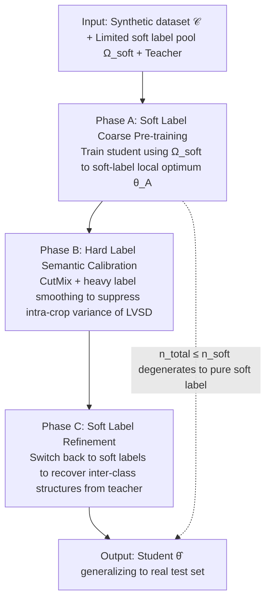

# Hard Labels In! Rethinking the Role of Hard Labels in Mitigating Local Semantic Drift

**Conference**: ICML 2026  
**arXiv**: [2512.15647](https://arxiv.org/abs/2512.15647)  
**Code**: https://github.com/Jiacheng8/HALD  
**Area**: Model Compression / Dataset Distillation  
**Keywords**: Dataset Distillation, Soft Label Compression, Local Semantic Drift, Hard Label Calibration, SRe2L  

## TL;DR
Addressing the exorbitant storage costs of "storing massive soft labels per image" in large-scale dataset distillation, this paper demonstrates that **Local View Semantic Drift (LVSD)** occurs when the number of soft labels per image $s$ is restricted. A three-stage training paradigm, HALD (soft→hard→soft), is proposed to use smoothed hard labels as semantic anchors to pull training back on track. On ImageNet-1K, it achieves 42.7% accuracy with 285M soft label storage, outperforming the SOTA LPLD by 9.0% while compressing soft label storage by 100x.

## Background & Motivation

**Background**: The de facto standard for dataset distillation (SRe2L, FKD, LPLD, FADRM, etc.) is to use a teacher to pre-generate a soft label for every crop of every image and replay them during training. Soft labels encode inter-class similarities and are much smoother than one-hot labels, making them an indispensable supervisory signal for large-scale ImageNet-level distillation.

**Limitations of Prior Work**: Soft label storage is a nightmare. On ImageNet-1K, the distilled data itself occupies only 750 MB, while FKD-style soft labels per crop total **28.33 GB**, an order of magnitude larger than the image storage. The most direct mitigation is to reduce the number of crops $s$ per image, but this introduces a commonly overlooked side effect: a crop might only cover local regions (a cat's face or just fur), causing the teacher's soft prediction to semantically drift toward "rabbit" or "carpet," inconsistent with the image-level ground truth.

**Key Challenge**: Soft labels provide fine-grained supervision but **drift with crop content**; hard labels have stable semantics but are **too coarse**. Methods like LPLD merely reduce crop counts to save storage without solving the drift; FKD maintains crop counts to solve drift but suffers from storage explosion. Both sit at opposite extremes.

**Goal**: (i) Formalize the link "fewer soft labels $\Rightarrow$ train-test distribution mismatch"; (ii) find a supervisory method that restores global semantic alignment even when $s$ is very small.

**Key Insight**: The authors reintroduce the neglected **hard labels**. Hard labels attached to the image-level ground truth are content-invariant "semantic anchors," regardless of whether the crop contains the main subject. Theoretically, a joint soft + hard approach can decouple and correct the "information drift" component.

**Core Idea**: Insert a **smoothed hard label calibration period** (CutMix + label smoothing) in the middle of soft-only training, forming a soft→hard→soft three-stage curriculum. Use hard labels to correct the variance introduced by LVSD before returning to soft label refinement.

## Method

### Overall Architecture

Input: Distilled synthetic dataset $\mathcal{C}$, pre-generated limited soft label pool $\Omega_{\text{soft}}$ (capacity controlled by $s$ labels per image), and a teacher. Output: A student $\hat\theta$ that generalizes to the real test set.

Training is divided into three stages, partitioned by $n_{\text{total}}$ and "the number of epochs required for soft-label ERM convergence" $n_{\text{soft}}$:

$$T_A=\lfloor n_{\text{soft}}/2 \rfloor,\ T_B = n_{\text{total}}-n_{\text{soft}},\ T_C = n_{\text{soft}}-T_A$$

Phase A uses $\Omega_{\text{soft}}$ soft labels for coarse pre-training. Phase B switches to CutMix + label-smoothed hard labels for semantic calibration to suppress intra-crop variance introduced by LVSD. Phase C returns to soft label refinement to consolidate inter-class structures. If $n_{\text{total}} \le n_{\text{soft}}$, it degenerates to pure soft label training, making HALD compatible with existing SRe2L/LPLD pipelines.

The theoretical part is central to the motivation. The authors decompose LVSD into two parts: fixing $\tilde x$, let $\bar p = \mathbb{E}[\tilde p(x^{(crop)})]$ and $\Sigma=\text{Cov}[\tilde p(x^{(crop)})]$. The supervision error of $\hat p_s$ aggregated over $s$ crops decomposes into an "oracle irreducible term $\|\bar p - e_y\|_2^2$" plus an "LVSD term $\text{Tr}(\Sigma)/s$." As long as $\Sigma \ne 0$ and $s$ is finite, the LVSD term is strictly greater than 0. Further, Theorem 3.5 provides an $\Omega(s^{-1/2})$ bias lower bound for the training objective; Theorem 3.6 provides an $\Omega(1/s)$ excess generalization loss lower bound between the ERM solution $\hat\theta_s$ and the oracle $\hat\theta_\star$. These bounds only vanish when $s\to\infty$—but large $s$ is precisely the storage disaster to be avoided. Conclusion: **Ours cannot match the oracle at low $s$ using pure soft labels**; an additional, crop-independent supervision source must be introduced.

### Key Designs

**1. Formal Definition of LVSD and Cantelli Bound: Calculating the probability of a student misclassifying a cat as a rabbit due to insufficient crops**

Previous works only empirically observed that "fewer crops lead to performance drops" without explaining the mechanism. The authors formalize this as a class reversal event $\mathcal{E}_{s,c}=\{\hat p_s(c) \ge \hat p_s(y)\}$—where the aggregated prediction ranks wrong class $c$ above true class $y$. Using the Cantelli inequality, they provide a distribution-free upper bound $\Pr(\mathcal{E}_{s,c}) \le v_{s,c}/(v_{s,c}+(\bar p_y - \bar p_c)^2)$, where the variance term $v_{s,c}=(\Sigma_{yy}+\Sigma_{cc}-2\Sigma_{yc})/s$ decreases monotonically with the number of crops $s$. This is the first quantifiable guarantee that "fewer soft labels lead to errors" independent of teacher or data. Its brilliance lies in making the correction utility of hard labels calculable: Phase B hard label supervision forces $v_{s,c}$ toward 0, making the reversal probability converge—theoretically pinpointing where the calibration signal should be inserted and what it suppresses.

**2. soft→hard→soft Three-Stage Curriculum: Aligning train-test distributions under the same LPLD storage budget**

This is the backbone of HALD. Pure soft labels suffer from LVSD drift, while pure hard labels lose inter-class similarity and revert to one-hot. The solution is to insert a hard label calibration phase in the middle. Phase A proceeds as usual by sampling minibatches from the soft label pool to optimize $\hat{\mathcal{L}}^{(t)}_{\text{soft}}(\theta)=\frac{1}{B}\sum_b \mathcal{L}(\tilde p_{j_b}, q_\theta(\cdot\mid x_{j_b}^{(\text{crop})}))$ until reaching local optimum $\hat\theta_s^A$. Phase B starts with $\theta_0 := \hat\theta_s^A$, resampling CutMix geometry $(x,x',\lambda,m)$ and smoothed labels $t_{\lambda,\alpha}(y,y')=(1-\lambda)\text{LS}_\alpha(y)+\lambda \text{LS}_\alpha(y')$ at each step to minimize $\ell_{\text{cal}}(\theta;\omega)=\mathcal{L}(t_{\lambda,\alpha}, q_\theta(\cdot\mid \text{CM}_{\lambda,m}(x,x')))$. Since geometry is resampled every step, this phase is equivalent to "infinitely diverse local views × global ground truth supervision," specifically suppressing intra-crop variance. Phase C switches back to soft labels to restore the coarsened inter-class structures. The sequence is critical: Phase A provides a reasonable initialization, Phase B calibrates, and Phase C restores sensitivity to fine-grained knowledge.

**3. Heavily-smoothed "Pseudo-hard Labels" + CutMix Geometry: Keeping hard labels "soft" enough not to pull the student directly to one-hot**

Using strict one-hot labels in Phase B would be counterproductive—Fig. 3 shows that the cosine similarity between soft and hard gradients remains high; if labels are over-coarsened, the two objectives cancel each other out. Thus, instead of $\delta_y$, the authors use smoothed labels $\text{LS}_\alpha(y)=(1-\alpha)\delta_y + \alpha\,\mathbf{1}/C$ and mix them via CutMix. Synthetic images possess weaker semantics than real images, so a large $\alpha$ is used to create heavily-flattened labels for stable calibration. This ensures Phase B provides perturbations near $\bar p$ rather than pushing toward $\delta_y$—exactly satisfying the theoretical requirement of "variance reduction in the oracle neighborhood" without knocking the student out of the soft-label solution space.

### Loss & Training

The three stages share the same per-crop loss $\mathcal{L}$ (cross-entropy or soft-target cross-entropy), switching only the label form and the mini-batch sampling space $\Omega_{\text{soft}}/\Omega_{\text{cal}}$. The learning rate follows the default schedules of the respective distillation methods. HALD is a plug-in applicable to SRe2L, RDED, FADRM, and LPLD pipelines.

## Key Experimental Results

### Main Results

ImageNet-1K main results: Under fixed SLI (soft labels per image), HALD significantly outperforms LPLD.

| Dataset | Setting | Prev. SOTA | HALD | Gain |
|--------|------|----------|------|---------|
| ImageNet-1K | SLI=10, IPC=10 | LPLD 33.7% | **42.7%** | +9.0 |
| Tiny-ImageNet | SLI=2, IPC=10 | FADRM 17.4% | **22.8%** | +5.4 |
| Tiny-ImageNet | SLI=1, IPC=10 | FADRM 10.1% | **18.6%** | +8.5 |
| Tiny-ImageNet | SLI=2, IPC=50 | FADRM 36.0% | **38.2%** | +2.2 |
| Tiny-ImageNet | SLI=1, IPC=50 | FADRM 27.8% | **30.7%** | +2.9 |

Key Observation: The smaller the SLI (higher storage savings), the larger the performance gain of HALD—validating the theoretical prediction that LVSD dominates error at low $s$.

### Ablation Study

| Configuration | Tiny-IN, SLI=1, IPC=10 | Description |
|------|----------------------|------|
| Soft only (LPLD) | 8.2% | Pure soft, suffers from LVSD |
| Soft → Hard (No Phase C) | Intermediate | Lacks final refinement |
| **HALD (Soft → Hard → Soft)** | **18.6%** | Complete three phases |
| HALD w/o label smoothing | Drop | Strong one-hot pulls student from oracle neighborhood |
| HALD w/o CutMix | Drop | Insufficient crop diversity |

### Key Findings

- **Storage-Accuracy Pareto Frontier Expansion**: HALD achieves accuracy at a 285M soft label budget that LPLD cannot reach even at a 28 GB budget, lowering the deployment threshold for dataset distillation by two orders of magnitude.
- **Phase B is not just "extra training"**: Train/test loss landscapes (Fig. 2) show that under pure soft labels, the test landscape is severely misaligned with the train landscape (typical overfitting to drifted targets); adding hard label calibration realigns them.
- **Gradient Alignment Increases During Training** (Fig. 3): The cosine similarity between soft and hard loss gradients rises significantly at the end of Phase A, indicating the student's representation increasingly satisfies both types of supervision.

## Highlights & Insights

- **Repositioning Hard Labels at the Center**: While recent literature treated hard labels as obsolete, this work links storage and drift perspectives, making the "zero storage + content-independent" nature of hard labels a core resource.
- **Theoretical and Curriculum Alignment**: The $\Omega(1/s)$ excess loss lower bound in Theorem 3.6 justifies inserting calibration after ERM convergence—preserving progress while precisely targeting the bound.
- **Transferable Trick**: The soft→hard→soft curriculum applies to any scenario where the label source is imperfect but cheap anchor labels are available, such as semi-supervised distillation or multi-teacher fusion.
- **Formalization of "Crop Drift"**: The definition of LVSD itself is a contribution—providing a tools like $\text{Tr}(\Sigma)/s$ for future discussions on the stability of "cropping-based data augmentation + soft targets."

## Limitations & Future Work

- The theory assumes IID crops and teacher prediction covariance $\Sigma$; validity under strongly correlated augmentations (e.g., RandAug chains) requires empirical validation.
- The $T_A/T_B/T_C$ partition depends on $n_{\text{soft}}$, the "empirical convergence point," which may be expensive to estimate for giant models.
- Phase B uses CutMix and label smoothing, moving beyond "strict hard labels." If distillation targets tasks like detection/segmentation where mixup is non-trivial, the calibration signal needs redesign.
- Architectural discrepancies (e.g., ViT teacher $\to$ CNN student) and their impact on drift structures were not explored.

## Related Work & Insights

- **vs LPLD (Xiao & He, 2024)**: LPLD uses limited soft labels for storage efficiency but ignores LVSD; HALD corrects drift within the same budget, yielding +9.0% on ImageNet-1K.
- **vs FKD / FerKD**: FKD solves accuracy by storing per-crop soft labels at the cost of storage; HALD solves accuracy from the low-storage side.
- **vs GIFT (Shang et al., 2025a)**: GIFT integrates hard info into soft targets (modifying labels); HALD switches in the time domain (phases), requiring no changes to pre-generated soft label pools.
- **vs label smoothing literature**: This work reveals label smoothing in distillation functions as a variance calibration signal for LVSD rather than just a regularizer.

## Rating
- Novelty: ⭐⭐⭐⭐⭐ First to formalize the "crop count $\to$ semantic drift $\to$ train-test mismatch" chain and design a matching curriculum.
- Experimental Thoroughness: ⭐⭐⭐⭐⭐ Full coverage of Tiny-IN/IN-1K across multiple IPC/SLI, comparing against four SOTA types.
- Writing Quality: ⭐⭐⭐⭐ Clear theory-algorithm correspondence; notation is dense, but proofs are complete.
- Value: ⭐⭐⭐⭐⭐ Reduces storage bottlenecks for dataset distillation by 100x, impacting practical industrial deployment.

<!-- RELATED:START -->

## Related Papers

- [\[CVPR 2026\] Rethinking Dataset Distillation: Hard Truths about Soft Labels](../../CVPR2026/model_compression/rethinking_dataset_distillation_hard_truths_about_soft_labels.md)
- [\[ICML 2026\] The Bridge-Garden Dilemma in LLM Distillation: Why Mixing Hard and Soft Labels Works](the_bridge-garden_dilemma_in_llm_distillation_why_mixing_hard_and_soft_labels_wo.md)
- [\[ICML 2026\] DSL-Topic: Improving Topic Modeling by Distilling Soft Labels from Language Models](dsl-topic_improving_topic_modeling_by_distilling_soft_labelsfrom_language_models.md)
- [\[ICML 2026\] DIVER: Diving Deeper into Distilled Data via Expressive Semantic Recovery](diverdiving_deeper_into_distilled_data_via_expressive_semantic_recovery.md)
- [\[ICCV 2025\] Heavy Labels Out! Dataset Distillation with Label Space Lightening](../../ICCV2025/model_compression/heavy_labels_out_dataset_distillation_with_label_space_lightening.md)

<!-- RELATED:END -->
