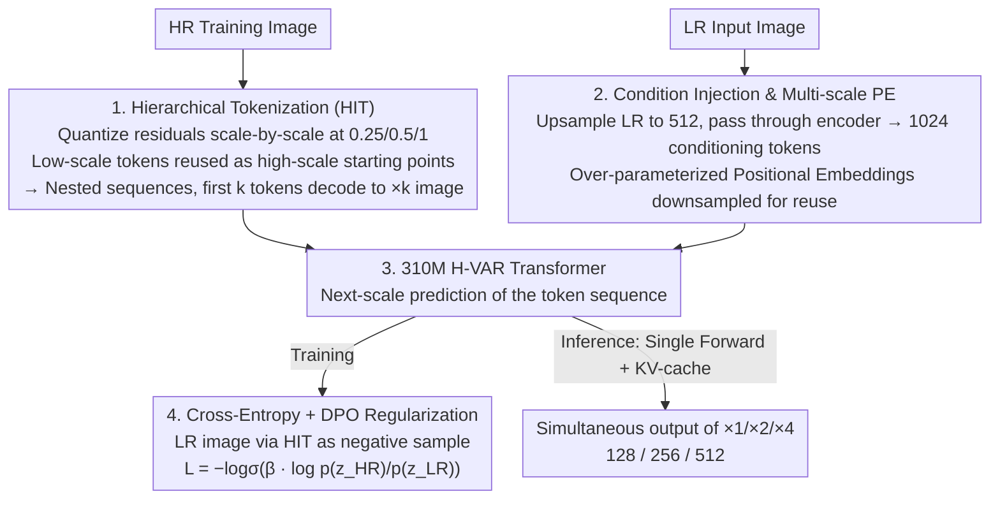

# Hierarchical Image Tokenization for Multi-Scale Image Super Resolution

**Conference**: ICML 2026  
**arXiv**: [2605.14891](https://arxiv.org/abs/2605.14891)  
**Code**: None  
**Area**: Model Compression / Image Super-Resolution / Visual Autoregression  
**Keywords**: VAR, Residual Quantization, Multi-scale Super-Resolution, Hierarchical Tokenization, DPO Regularization

## TL;DR
H-VAR reslices the VAR paradigm of "residual quantization for multi-scale generation" into Hierarchical Image Tokenization (HIT). This allows a small 310M model to output meaningful intermediate resolutions (128 / 256 / 512) in a single forward pass. Combined with a DPO regularization term that biases output toward HR without an external reward model, it competes with the 1B-parameter VARSR on standard ISR datasets.

## Background & Motivation

**Background**: Strong baselines for image super-resolution have long been dominated by GANs (Real-ESRGAN) and Diffusion Models (StableSR, SeeSR, ResShift). Recently, next-scale prediction VAR models have been adapted for ISR (e.g., VARSR, PURE, VARestorer) because their natural residual expansion across scales offers better alignment between pretraining and downstream tasks than diffusion models.

**Limitations of Prior Work**: Existing AR-based super-resolution models face two major drawbacks. First, the original RQ-VAE decomposes an image into $L$ progressively refined residuals, but the initial residual levels lack "low-resolution semantics" and instead represent a random allocation of high-frequency details; thus, intermediate stages cannot be decoded into meaningful low-res images. To perform $\times 4$ SR, the entire token sequence must be run, preventing the simultaneous generation of $\times 2$ results. Second, to match SOTA performance, VARSR requires a 1B model, classifier-free guidance, and massive labeled datasets, while PURE directly utilizes the 7B Lumina-mGPT.

**Key Challenge**: The token sequence of VAR is a "generic residual stack"—which is efficient for compression but lacks the strong constraint of "scale semantics." To make multi-scale outputs meaningful, "scale-decodability" must be embedded into the tokenization process, which typically degrades single-scale reconstruction, creating an explicit trade-off.

**Goal**: (a) Design a tokenization method where the first $k$ tokens deterministically decode into a valid image at that specific scale, with shared tokens across scales. (b) Encode the preference for "VAR outputting HR instead of LR" into the training objective without additional data or VLMs.

**Key Insight**: The authors observe that next-scale prediction reduces redundancy because the prediction of the next scale depends on all tokens from the previous scale. If "downsampling-quantization-upsampling" is made into an independent closed loop at each target scale with forced token reuse, one can maintain both multi-scale decodability and the VAR sequence prediction format.

**Core Idea**: Utilize HIT (Hierarchical Image Tokenization) to slice RQ-VAE residuals by target scale for token reuse, combined with a DPO regularization term based on the $p(z_{HR})/p(z_{LR})$ ratio, to create a 310M multi-scale H-VAR.

## Method

### Overall Architecture
H-VAR aims to enable a small VAR model to achieve multi-scale decodability and match SOTA performance without massive data. The pipeline consists of two parts: First, a Hierarchical RQ-VAE is trained by finetuning the vocabulary and decoder of a pretrained Switti RQ-VAE. The residual token sequence is sliced into $N$ nested segments $\{s_1,\dots,s_N\}$, allowing each segment to be independently decoded into an image of the corresponding scale. Second, a 310M 16-layer GPT-2 style transformer (Hierarchical VAR) is trained. Taking LR features encoded by the RQ-VAE encoder as a condition, it predicts the token sequence via next-scale prediction, using a joint objective of cross-entropy and DPO regularization. During inference, a single forward pass with KV-cache reuse simultaneously produces $\times 1 / \times 2 / \times 4$ resolutions.

### Key Designs

**1. Hierarchical Image Tokenization (HIT): Making the first $k$ tokens correspond to a "valid $\times k$ image"**

The original RQ-VAE flattens an image into $L$ refinement levels, but the early tokens lack low-resolution semantic constraints. HIT embeds this constraint into tokenization: given target scales $s_1 < s_2 < \dots < s_N$ (e.g., $0.25, 0.5, 1$ for $\times 1/\times 2/\times 4$), for each scale $n$, the input is downsampled to $s_n \rho_L$ and encoded into $\mathbf{Z}_n$ to quantize residuals. The resulting tokens are both recorded in the $s_n$ subsequence and reused as the "starting tokens" for the next scale. Then, shifting to $s_{n+1}$, the previous scale's tokens are upsampled to the current residual space and subtracted before quantizing the new residuals. This creates a nested structure $z = \{\{\{z_1,\dots\}_{s_1},\dots\}_{s_2}, \dots\}_{s_N}$. Finetuning the vocabulary follows the HART approach: keeping the decoder frozen and updating the vocabulary using the gradient of the $\ell_2$ distance between encoder features and token embeddings. This injects a strong inductive bias that forces the representation space to follow the scale hierarchy, significantly compressing the search space for the transformer.

**2. Condition Injection and Multi-scale Positional Encoding: A single downsampled table for all scales**

The transformer processes $\sum_l \rho_l^2 = 3452$ tokens across different scales. The authors use "over-parameterized learnable positional embeddings"—a large table defined for the maximum scale, which is downsampled for each resolution $\rho_l$. This allows the model to share positional inductive biases across scales. For conditioning, rather than using a separate ControlNet, the LR image is bilinearly upsampled to 512 and passed through the RQ-VAE encoder to obtain 1024 conditioning tokens, simplifying the architecture and avoiding scale mismatch issues.

**3. DPO Regularization for HR Preference: Using LR as a negative sample**

Since HR and LR tokens overlap significantly at lower scales, VAR models often "cheat" by copying the LR input. By treating the LR image (upsampled and tokenized via HIT as $z_{LR}$) as a negative sample and utilizing the AR property to calculate log-likelihoods, the authors define $\mathcal{L}_{DPO} = -\log\sigma\left(\beta \log \frac{p(z_{HR})}{p(z_{LR})}\right)$. Combined with standard cross-entropy ($\beta = 0.2$), this acts as an unsupervised regularization term. Since ISR naturally provides pairs of HR/LR samples, this eliminates the need for an external reward model or pair-wise preferences required in traditional DPO, significantly sharpening results at nearly zero extra cost.

### Loss & Training
- **RQ-VAE Finetuning**: $\mathcal{L}_{RQVAE} = \ell_2 + 5\, \mathcal{L}_{LPIPS}$, AdamW, batch size 384, lr 0.00025, 25K steps on 24 A100 GPUs (~24 hours). Quantization is bypassed with 50% probability during training to prevent vocabulary overfitting.
- **H-VAR Training**: Cross-entropy + $\mathcal{L}_{DPO}$ with equal weights. Initialized from official VAR d-16 checkpoint, 200 epochs on 24 A100s, batch size 384, lr 1e-3, AdamW with betas $(0.9, 0.95)$ (~13 hours).
- **Training Data**: Standard sets (DIV2K, DIV8K, Flickr2K, OST, 10K FFHQ) using Real-ESRGAN degradations. No proprietary datasets used.

## Key Experimental Results

### Main Results

| Dataset | Metric | StableSR | ResShift | VARSR (1B) | VARSR-d16 | H-VAR (310M, ours) |
|---|---|---|---|---|---|---|
| DIV2K-Val | LPIPS ↓ | 0.323 | 0.428 | 0.326 | 0.495 | **0.317** |
| DIV2K-Val | FID ↓ | 28.32 | 30.79 | 35.51 | 45.96 | **28.86** |
| RealSR | LPIPS ↓ | 0.300 | 0.346 | 0.350 | 0.413 | **0.256** |
| DRealSR | LPIPS ↓ | 0.333 | 0.401 | 0.354 | 0.409 | **0.259** |
| DRealSR | FID ↓ | 148.2 | 159.8 | 155.9 | 244.7 | **145.1** |

| Model | Params | FLOPs | Inference Time | DIV2K-Val FID (LPIPS) |
|---|---|---|---|---|
| H-VAR (Ours) | 310M | 0.921T | 0.25s | 28.86 (0.317) |
| VARSR | 1B | 3.071T | 0.93s | 35.51 (0.326) |
| ResShift | 173M | 2.651T | 0.17s | 30.79 (0.428) |
| StableSR | 919M | 79.94T | 5.51s | 28.32 (0.323) |

### Ablation Study

| Dataset | Config | PSNR@128 | PSNR@256 | PSNR@512 | LPIPS@512 |
|---|---|---|---|---|---|
| RealSR | w/o DPO | 20.56 | 23.09 | 25.72 | 0.310 |
| RealSR | w/ DPO | **22.09** | **24.41** | 25.55 | **0.256** |
| DRealSR | w/o DPO | 23.03 | 26.38 | 28.61 | 0.335 |
| DRealSR | w/ DPO | **25.26** | **27.65** | **28.73** | **0.259** |

| Config (RealSR LPIPS@512) | 128 | 256 | 512 |
|---|---|---|---|
| VARSR (1B) | 0.618 | 0.450 | 0.350 |
| Baseline (RQ-VAE w/o HIT) | 0.686 | 0.491 | 0.311 |
| H-VAR (HIT) | **0.199** | **0.236** | **0.256** |

### Key Findings
- At intermediate scales (128 / 256), the baseline without HIT is nearly unusable (LPIPS > 0.4); HIT improves these scores to the 0.2 range, proving it generates meaningful multi-scale images.
- HIT acts as a powerful inductive bias: by reducing the transformer from 1B to 310M and using only public data, H-VAR still matches or outperforms VARSR. This suggests that some "data/parameter scaling" issues are actually token alignment problems.
- DPO regularization improves scores across all datasets and scales without an external reward model, acting as a "free lunch."
- **Side Effect**: Because early residuals are forced into low-resolution constraints, the final 512 reconstruction suffers a slight degradation; increasing from $L=10$ to $11$ fixes this but increases inference cost by 24%—an explicit trade-off.

## Highlights & Insights
- "Embedding multi-scale decodability into tokenization" is the most significant takeaway. It modifies the upstream vocabulary instead of the transformer architecture or downstream loss, allowing the model to be an order of magnitude smaller.
- Using LR as a negative sample for DPO is a clever "self-supervised preference learning" trick that saves the cost of a reward model. This could be applied to any task with natural degradation pairs (deblurring, denoising, etc.).
- The paper transparently discusses the trade-offs: HIT slightly reduces reconstruction quality at high resolutions, which must be compensated by more token steps.
- Providing three resolutions in one forward pass is highly practical for real-world products (e.g., mobile previews), offering engineering value beyond academic metrics.

## Limitations & Future Work
- Multi-scale support is limited to discrete levels (e.g., 3 scales). Arbitrary upscaling ($\times 1.5, \times 3$) would require re-designing $\rho_l$ allocation, a limitation inherent to discrete tokenization.
- DPO assumes LR is the "wrong answer," but if the input is only lightly degraded, the preference might push the model toward over-sharpening.
- Experiments focused on $\times 4$; the efficiency of HIT at higher ratios ($\times 8, \times 16$) where more intermediate scales are involved remains to be verified.
- Comparisons against diffusion-based SOTAs (e.g., PASD, SUPIR) are limited; while it beats VARSR, wider comparison is needed to claim absolute SOTA.

## Related Work & Insights
- **vs. VARSR**: Both use VAR for ISR, but VARSR uses original RQ-VAE (meaningless intermediate scales) and require 1B models and private data. H-VAR solves these via HIT and doesn't require a ControlNet branch.
- **vs. PURE**: PURE uses a 7B Lumina-mGPT with multi-modal prompts. H-VAR demonstrates that ISR doesn't strictly require massive multi-modal models if the token design and DPO are optimized.
- **vs. Diffusion (StableSR/ResShift)**: Diffusion models are slower and lack sequence likelihoods, making native DPO impossible. H-VAR's AR format provides both speed and DPO compatibility.
- **Inspiration**: "Injecting task structure as inductive bias into tokenization" is an undervalued direction. Potential applications include Video AR (temporal scale slicing) or Medical AR (anatomical hierarchy slicing).

## Rating
- **Novelty**: ⭐⭐⭐⭐ HIT is the first multi-scale solution for VAR ISR. DPO with LR negative samples is innovative.
- **Experimental Thoroughness**: ⭐⭐⭐⭐ Covers baselines, multiple datasets, sensitivity analysis, and complexity. Missing some diffusion SOTA comparisons.
- **Writing Quality**: ⭐⭐⭐⭐⭐ Clear pseudocode, diagrams, and honest discussion of trade-offs.
- **Value**: ⭐⭐⭐⭐ Leveling the field between 310M and 1B models while offering 3-in-1 resolution output is highly valuable for deployment.

<!-- RELATED:START -->

## Related Papers

- [\[AAAI 2026\] HCF: Hierarchical Cascade Framework for Distributed Multi-Stage Image Compression](../../AAAI2026/model_compression/hcf_hierarchical_cascade_framework_for_distributed_multi-stage_image_compression.md)
- [\[ICML 2026\] Efficient Learned Image Compression without Entropy Coding](efficient_learned_image_compression_without_entropy_coding.md)
- [\[ICCV 2025\] Learned Image Compression with Hierarchical Progressive Context Modeling](../../ICCV2025/model_compression/learned_image_compression_with_hierarchical_progressive_context_modeling.md)
- [\[ICML 2026\] From Per-Image Low-Rank to Encoding Mismatch: Rethinking Feature Distillation in Vision Transformers](from_per-image_low-rank_to_encoding_mismatch_rethinking_feature_distillation_in_.md)
- [\[AAAI 2026\] QuantVSR: Low-Bit Post-Training Quantization for Real-World Video Super-Resolution](../../AAAI2026/model_compression/quantvsr_low-bit_post-training_quantization_for_real-world_video_super-resolutio.md)

<!-- RELATED:END -->
