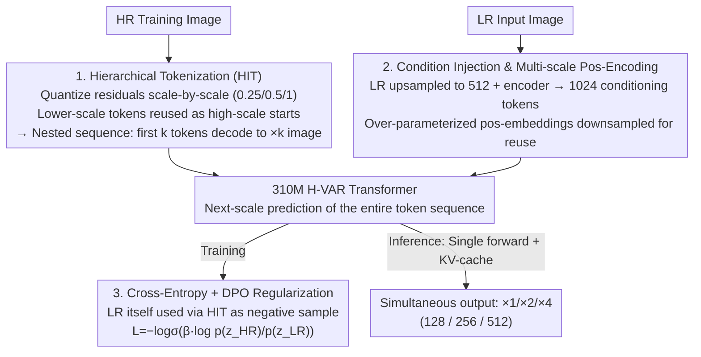

# Hierarchical Image Tokenization for Multi-Scale Image Super Resolution

**Conference**: ICML 2026  
**arXiv**: [2605.14891](https://arxiv.org/abs/2605.14891)  
**Code**: None  
**Area**: Model Compression / Image Super-Resolution / Visual Autoregression  
**Keywords**: VAR, Residual Quantization, Multi-scale Super-Resolution, Hierarchical Tokenization, DPO Regularization

## TL;DR
H-VAR reslices the VAR paradigm, which uses residual quantization for multi-scale generation, into Hierarchical Image Tokenization (HIT). This allows a small 310M model to output three meaningful intermediate resolutions (128 / 256 / 512) in a single forward pass. Combined with a DPO regularization term that favors HR outputs without requiring external reward models, it competes with the 1B-parameter VARSR on standard ISR datasets.

## Background & Motivation

**Background**: Strong baselines for image super-resolution (ISR) have long been dominated by GANs (Real-ESRGAN) and diffusion models (StableSR, SeeSR, ResShift). Recently, next-scale prediction via VAR has been applied to ISR (VARSR, PURE, VARestorer) due to its natural multi-scale residual expansion, showing better alignment between pretraining and downstream tasks than diffusion.

**Limitations of Prior Work**: Existing AR-based super-resolution suffers from two main drawbacks. First, the original RQ-VAE decomposes an image into $L$ progressively refined residuals, but the initial residual levels lack "low-resolution semantics" and are merely random allocations of high-frequency details; thus, intermediate stages cannot be decoded into meaningful low-res images. To perform $\times 4$ upscaling, one must run the entire token sequence, making it impossible to produce $\times 2$ results simultaneously. Second, to reach SOTA performance, VARSR requires 1B+ models, classifier-free guidance, and massive annotated datasets, while PURE directly utilizes the 7B Lumina-mGPT.

**Key Challenge**: The token sequence in VAR is a "generic residual stack" optimized for compression efficiency but lacking the strong constraint of "scale semantics." To make multiple scales meaningful, "per-scale decodability" must be embedded into the tokenization, but this often degrades single-scale reconstruction, creating an explicit trade-off.

**Goal**: (a) Design a tokenization where the first $k$ tokens deterministically decode into a valid image of that scale, sharing tokens across scales; (b) encode the preference for "VAR outputting HR instead of LR" into the training objective without scaling data or adding VLMs.

**Key Insight**: The authors observe that next-scale prediction reduces redundancy because predictions for the next scale depend on all tokens from the previous scale. By creating an independent closed loop of "downsample-quantize-upsample" for each target scale and forcing token reuse, one can maintain multi-scale decodability while preserving the VAR sequential prediction format.

**Core Idea**: Use HIT (Hierarchical Image Tokenization) to slice and reuse RQ-VAE residual tokens by target scales, combined with a DPO regularization term based on the $p(z_{HR})/p(z_{LR})$ ratio, to build a 310M multi-scale H-VAR.

## Method

### Overall Architecture
H-VAR aims to enable a small VAR to achieve multi-scale decodability while matching SOTA performance without massive data scaling. The pipeline consists of two parts: First, a Hierarchical RQ-VAE is trained by finetuning the vocabulary and decoder of a pretrained Switti RQ-VAE. The residual token sequence is sliced into $N$ nested segments $\{s_1,\dots,s_N\}$, each independently decodable to its corresponding scale. Second, a 310M 16-layer GPT-2 style transformer (Hierarchical VAR) is trained. It uses LR features encoded by the RQ-VAE encoder as a condition to predict the full token sequence via next-scale prediction, optimized with a joint cross-entropy and DPO regularization loss. During inference, a single forward pass with KV-cache reuse simultaneously outputs $\times 1/\times 2/\times 4$ resolutions.

### Key Designs

**1. Hierarchical Image Tokenization (HIT): Making the first $k$ tokens truly correspond to a "valid $\times k$ image"**

The original RQ-VAE flattens an image into $L$ levels of refining residuals, but the early levels are random high-frequency allocations lacking "low-resolution semantics." This is why VAR cannot produce meaningful intermediate scales. HIT embeds this constraint into tokenization: define target scales $s_1 < s_2 < \dots < s_N$ (e.g., $0.25, 0.5, 1$ for $\times 1/\times 2/\times 4$). For each scale $n$, the input image is downsampled to $s_n \rho_L$ to encode $\mathbf{Z}_n$, and residuals are quantized at that scale. These tokens are recorded in the $s_n$ subsequence and reused as "start tokens" for the next scale. At $s_{n+1}$, the previous scale's tokens are upsampled to the current residual space and subtracted before quantizing the new residuals. The image is thus sliced into a nested structure $z = \{\{\{z_1,\dots\}_{s_1},\dots\}_{s_2}, \dots\}_{s_N}$. Vocabulary and decoder finetuning support this: the decoder is frozen while the vocabulary is updated via gradients from the $\ell_2$ distance between encoder features and token embeddings. Forcing the first $k$ tokens to reconstruct scale $k$ injects a strong inductive bias, significantly compressing the path search space for the transformer—allowing a 310M model to match the SOTA of a 1B model.

**2. Condition Injection and Multi-scale Positional Encoding: A single downsampled table for all scales**

A single transformer must handle $\sum_l \rho_l^2 = 3452$ tokens across different scales, making positional encoding a potential bottleneck. The authors use "over-parameterized learnable positional embeddings"—a large table defined for the maximum scale, which is downsampled for each resolution $\rho_l$. This avoids maintaining multiple sets of weights and shares positional inductive biases across scales. For conditioning, rather than using a ControlNet (as in VARSR), the LR is bilinearly upsampled to 512 and passed through the RQ-VAE encoder to obtain 1024 conditioning tokens. This simplifies the architecture and eliminates scale-mismatch issues.

**3. DPO Regularization for HR Preference: Using LR as a negative sample without an external reward model**

Since HR and LR tokens heavily overlap at lower scales, VAR models tend to "lazily" replicate the LR input. The authors run the LR (upsampled to 512) through HIT to obtain $z_{LR}$. Utilizing the AR model's ability to calculate sequence log-likelihood, they define $\mathcal{L}_{DPO} = -\log\sigma\left(\beta \log \frac{p(z_{HR})}{p(z_{LR})}\right)$, added with equal weight to the standard cross-entropy. $\beta$ is set to $0.2$. While traditional DPO requires pair-wise preferences and a reference policy (often requiring a separate reward model in generative ISR), ISR naturally provides LR/HR preference pairs. LR serves as the "negative sample," turning DPO into a nearly cost-free unsupervised regularizer that significantly sharpens results. (Diffusion models cannot easily compute sequence likelihood, making this a specific advantage of the VAR approach).

### Loss & Training
- **RQ-VAE Finetuning**: $\mathcal{L}_{RQVAE} = \ell_2 + 5\, \mathcal{L}_{LPIPS}$. AdamW, batch size 384, lr 0.00025, 25K steps on 24 A100s (~24 hours). Following HART, quantization is dropped with 50% probability to prevent vocabulary overfitting.
- **H-VAR Training**: Cross-entropy + $\mathcal{L}_{DPO}$ with equal weights. Initialized from official VAR d-16 checkpoint. 24 A100s, 200 epochs, batch size 384, lr 1e-3, AdamW betas $(0.9, 0.95)$, completed in ~13 hours.
- **Datasets**: Standard DIV2K + DIV8K + Flickr2K + OST + 10K FFHQ. LR-HR pairs synthesized via Real-ESRGAN degradation; no proprietary datasets used.

## Key Experimental Results

### Main Results

| Dataset | Metric | StableSR | ResShift | VARSR (1B) | VARSR-d16 | H-VAR (310M, ours) |
|---|---|---|---|---|---|---|
| DIV2K-Val | LPIPS ↓ | 0.323 | 0.428 | 0.326 | 0.495 | **0.317** |
| DIV2K-Val | FID ↓ | 28.32 | 30.79 | 35.51 | 45.96 | **28.86** |
| RealSR | LPIPS ↓ | 0.300 | 0.346 | 0.350 | 0.413 | **0.256** |
| DRealSR | LPIPS ↓ | 0.333 | 0.401 | 0.354 | 0.409 | **0.259** |
| DRealSR | FID ↓ | 148.2 | 159.8 | 155.9 | 244.7 | **145.1** |

| Model | Params | FLOPs | Inference Time | DIV2K-Val FID (LPIPS) |
|---|---|---|---|---|
| H-VAR (Ours) | 310M | 0.921T | 0.25s | 28.86 (0.317) |
| VARSR | 1B | 3.071T | 0.93s | 35.51 (0.326) |
| ResShift | 173M | 2.651T | 0.17s | 30.79 (0.428) |
| StableSR | 919M | 79.94T | 5.51s | 28.32 (0.323) |

### Ablation Study

| Dataset | Configuration | PSNR@128 | PSNR@256 | PSNR@512 | LPIPS@512 |
|---|---|---|---|---|---|
| RealSR | w/o DPO | 20.56 | 23.09 | 25.72 | 0.310 |
| RealSR | w/ DPO | **22.09** | **24.41** | 25.55 | **0.256** |
| DRealSR | w/o DPO | 23.03 | 26.38 | 28.61 | 0.335 |
| DRealSR | w/ DPO | **25.26** | **27.65** | **28.73** | **0.259** |

| Configuration (RealSR LPIPS@512) | 128 | 256 | 512 |
|---|---|---|---|
| VARSR (1B) | 0.618 | 0.450 | 0.350 |
| Baseline (RQ-VAE w/o HIT) | 0.686 | 0.491 | 0.311 |
| H-VAR (HIT) | **0.199** | **0.236** | **0.256** |

### Key Findings
- At intermediate scales (128 / 256), the baseline without HIT is nearly unusable (LPIPS > 0.4). HIT reduces scores to the 0.2 range, confirming it produces readable images at intermediate scales.
- HIT serves as a powerful inductive bias: reducing the transformer from 1B to 310M and using public datasets instead of VARSR's proprietary ones still yields competitive or superior FID/LPIPS scores. This suggests many issues attributed to "lack of data/params" are actually issues of unaligned token representations.
- DPO regularization consistently improves results across all datasets and scales without external reward models, representing a "free lunch."
- **Side Effect**: Because early residual levels are forced into low resolutions, final 512 reconstruction suffers slight degradation. Increasing $L$ from 10 to 11 fixes this but increases inference costs by 24%, a trade-off the authors acknowledge.

## Highlights & Insights
- "Coding multi-scale resolvability into tokenization" is the standout technique. Rather than modifying the transformer architecture or adding loss terms, it constrains the upstream vocabulary. Once the upstream is correct, the downstream model can be an order of magnitude smaller.
- Using LR as a negative sample for DPO is a clever "self-supervised preference learning" trick. This can be adapted to any generation task with natural degradation pairs (deblurring, denoising, etc.).
- The paper transparently discusses trade-offs: HIT slightly compromises max-resolution quality, requiring more token steps to compensate.
- Providing three resolutions in a single forward pass is highly practical for real-world products (e.g., mobile previews, thumbnails), offering a genuine engineering advantage beyond paper metrics.

## Limitations & Future Work
- Multi-scale support is limited to discrete slices (3 stages). Arbitrary upsampling ($\times 1.5, \times 3$) would require redesigning $\rho_l$ allocation, a limitation of the discrete nature of tokenization.
- DPO assumes LR is always a "bad answer," but if the input is already close-to-HR (mild degradation), this preference might push the model toward over-sharpening.
- Experiments focused on the $\times 4$ setting. It remains to be seen if HIT maintains its efficiency advantages for $\times 8 / \times 16$ factors where intermediate scales are more numerous.
- Comparisons with strong diffusion baselines like PASD or SUPIR were not covered; the primary comparison remains original VARSR.

## Related Work & Insights
- **vs VARSR**: Both apply VAR to ISR, but VARSR uses original RQ-VAE, leading to meaningless intermediate scales and requiring 1B models/private data. H-VAR addresses these via HIT.
- **vs PURE**: PURE uses the 7B Lumina-mGPT to ingest image and degradation descriptions. H-VAR takes the opposite path, proving that "upstream token design + simple DPO" can avoid scaling to multi-modal LLMs for ISR.
- **vs Diffusion-based ISR (StableSR / ResShift)**: DMs are slow and lack sequence likelihoods for native DPO. The AR format of H-VAR provides these benefits.
- **Inspiration**: Injecting task structure as an inductive bias into tokenization is an undervalued direction. Potential future work includes Video AR (slicing tokens by temporal scale) or Medical AR (slicing by anatomical hierarchy).

## Rating
- **Novelty**: ⭐⭐⭐⭐ HIT is the first scheme to support multi-scale in VAR-based ISR; DPO with LR negative samples is also a fresh application.
- **Experimental Thoroughness**: ⭐⭐⭐⭐ Includes multiple baselines, datasets, $L/\rho_l$ sensitivity, and complexity analysis; lacks comparison with diffusion SOTA (PASD/SUPIR).
- **Writing Quality**: ⭐⭐⭐⭐⭐ Clean pseudo-code, diagrams, ablations, and limitation discussions.
- **Value**: ⭐⭐⭐⭐ Matching 1B with 310M and providing 3 resolutions in one pass has direct industrial deployment value.

<!-- RELATED:START -->

## Related Papers

- [\[ICLR 2026\] SPR$^2$Q: Static Priority-based Rectifier Routing Quantization for Image Super-Resolution](../../ICLR2026/model_compression/spr2q_static_priority-based_rectifier_routing_quantization_for_image_super-resol.md)
- [\[AAAI 2026\] HCF: Hierarchical Cascade Framework for Distributed Multi-Stage Image Compression](../../AAAI2026/model_compression/hcf_hierarchical_cascade_framework_for_distributed_multi-stage_image_compression.md)
- [\[ICML 2026\] Efficient Learned Image Compression without Entropy Coding](efficient_learned_image_compression_without_entropy_coding.md)
- [\[ICML 2026\] From Per-Image Low-Rank to Encoding Mismatch: Rethinking Feature Distillation in Vision Transformers](from_per-image_low-rank_to_encoding_mismatch_rethinking_feature_distillation_in_.md)
- [\[ICCV 2025\] Learned Image Compression with Hierarchical Progressive Context Modeling](../../ICCV2025/model_compression/learned_image_compression_with_hierarchical_progressive_context_modeling.md)

<!-- RELATED:END -->
