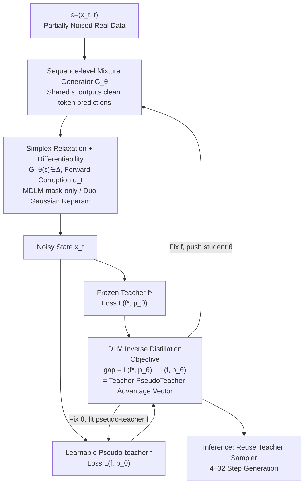

# IDLM: Inverse-distilled Diffusion Language Models

**Conference**: ICML 2026  
**arXiv**: [2602.19066](https://arxiv.org/abs/2602.19066)  
**Code**: https://david-cripto.com/idlm (Available)  
**Area**: LLM Pre-training / Diffusion Language Models / Distillation Acceleration  
**Keywords**: Diffusion Language Models, Inverse Distillation, Discrete Diffusion, Few-step Sampling, MDLM/Duo

## TL;DR
This paper extends "Inverse Distillation" from continuous diffusion to discrete text diffusion models. By proving that the unique optimal solution for the IDLM loss under SEDD/MDLM/Duo is the true data distribution, and combining simplex relaxation with Gaussian reparameterization to address discrete backpropagation instability, it compresses a 1024-step teacher DLM down to 16 or even 4 steps while maintaining GenPPL/Entropy and MAUVE scores.

## Background & Motivation
**Background**: Diffusion Language Models (DLMs, such as SEDD / MDLM / UDLM / Duo) have recently approached the quality of autoregressive LMs in text generation. They work by designing a forward corruption process (masking or uniform processes) on discrete tokens and training a denoiser for gradual reverse recovery. However, reverse sampling naturally requires hundreds to thousands of steps, resulting in inference latency far higher than the throughput of a single forward pass with KV-cache in autoregressive models, which hinders industrial adoption.

**Limitations of Prior Work**: Acceleration of diffusion in the continuous domain has been thoroughly studied (DDIM, progressive distillation, consistency models, DMD, etc.), but applying these directly to the discrete domain faces two major obstacles: (1) Backpropagation must pass through categorical sampling, where hard Gumbel-Softmax is often unstable; (2) Distillation objectives often do not guarantee that the optimal solution uniquely corresponds to $p^*$. Current discrete-side mainstream methods are consistency-style (SDTT, Duo-DCD), which essentially teach the student to "skip teacher trajectory segments" but retain the teacher's position-independent decomposition, failing to characterize joint distributions between tokens in the few-step limit and easily collapsing to high-frequency modes.

**Key Challenge**: The DLM denoiser $f^*$ is "uniquely defined" by $p^*$ (diffusion training is $f^*=\arg\min_f \mathcal{L}(f,p^*)$), but the inverse—deriving $p_\theta$ given $f^*$—lacks both uniqueness theory and stable gradient paths in the discrete domain.

**Goal**: Generalize Inverse Distillation from the continuous domain (following IBMD/UID/RSD) to discrete DLMs to obtain a few-step generation framework that (a) has a unique global optimum at $p^*$, (b) allows stable gradient backpropagation, and (c) matches the performance of a 1024-step teacher in 4–16 steps.

**Key Insight**: View distillation from a different perspective—instead of having the student imitate a specific trajectory or marginal of the teacher, ask: "If I have a distribution $p_\theta$, would running diffusion training on it recover the known teacher $f^*$?" That is, treat $f^*=\arg\min_f \mathcal{L}(f, p_\theta)$ as an optimality condition for $p_\theta$.

**Core Idea**: Use the IDLM loss $\mathcal{L}_{\text{IDLM}}(\theta)=\mathcal{L}(f^*,p_\theta)-\min_f \mathcal{L}(f,p_\theta)$ as the training objective for the student distribution. The paper proves that this gap is actually equal to the **KL divergence between the student and reality across the entire diffusion trajectory**, meaning a few-step generator uniquely recovers $p^*$ by minimizing this gap to zero.

## Method

### Overall Architecture
IDLM compresses thousand-step teacher DLMs into a few steps using an "inverse" perspective: it doesn't force the student to mimic sampling trajectories but finds a student distribution $p_\theta$ such that the pre-trained teacher $f^*$ remains the "optimal denoiser" for it. It maintains three networks: a frozen **Teacher** $f^*$ (a multi-step DLM pre-trained on $p^*$), a learnable **Pseudo-teacher** $f$ (a denoiser re-fitted to the student's current distribution $p_\theta$), and a **Student Generator** $G_\theta$. The student takes $\epsilon=(x_t,t)$ and outputs a simplex vector $G_\theta(\epsilon)\in\Delta$ as a prediction for clean tokens, sharing $\epsilon$ across all positions to obtain a sequence-level mixture distribution $p_\theta(x_0^{1:L})=\mathbb{E}_{\epsilon}[\prod_l \text{Cat}(x_0^l;G_\theta^l(\epsilon))]$. Training alternates between two steps: fixing $\theta$ to fit the pseudo-teacher $f$ using $\mathcal{L}(f,p_\theta)$, and fixing $f$ to push the student using the IDLM gap $\mathcal{L}(f^*,p_\theta)-\mathcal{L}(f,p_\theta)$. Inference reuses the teacher's reverse sampler but with a grid of only 4–32 steps.

### Key Designs

**1. IDLM Inverse Distillation Objective + Uniqueness Theorem**

IDLM formulates the problem inversely: rather than chasing trajectories, it seeks $p_\theta$ such that retraining a denoiser on its samples yields $f^*$. This leads to $\mathcal{L}_{\text{IDLM}}(\theta)=\mathcal{L}(f^*,p_\theta)-\min_f \mathcal{L}(f,p_\theta)$. Theorem 3.1 proves that for SEDD / MDLM / Duo, $\mathcal{L}_{\text{IDLM}}(\theta)\geq \mathcal{D}_{\text{KL}}(p_\theta\|p^*)\geq 0$, where equality holds if and only if $p_\theta=p^*$. This gap represents the KL divergence over the entire trajectory $\mathcal{D}_{\text{KL}}(\mathbb{P}^\theta\|\mathbb{P}^*)$. Unlike marginal matching ($\mathcal{L}_{\text{DMD}}$) which only looks at "slices" in time, IDLM matches the full path distribution, allowing the few-step student to learn joint structures between tokens.

**2. Simplex Relaxation + Modality-specific Differentiability**

To pass gradients through discrete sampling, IDLM relaxes the generator's range to the probability simplex $\Delta$. For MDLM, it leverages the *subs* parameterization: the gap is only non-zero at masked positions ($x_t=m$), simplifying the update to $-\mathbb{E}_{\epsilon,t}[(1-\alpha_t)\lambda_t\langle G_\theta(\epsilon),\log f(m,t)\rangle]$, where the sampled token $x_t$ disappears from the gradient path (implicit stop-gradient). For Duo, it uses Gaussian reparameterization $x_t=\text{softmax}((\tilde{\alpha}_t G_\theta(\epsilon)+\sqrt{1-\tilde{\alpha}_t^2}\,\xi)/\tau)$ to replace non-differentiable sampling with a continuous approximation.

**3. Sequence-level mixture + Alternating Optimization**

To capture joint structures without explicit枚举, IDLM uses a mixture model: given a shared latent $\epsilon$, positions are independent on $\Delta$, but sharing $\epsilon$ captures sentence-level correlations. Optimization alternates between fitting the pseudo-teacher $f$ with $\mathcal{L}_f=\mathcal{L}(f,p_\theta)$ and updating the student $\theta$ with the IDLM gap.

### Loss & Training
The general token-level objective is $\mathcal{L}(f,p)=\mathbb{E}_{p(x_0),t,q_t}[g(x_t,x_0,f(x_t,t))]$. The IDLM gradient provides an advantage vector $a_t=\log f^*(m,t)-\log f(m,t)$. The student is pushed toward tokens where the teacher's preference exceeds the pseudo-teacher's. Both student and pseudo-teacher are initialized with teacher weights.

## Key Experimental Results

### Main Results
Unconditional generation based on OpenWebText (OWT), comparing GenPPL ↓ / MAUVE ↑ / Entropy ↑.

| Setting | Steps | GenPPL ↓ | MAUVE ↑ | Entropy ↑ |
| :--- | :--- | :--- | :--- | :--- |
| MDLM Teacher | 1024 | 41.29 | 0.89 | 5.28 |
| SDTT | 16 | 61.34 | 0.88 | 5.36 |
| **IDLM-MDLM (Ours)** | **16** | **32.75** | **0.93** | **5.42** |
| Duo Teacher | 1024 | 71.72 | 0.90 | 5.22 |
| Duo-DCDg | 4 | 96.24 | 0.69 | 4.93 |
| **IDLM-DCDg (Ours)** | **4** | **77.47** | **0.89** | **5.28** |

### Key Findings
- **64× Acceleration without Loss**: The 16-step student matches or exceeds the 1024-step teacher in GenPPL, MAUVE, and Entropy simultaneously.
- **Superior at the Few-step Limit**: At 4–8 steps, IDLM significantly outperforms consistency methods (Duo-DCDg MAUVE 0.69 vs IDLM-DCDg 0.89), validating the "trajectory KL" advantage.
- **Ablation**: On MDLM, the mask-only update is superior. On Duo, the full IDLM objective is more stable than the stop-gradient version (DMD-style).

## Highlights & Insights
- **Elegance of the Inverse Perspective**: Translating "student mimics teacher" into "student distribution makes teacher optimal" allows for a natural gap loss tied to trajectory KL.
- **Effective Simplex Handling**: The modality-specific differentiability (mask-only for MDLM, Gaussian for Duo) avoids one-size-fits-all hard sampling issues.
- **Sequence-level Mixture**: This provides a lightweight way to capture joint distributions in few-step discrete generation.

## Limitations & Future Work
- IDLM is not a pure one-step generator; it requires parameterization with $t$ to succeed.
- Uniqueness results for Duo rely on the $\tau\to 0^+$ limit; the gap at finite $\tau$ is not fully characterized.
- Scalability to complex dialogue or long-context scenarios remains to be verified.

## Related Work & Insights
- **vs SDTT / Duo-DCD**: Consistency methods lack guarantees of recovering $p^*$ in the few-step limit; IDLM provides a theoretical path to $p^*$.
- **vs DiDi-Instruct / DMD-style**: DMD matches marginals via stop-gradients; IDLM matches the full trajectory, which is crucial for processes like uniform diffusion where tokens are modified repeatedly.

## Rating
- Novelty: ⭐⭐⭐⭐⭐ 
- Experimental Thoroughness: ⭐⭐⭐⭐ 
- Writing Quality: ⭐⭐⭐⭐⭐ 
- Value: ⭐⭐⭐⭐⭐ 

<!-- RELATED:START -->

- **MDLM**: [2402.15021](https://arxiv.org/abs/2402.15021)
- **Duo**: [2410.13456](https://arxiv.org/abs/2410.13456)
- **DMD**: [2311.18828](https://arxiv.org/abs/2311.18828)

<!-- RELATED:END -->

## Related Papers

- [\[ICML 2026\] DIVER: Diving Deeper into Distilled Data via Expressive Semantic Recovery](diverdiving_deeper_into_distilled_data_via_expressive_semantic_recovery.md)
- [\[ICML 2026\] Mind Your Margin and Boundary: Are Your Distilled Datasets Truly Robust?](mind_your_margin_and_boundary_are_your_distilled_datasets_truly_robust.md)
- [\[ICLR 2026\] ES-dLLM: Efficient Inference for Diffusion Large Language Models by Early-Skipping](../../ICLR2026/model_compression/es-dllm_efficient_inference_for_diffusion_large_language_models_by_early-skippin.md)
- [\[CVPR 2026\] Sampling-Aware Quantization for Diffusion Models](../../CVPR2026/model_compression/sampling-aware_quantization_for_diffusion_models.md)
- [\[ICML 2026\] Entropy-Aware On-Policy Distillation of Language Models](entropy-aware_on-policy_distillation_of_language_models.md)

<!-- RELATED:END -->
