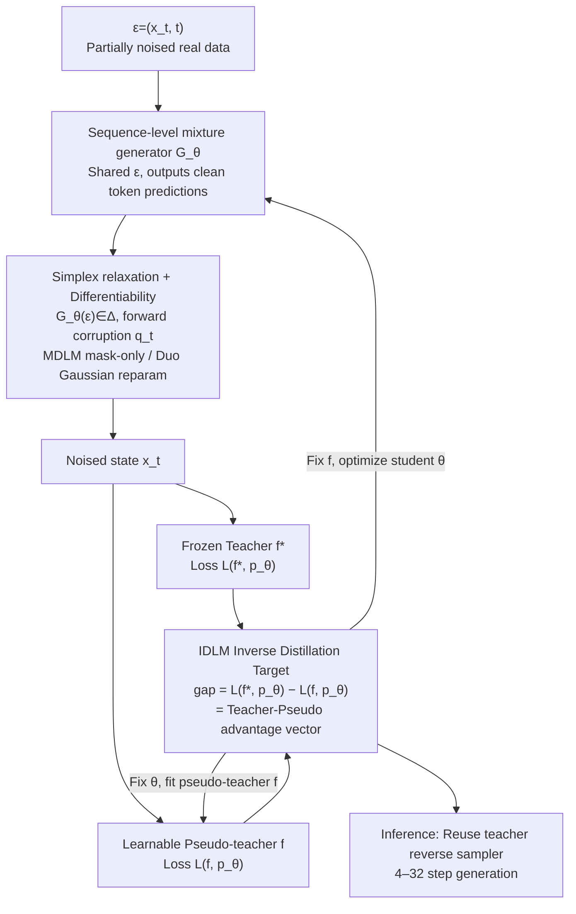

# IDLM: Inverse-distilled Diffusion Language Models

**Conference**: ICML 2026  
**arXiv**: [2602.19066](https://arxiv.org/abs/2602.19066)  
**Code**: https://david-cripto.com/idlm (Available)  
**Area**: LLM Pre-training / Diffusion Language Models / Distillation Acceleration  
**Keywords**: Diffusion Language Models, Inverse Distillation, Discrete Diffusion, Few-step Sampling, MDLM/Duo

## TL;DR
This paper extends "Inverse Distillation" from continuous diffusion to discrete text diffusion models. By proving that the unique optimal solution for the IDLM loss under SEDD/MDLM/Duo is the true data distribution $p^*$, and combining simplex relaxation with Gaussian reparameterization to solve the instability of discrete backpropagation, it compresses a 1024-step teacher DLM to 16 or even 4 steps while maintaining GenPPL, Entropy, and MAUVE with almost no degradation.

## Background & Motivation
**Background**: Diffusion Language Models (DLMs, such as SEDD / MDLM / UDLM / Duo) have recently approached the quality of autoregressive LMs in text generation. They work by designing a forward corruption process (masking or uniform processes) for discrete tokens and training a denoiser to recover them step-by-step. However, reverse sampling naturally requires hundreds to thousands of steps, resulting in inference latency much higher than the throughput of autoregressive models with KV-caching, which hinders industrialization.

**Limitations of Prior Work**: Acceleration of diffusion in the continuous domain has been extensively studied (DDIM, progressive distillation, consistency models, DMD, etc.). However, directly migrating these to the discrete domain faces two major obstacles: (1) backpropagation must pass through categorical sampling, where hard Gumbel-Softmax is prone to instability; (2) distillation objectives often fail to guarantee that the optimal solution uniquely corresponds to $p^*$. Current mainstream discrete methods like consistency-style SDTT or Duo-DCD essentially teach students to "skip teacher trajectory segments" but retain the teacher's position-independent decomposition, making them unable to characterize joint distributions between tokens at the few-step limit, often collapsing into high-frequency modes.

**Key Challenge**: The denoiser $f^*$ of a DLM is "uniquely defined" by $p^*$ (diffusion training is $f^*=\arg\min_f \mathcal{L}(f,p^*)$), but conversely, "inferring $p_\theta$ given $f^*$" lacks both uniqueness theory and stable gradient paths in the discrete domain.

**Goal**: To generalize Inverse Distillation (from the IBMD/UID/RSD lineage in the continuous domain) to discrete DLMs, resulting in a few-step generation framework that (a) has a unique global optimum at $p^*$, (b) allows for stable gradient backpropagation, and (c) matches the 1024-step teacher performance in 4–16 steps.

**Key Insight**: Change the perspective on distillation—rather than making the student mimic a specific trajectory or marginal point of the teacher, ask: "If I have a distribution $p_\theta$, does retraining a diffusion model on it restore the known teacher $f^*$?" That is, using $f^*=\arg\min_f \mathcal{L}(f, p_\theta)$ as the optimality condition for $p_\theta$.

**Core Idea**: Use the IDLM loss $\mathcal{L}_{\text{IDLM}}(\theta)=\mathcal{L}(f^*,p_\theta)-\min_f \mathcal{L}(f,p_\theta)$ as the training objective for the student distribution. It is proved that this gap is equivalent to the **KL divergence between the student and real data across the entire diffusion trajectory**, meaning the few-step generator uniquely recovers $p^*$ by minimizing this gap to zero.

## Method

### Overall Architecture
IDLM aims to compress a thousand-step teacher diffusion language model into a few steps using an "inverse" perspective: instead of forcing the student to follow the teacher's sampling trajectory, it seeks a student distribution $p_\theta$ for which the pre-trained teacher $f^*$ resides as the "optimal denoiser." To achieve this, it maintains three networks: a frozen **Teacher** $f^*$ (a multi-step DLM pre-trained on real data $p^*$), a learnable **Pseudo-teacher** $f$ (a denoiser refitted on the student's current distribution $p_\theta$), and a **Student Generator** $G_\theta$. The student takes $\epsilon=(x_t,t)$ and outputs a simplex vector $G_\theta(\epsilon)\in\Delta$ as a prediction for clean tokens. By sharing the same $\epsilon$ across all positions, it yields a sequence-level mixture distribution $p_\theta(x_0^{1:L})=\mathbb{E}_{\epsilon}[\prod_l \text{Cat}(x_0^l;G_\theta^l(\epsilon))]$. Training alternates between two steps: fixing $\theta$ and using $\mathcal{L}(f,p_\theta)$ to fit the pseudo-teacher $f$ to the student distribution, then fixing $f$ and using the IDLM gap $\mathcal{L}(f^*,p_\theta)-\mathcal{L}(f,p_\theta)$ to update the student. Inference reuses the teacher’s reverse sampler but with a grid reduced to 4–32 steps.

### Key Designs

**1. IDLM Inverse Distillation Target + Uniqueness Theorem: Optimizing the "Teacher Remains Optimal" Gap**

Few-step distillation often lacks theoretical guarantees—consistency-based methods cannot confirm if a 4-step student can still recover the true distribution $p^*$. IDLM reverses the question: instead of chasing trajectories, it finds $p_\theta$ such that $f^*$ remains the optimal denoiser when retraining on student samples. This leads to the loss $\mathcal{L}_{\text{IDLM}}(\theta)=\mathcal{L}(f^*,p_\theta)-\min_f \mathcal{L}(f,p_\theta)$. The first term is the teacher's denoising loss on student samples; the second is the lower bound achieved by the best possible denoiser trained on those same samples. The gap measures how far the teacher is from being optimal. Crucially, Theorem 3.1 proves that for SEDD / MDLM / Duo (taking the $\tau\to 0^+$ limit for Duo), $\mathcal{L}_{\text{IDLM}}(\theta)\geq \mathcal{D}_{\text{KL}}(p_\theta\|p^*)\geq 0$, with equality if and only if $p_\theta=p^*$. The proof rewrites this gap as the KL divergence over the entire diffusion trajectory $\mathcal{L}_{\text{IDLM}}(\theta)=\mathcal{D}_{\text{KL}}(\mathbb{P}^\theta\|\mathbb{P}^*)$. This is superior to direct marginal matching $\mathcal{L}_{\text{DMD}}=\int w(t)\,D_{\text{KL}}(p_t^\theta\|p_t^*)\,dt$ because the latter only views "slices" at each time step. In processes like uniform diffusion where tokens can be repeatedly modified, marginal matching loses trajectory coupling signals. By matching path distributions, IDLM allows the few-step student to learn joint structures between tokens rather than collapsing into position-independent conditional distributions.

**2. Simplex Relaxation + Modality-specific Differentiability: Passing Gradients Through Discrete Sampling**

The "hardest nut to crack" in discrete distillation is backpropagation through categorical sampling. Hard Gumbel-Softmax tends to have high gradient variance in multi-step training. IDLM uses a general relaxation: relaxing the generator's range from the one-hot set $\mathcal{V}$ to the probability simplex $\Delta$. This turns cross-entropy into a soft-label loss while keeping the forward corruption $q_t(\cdot\mid G_\theta(\epsilon))$ as a valid categorical process. Beyond this, it follows stable paths tailored to two DLM types. For MDLM, it leverages the properties of `subs` parameterization: for all unmasked positions, $f^*(x_t,t)=f(x_t,t)=x_t$, which cancels out. The IDLM gap is non-zero only when $x_t=m$ (masked). The generator update simplifies to $-\mathbb{E}_{\epsilon,t}[(1-\alpha_t)\lambda_t\langle G_\theta(\epsilon),\log f(m,t)\rangle]$, where the sampled token $x_t$ vanishes from the gradient path. This acts as a natural implicit stop-gradient, allowing gradients to flow only through simplex outputs, ensuring stability and simplicity. For Duo, it uses its inherent simplex-based denoiser and applies Gaussian reparameterization $x_t=\text{softmax}((\tilde{\alpha}_t G_\theta(\epsilon)+\sqrt{1-\tilde{\alpha}_t^2}\,\xi)/\tau)$ to replace non-differentiable sampling with a differentiable approximation, making $G_\theta(\epsilon)\mapsto x_t$ differentiable.

**3. Sequence-level mixture + Alternating Optimization: Fitting Joint Distributions into Single-step Generators**

Directly parameterizing $p_\theta$ as a distribution over $\mathcal{V}^L$ is intractable as it requires $N^L$ probabilities. Conversely, position-independent decomposition loses joint structures. IDLM compromises using a shared latent variable: first sampling $\epsilon\sim p_\mathcal{E}$, then making positions independent on $\Delta$ given $\epsilon$. Since $\epsilon$ is shared across positions, each mixture component corresponds to a sentence-level choice. The generator maintains differentiability while capturing semantic correlations without explicitly enumerating the sequence space. Since $\min_f$ cannot be solved exactly, IDLM uses alternating updates (similar to DMD): either fitting the pseudo-teacher with $\mathcal{L}_f=\mathcal{L}(f,p_\theta)$ or updating the student with $\mathcal{L}_{\text{IDLM}}$. Practically, the paper finds that generating a clean sentence from noise in one step often fails; thus, during inference, $\epsilon=(x_t,t)$ is sampled from partially noised real data, and the teacher's reverse sampler is used for 4–32 steps to spread out the optimization difficulty.

### Loss & Training
The general token-level objective is denoted as $\mathcal{L}(f,p)=\mathbb{E}_{p(x_0),t,q_t}[g(x_t,x_0,f(x_t,t))]$, summed over all positions. The resulting IDLM gradient signal can be interpreted as a token advantage vector $a_t=\log f^*(m,t)-\log f(m,t)$. The student does not just chase the teacher's most probable token; it pushes towards tokens that the "teacher prefers more than the pseudo-teacher." Training converges when the pseudo-teacher $f$ matches the teacher $f^*$. Both student and pseudo-teacher are initialized from the teacher's weights to reuse learned semantic structures.

## Key Experimental Results

### Main Results
Unconditional generation based on OpenWebText (OWT), comparing GenPPL ↓ / MAUVE ↑ / Entropy ↑ / GM ↓ under equivalent sampling steps.

| Setting | Steps | GenPPL ↓ | MAUVE ↑ | Entropy ↑ | Remarks |
|------|------|---------|---------|----------|-----|
| MDLM Teacher | 1024 | 41.29 | 0.89 | 5.28 | Teacher Upper Bound |
| SDTT | 16 | 61.34 | 0.88 | 5.36 | Consistency Distillation |
| SDTT+Di4C2 | 16 | 44.82 | 0.90 | 5.34 | + Latent Mixture |
| DiDi-Instruct | 16 | 38.19 | – | 5.21 | DMD-style |
| **IDLM-MDLM (Ours)** | **16** | **32.75** | **0.93** | **5.42** | 64× Speedup |
| Duo Teacher (greedy) | 1024 | 71.72 | 0.90 | 5.22 | Teacher |
| Duo-DCDg | 4 | 96.24 | 0.69 | 4.93 | Consistency |
| **IDLM-DCDg (Ours)** | **4** | **77.47** | **0.89** | **5.28** | 256× Speedup |

On MDLM, the 16-step student reduces GenPPL from the teacher's 41.29 to 32.75 while surpassing it in MAUVE at 0.93. In the Duo lineage, IDLM-DCDg significantly outperforms Duo-DCDg at both 8 and 4 steps, recovering MAUVE from 0.69 to 0.89 at the 4-step limit.

### Key Experimental Results (GSM8K / TinyGSM)

| Model | Steps | Accuracy (%) | Speedup |
|------|------|--------------|--------|
| MDLM Teacher | 1024 | 18.0 | 1× |
| **IDLM-MDLM** | **128** | **19.86** | 8× |
| Duo Teacher | 1024 | 17.2 | 1× |
| **IDLM-Duo** | **64** | **19.03** | 16× |
| Autoregressive (greedy) | 512 | 63.3 | – |

The few-step student **slightly outperforms** the teacher's accuracy despite a much smaller step budget, suggesting that IDLM's inverse distillation does not sacrifice sequence-level correctness.

### Key Findings
- **64× Speedup with no loss in quality**: The 16-step MDLM student matches or exceeds the 1024-step teacher across GenPPL, MAUVE, and Entropy, outperforming SDTT/Di4C2/DiDi-Instruct at low step counts.
- **Critical gap at low-step limits**: The performance gap between IDLM and consistency methods is largest at 4–8 steps, validating the argument for "Trajectory KL vs. Marginal KL."
- **GenPPL–Entropy tradeoff**: Models with low entropy (like FLM/ELF) can "trick" GenPPL. IDLM improves GenPPL while keeping entropy close to the teacher, indicating genuine improvement rather than mode collapse.
- **Ablation**: On MDLM, the original mask-only update is superior to adding Gaussian noise; on Duo, the full IDLM is more stable than a stop-gradient version (≈DMD), showing trajectory matching is vital for uniform diffusion.
- **Scalability**: The same patterns hold consistently on the 0.9B MDLM provided by SDTT.

## Highlights & Insights
- **Elegance of the Inverse Perspective**: Turning "student mimics teacher" into "student distribution makes teacher optimal" allows the loss to be expressed as $\mathcal{L}(f^*,p_\theta)-\min_f \mathcal{L}(f,p_\theta)$, which naturally connects to trajectory KL. This unifies discrete DLMs with the existing IBMD/UID/RSD framework from the continuous domain.
- **Beautiful MDLM Mask-only Simplification**: The `subs` parameterization allows "already revealed" tokens to cancel out in the IDLM gap. Gradients only flow through simplex outputs, effectively providing a natural implicit stop-gradient and single-token loss. This trick is transferable to any discrete diffusion variant with copy-forward properties.
- **Reusable Sequence-level Mixture**: Using a shared latent to upgrade position-independent decomposition to a mixture is a lightweight solution for capturing joint distributions in few-step discrete diffusion. IDLM unifies this with trajectory KL.

## Limitations & Future Work
- The authors admit that pure one-step distillation fails; they must rely on multi-step parameterization $\epsilon=(x_t,t)$. Thus, IDLM is not a true one-step generator but a compressor that "learns 1024 steps into 4–16 steps."
- Uniqueness results for Duo require the $\tau\to 0^+$ limit; the gap between finite $\tau$ and the optimal solution is not explicitly characterized.
- Evaluation is limited to OWT unconditional generation and GSM8K. Complex scenarios like dialogue, code, or long contexts remain unverified. The gap with autoregressive LMs in instruction following remains large (19.86% vs 63.3% on GSM8K).
- Training Cost: Alternating updates between $f$ and $\theta$ effectively requires co-training two models, similar in overhead to the DMD lineage.

## Related Work & Insights
- **vs. SDTT / Duo-DCD (consistency-style)**: These methods train the student as an approximator that "jumps" along the teacher's trajectory, preserving position-independent decomposition, which does not guarantee recovery of $p^*$ at few-step limits. IDLM uses sequence-level mixtures and trajectory KL for a theoretical guarantee.
- **vs. DiDi-Instruct / D-MMD / Di[M]O (DMD-style)**: These perform marginal KL matching at each time step $\int w(t) D_{\text{KL}}(p_t^\theta\|p_t^*) dt$, which is a special case of IDLM with stop-gradients. While they overlap on MDLM due to `subs`, IDLM shows superiority in Duo where tokens can be modified repeatedly.
- **vs. IBMD / UID / RSD (Continuous Inverse Distillation)**: Shared core philosophy (student distribution satisfies the teacher's optimality condition). IDLM is the first to rigorously extend this to discrete DLMs, solving discrete backpropagation and uniqueness issues.

## Rating
- Novelty: ⭐⭐⭐⭐⭐ Rigorous extension of Inverse Distillation to discrete DLMs with uniqueness theorems and trajectory KL interpretations.
- Experimental Thoroughness: ⭐⭐⭐⭐ MDLM/Duo/SEDD/0.9B setups + OWT + GSM8K + full step sweeps, though lacking larger scale dialogue evaluation.
- Writing Quality: ⭐⭐⭐⭐⭐ Clear logical chain from theory to implementation to algorithm pseudocode. The advantage vector and mixture intuition are well-explained.
- Value: ⭐⭐⭐⭐⭐ Compressing DLM inference to 4–16 steps without quality loss is a key piece in making diffusion language models practical.

<!-- RELATED:START -->

## Related Papers

- [\[CVPR 2026\] InstantViR: Real-Time Video Inverse Problem Solver with Distilled Diffusion Prior](../../CVPR2026/model_compression/instantvir_real-time_video_inverse_problem_solver_with_distilled_diffusion_prior.md)
- [\[ICML 2026\] DIVER: Diving Deeper into Distilled Data via Expressive Semantic Recovery](diverdiving_deeper_into_distilled_data_via_expressive_semantic_recovery.md)
- [\[ICML 2026\] Mind Your Margin and Boundary: Are Your Distilled Datasets Truly Robust?](mind_your_margin_and_boundary_are_your_distilled_datasets_truly_robust.md)
- [\[ICML 2026\] Entropy-Aware On-Policy Distillation of Language Models](entropy-aware_on-policy_distillation_of_language_models.md)
- [\[ICML 2026\] Model Merging Scaling Laws in Large Language Models](model_merging_scaling_laws_in_large_language_models.md)

<!-- RELATED:END -->
