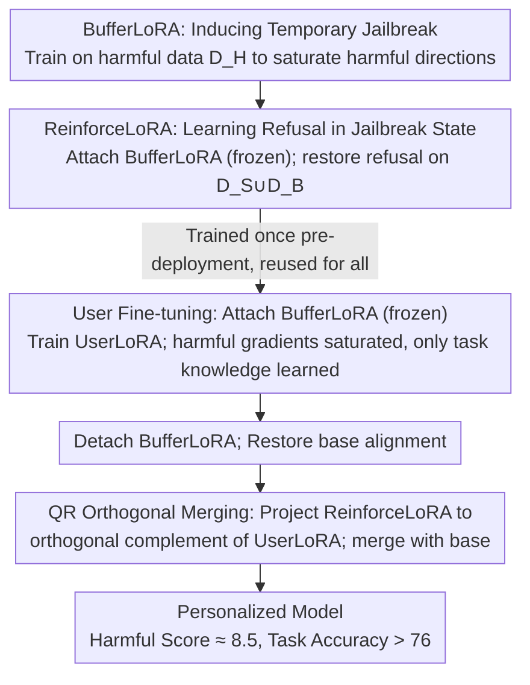

# Jailbreak to Protect: Buffering and Reinforcing via Temporary Jailbreaking for Safe Fine-Tuning in Large Language Models

**Conference**: ICML 2026 Spotlight  
**arXiv**: [2605.24550](https://arxiv.org/abs/2605.24550)  
**Code**: To be confirmed  
**Area**: LLM Security / Fine-tuning-as-a-Service Defense / LoRA  
**Keywords**: Harmful Fine-tuning Defense, Temporary Jailbreaking, BufferLoRA, ReinforceLoRA, QR Orthogonal Merging  

## TL;DR
In the Fine-tuning-as-a-Service scenario, the authors reinterpret "temporarily jailbreaking a model before user fine-tuning" as a gradient saturation mechanism. Based on this observation, they design the Buffer-and-Reinforce framework: a detachable BufferLoRA consumes harmful gradients during user fine-tuning, while ReinforceLoRA restores safety via QR orthogonal merging. This approach reduces harmful scores to approximately 8.5 without requiring user-side safety data, while maintaining downstream task accuracy above 76.

## Background & Motivation

**Background**: Fine-tuning-as-a-Service (FaaS) platforms from providers like OpenAI and Google allow users to upload data to fine-tune aligned LLMs, which has become the mainstream method for customized deployment. Defenses against "harmful fine-tuning attacks" in FaaS are categorized into three types: the alignment phase (modifying pre-trained weights for fine-tuning resistance), the fine-tuning phase (adding regularization to user optimization), and the post-fine-tuning phase (post-hoc cleaning or merging safety modules).

**Limitations of Prior Work**: Most existing defenses follow the "explicit regularization" route, such as integrating KL loss, reference model distance, or adversarial perturbations into user fine-tuning objectives. This approach faces three obstacles in FaaS deployment: (i) it requires service providers to continuously inject additional safety alignment data during user training, violating the minimalist interface of commercial FaaS; (ii) it introduces linear computational overhead due to additional regularization gradients; and (iii) the regularization intensity is difficult to adapt when user data contains varying proportions of harmful samples, often failing to suppress harmful updates or damaging benign tasks. Zhou et al. (2024) proposed the Security Vector, which temporarily activates "harmful behavior modules" before fine-tuning. While empirically effective, it lacks mechanistic explanation and systematic quantification of its impact on benign learning capabilities.

**Key Challenge**: To suppress harmful gradients while preserving task gradients under the strict constraints of FaaS (zero additional data, zero extra computation, and unknown user data distribution). Explicit regularization naturally violates the zero-extra-data assumption, while temporary jailbreak schemes lack theoretical grounding and proof that they do not suppress useful updates.

**Goal**: (1) Provide a gradient-level analysis of why "jailbreak before fine-tuning" blocks harmful updates; (2) Engineer this mechanism into a fine-tuning framework that does not rely on user-side safety data, has near-zero overhead, and further reinforces safety post-hoc.

**Key Insight**: By plotting the 2D loss landscape of LLaMA3-8B-Instruct on harmful versus harmless data, the authors find that safety-aligned models still have significant downhill space on harmful data (explaining why they are easily corrupted). In contrast, "jailbroken models" have already converged to the bottom of the harmful loss valley. Meanwhile, both models still have ample optimization margin on harmless data. This implies that jailbreaking does not "violently destroy alignment" but rather drains gradients in harmful directions, leaving mainly task-related directions for user fine-tuning.

**Core Idea**: Use a detachable LoRA module to temporarily jailbreak the model before fine-tuning to saturate harmful gradients naturally. After fine-tuning, detach this LoRA and overlay a pre-trained safety-enhanced ReinforceLoRA via QR orthogonal projection. This achieves a "buffer first, reinforce later" defense without modifying user interfaces.

## Method

### Overall Architecture
Buffer-and-Reinforce addresses defense under FaaS constraints: no safety data added to the user interface and near-zero runtime overhead, while defending against harmful gradients and preserving task gradients for unknown distributions. It distributes tasks across three LoRAs: a pre-trained BufferLoRA ("induced jailbreak"), a pre-trained ReinforceLoRA ("restored refusal"), and the UserLoRA that is actually optimized during user data upload.

The pipeline comprises three stages. Pre-deployment: The provider trains BufferLoRA and ReinforceLoRA once for all users. User Fine-tuning: BufferLoRA is attached and frozen; only UserLoRA learns from user data. Since the base is at the bottom of the harmful loss valley, there are minimal harmful gradients, preventing harmful updates. Post-fine-tuning: BufferLoRA is detached to restore base alignment. Then, ReinforceLoRA is projected onto the orthogonal complement of the UserLoRA subspace via QR decomposition, averaged with UserLoRA, and added back to the base. Throughout the process, the user only submits their own data, maintaining a standard LoRA fine-tuning interface.

The design is supported by a newly defined observable—Safety Gradient Score $S^{l}=\tfrac{1}{N}\sum_{i}\mathbf{g}_{i}^{l}\cdot\mathbf{v}^{l}/(\lVert\mathbf{v}^{l}\rVert_{2}+\epsilon)$, which measures the projection of gradients at layer $l$ onto the "safety direction" $\mathbf{v}^{l}$ (derived from safety-aligned LoRA weights). In LLaMA3-8B-Instruct (layers 0–15), safe models show significant negative scores for both harmful and harmless data, indicating that standard fine-tuning erodes safety. Conversely, jailbroken models show scores near zero for harmful data, but their harmless gradient norms remain comparable to safe models in layers 15+, meaning task directions are preserved.

### Key Designs

**1. BufferLoRA: Pre-saturating harmful directions to nullify harmful gradients**

Harmful fine-tuning is effective because safety-aligned models retain downhill space on harmful data. BufferLoRA preemptively reaches the end of this path for the "attacker" by training parameters $\theta_{B}$ on harmful query-response pairs $\mathcal{D}_{H}$ held by the provider. The objective is $\mathcal{L}_{B}(\theta_{B})=-\mathbb{E}_{(x,y)\sim\mathcal{D}_{H}}\sum_{t}\log P(y_{t}\mid x,y_{<t};\theta,\theta_{B})$, forcing the model to generate harmful content. When a user fine-tunes, the harmful directions are already saturated. Its "attach-and-detach" design ensures that corruption is temporary. Unlike Zhou et al. (2024), this approach uses the Safety Gradient Score to empirically prove that no additional KL term is needed to preserve harmless task performance.

**2. ReinforceLoRA: Learning refusal in jailbreak state to further enhance safety**

BufferLoRA only "maintains" original alignment; ReinforceLoRA pushes safety further post-hoc. It is trained while both the base and BufferLoRA are attached and frozen. The optimization objective $\mathcal{L}_{R}(\theta_{R})=-\mathbb{E}_{(x,y)\sim\mathcal{D}_{S}\cup\mathcal{D}_{B}}\sum_{t}\log P(y_{t}\mid x,y_{<t};\theta,\theta_{B},\theta_{R})$ uses harmful queries paired with refusals ($\mathcal{D}_{S}$) and harmless queries with benign responses ($\mathcal{D}_{B}$). By learning on a "jailbroken" model, it identifies the direction to restore refusal from a compromised state. Training on $\mathcal{D}_{S} \cup \mathcal{D}_{B}$ prevents the model from collapsing into constant refusal.

**3. QR Orthogonal Merging: Avoiding user task subspaces during safety updates**

To merge ReinforceLoRA without damaging user-learned task directions, the safety update is projected onto the orthogonal complement of the task subspace. Defining UserLoRA as $W_{U}=B_{U}A_{U}$, the authors show that $\mathrm{span}(W_{U})\approx\mathrm{span}(B_{U})$. QR decomposition is performed such that $\hat{B}_{U}=Q_{B}R$, and ReinforceLoRA is shifted via $\tilde{W}_{R}=(I-\alpha Q_{B}Q_{B}^{\top})W_{R}$. The final merge is $W_{\text{final}}=W_{\text{base}}+\tfrac{1}{2}(W_{U}+\tilde{W}_{R})$, where $\alpha$ controls the soft orthogonalization strength. To avoid over-deletion of ReinforceLoRA during rank collapse, an effective subspace $V_{\text{eff}}$ is identified using an eigenvalue threshold $\lambda_{i}>\tau\max_{j}\lambda_{j}$ of the Gram matrix $G=A_{U}A_{U}^{\top}$. This circumvents the task performance degradation seen in SafeLoRA-style merging.

### Loss & Training
The three LoRAs are optimized independently: BufferLoRA uses $\mathcal{D}_{H}$ (5,000 harmful pairs), ReinforceLoRA uses $\mathcal{D}_{S}\cup\mathcal{D}_{B}$ (5,000 refusal pairs + 5,000 benign pairs), and UserLoRA uses only $\mathcal{D}_{U}$. The first two are trained once by the provider. User fine-tuning involves standard cross-entropy without additional regularization.

## Key Experimental Results

### Main Results
Using LLaMA3-8B-Instruct, downstream tasks include GSM8K, SST2, and AGNEWS. User data is mixed with harmful samples at ratio $p$ (0 to 1). Metrics are Harmful Score (HS, lower is better) and Fine-tuning Accuracy (FA, higher is better).

| Setting | Method | HS ↓ | FA ↑ |
|------|------|------|------|
| $p=0.1$, GSM8K | SFT | 75.2 | 69.0 |
| $p=0.1$, GSM8K | SafeInstruct | 19.6 | 69.4 |
| $p=0.1$, GSM8K | Security Vector | 22.1 | 71.3 |
| $p=0.1$, GSM8K | Antidote | 27.2 | 75.0 |
| $p=0.1$, GSM8K | Panacea | 36.2 | 67.1 |
| $p=0.1$, GSM8K | **Ours** | **8.1** | **76.6** |
| $p=0.5$, GSM8K | SFT | 80.7 | 67.3 |
| $p=0.5$, GSM8K | SafeInstruct | 66.3 | 67.2 |
| $p=0.5$, GSM8K | **Ours** | **8.2** | **75.2** |
| $p=1.0$, GSM8K (All harmful) | SFT | 81.0 | — |
| $p=1.0$, GSM8K (All harmful) | **Ours** | **8.8** | — |

Ours maintains HS around 8 across tasks, even when SFT HS exceeds 75. FA remains comparable to or better than SFT, showing no HS "rebound" as user data size increases, unlike SafeLoRA or Antidote.

### Ablation Study

| Configuration | HS ↓ | FA ↑ | Description |
|------|------|------|------|
| Full Buffer-and-Reinforce | ≈8.5 | ≈76 | Three LoRAs + QR Merging |
| BufferLoRA only (no ReinforceLoRA) | Lower than SFT, but > 8.5 | ≈76 | BufferLoRA alone blocks most harmful updates |
| ReinforceLoRA only (no BufferLoRA) | Near SafeLoRA levels | Slightly lower | Post-hoc safety injection is limited if user is heavily corrupted |
| Naive Merge (no QR) | HS slightly better | FA drops sig. | QR Orthogonal Merging protects task performance |
| Ours vs Data Size $n=500$ → $2500$ | 8.5 → 9.1 | 75.1 → 76.7 | HS stability; Antidote HS spikes to 45+ at $n \geq 1500$ |

### Key Findings
- BufferLoRA and ReinforceLoRA are complementary: the former prevents harmful updates from entering UserLoRA, while the latter fills the base alignment's safety gaps during merging.
- Stability is key: Buffer-and-Reinforce's HS standard deviation remains in the single digits across varying $n$ and $p$, whereas Panacea/Antidote variance often exceeds 20.
- The soft intensity $\alpha$ in QR merging is the primary dial between FA and HS; hard projection can cause HS to rebound if the task direction is not properly isolated.

## Highlights & Insights
- Mechanistic Upgrade: Moves "jailbreak-as-defense" from an empirical trick to a quantifiable mechanism via the Safety Gradient Score, providing a tool to diagnose other fine-tuning defenses.
- Deployment Friendliness: The "train once, reuse, detach after use" format shifts costs from the user's training phase to the provider's pre-deployment phase, making it highly compatible with commercial FaaS APIs.
- Modular Merging: The QR merging logic treats safety and task directions as architectural abstractions, potentially applicable to multi-skill merging and personalization-alignment coexistence.

## Limitations & Future Work
- The methodology and the layer 16 partition are specific to LLaMA3-8B-Instruct; generalizability to Qwen, Mixtral, or Gemma is not yet verified.
- Dependence on provider data: The coverage of $\mathcal{D}_{H}$ determines the effectiveness of gradient saturation; performance might degrade if user data distribution differs significantly from $\mathcal{D}_{H}$.
- Hyperparameter Sensitivity: The threshold $\tau$ and soft intensity $\alpha$ are currently empirical and lack an adaptive selection strategy.

## Related Work & Insights
- **vs Security Vector (Zhou 2024)**: Both use "jailbreak then train," but this work adds gradient explanations, removes the KL loss requirement, and introduces ReinforceLoRA for post-hoc reinforcement, outperforming Security Vector on both HS and FA.
- **vs SafeLoRA / Antidote / Panacea**: These post-hoc methods modify UserLoRA structures. The authors prove that naive merging damages task performance and that QR orthogonal projection is a superior merging operator.
- **vs SafeInstruct / Lisa**: Unlike traditional fine-tuning defenses that require data injection during every user's training, this framework shifts safety costs to pre-training, aligning better with PEFT deployment paradigms.

<!-- RELATED:START -->

## Related Papers

- [\[ICML 2025\] Weak-to-Strong Jailbreaking on Large Language Models](../../ICML2025/model_compression/weak-to-strong_jailbreaking_on_large_language_models.md)
- [\[CVPR 2026\] Masking Teacher and Reinforcing Student for Distilling Vision-Language Models](../../CVPR2026/model_compression/masking_teacher_and_reinforcing_student_for_distilling_vision-language_models.md)
- [\[AAAI 2026\] Consensus-Aligned Neuron Efficient Fine-Tuning Large Language Models for Multi-Domain Machine Translation](../../AAAI2026/model_compression/consensus-aligned_neuron_efficient_fine-tuning_large_language_models_for_multi-d.md)
- [\[ACL 2025\] Outlier-Safe Pre-Training for Robust 4-Bit Quantization of Large Language Models](../../ACL2025/model_compression/outlier-safe_pre-training_for_robust_4-bit_quantization_of_large_language_models.md)
- [\[ACL 2025\] L4Q: Parameter Efficient Quantization-Aware Fine-Tuning on Large Language Models](../../ACL2025/model_compression/l4q_parameter_efficient_quantization_aware_finetuning.md)

<!-- RELATED:END -->
