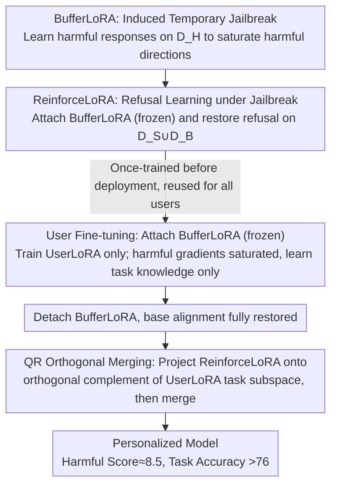

# Jailbreak to Protect: Buffering and Reinforcing via Temporary Jailbreaking for Safe Fine-Tuning in Large Language Models

**Conference**: ICML 2026 Spotlight  
**arXiv**: [2605.24550](https://arxiv.org/abs/2605.24550)  
**Code**: TBD  
**Area**: LLM Security / Fine-tuning-as-a-Service Defense / LoRA  
**Keywords**: Harmful Fine-tuning Defense, Temporary Jailbreaking, BufferLoRA, ReinforceLoRA, QR Orthogonal Merging  

## TL;DR
In the Fine-tuning-as-a-Service (FaaS) scenario, the authors reinterpret the strategy of "temporarily jailbreaking a model before user fine-tuning" as a gradient saturation mechanism. Based on this observation, they design the Buffer-and-Reinforce framework: a removable BufferLoRA is used to absorb harmful gradients during user fine-tuning, followed by a ReinforceLoRA that restores safety via QR orthogonal merging. This approach reduces harmful scores to approximately 8.5 without requiring any user-side safety data, while maintaining downstream task accuracy above 76.

## Background & Motivation

**Background**: Fine-tuning-as-a-Service (FaaS) provided by OpenAI, Google, and others allows users to upload data to fine-tune aligned LLMs, becoming a mainstream method for customized deployment. Defenses against "harmful fine-tuning attacks" in FaaS are categorized into three types: the alignment phase (modifying pre-trained weights for fine-tuning resistance), the fine-tuning phase (adding regularization during user optimization), and the post-fine-tuning phase (post-hoc cleaning or merging of safety modules).

**Limitations of Prior Work**: Most existing defenses follow an "explicit regularization" path, such as integrating KL loss, reference model distance, or adversarial perturbations into the user's fine-tuning objectives. This approach faces three obstacles in FaaS deployment: (i) it requires service providers to continuously inject extra safety alignment data during user training, violating the minimalist interface of commercial FaaS; (ii) it linearly increases computational overhead per user to calculate additional regularization gradients; (iii) regularization strength is difficult to adapt when user data contains varying proportions of harmful samples, often failing to suppress harmful updates or damaging benign tasks. Alternatively, the "Security Vector" proposed by Zhou et al. (2024) activates a "harmful behavior module" before fine-tuning to make the model "already proficient in bad behavior." While empirically effective, it lacks mechanistic explanation and systematic quantification of its impact on benign learning capabilities.

**Key Challenge**: Under the hard constraints of FaaS—"zero extra data, zero extra computation, and unknown user data distribution"—the goal is to simultaneously suppress harmful gradients and preserve task gradients. Explicit regularization naturally violates the zero-extra-data assumption, while temporary jailbreaking lacks theoretical grounding and proof that it does not inadvertently suppress useful updates.

**Goal**: (1) Provide a gradient-level analysis to explain why "jailbreaking before fine-tuning" prevents harmful updates; (2) Engineer this mechanism into a fine-tuning framework that does not rely on user-side safety data, incurs near-zero overhead, and allows further safety reinforcement post-hoc.

**Key Insight**: By plotting the 2D loss landscape of LLaMA3-8B-Instruct on harmful versus harmless data, the authors find that aligned models still have significant downward space on harmful data (explaining why harmful fine-tuning is effective), whereas "jailbroken models" have already converged to the bottom of the harmful loss landscape. Meanwhile, both models retain ample optimization potential on harmless data. This implies that jailbreaking is not "violent destruction of alignment" but a way to drain harmful gradients, leaving primarily task-related directions for user fine-tuning.

**Core Idea**: A removable LoRA module is used to temporarily jailbreak the model before fine-tuning to naturally saturate harmful gradients. After fine-tuning, this module is removed, and a pre-trained safety reinforcement LoRA is superposed via QR orthogonal projection. This achieves a "buffer-then-reinforce" defense without modifying user interfaces.

## Method

### Overall Architecture
Buffer-and-Reinforce addresses defense under FaaS constraints: no safety data added to the user interface and near-zero runtime overhead, even with unknown user data distributions. It partitions the process into three LoRAs: a pre-trained BufferLoRA ("induced jailbreak"), a pre-trained ReinforceLoRA ("restored refusal"), and the UserLoRA optimized during data upload.

The pipeline comprises three stages. Before deployment, the provider trains BufferLoRA and ReinforceLoRA once to be shared by all users. During user fine-tuning, BufferLoRA is attached and frozen while only UserLoRA is optimized. Since the backbone is pushed to the harmful loss floor, there are few harmful gradients available, naturally preventing harmful updates. Post-fine-tuning, BufferLoRA is detached to restore base alignment, and ReinforceLoRA is projected onto the orthogonal complement of the UserLoRA subspace using QR decomposition before being averaged and merged back. Users only submit their own data, maintaining a standard LoRA fine-tuning interface.

The design is supported by a newly defined observable—the Safety Gradient Score $S^{l}=\tfrac{1}{N}\sum_{i}\mathbf{g}_{i}^{l}\cdot\mathbf{v}^{l}/(\lVert\mathbf{v}^{l}\rVert_{2}+\epsilon)$—which measures the projection of the gradient at layer $l$ onto the "safety direction" $\mathbf{v}^{l}$ (derived from safety-aligned LoRA weights). In LLaMA3-8B-Instruct (layers 0–15), aligned models yield negative scores for both harmful and harmless data, indicating that standard fine-tuning erodes safety. In contrast, scores for jailbroken models are near zero, indicating exhausted harmful gradients. Above layer 15, the harmless gradient norm of jailbroken models remains comparable to aligned models, meaning task-related directions are preserved. This provides gradient-level evidence for "jailbreaking as a buffer."

### Key Designs

**1. BufferLoRA: Saturating harmful directions to zero out harmful gradients**

Harmful fine-tuning is effective because safety-aligned models retain downward optimization space on harmful data. BufferLoRA preemptively travels this path using provider-side harmful query-answer pairs $\mathcal{D}_{H}$ to train parameters $\theta_{B}$ with objective $\mathcal{L}_{B}(\theta_{B})=-\mathbb{E}_{(x,y)\sim\mathcal{D}_{H}}\sum_{t}\log P(y_{t}\mid x,y_{<t};\theta,\theta_{B})$. This forces the model to generate harmful responses and converge to the loss floor. During user fine-tuning, the saturated harmful directions prevent UserLoRA from extracting harmful gradients. Designed as a "plug-and-play" module, the pollution is temporary: once detached, the base alignment is restored. Unlike Zhou et al. (2024), which requires KL terms to preserve harmless performance, Safty Gradient Scores prove that BufferLoRA preserves utility without additional loss terms.

**2. ReinforceLoRA: Learning refusal in a jailbroken state to elevate safety**

BufferLoRA only "maintains" original alignment and does not fill safety gaps in the base model. ReinforceLoRA pushes safety further by training on a base model with BufferLoRA attached (both frozen). It optimizes $\theta_{R}$ using $\mathcal{L}_{R}(\theta_{R})=-\mathbb{E}_{(x,y)\sim\mathcal{D}_{S}\cup\mathcal{D}_{B}}\sum_{t}\log P(y_{t}\mid x,y_{<t};\theta,\theta_{B},\theta_{R})$, where $\mathcal{D}_{S}$ contains harmful queries with refusal answers and $\mathcal{D}_{B}$ contains benign pairs. Because it trains on an "already jailbroken" model, it learns "how to restore refusal from a jailbroken state" rather than merely exaggerating harmful loss. Joint training on $\mathcal{D}_{S}$ and $\mathcal{D}_{B}$ prevents model collapse into universal refusal.

**3. QR Orthogonal Merging: Steering safety updates away from user task subspaces**

Merging ReinforceLoRA post-hoc can damage the user's task-specific directions. The authors project safety updates into the orthogonal complement of the task subspace. Defining UserLoRA as $W_{U}=B_{U}A_{U}$, they prove $\mathrm{span}(W_{U})\approx\mathrm{span}(B_{U})$. QR decomposition $\hat{B}_{U}=Q_{B}R$ is performed on $B_{U}$, and ReinforceLoRA is shifted via $\tilde{W}_{R}=(I-\alpha Q_{B}Q_{B}^{\top})W_{R}$ into the orthogonal complement of the task direction. The final weights are $W_{\text{final}}=W_{\text{base}}+\tfrac{1}{2}(W_{U}+\tilde{W}_{R})$, where $\alpha$ controls soft-orthogonalization strength. To prevent over-deletion of ReinforceLoRA components during rank collapse, an effective subspace $V_{\text{eff}}$ is identified using an eigenvalue threshold $\lambda_{i}>\tau\max_{j}\lambda_{j}$ of the Gram matrix $G=A_{U}A_{U}^{\top}$, used only when rank collapse is detected.

### Loss & Training
The three LoRAs are optimized independently: BufferLoRA uses $\mathcal{D}_{H}$ (5,000 harmful pairs), ReinforceLoRA uses $\mathcal{D}_{S}\cup\mathcal{D}_{B}$ (5,000 harmful-refusal + 5,000 benign pairs), and UserLoRA uses only $\mathcal{D}_{U}$. The first two are trained once by the provider. User fine-tuning involves standard cross-entropy without extra regularization.

## Key Experimental Results

### Main Results
The base model is LLaMA3-8B-Instruct, with GSM8K as the primary downstream task (extended to SST2 and AGNEWS). User data includes a proportion $p$ of harmful samples ($p=0$ to $1$). Metrics include Harmful Score (HS, lower is better) and Fine-tuning Accuracy (FA, higher is better).

| Setting | Method | HS ↓ | FA ↑ |
|------|------|------|------|
| $p=0.1$, GSM8K | SFT | 75.2 | 69.0 |
| $p=0.1$, GSM8K | SafeInstruct | 19.6 | 69.4 |
| $p=0.1$, GSM8K | Security Vector | 22.1 | 71.3 |
| $p=0.1$, GSM8K | Antidote | 27.2 | 75.0 |
| $p=0.1$, GSM8K | Panacea | 36.2 | 67.1 |
| $p=0.1$, GSM8K | Buffer-and-Reinforce | **8.1** | **76.6** |
| $p=0.5$, GSM8K | SFT | 80.7 | 67.3 |
| $p=0.5$, GSM8K | Buffer-and-Reinforce | **8.2** | **75.2** |
| $p=1.0$, GSM8K (All Harmful) | SFT | 81.0 | — |
| $p=1.0$, GSM8K (All Harmful) | Buffer-and-Reinforce | **8.8** | — |

Cross-task comparisons show low HS across all tasks. HS for GSM8K dropped from 75.2 (SFT) to ~8, while maintaining accuracy. Unlike SafeLoRA or Antidote, Buffer-and-Reinforce scores do not rebound as user data size increases.

### Ablation Study

| Configuration | HS ↓ | FA ↑ | Note |
|------|------|------|------|
| Complete Buffer-and-Reinforce | ≈8.5 | ≈76 | Three LoRAs + QR Merging |
| BufferLoRA only (w/o Reinforce) | Lower than SFT, higher than complete | ≈76 | BufferLoRA alone blocks most updates |
| ReinforceLoRA only (w/o Buffer) | Near SafeLoRA levels | Slightly lower | Post-hoc injection is limited when polluted |
| Naive ReinforceLoRA merging | HS slightly better, FA drops | ↓ | QR merging protects task performance |
| Data scaling ($n=500$ to $2500$) | 8.5 → 9.1 | 75.1 → 76.7 | HS stability; Antidote HS hits 45+ at $n=1500$ |

### Key Findings
- BufferLoRA and ReinforceLoRA are complementary: the former prevents harmful updates from entering UserLoRA, while the latter fixes base model safety gaps during merging.
- Stability is key: Buffer-and-Reinforce maintains a consistent HS across different data sizes $n$ and harmful ratios $p$, whereas competitors show high variance.
- Soft-orthogonalization strength $\alpha$ is the primary trade-off knob between FA and HS.

## Highlights & Insights
- Mechanism quantification: The Safety Gradient Score provides a diagnostic tool for measuring gradient saturation, transforming "jailbreak defense" from an empirical trick into a quantifiable mechanism.
- Deployment efficiency: By using a "train-once, reuse-everywhere" LoRA structure, safety costs are shifted to the pre-deployment phase, making the framework highly compatible with real-world FaaS APIs.
- Merging abstraction: QR orthogonal merging aligns with Task Arithmetic and DARE by treating the separation of task and safety subspaces as the core problem.

## Limitations & Future Work
- Findings are limited to LLaMA3-8B-Instruct; layer partitioning (e.g., first 16 layers) may vary for Qwen, Mixtral, or Gemma.
- Dependence on provider-side safety data (10k samples total); if user harmful distributions diverge significantly from $\mathcal{D}_{H}$, saturation effectiveness may decrease.
- QR merging parameters ($\tau$ and $\alpha$) are empirical and lack adaptive selection strategies for low-rank or highly concentrated task directions.

## Related Work & Insights
- **vs Security Vector (Zhou 2024)**: Provides a gradient-level explanation, removes the need for KL loss, and adds ReinforceLoRA+QR for superior HS and FA.
- **vs SafeLoRA / Antidote / Panacea**: Buffer-and-Reinforce avoids task degradation during merging via QR projection and prevents HS rebound at larger data scales.
- **vs SafeInstruct / Lisa**: Eliminates the need for per-user safety data injection, fitting the actual PEFT deployment landscape better.

## Related Papers

- [\[ICML 2025\] Weak-to-Strong Jailbreaking on Large Language Models](../../ICML2025/model_compression/weak-to-strong_jailbreaking_on_large_language_models.md)
- [\[CVPR 2026\] Masking Teacher and Reinforcing Student for Distilling Vision-Language Models](../../CVPR2026/model_compression/masking_teacher_and_reinforcing_student_for_distilling_vision-language_models.md)
- [\[AAAI 2026\] Consensus-Aligned Neuron Efficient Fine-Tuning Large Language Models for Multi-Domain Machine Translation](../../AAAI2026/model_compression/consensus-aligned_neuron_efficient_fine-tuning_large_language_models_for_multi-d.md)
- [\[ACL 2025\] Outlier-Safe Pre-Training for Robust 4-Bit Quantization of Large Language Models](../../ACL2025/model_compression/outlier-safe_pre-training_for_robust_4-bit_quantization_of_large_language_models.md)
- [\[ICML 2026\] Decomposing the Basic Abilities of Large Language Models: Mitigating Cross-Task Interference in Multi-Task Instruct-Tuning](decomposing_the_basic_abilities_of_large_language_models_mitigating_cross-task_i.md)

<!-- RELATED:END -->

<!-- RELATED:START -->

## Related Papers

- [\[ICML 2026\] The Shape of Addition: Geometric Structures of Arithmetic in Large Language Models](the_shape_of_addition_geometric_structures_of_arithmetic_in_large_language_model.md)
- [\[ICML 2026\] UB-SMoE: Universally Balanced Sparse Mixture-of-Experts for Resource-Adaptive Federated Fine-tuning of Foundation Models](ub-smoe_universally_balanced_sparse_mixture-of-experts_for_resource-adaptive_fed.md)
- [\[ICML 2026\] FRISM: Fine-Grained Reasoning Injection via Subspace-Level Model Merging for Vision–Language Models](frism_fine-grained_reasoning_injection_via_subspace-level_model_merging_for_visi.md)
- [\[ICML 2026\] Decomposing the Basic Abilities of Large Language Models: Mitigating Cross-Task Interference in Multi-Task Instruct-Tuning](decomposing_the_basic_abilities_of_large_language_models_mitigating_cross-task_i.md)
- [\[ICML 2026\] Bounded Hyperbolic Tangent: A Stable and Efficient Alternative to Pre-Layer Normalization in Large Language Models](bounded_hyperbolic_tangent_a_stable_and_efficient_alternative_to_pre-layer_norma.md)

<!-- RELATED:END -->
