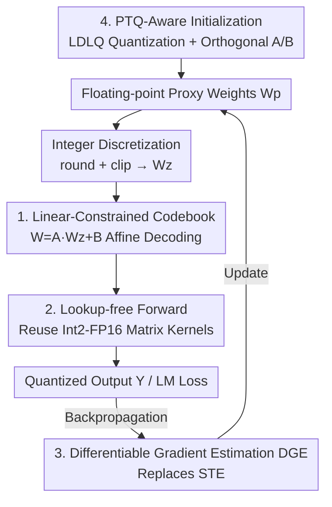

# LC-QAT: Data-Efficient 2-Bit QAT for LLMs via Linear-Constrained Vector Quantization

**Conference**: ICML2026  
**arXiv**: [2606.10531](https://arxiv.org/abs/2606.10531)  
**Code**: TBD  
**Area**: Model Compression / LLM Quantization  
**Keywords**: 2-bit quantization, vector quantization, QAT, linear-constrained codebook, data-efficient

## TL;DR
LC-QAT employs a parameterization of "shared linear transformation + discrete integer vectors" to reformulate the codebook lookup of Vector Quantization (VQ) as a differentiable round-and-project operation. This enables, for the first time, end-to-end QAT for 2-bit VQ. Leveraged by high-quality PTQ initialization, it matches or surpasses existing SOTA quantization methods using only 0.1%–10% of the training data.

## Background & Motivation
**Background**: When compressing LLMs to 1–2 bits, Quantization-Aware Training (QAT) generally outperforms Post-Training Quantization (PTQ) because QAT can adjust parameters during training to compensate for quantization errors. However, existing QAT methods are almost entirely built upon Scalar Quantization (SQ)—where each weight is independently quantized/dequantized into one of four discrete values.

**Limitations of Prior Work**: SQ suffers from severe information loss at the extreme precision of 2-bit. The initial point after quantization is far from the full-precision model, requiring massive training data to "recover," which leads to high data costs. Vector Quantization (VQ) maps a group of weights to a codeword in a shared codebook, offering much stronger expressiveness than SQ (a codebook contains $4^d$ codewords for a $d$-dimensional space with 4 values per dimension), resulting in significantly higher post-quantization accuracy.

**Key Challenge**: The strong expressiveness of VQ naturally conflicts with "end-to-end trainability." VQ quantization requires a nearest neighbor search $i_g=\arg\min_k \|w_g-c_k\|_2^2$, and dequantization requires a table lookup for $c_{i_g}$. Both steps are **non-differentiable** with respect to the codeword index, preventing standard backpropagation. Existing attempts to integrate VQ into QAT (e.g., PV-Tuning) can only use expensive coordinate descent or beam search, which are slow and asynchronous.

**Goal**: To make 2-bit VQ weights trainable via standard backpropagation while retaining the advantages of high-quality VQ initialization.

**Key Insight**: If the codewords are generated by a **shared affine transformation** acting on discrete vectors, then "selecting which codeword" reduces to "selecting which discrete vector." Discrete vectors can be obtained via rounding and clipping, while the affine component remains continuous and differentiable.

**Core Idea**: Replace unconstrained codebooks with linear-constrained codebooks $c=Az+B$. This transforms discrete index selection into "rounding/clipping + linear projection," allowing gradients to flow back through the linear mapping and eliminating the need for explicit table lookups in the forward pass.

## Method

### Overall Architecture
LC-QAT maintains a set of floating-point "proxy weights" $W_p\in\mathbb{R}^{m\times n}$. These do not directly represent model weights but undergo "discretization → affine decoding" to produce the effective weights $\hat{W}$ used in computation. During the forward pass, $W_p$ is rounded and clipped into integer weights $W_z$, which are then decoded into $\hat{W}$ using an intra-matrix shared linear-constrained codebook. During the backward pass, a Differentiable Gradient Estimator (DGE) is used to bypass traditional codebook lookups, allowing gradients to pass through the discretization operator to update $W_p$ end-to-end. The integer weights are not randomly initialized but are derived from a high-quality PTQ process, which is the root of its data efficiency.

### Key Designs

**1. Linear-Constrained Codebook: Rewriting "Lookup" as "Round and Project"**

The non-differentiability of VQ stems from the nearest neighbor search and lookup table operations on discrete indices. LC-QAT generates every codeword through the same affine mapping: $c=Az+B$, where $z\in\{0,1,2,3\}^d$ is a discrete 4-ary vector, and $A\in\mathbb{R}^{d\times d}$, $B\in\mathbb{R}^{d}$ are floating-point parameters shared within the matrix. All codewords reside in an affine subspace determined by $A$ and $B$. Determining $z$ no longer requires a nearest neighbor search; it is obtained by rounding and clipping the proxy weights: $W_z=\mathrm{clip}(\mathrm{round}(W_p),0,2^b-1)$. Since $A$ and $B$ are continuous, gradients can propagate through the linear mapping. Unlike lattice or nested codebook methods (e.g., QuIP#, NestQuant), LC-QAT is **lookup-free**. The overhead is minimal: for $d=4$, $A$ is $4\times4$ and $B$ is 4-dimensional, adding only 20 parameters per weight matrix.

**2. Lookup-free Forward + Reusing Integer Kernels: Minimal Execution Overhead**

By partitioning weights into $G=n/d$ groups along columns, decoding $\hat{W}^T$ can be written in block form as $A W_{z,i}^T+B\mathbf{1}^T$. To avoid the overhead of explicit linear mapping, the output $Y=X\hat{W}$ is rearranged as:

$$Y=\sum_{i=1}^{G}(X_iA)W_{z,i}^T+\sum_{i=1}^{G}(X_iB)\mathbf{1}^T$$

Here, $X_iA$ represents floating-point activations, while $W_{z,i}$ remains an integer matrix. The primary multiplication remains Int2×FP16, allowing the reuse of optimized integer matrix multiplication kernels. The additional computation for dequantization is $O(Nnd)+O(Nn)$, which is negligible compared to the standard $O(Nnm)$ since the group dimension $d$ is small (4 or 8). Custom CUDA kernels achieve a 1.68× speedup over the FP16 baseline and a 1.43× speedup over AQLM.

**3. Differentiable Gradient Estimation (DGE): Replacing STE to Preserve Initialization**

The derivative of the discretization $W_z=\mathrm{clip}(\mathrm{round}(W_p))$ is zero almost everywhere. The standard Straight-Through Estimator (STE) assumes $\partial W_z/\partial W_p\approx 1$, but its noise can cause instability near local minima. The authors observe that while SQ-QAT can tolerate STE because the 2-bit initialization is far from the optimum, LC-QAT starts near a high-quality local minimum that STE noise can easily destroy. Thus, DGE uses a smooth function to approximate discretization:

$$f(x)=\frac{\delta}{2}\left(1+\mathrm{sign}\left(\frac{2x}{\delta}-1\right)\left|\frac{2x}{\delta}-1\right|^{1/k}\right)$$

Its derivative is $f'(x)=\frac{1}{k}\left|\frac{2x}{\delta}-1\right|^{1/k-1}$ (where $\delta$ is the quantization interval and $k$ controls sharpness). A larger $k$ approximates hard clipping while maintaining smooth gradients. The implementation uses $\delta=1$ and $k=5$.

**4. PTQ-Aware Integer Weight Initialization: Making Good Starting Points Usable**

In standard SQ, $W_p$ is initialized randomly or from pre-training, and $W_z$ is the result of quantizing $W_p$. LC-QAT reverses this: $W_z$ originates from a prior PTQ (using LDLQ for column-wise group quantization with sequential error compensation and Hadamard transforms to eliminate outliers). Thus, $W_p$ must be derived from $W_z$: $W_p=s(W_z-t)$, where $s=\dfrac{2a}{2^b-1}$, $t=\dfrac{2^b-1}{2}$, and $a=\sqrt{\dfrac{6}{m+n}}$. This aligns $W_p$ statistics with Xavier initialization, ensuring both inference consistency and training stability. Codebook parameters are initialized as $A=sG$ and $B=-sG\mu\mathbf{1}$ (where $G$ is a random orthogonal matrix), ensuring the codebook has near-zero mean, unit variance, and weak inter-dimensional correlation.

### Loss & Training
The objective is the standard language modeling loss without additional regularization. Training setup: 16×A100, effective batch size 1024, ~1900 steps. Learning rates: $1\times10^{-4}$ for Qwen-3-1.7B / LLaMA-3-3B, $3\times10^{-5}$ for 8B models, and $1\times10^{-5}$ for instruction tuning. AdamW with warmup-stable-decay is used, with a gradient clipping threshold of 1.0. Hessian statistics for the PTQ phase are estimated using 1024 samples from RedPajama.

## Key Experimental Results

### Main Results
The evaluation uses two protocols: comparing "model capacity" against VQ-QAT and "data efficiency" against SOTA SQ-QAT. Below is the comparison for Qwen-3-8B on Wikitext-2 perplexity (PPL↓) and the average of six zero-shot QA tasks (Avg↑):

| Type | Method | PPL↓ | Avg QA↑ | Relative to FP16 |
|------|------|------|----------|-----------|
| Full Precision | FP16 | 9.72 | 74.12 | 1.00 |
| SQ-PTQ | GPTQ | 4.68e4 | 37.29 | 0.50 |
| VQ-PTQ | QTIP | 10.39 | 72.04 | 0.97 |
| VQ-PTQ | YAQA | 10.50 | 72.14 | 0.97 |
| VQ-QAT | PV-Tuning | 10.65 | 70.99 | 0.96 |
| VQ-QAT | **LC-QAT** | **10.23** | **72.18** | **0.97** |

Similar trends are observed on Qwen-3-1.7B: SQ methods (GPTQ PPL 2.80e4 / Avg 36.95) nearly collapse at 2-bit, while LC-QAT consistently outperforms PV-Tuning as the only end-to-end trainable VQ method under equivalent data constraints.

### Data Efficiency

| Comparison | Key Conclusion |
|----------|----------|
| vs SQ-QAT (e.g., ParetoQ) | Matches or exceeds performance with only 0.1%–10% of training data. |
| vs VQ-QAT (PV-Tuning) | Superior PPL and average accuracy with faster, synchronous updates. |
| vs BitNet 2B4T | BitNet requires 4T tokens from scratch; LC-QAT matches it with PTQ init + minor fine-tuning. |

### Key Findings
- Data efficiency is rooted in the quality of PTQ initialization: loss landscape analysis shows VQ initial points are close to FP16 basins, whereas SQ points are distant.
- STE is harmful under high-quality initialization; DGE is required for stable convergence.
- Lookup-free rearrangement makes additional overhead negligible. Custom kernels offer a 1.68× speedup over FP16, proving VQ expressiveness does not necessitate slow inference.

## Highlights & Insights
- **Translating "Codeword Selection" to "Rounding + Projection"**: Using a shared affine $c=Az+B$ eliminates both non-differentiable steps (nearest neighbor search and lookup), enabling VQ in end-to-end QAT with only ~20 extra parameters per matrix.
- **Reusing SQ Integer Kernels**: Through the rearrangement $\sum(X_iA)W_{z,i}^T$, the computation of the linear-constrained codebook is mapped back to mature Int2 matrix multiplication.
- **"Soft Gradients for Good Initialization"**: The clarification of why STE works for SQ but fails for VQ provides a systematic link between method selection, initialization quality, and the loss landscape.

## Limitations & Future Work
- The paper focuses on 2-bit weight-only quantization; activation quantization and sub-1-bit scenarios remain unverified.
- Data efficiency is highly dependent on the quality of PTQ (LDLQ + Hadamard) initialization.
- Linear-constrained codebooks are more restricted than unconstrained ones (sharing an affine transformation); potential trade-offs for certain weight distributions are not fully explored.

## Related Work & Insights
- **vs PV-Tuning**: Both are VQ-QAT, but PV-Tuning relies on coordinate descent for discrete indices; LC-QAT enables true end-to-end synchronous updates.
- **vs ParetoQ / EfficientQAT (SQ-QAT)**: These suffer from huge information loss at 2-bit and depend on massive data; LC-QAT reduces data requirements by 1–3 orders of magnitude via VQ init.
- **vs QuIP# / NestQuant (Lattice/Nested)**: These use flexible codewords but require lookups; LC-QAT sacrifices some flexibility for a lookup-free, differentiable linear transformation.

## Rating
- Novelty: ⭐⭐⭐⭐⭐ 
- Experimental Thoroughness: ⭐⭐⭐⭐ 
- Writing Quality: ⭐⭐⭐⭐ 
- Value: ⭐⭐⭐⭐⭐

<!-- RELATED:START -->

## Related Papers

- [\[ICML 2026\] UniSVQ: 2-bit Unified Scalar-Vector Quantization](unisvq_2-bit_unified_scalar-vector_quantization.md)
- [\[ICML 2026\] NeUQI: Near-Optimal Uniform Quantization Parameter Initialization for Low-Bit LLMs](neuqi_near-optimal_uniform_quantization_parameter_initialization_for_low-bit_llm.md)
- [\[ICML 2026\] TWLA: Achieving Ternary Weights and Low-Bit Activations for LLMs via Post-Training Quantization](twla_achieving_ternary_weights_and_low-bit_activations_for_llms_via_post-trainin.md)
- [\[ICML 2026\] ReQAT: Achieving Full-Precision Reasoning Accuracy with 4-bit Floating-Point Quantization-Aware Training](reqat_achieving_full-precision_reasoning_accuracy_with_4-bit_floating-point_quan.md)
- [\[ICML 2026\] ArcVQ-VAE: A Spherical Vector Quantization Framework with ArcCosine Additive Margin](arcvq-vae_a_spherical_vector_quantization_framework_with_arccosine_additive_marg.md)

<!-- RELATED:END -->
