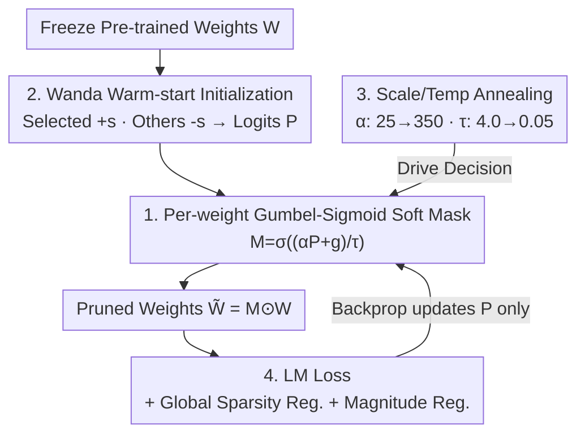

# LEAP: Learnable End-to-End Adaptive Pruning of Large Language Models

**Conference**: ICML2026  
**arXiv**: [2605.17289](https://arxiv.org/abs/2605.17289)  
**Code**: [github.com/Paramathic/patch/tree/leap](https://github.com/Paramathic/patch/tree/leap)  
**Area**: Model Compression / LLM Pruning  
**Keywords**: Unstructured Sparsity, Learnable Masks, Gumbel-Sigmoid, End-to-End Pruning, LLM

## TL;DR
LEAP replaces the "categorical logit per valid sparsity pattern in each group" parameterization found in learnable mask pruning (MaskLLM/PATCH) with a "per-weight Bernoulli gate via Gumbel-Sigmoid". This bypasses the combinatorial explosion deadlock in unstructured sparsity, enabling end-to-end mask learning for unstructured LLM pruning for the first time. On five models (0.5B–8B) at 50%/60% sparsity, it achieves an average zero-shot accuracy improvement of +2.59 points over the strongest layer-wise baseline, ADMM.

## Background & Motivation
**Background**: As kernels like SpInfer, FlashLLM, and MACKO, along with wafer-scale dataflow hardware, enable real acceleration for unstructured sparsity on commercial GPUs, the bottleneck has shifted from "how to execute sparsity" to "how to induce sparsity with minimal accuracy loss." Unstructured sparsity preserves higher accuracy than structured or semi-structured (e.g., 2:4) patterns, making it a more worthwhile target for compression.

**Limitations of Prior Work**: Mainstream unstructured LLM pruning methods (Wanda, SparseGPT, Thanos, ADMM, OPTIMA) derive from Optimal Brain Surgeon and minimize **layer-wise** reconstruction error as a proxy for end-to-end loss. This proxy is computationally cheap but misaligned with the actual optimization objective; furthermore, local errors accumulate and amplify across deep networks, leading to significant accuracy drops under aggressive sparsity. Learnable mask methods (MaskLLM, PATCH) directly optimize the language modeling loss with better results but are only applicable to semi-structured patterns.

**Key Challenge**: MaskLLM assigns a logit to "each valid sparsity pattern" within a group and applies Gumbel-Softmax over this set. For 2:4 sparsity, there are only $\binom{4}{2}=6$ valid patterns per group, which is feasible. However, for unstructured 50% sparsity with a row width of $d=4096$, the number of valid masks is $\binom{4096}{2048}\approx10^{1229}$, which is impossible to store or index. This is a **fundamental combinatorial obstacle** rather than an engineering issue—no amount of compute can resolve it.

**Goal**: To identify a per-weight parameterization for unstructured masks that is end-to-end differentiable, has a parameter count on the same order as weights, and is independent of the sparsity rate.

**Key Insight**: Abandon the categorical distribution of "selecting one from a set of patterns" and instead use a Bernoulli product where "each weight is independently kept/pruned"—this reduces the parameter count to $O(mn)$, which is exactly equal to the weight count.

**Core Idea**: Replace categorical-over-patterns with per-weight Bernoulli-via-Gumbel-Sigmoid relaxation, combined with a suite of lightweight stabilization techniques (Wanda initialization, scale/temperature scheduling, global sparsity regularization, and magnitude-aware terms) to make unstructured end-to-end mask learning feasible at LLM scales.

## Method

### Overall Architecture
LEAP freezes the pre-trained weights $W$ and learns only a logit matrix $P$ of the same shape for each weight matrix. During the forward pass, $P$ is relaxed into a soft mask $M$ via Gumbel-Sigmoid and element-wise multiplied with the weights to produce pruned weights $\widetilde{W}=M\odot W$. The language modeling loss is calculated on small-scale calibration text, combined with global sparsity and magnitude-aware regularization for backpropagation—updating only $P$ while keeping $W$ static. The training uses two annealing schedules (increasing scale $\alpha$ and decreasing temperature $\tau$) to push the soft mask from "broad exploration" toward a $\{0,1\}$ "decision." Instead of a cold start, $P$ is initialized using a one-shot Wanda mask to begin searching from a reasonable local starting point, allowing convergence in approximately 2000 steps.

### Key Designs

**1. Per-weight Gumbel-Sigmoid Bernoulli Gates: The core reformulation to resolve combinatorial explosion**

The logit table size for categorical-over-patterns grows with the number of valid patterns per group, which is an astronomical $\binom{4096}{2048}$ for unstructured cases. LEAP replaces "choosing one from a pattern set" with "one independent Bernoulli per weight," reducing parameters from $O(|\{\text{valid patterns}\}|)$ to $O(mn)$—exactly the number of weights, regardless of the sparsity rate $\rho$. Specifically, a logit matrix $P\in\mathbb{R}^{m\times n}$ is paired with each weight matrix, and the mask is obtained via Gumbel-Sigmoid relaxation:

$$M=\sigma\!\left(\frac{\alpha P+g}{\tau}\right),\qquad g=-\log(-\log(u)),\ u\sim\mathrm{Uniform}(0,1)$$

where $\sigma$ is the sigmoid function, $\alpha$ is the scale, and $\tau$ is the temperature. $M$ represents a continuous relaxation of a Bernoulli distribution with logit $\alpha P_{ij}$ and scale $\tau$, resulting in pruned weights $\widetilde{W}=M\odot W$. Soft masks are used throughout because hard sampling with Straight-Through Estimators (STE) is unstable at LLM scales; soft masks maintain well-behaved gradients, while the $\alpha,\tau$ schedules push $M$ toward $\{0,1\}$. This step is fundamental to enabling end-to-end mask learning for unstructured pruning.

**2. Wanda Warm-start Initialization: Converting search from cold-start to local fine-tuning**

If $P$ were initialized randomly, the search space would be too vast, leading to explosive training times. LEAP uses a one-shot Wanda mask to initialize $P$: positions retained by Wanda (scored by "weight magnitude × input activation norm") are set to $+s$, while others are set to $-s$ ($s>0$ is the initial mask strength). This provides a reasonable initial loss for the sigmoid relaxation, shifting the problem from a "global cold search" to "local adjustments near a good starting point," allowing convergence in just ~2000 steps—a key factor in LEAP's efficiency.

**3. Scale/Temperature Annealing: Two schedules from exploration to decision**

If the soft mask remains near 0.5 after training, it cannot be converted into true sparsity. LEAP uses two schedules to force $M$ toward binary values: the scale $\alpha$ increases from $\alpha_0$ to $\alpha_T$ (e.g., $25\to350$), amplifying $P$ to push $\sigma$ toward $\{0,1\}$; and the temperature $\tau$ decreases from $\tau_0$ to $\tau_T$ (e.g., $4.0\to0.05$), making the sigmoid curve increasingly steep. Early in training, high $\tau$ and low $\alpha$ allow for soft masks and exploration of many candidate support sets; later, low $\tau$ and high $\alpha$ result in hard masks, "committing" to final keep/prune decisions.

**4. Global Sparsity Regularization + Magnitude-aware Stabilization: Constraining density without losing critical weights**

To reach the target density $\rho$ without performance degradation, LEAP adds two regularization terms. The first is **global** sparsity regularization (rather than layer-wise):

$$\mathcal{L}_{\mathrm{sparsity}}=\lambda_1\left|\frac{1}{N}\sum_i\|\widetilde{M}_i\|_1-\rho\right|$$

This forces the total density across all prunable layers toward $\rho$, allowing layers to adaptively adjust their own densities based on end-to-end importance rather than being forced into a rigid uniform distribution. The second is a **magnitude-aware** term $\mathcal{L}_{\mathrm{weight}}=-\lambda_2\sum_i\|\widetilde{W}_i\|_1$ ($\lambda_2\sim10$), which favors retaining high-magnitude weights to stabilize mask learning and avoid degenerate minima (e.g., keeping many small weights but losing a few critical ones). The full objective is $\mathcal{L}=\mathcal{L}_{\mathrm{LM}}(\widetilde{W};X)+\mathcal{L}_{\mathrm{sparsity}}+\mathcal{L}_{\mathrm{weight}}$, where only $P$ is updated and $W$ remains frozen. Freezing is an intentional design choice to preserve the pre-trained weight calibrations, isolate the "mask" as the unique subject of learning, simplify the deployment pipeline, and maintain compatibility with future fine-tuning or distillation.

### Loss & Training
Mask training is conducted for 2000 steps with a batch size of 256 and a sequence length of 4096. Data is sourced from SlimPajama, and weights remain frozen throughout. Evaluation is performed on WikiText2 perplexity (seq length 4096) and six zero-shot tasks (PIQA, ARC-E, ARC-C, Winogrande, OpenBookQA, MMLU) using lm-evaluation-harness.

## Key Experimental Results

### Main Results
Testing on five models (Qwen-2.5 0.5B, Gemma-3 1B, LLaMA-3.2 1B/3B, LLaMA-3.1 8B) at 50%/60% unstructured sparsity. The table below shows WikiText2 PPL↓ / Average Zero-shot Accuracy↑ for LLaMA-3.1 8B:

| Sparsity | Method | PPL↓ | Avg. Acc↑ |
|----------|--------|------|-----------|
| 0% | Dense | 5.84 | 63.89 |
| 50% | Wanda | 9.64 | 55.81 |
| 50% | SparseGPT | 9.30 | 57.33 |
| 50% | ADMM (Strongest Layer-wise) | 9.12 | 57.50 |
| 50% | **LEAP** | **7.66** | **57.71** |
| 60% | ADMM | 14.10 | 50.61 |
| 60% | **LEAP** | **8.82** | **54.47** |

Across 10 configurations (model × sparsity rate), LEAP averages **+2.59** points higher than ADMM, with a minimum gain of +0.21 (LLaMA-3.1 8B @50%) and a maximum gain of +5.40 (LLaMA-3.2 1B @60%).

### Ablation Study

| Comparison | Key Finding |
|------------|-------------|
| vs Layer-wise Proxies (Wanda/SparseGPT/Thanos/ADMM) | Directly optimizing LM loss avoids layer-wise error accumulation, leading to overall superiority. |
| vs MaskLLM (2:4 Semi-structured only) | Their logit tables cannot scale to unstructured; LEAP is the first for end-to-end unstructured mask learning. |
| Higher sparsity leads to larger gaps | While ADMM is competitive at 50%, LEAP widens the gap significantly at 60% aggressive sparsity, leading by +3.86 (8B). |

### Key Findings
- Gains expand as the sparsity rate increases: While layer-wise baselines are functional at 50%, the end-to-end advantage truly manifests under aggressive 60% sparsity.
- Global (rather than layer-wise) sparsity regularization allows layers to adaptively allocate density based on end-to-end importance, a major source of improvement over layer-wise methods.
- Soft masks + annealing are more stable than hard sampling with STE at LLM scales, which is a prerequisite for convergence.

## Highlights & Insights
- **Identified and Solved the "Combinatorial Obstacle"**: The work clearly identifies that MaskLLM/PATCH’s logit tables approach $\binom{4096}{2048}\approx10^{1229}$ for unstructured cases—an unsolvable problem regardless of compute power—and provides a natural, scalable per-weight Bernoulli reformulation.
- **Weight Freezing as a Feature, Not a Compromise**: Learning only the mask while keeping weights static preserves pre-trained calibration, simplifies deployment, and remains orthogonal to subsequent fine-tuning or distillation.
- **Efficiency and Reproducibility**: By pairing Wanda warm-starting with a 2000-step calibration stream, the cost of end-to-end mask learning is kept low, ensuring high transferability.

## Limitations & Future Work
- The paper deliberately limits the scope to 50%–60% sparsity (the range currently supported by acceleration kernels); extreme sparsity (~90%, e.g., ELSA) is not discussed.
- While freezing weights simplifies deployment, it abandons potential extra gains from joint weight-mask optimization, which the authors list as a future direction.
- Hyperparameters for annealing schedules ($\alpha:25\to350$, $\tau:4.0\to0.05$) are empirically set, and robustness/sensitivity analysis across different model families is limited.
- Comparison with MaskLLM is restricted since the latter only supports 2:4 sparsity, forcing comparisons on limited task intersections.

## Related Work & Insights
- **vs MaskLLM / PATCH**: Both use end-to-end learnable masks, but those use categorical-over-patterns and are limited to semi-structured; LEAP uses per-weight Bernoulli, covering unstructured for the first time.
- **vs Wanda / SparseGPT / ADMM (OBS Layer-wise)**: These optimize layer-wise reconstruction proxies where errors accumulate; LEAP directly optimizes LM loss, aligning with the true objective.
- **vs $L_0$ Regularization / Continuous Sparsification**: While also using per-weight continuous relaxation gates, LEAP focuses on unstructured LLM scales, uses Wanda warm-starts to reduce steps, and incorporates global sparsity + magnitude stabilization for frozen weights.
- **vs ELSA**: ELSA uses proxy-free ADMM for extreme sparsity (~90%); LEAP focuses on the 50%–60% range favored by real hardware acceleration.

## Rating
- Novelty: ⭐⭐⭐⭐⭐ Resolves the logit table explosion by switching to per-weight Bernoulli, bringing end-to-end mask learning to unstructured LLM pruning.
- Experimental Thoroughness: ⭐⭐⭐⭐ Five models and dual sparsity rates are well-covered, though extreme sparsity and joint weight-mask optimization are omitted.
- Writing Quality: ⭐⭐⭐⭐⭐ The "combinatorial obstacle" is explained with extreme clarity; every component of the method is well-motivated.
- Value: ⭐⭐⭐⭐⭐ Aligned with hardware trends for unstructured acceleration; provides a meaningful +2.59 gain with a lightweight, reproducible approach.

<!-- RELATED:START -->

## Related Papers

- [\[ICML 2026\] End-to-End Compression for Tabular Foundation Models](end-to-end_compression_for_tabular_foundation_models.md)
- [\[ICML 2026\] Towards Resource-Efficient LLMs: End-to-End Energy Accounting of Distillation Pipelines](towards_resource-efficient_llms_end-to-end_energy_accounting_of_distillation_pip.md)
- [\[ICML 2025\] GuidedQuant: Large Language Model Quantization via Exploiting End Loss Guidance](../../ICML2025/model_compression/guidedquant_large_language_model_quantization_via_exploiting_end_loss_guidance.md)
- [\[ICML 2026\] Model Merging Scaling Laws in Large Language Models](model_merging_scaling_laws_in_large_language_models.md)
- [\[NeurIPS 2025\] PermLLM: Learnable Channel Permutation for N:M Sparse Large Language Models](../../NeurIPS2025/model_compression/permllm_learnable_channel_permutation_for_nm_sparse_large_language_models.md)

<!-- RELATED:END -->
