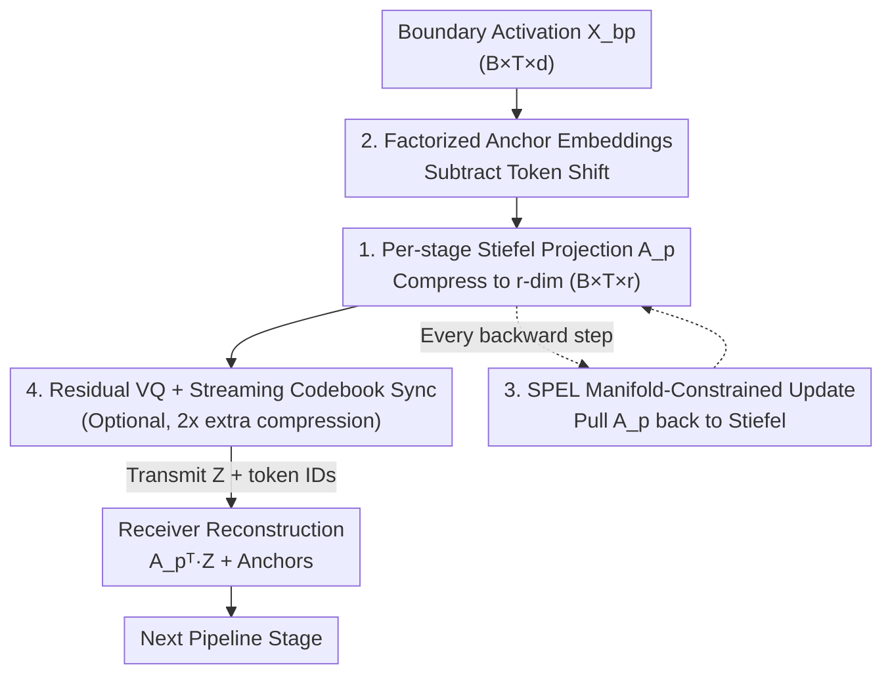

# Learned Subspace Compression for Communication-Efficient Pipeline Parallelism

**Conference**: ICML2026  
**arXiv**: [2606.05484](https://arxiv.org/abs/2606.05484)  
**Code**: TBD  
**Area**: Model Compression / Distributed Training  
**Keywords**: Pipeline Parallelism, Activation Compression, Stiefel Manifold, Learned Subspace, Vector Quantization

## TL;DR
To address the "inter-stage communication" bottleneck of pipeline parallelism in low-bandwidth networks, this paper proposes MAPL: allowing each pipeline stage to **learn its own orthogonal projection** on the Stiefel manifold to compress boundary activations. Combined with factorized anchor embeddings to decouple token shifts and residual vector quantization (RVQ), it achieves 4–16× communication compression on 150M–1B LLaMA models with only ~1% performance degradation compared to uncompressed baselines, significantly outperforming the fixed-subspace SSN.

## Background & Motivation
**Background**: When training large models that exceed the memory of a single GPU, pipeline parallelism (PP) partitions the model across different devices. However, each micro-batch must exchange **boundary activations** between adjacent stages during both forward and backward passes. In bandwidth-constrained environments such as wide-area networks (WAN) or heterogeneous low-end hardware, this inter-stage communication becomes the dominant overhead.

**Limitations of Prior Work**: A natural approach is to compress activations before transmission. Existing Subspace Networks (SSN) use a **fixed, globally shared** low-rank orthogonal matrix $U_r$ to project activations of all layers into the same $r$-dimensional subspace. This presents three issues: ① It forces all layers into the same representation space, acting as an intrusive architectural modification; ② Maintaining weights within this subspace requires a modified AdamW optimizer with static embedding shifts; ③ In fair "token-matched" comparisons, performance drops significantly compared to the uncompressed baseline (up to nearly 14%).

**Key Challenge**: Activation compression is inherently more difficult than gradient compression in data parallelism. Pipeline stages hold complementary, non-overlapping model segments; compressed activations from one stage are fed directly into the next. Any transmission distortion accumulates across subsequent forward layers and backward gradients, polluting the learning signal. The challenge lies in achieving high compression ratios without destroying the geometric structure of the activations that drives learning.

**Key Insight**: The authors make a crucial observation (§3.1): **boundary residual activations** (after subtracting token embeddings) are **intrinsically low-rank**. On a 150M LLaMA ($d=1024$), a rank of $\approx 250$ preserves $\ge 99\%$ of the activation energy. This suggests that low-rank structures **emerge naturally** during training, making weight constraints like those in SSN unnecessary.

**Core Idea**: Instead of imposing a global basis for all layers, each **pipeline stage should discover** its own task-optimal compression subspace. Inter-stage communication is treated as a **learnable geometric projection** rather than a fixed architectural constraint. The challenge is that standard gradient updates can push the projector off the Stiefel manifold (the set of orthogonal matrices), destroying orthogonality and isometry. Thus, manifold-constrained optimization must be used to keep the projector strictly on the manifold.

## Method

### Overall Architecture
MAPL (Manifold Aware Projection Learning) performs the same operations across $P-1$ inter-stage boundaries: the sender **subtracts token-related anchor shifts** from the boundary activations and uses a **learnable orthogonal projector** $A_p \in \mathrm{St}(d,r)$ to project the residuals to $r$ dimensions (reducing communication by $d/r$). The low-dimensional representation $Z$ is transmitted along with integer token IDs; the receiver reconstructs the full-dimensional activation using $A_p^\top$ and adds back the anchor shifts. Since $A_p$ strictly resides on the Stiefel manifold and $A_p^\top$ is its exact inverse, the projection/reconstruction is isometric on the column space of $A_p$. The projectors are trained jointly with model weights using the SPEL optimizer, with optional residual vector quantization (RVQ) to further double the compression ratio.

### Key Designs

**1. Per-stage Learnable Stiefel Projection: Learning localized compression subspaces**

The fixed global basis of SSN forces all layers into the same representation space, limiting model capacity and causing significant performance loss. MAPL places an **independently learnable** projector $A_p$ at each boundary $p$ and constrains it to the Stiefel manifold $\mathrm{St}(d,r) = \{A \in \mathbb{R}^{d\times r}: A^\top A = I_r\}$. The forward compression and reconstruction are:

$$Z_{bp} = \big(X_{bp} - E^{small}_p[\text{tids}]\,P_p\big)A_p, \qquad \hat{X}_{bp} = Z_{bp}A_p^\top + E^{small}_{p+1}[\text{tids}]\,P_{p+1}.$$

The orthogonality constraint ensures $A_p^\top$ is the exact inverse of $A_p$, making the projection/back-projection **isometric** on the column space. Empirically, the learned subspaces are **geometrically distinct**: the principal angle between adjacent stages is approximately $53^\circ$, while far-apart stages approach orthogonality (up to $72^\circ$), reflecting the layer-wise transition from lexical representations to task-specific ones. Critically, learned $A_p$ preserves **2.2×** more activation energy than fixed random orthogonal bases of the same rank ($\sim 80\%$ vs $\sim 36\%$), and the cosine similarity between token pairs after projection is nearly identical to the original (Pearson $r=0.992$).

**2. Factorized Anchor Embeddings: Decoupling high-rank token shifts**

The residual stream contains a shift driven by token frequency, which is inherently **high-rank**. Attempting to compress this shift directly using a low-rank projector wastes the projector's capacity. While SSN uses a static high-rank shift, MAPL uses a learnable shift and **factorizes** it as:

$$E^{small}_p[\text{ids}]\,P_p, \qquad E^{small}_p \in \mathbb{R}^{V\times r},\quad P_p \in \mathbb{R}^{r\times d},$$

where $E^{small}_p$ is a small trainable embedding table and $P_p$ is a fixed random orthogonal matrix. This keeps the parameter count low while allowing effective embeddings to be full-rank at each stage. Crucially, reconstructing this shift only requires transmitting **integer token IDs**, which costs almost nothing, while the receiver looks up local anchors.

**3. SPEL Manifold-Constrained Optimization: Keeping projectors on the Stiefel manifold**

Plain gradient updates push $A_p$ away from the Stiefel manifold. Once it escapes, the model begins encoding features outside the target subspace, leading to catastrophic performance failure (the authors found "manifold-unaware" learning is even worse than fixed bases). MAPL utilizes SPEL (Spectral Steepest Descent on the Stiefel Manifold) to update $A_p$ using the task loss: first, the Euclidean gradient $g_t = \partial L/\partial A_p$ is projected to the tangent space $g^R_t = g_t - A_p\,\mathrm{sym}(A_p^\top g_t)$; then, heavy-ball momentum is applied $m_t = \beta m_{t-1} + (1-\beta)g^R_t$; directions are sought via PolarExpress; and finally, a retraction pulls the matrix back to the manifold $A_p \leftarrow \mathrm{PolarExpress}(A_p - \alpha\,d_t)$. It maintains a $O(1/\sqrt{T})$ convergence rate and updates $A_p$ **every step**, allowing the subspace to track evolving activation geometry.

**4. Residual VQ + Streaming Codebook Sync: Doubling compression on the low-rank manifold**

To achieve higher compression, MAPL applies multi-codebook vector quantization (MCVQ) on the low-rank representation. The projected $Z_{bp} \in \mathbb{R}^{B\times T\times r}$ is divided into $G$ groups, and $R$ rounds of **residual quantization** are performed using codebooks $C_{p} \in \mathbb{R}^{r\times K}$. To avoid the overhead of codebook synchronization, MAPL uses a **streaming dictionary update protocol** based on the observation that VQ codebooks evolve slowly. Only a $1/K$ fraction of the codebook is transmitted per micro-batch, making synchronization costs negligible. Because Design 1 ensures near-isometric projection, the distribution in $\mathbb{R}^r$ is well-behaved, allowing VQ to double the compression ratio with minimal loss.

### Loss & Training
The entire model is trained using the standard cross-entropy task loss, with projectors and weights trained jointly. A hybrid optimizer configuration is used: 2D hidden layer weight matrices use Muon ($\eta_\mu=0.02$ for 150M/500M, $0.01$ for 1B), while embeddings, biases, and output projections use AdamW ($\eta_{adam}=0.5\eta_\mu$). The projector learning rate is $0.1 \times$ the parameter update rate. Global batch size 512, context 2048, bf16, trained on DCLM corpus following Chinchilla optimality (20 tokens per parameter), $P \in \{4, 8\}$.

## Key Experimental Results

### Main Results
Validation cross-entropy loss and relative degradation ($\Delta\%$) for LLaMA 150M/500M/1B compared to the uncompressed upper bound and SSN variants:

| Scale | Method | Ratio | P=4 Loss (Δ%) | P=8 Loss (Δ%) |
|------|------|--------|---------------|---------------|
| 150M | Uncompressed | — | 3.13 | 3.13 |
| 150M | SSN | 4× | 3.39 (+8.37%) | 3.40 (+8.63%) |
| 150M | **MAPL** | 4× | **3.156 (+0.84%)** | **3.165 (+1.11%)** |
| 150M | MAPL+VQ | 8× | 3.165 (+1.11%) | 3.170 (+1.28%) |
| 500M | Uncompressed | — | 2.84 | 2.84 |
| 500M | SSN | 6× | 3.09 (+8.92%) | 3.12 (+9.90%) |
| 500M | **MAPL** | 6× | **2.79 (−1.90%)** | **2.84 (0.00%)** |
| 500M | MAPL+VQ | 12× | 2.92 (+2.75%) | 2.88 (+1.49%) |
| 1B | Uncompressed | — | 2.68 | 2.68 |
| 1B | SSN | 8× | 3.05 (+13.93%) | 3.08 (+15.05%) |
| 1B | **MAPL** | 8× | **2.72 (+1.38%)** | **2.73 (+2.02%)** |
| 1B | MAPL+VQ | 16× | 2.76 (+3.01%) | 2.74 (+2.30%) |

MAPL reduces the gap to the uncompressed baseline to $\sim 1\%$ across all scales, even **outperforming** the baseline in the 500M P=4 case by 1.90%. At the same compression ratio, SSN degrades by up to 14%.

### Key Findings
- **Learning > Fixed**: At rank $r=128$, the learned Stiefel projector preserves $\sim 80\%$ of residual energy within 1500 steps, compared to $\sim 36\%$ for a fixed random basis. This suggests compression **actively induces** low-rank structure.
- **Isometry is Key for VQ**: Post-projection token cosine similarity correlates with the original at Pearson $r=0.992$, ensuring VQ codebooks are well-behaved.
- **Stage-Specific Subspaces**: The principal angles reach $72^\circ$ between non-adjacent stages, validating the hypothesis that each stage requires its own specialized subspace.

## Highlights & Insights
- **Reframing Communication Compression as Geometry**: Instead of architectural constraints, the paper views inter-stage communication as a learnable projection on the Stiefel manifold, allowing compression to "discover" rather than "impose" subspaces.
- **Clean Diagnosis of Failure Modes**: The authors identify "manifold escape" as the primary cause of failure in naive projector learning, providing evidence for the necessity of SPEL.
- **Decoupling Token Shifts**: Factorizing high-rank token offsets and transmitting them via integer IDs prevents these offsets from exhausting the low-rank capacity of the projector.
- **Streaming Codebook Sync**: Leveraging slow codebook evolution to amortize synchronization costs is a practical trick for bringing VQ into distributed training.

## Limitations & Future Work
- Evaluation is limited to 1B parameters and Chinchilla budgets; stability and overhead of SPEL at 10B+ scales remain to be explored.
- While MAPL+VQ shows little validation loss decay, downstream zero-shot performance degrades more noticeably (e.g., dropping to 33.0 on 150M P=8).
- The method introduces additional parameters and optimization logic; end-to-end speedups on real-world low-bandwidth clusters were not provided.
- Sensitivity analysis for the $0.1 \times$ learning rate multiplier and generalization across non-LLaMA architectures are pending.

## Related Work & Insights
- **vs SSN [42]**: SSN uses a fixed global basis and constrains weights; MAPL uses per-stage learned Stiefel projections and factorized anchors. MAPL outperforms SSN by over 5% in token-matched comparisons.
- **vs GaLore [68]**: While GaLore uses low-rank projections for gradient compression to save memory, MAPL targets **boundary activation communication** in pipeline parallelism.
- **vs DiLoCo [12]**: These target low-bandwidth data parallelism where full model copies fit on each node; MAPL is designed for scenarios where the model must be partitioned.

## Rating
- Novelty: ⭐⭐⭐⭐⭐ Reframing communication as learnable manifold projection is a fresh and self-consistent perspective.
- Experimental Thoroughness: ⭐⭐⭐⭐ Extensive 150M–1B benchmarks, but lacks real-cluster end-to-end throughput data.
- Writing Quality: ⭐⭐⭐⭐ Clear logical progression from observation to design.
- Value: ⭐⭐⭐⭐ Provides a high-compression, low-degradation solution for decentralized training.

<!-- RELATED:START -->

## Related Papers

- [\[CVPR 2026\] Otil: Accelerating Diffusion Model Inference via Communication-Efficient Multi-GPU Parallelism](../../CVPR2026/model_compression/otil_accelerating_diffusion_model_inference_via_communication-efficient_multi-gp.md)
- [\[ICML 2026\] Efficient Learned Image Compression without Entropy Coding](efficient_learned_image_compression_without_entropy_coding.md)
- [\[ACL 2026\] Efficient Learned Data Compression via Dual-Stream Feature Decoupling](../../ACL2026/model_compression/efficient_learned_data_compression_via_dual-stream_feature_decoupling.md)
- [\[AAAI 2026\] InfoCom: Kilobyte-Scale Communication-Efficient Collaborative Perception with Information-Aware Feature Compression](../../AAAI2026/model_compression/infocom_kilobyte-scale_communication-efficient_collaborative_perception_with_inf.md)
- [\[ICML 2026\] ReSpinQuant: Efficient Layer-Wise LLM Quantization via Subspace Residual Rotation Approximation](respinquant_efficient_layer-wise_llm_quantization_via_subspace_residual_rotation.md)

<!-- RELATED:END -->
