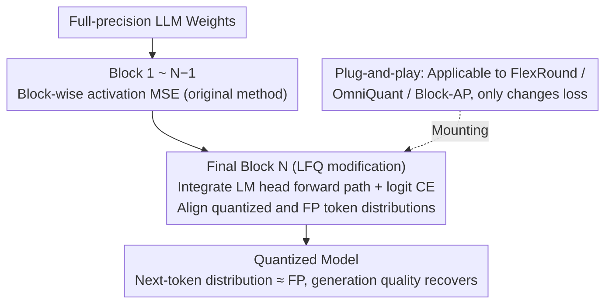

# LFQ: Logit-aware Final-block Quantization for Boosting the Generation Quality of Low-Bit Quantized LLMs

**Conference**: ICML 2026  
**arXiv**: [2605.29756](https://arxiv.org/abs/2605.29756)  
**Code**: None  
**Area**: Model Compression  
**Keywords**: Low-bit quantization, post-training quantization, cross-entropy alignment, generation quality, block-wise PTQ  

## TL;DR
Addressing the quality degradation of block-wise PTQ in generation tasks, LFQ replaces the quantization objective of the final Transformer block from MSE to logit-level cross-entropy loss. This aligns the token distribution of the quantized model with the full-precision model, consistently improving accuracy across generation benchmarks such as IFEval, GSM8K, MATH500, and AIME.

## Background & Motivation

**Background**: Low-bit weight-only PTQ (e.g., GPTQ, FlexRound, OmniQuant, Block-AP) is the mainstream approach for LLM memory compression. Block-wise PTQ minimizes the MSE between quantized and full-precision block outputs, reaching performance near full-precision baselines on language modeling (WikiText2) and understanding (MMLU) tasks.

**Limitations of Prior Work**: Accuracy drops significantly when evaluation shifts to long-text generation (IFEval) and complex reasoning (MATH500, AIME). Large reasoning models (DeepSeek-R1, L1-Max) rely on long chains of thought to improve accuracy; however, the generation trajectories of quantized models easily deviate from the correct path.

**Key Challenge**: There are two root causes: (1) block-wise PTQ completely ignores the unembedding layer (LM head), yet the output of the final block must pass through the LM head to generate the token distribution; (2) even considering the LM head, MSE minimization does not guarantee consistent token ranking. The authors provide a clear 2-token example showing that a quantization scheme with lower MSE might predict the wrong top-1 token, while one with higher MSE preserves the correct prediction.

**Goal**: To bring the generation quality of block-wise PTQ close to the full-precision baseline without changing the quantization scheme or inference kernels.

**Key Insight**: Minimizing cross-entropy is equivalent to minimizing KL divergence, which is zero if and only if the two distributions are identical. Thus, cross-entropy aligns token probability distributions more directly than MSE.

**Core Idea**: Modify only the quantization loss of the final Transformer block—replacing MSE with logit-level cross-entropy—to align the next-token distribution of the quantized model with the full-precision model.

## Method

### Overall Architecture
LFQ aims to solve the performance drop of block-wise PTQ in generation tasks by modifying only one part: from the 1st to the $(N-1)$-th Transformer block, MSE is still minimized block-wise; for the final block, the LM head is integrated into the forward path, and the loss is switched from MSE to logit-level cross-entropy. It is a plug-and-play enhancement that keeps the quantization scheme, packing/unpacking kernels, and single-GPU execution capability unchanged, allowing it to be applied on top of any block-wise PTQ method.

### Key Designs

**1. Replacing the final block objective with logit cross-entropy: Direct probability alignment**

The pain point is that traditional block-wise PTQ minimizes MSE in the activation space, but small errors in activations can flip the top-1 token ranking after LM head projection. LFQ instead calculates the cross-entropy between the full-precision logit $\sigma(X W_{\text{FP}} W_{\text{Head}})$ and the quantized logit $\sigma(X W_q W_{\text{Head}})$ for the final block:

$$\mathcal{L}_{\text{CE}} = -\frac{1}{L}\sum_{i,j} \sigma(X W_{\text{FP}} W_{\text{Head}})_{i,j} \log \sigma(X W_q W_{\text{Head}})_{i,j}$$

This is effective because cross-entropy is sensitive to probability ranking and naturally preserves top-k order, matching the requirements of generation tasks which rely on token ranking rather than absolute activation values.

**2. Integrating the LM head into the final block forward path: Making the optimizer aware of unembedding**

To calculate the logit cross-entropy, the optimizer must "see" the LM head during optimization. Standard block-wise PTQ ignores subsequent LM head projections. LFQ keeps the LM head weight $W_{\text{Head}}$ fixed during the forward pass (the head itself is not quantized), allowing gradients to propagate from the final token distribution. This step is both a carrier for the cross-entropy objective and a contributor to gains; ablation shows that merely adding the LM head while keeping MSE already improves IFEval.

**3. Method-agnostic: Changing only the loss, not the parameterization**

Since LFQ only replaces the loss function of the final block, it works seamlessly with different methods: optimizing $(s_1, S_2, s_3)$ for FlexRound, $(\gamma, \beta)$ for OmniQuant, or $(s, W_{\text{FP}})$ for Block-AP. This ensures zero-cost compatibility—memory overhead, inference kernels, and single-GPU feasibility remain identical to the original methods, requiring no extra adaptation during deployment.

## Key Experimental Results

### Main Results (Qwen2.5-7B-Instruct)

| Method | Bit | WikiText2↓ | MMLU↑ | IFEval↑ | MATH500↑ |
|------|------|-----------|-------|---------|----------|
| BF16 Baseline | 16 | 6.85 | 73.49 | 70.79 | 74.2 |
| FlexRound | W4 | 7.23 | 72.50 | 69.50 | 72.6 |
| FlexRound+LFQ | W4 | **7.21** | 72.48 | **71.35** | **73.4** |
| FlexRound | W3g128 | 7.63 | 70.13 | 66.54 | 65.6 |
| FlexRound+LFQ | W3g128 | **7.58** | **70.26** | **67.84** | **68.0** |
| OmniQuant | W4 | 7.73 | **71.00** | 68.21 | 69.8 |
| OmniQuant+LFQ | W4 | **7.53** | 70.99 | **69.50** | **71.6** |

### Ablation Study (Llama 3.1 8B Instruct, W4)

| Method | LM Head | Cross-Entropy | WikiText2↓ | IFEval↑ | GSM8K↑ |
|------|---------|--------|-----------|---------|--------|
| FlexRound | ✗ | ✗ | 7.06 | 70.24 | 81.35 |
| +LM Head | ✓ | ✗ | 7.08 | 71.53 | 81.58 |
| +LM Head+CE (LFQ) | ✓ | ✓ | **7.06** | **72.09** | **81.80** |
| OmniQuant | ✗ | ✗ | 7.49 | 70.61 | 78.17 |
| +LM Head | ✓ | ✗ | 7.48 | 71.35 | 78.32 |
| +LM Head+CE (LFQ) | ✓ | ✓ | **7.47** | **71.35** | **79.76** |

### Key Findings
- LFQ consistently improves performance on generation tasks (IFEval, MATH500, AIME) while remaining stable or slightly improving on understanding tasks (WikiText2, MMLU).
- Ablations show that both components (LM Head integration and cross-entropy loss) contribute incremental gains, with the combination performing best.
- For the reasoning model L1-Qwen-7B-Max under W3g128 settings, LFQ recovers greedy accuracy on AIME'24 from 23.33% to 30.00% (BF16 is 46.67%), recovering nearly half of the quantization degradation.

## Highlights & Insights
- The use of a constructive 2-token counter-example intuitively proves the disconnect between MSE and token prediction consistency. This analytical approach is concise and powerful, potentially extending to other compression scenarios requiring discrete decision consistency.
- Modifying the loss of only the final block achieves comprehensive improvements in generation quality. This minimal change with high impact exemplifies a design philosophy of "applying the right constraint at the right location."
- Analysis of "aha moment" probability distributions (e.g., "Wait"/"But" tokens) in reasoning models reveals overconfidence issues in quantized models at key thinking pivots, providing a new perspective on how quantization affects chain-of-thought reasoning.
- Validation on the MoE model Qwen3-30B-A3B demonstrates that LFQ is equally effective for sparse activation architectures, with AIME'25 greedy accuracy increasing from 53.33% to 60.00%.

## Limitations & Future Work
- Cross-entropy calculation requires softmax over the entire vocabulary. For very large vocabularies (e.g., 150K+), this might increase optimization overhead, which the paper does not discuss.
- The study focuses solely on weight-only quantization and does not explore the effects of logit alignment in activation quantization scenarios.
- Future work could consider extending the cross-entropy objective to multiple trailing blocks (rather than just the last one) or combining it with temperature scaling to further control distribution alignment precision.
- The paper did not report 2-bit results.

## Related Work & Insights
- **vs FlexRound/OmniQuant/Block-AP**: These methods are sufficient for intermediate blocks using MSE. LFQ proves that switching the loss function only in the final block compensates for the generation quality shortfall.
- **vs QAT with Knowledge Distillation**: QAT performs end-to-end KL alignment across the whole model but requires heavy computation. LFQ achieves similar probability alignment effects at much lower cost by targeting only the last block.

## Rating
- Novelty: ⭐⭐⭐⭐ Precise observation, simple but effective method.
- Experimental Thoroughness: ⭐⭐⭐⭐⭐ Covers 6 model families, 3 PTQ methods, 2 bit widths, and multiple generation benchmarks.
- Writing Quality: ⭐⭐⭐⭐⭐ The constructive counter-example and reasoning trajectory visualizations are highly persuasive.
- Value: ⭐⭐⭐⭐ Plug-and-play with zero extra inference cost, providing direct utility for LLM deployment.

<!-- RELATED:START -->

## Related Papers

- [\[ICML 2026\] NeUQI: Near-Optimal Uniform Quantization Parameter Initialization for Low-Bit LLMs](neuqi_near-optimal_uniform_quantization_parameter_initialization_for_low-bit_llm.md)
- [\[ICML 2026\] TWLA: Achieving Ternary Weights and Low-Bit Activations for LLMs via Post-Training Quantization](twla_achieving_ternary_weights_and_low-bit_activations_for_llms_via_post-trainin.md)
- [\[ICLR 2026\] Towards Quantization-Aware Training for Ultra-Low-Bit Reasoning LLMs](../../ICLR2026/model_compression/towards_quantization-aware_training_for_ultra-low-bit_reasoning_llms.md)
- [\[ICML 2026\] UniSVQ: 2-bit Unified Scalar-Vector Quantization](unisvq_2-bit_unified_scalar-vector_quantization.md)
- [\[ICML 2026\] NanoQuant: Efficient Sub-1-Bit Quantization of Large Language Models](nanoquant_efficient_sub-1-bit_quantization_of_large_language_models.md)

<!-- RELATED:END -->
