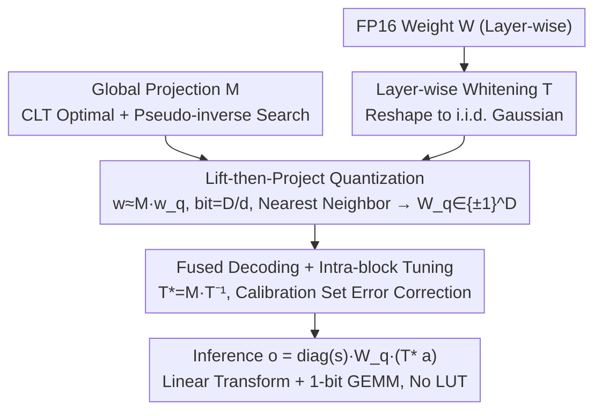

# LiftQuant: Continuous Bit-Width LLM via Dimensional Lifting and Projection

**Conference**: ICML 2026 Spotlight  
**arXiv**: [2606.04050](https://arxiv.org/abs/2606.04050)  
**Code**: https://github.com/Heliulu/LiftQuant  
**Area**: Model Compression / LLM Quantization / Deployment Optimization  
**Keywords**: Continuous bit-width, lift-then-project, high-dimensional projection, 1-bit lattice, Pareto-optimal deployment

## TL;DR
LiftQuant decouples LLM quantization bit-width from discrete integers (2/3/4 bit) into continuous fractions (e.g., 2.4-bit) through a "high-dimensional 1-bit lattice $\rightarrow$ low-dimensional weight space projection" (lift-then-project) mechanism. This allows a 70B model to fit precisely into a 24GB GPU with a PPL significantly better than 2-bit baselines. The entire decoding path uses only linear transformations and 1-bit uniform quantizers, making it hardware-friendly.

## Background & Motivation

**Background**: Weight-only quantization is essential for LLM deployment. Two main paradigms exist: Uniform Quantization (UQ), such as AWQ, QLoRA, QuIP#, QuaRot, and SpinQuant (INT2/3/4 after preprocessing), and Vector Quantization (VQ), such as AQLM, VPTQ, and QTIP (learned codebooks with higher accuracy but slower LUT-based inference).

**Limitations of Prior Work**: (1) All methods are locked to integer bit-widths. For instance, Llama-3-70B cannot fit into a 24GB card at 3-bit, while 2-bit quantization suffers catastrophic performance drops, leaving memory between 2 and 3 bits wasted. (2) UQ allows coarse adjustments via group sizes (e.g., EfficientQAT transitioning from 128 to 64), but these are discrete "gears" rather than continuous levels. (3) Non-power-of-two codebooks (e.g., ternary 1.58-bit) require specialized kernels. (4) Q-Palette achieves fractional bits by mixing multiple quantizers, but maintaining heterogeneous kernel libraries is engineering-heavy.

**Key Challenge**: Hardware budgets are continuous (24GB, 12GB, etc.), whereas model bit-widths are discrete (2, 3, 4), leading to suboptimal memory utilization. Meanwhile, VQ offers high accuracy but slow LUTs, while UQ is fast but less accurate; balancing "accuracy vs. speed" is even more difficult at fractional bit-widths.

**Goal**: (1) Transform bit-width from discrete integers to continuous fractions (2.0, 2.4, 2.5, etc.) to match hardware budgets precisely; (2) maintain VQ-level accuracy while retaining UQ-level hardware friendliness; (3) use a unified operator for all bit-widths without needing unique kernels for each.

**Key Insight**: It is observed that by projecting a high-dimensional ($\mathbb{R}^D$) 1-bit lattice ($\{\pm 1\}^D$, 1 bit per dimension) into a low-dimensional space ($\mathbb{R}^d, d < D$) via a matrix $\bm M$, the effective bit-width becomes the ratio $D/d$. Since $D$ and $d$ are flexible structural parameters, the ratio can be any fraction. According to the Central Limit Theorem (CLT), the projection of a high-dimensional lattice naturally forms a Gaussian-like dense codebook, providing VQ expressiveness with hardware-friendly 1-bit operators for decoding.

**Core Idea**: Lift-then-project — weights are represented as $\bm w \simeq \bm M \bm w_q$, where $\bm M$ is a learned global projection matrix and $\bm w_q \in \{\pm 1\}^D$ is a 1-bit quantized vector; the bit-width $D/d$ is continuously adjustable.

## Method

### Overall Architecture

LiftQuant addresses the mismatch between continuous hardware budgets and discrete model bit-widths by representing weights as a low-dimensional projection of a high-dimensional 1-bit lattice: $\bm w \simeq \bm M \bm w_q$, where the effective bit-width equals the dimension ratio $D/d$. The pipeline consists of three offline steps: first, learning a global projection matrix $\bm M$ optimized for Gaussian weights; second, learning a layer-wise whitening transform $\bm T$ to reshape real weights into i.i.d. Gaussian distributions to satisfy the projection assumption; and finally, fusing quantization and dequantization into the GEMM as $\bm o = \text{diag}(\bm s)\,\bm W_q\,(\bm M \bm T^{-1} \bm a)$, followed by intra-block fine-tuning on a calibration set to correct residuals. The decoding path consists solely of linear transformations and a 1-bit uniform quantizer. The notation LQ-$D/d$ denotes a configuration (e.g., LQ-24/10 for $D{=}24, d{=}10$, bit-width $=2.4$).

### Key Designs

**1. Lift-then-Project Quantization: Unlocking Continuous Bit-Widths**

Existing methods are constrained to integer bit-widths because "codebooks" and "bit-widths" are coupled—VQ learns codebooks directly in $\mathbb{R}^d$, where size defines bit-width, and UQ uses even more rigid scalar quantization. LiftQuant breaks this by lifting then projecting: low-dimensional weights $\bm w \in \mathbb{R}^d$ are expressed as $\bm w \simeq \bm M \bm w_q$, where $\bm w_q \in \{\pm 1\}^D$ is a high-dimensional 1-bit lattice (1 bit per dimension) and $\bm M \in \mathbb{R}^{d \times D}$ is a projection matrix. The storage cost is $D$ 1-bit signs spread over $d$ weights, making the effective bit-width $D/d$—a ratio of structural parameters that can be any fraction. Remarkably, since each $w_i = \sum_j \bm M_{ij}\, \bm y_j$ is a weighted sum of independent $\pm 1$ variables, the CLT ensures that this high-dimensional projection spontaneously forms a Gaussian-like dense codebook, achieving VQ-level expressiveness with 1-bit operator decoding.

**2. Optimizing $\bm M$ and Solving Nearest Neighbor Search**

CLT only provides asymptotic guarantees; for finite $D$, the projection distribution is imperfect, necessitating explicit optimization of $\bm M$. The objective is to minimize the reconstruction error of the projected codebook for Gaussian weights:

$$\bm M^* = \arg\min_{\bm M}\ \mathbb{E}_{\bm w \sim \mathcal{N}}\Big[\min_{\bm w_q \in \{\pm 1\}^{d_s \cdot b}} \|\bm w - \bm M \bm w_q\|\Big].$$

$\bm M$ is initialized as an orthogonal matrix to encourage uncorrelated projection directions, and the inner discrete argmin is approximated using a soft-argmin with temperature 10 for end-to-end differentiability. Furthermore, finding the nearest lattice point for each weight block typically requires $2^D$ complexity, which is impractical for $D \geq 24$. LiftQuant utilizes a pseudo-inverse projection for a high-quality starting point and pads an auxiliary vector, reducing the search space from $2^D$ to $2^{D-d}$. For $D-d \lesssim 20$, quantization completes in seconds.

**3. Layer-wise Whitening Transform $\bm T$: Bridging the Gaussian Assumption**

Lift-then-project relies on the assumption that weights are i.i.d. Gaussian. However, LLM weights exhibit heavy tails, outliers, and varying channel importance. LiftQuant learns a lightweight whitening transform $\bm T$ for each layer to reshape weights into an approximate i.i.d. Gaussian distribution. $\bm T$ is decomposed into $\bm T = \text{diag}(\bm s_1)\,(\bm P_1 \otimes \bm P_2)\,\text{diag}(\bm s_2)$, where $\bm P_{1,2}$ are small $\sqrt n \times \sqrt n$ matrices (Hadamard orthogonal initialization) that utilize Kronecker products for channel mixing and decorrelation, reducing activation multiplication cost from $\mathcal O(n^2)$ to $\mathcal O(n\sqrt n)$. $\bm s_1$ performs importance-aware scaling (handling large activation channels), $\bm P_{1,2}$ decorrelates and spreads outliers, and $\bm s_2$ performs isotropy refinement. For a 70B model, storing these parameters adds only 0.008–0.011 bits per parameter.

**4. Fused Decoding + Intra-block Tuning: Near-Zero Cost Dequantization**

During inference, LiftQuant fuses dequantization into the matrix multiplication: $\bm o = \text{diag}(\bm s)\,\bm W_q\,(\bm M \bm T^{-1} \bm a)$, where $\bm T^{*} = \bm M \bm T^{-1}$ is the fused decoding matrix and $\bm W_q$ is the 1-bit quantization matrix. Only one small matrix multiplication $\bm T^{*} \bm a$ is required before the standard 1-bit × float GEMM. This avoids the memory bottlenecks of VQ LUTs. Additionally, since the fused path is differentiable, LiftQuant treats $\bm W_q$ (via STE) and $\bm T^{*}$ as trainable parameters, performing intra-block fine-tuning on a small calibration set to minimize output reconstruction error and align components end-to-end.

## Key Experimental Results

### Llama-2-7B Wikitext-2 PPL (Standard Gaussian Source)

| Encoding | bits | MSE | Info | PPL | Search Time (1M params) |
|------|------|-----|------|-----|----|
| LQ-32/20 | 1.60 | 0.146 | 1.39 | 7.71 | 0.3s |
| **LQ-16/8** | **2.00** | 0.089 | 1.75 | **6.60** | ≪0.1s |
| LQ-32/16 | 2.00 | 0.082 | 1.79 | 6.53 | 4s |
| **LQ-30/14** | **2.14** | **0.070** | 1.92 | **6.30** | 4s |
| **LQ-24/10** | **2.40** | **0.053** | 2.12 | **6.10** | 1s |
| Int2 | 2.00 | 0.119 | 1.53 | 7.62 | – |
| E8 (QuIP#) | 2.00 | 0.089 | 1.75 | 6.60 | – |
| TCQ (QTIP) | 2.00 | 0.073 | 1.89 | 6.28 | – |

At exactly 2.00 bits, LQ is slightly weaker than QTIP (TCQ is more efficient at 64 dimensions). However, increasing to 2.14 bits allows LQ to surpass QTIP. At 2.4 bits, the PPL of 6.10 significantly outperforms all 2-bit baselines.

### Pareto Deployment of 70B Model on 24GB GPU

| Method | bits | Memory (GB) | WikiText-2 PPL | C4 PPL |
|------|------|--------|--------------|--------|
| QTIP 2-bit | 2.00 | 17.5 | 5.21 | 6.94 |
| EfficientQAT 2-bit | 2.00 | 18.0 | 5.45 | 7.18 |
| QTIP 3-bit | 3.00 | 26.3 | – | OOM |
| **LQ-24/10 (2.4-bit)** | **2.40** | **23.6** | **4.92** | **6.51** |

LQ fits the 70B model precisely into 24GB, with a significantly lower PPL than 2-bit baselines; 3-bit quantization results in OOM.

### Key Findings
- **Continuous bit-widths unlock the Pareto frontier**: Increasing from 2-bit to 2.4-bit (extra 0.4 bit) yields substantial PPL improvements that integer bit-widths cannot achieve.
- **Both CLT guarantees and explicit $\bm M$ optimization are necessary**: CLT provides the direction, but explicit optimization of $\bm M$ is required for competitive performance at finite $D$.
- **The 2-3 bit range is the sweet spot for LiftQuant**: For bit-widths above 4, quantization is nearly lossless, making fractional adjustments less beneficial. This paper focuses on the 2-3 bit deployment gap where hardware mismatch is greatest.
- **Search complexity is manageable**: With $D-d \leq 20$, searches complete in seconds, especially when paired with pseudo-inverse initialization.

## Highlights & Insights
- **Decoupling bit-width from coding format is a paradigm shift**: Traditional quantization ties the codebook size to the bit-width. By using dimensionality lifting and projection, LiftQuant separates them—a concept applicable to all codebook design problems.
- **CLT bridges 1-bit lattices and Gaussian codebooks**: Projecting a high-dimensional lattice naturally produces Gaussian-like distributions, perfectly matching the Gaussian nature of LLM weights.
- **The cost of hardware friendliness is roughly 0.1 bit**: Compared to the complex Trellis Codes in QTIP, LQ uses only linear transforms and 1-bit operators. While slightly weaker at identical bit-widths, LQ surpasses others with an additional 0.1 bit—a practical trade-off for engineering simplicity.
- **Real-world impact for 70B deployment**: There is a high demand for running 70B models on consumer GPUs (24GB). This paper provides an immediately applicable solution for this practical bottleneck.

## Limitations & Future Work
- Nearest neighbor search is still $2^{D-d}$, limiting practicality to $D-d \leq 20$. Achieving higher coding gains (like QTIP at $D \geq 64$) requires more efficient search methods.
- At bit-widths above 4, $d \leq 6$, which may lose high-dimensional inter-channel correlations—a common limitation for VQ.
- Whitening matrices $\bm T$ are learned layer-wise; significant distribution shifts might require recalibration.
- The method currently focuses on weight-only quantization and has not been extended to joint weight-activation quantization (e.g., W4A4, W2A4).
- $\bm M$ is shared globally; exploring grouping by hidden dimensions or layers might yield better results.

## Related Work & Insights
- **vs. Uniform Quantization (AWQ / QuIP#)**: UQ is restricted to discrete INT2/3/4; LiftQuant is continuously adjustable.
- **vs. Vector Quantization (AQLM / VPTQ / QTIP)**: VQ is accurate but slowed by LUTs; LiftQuant matches QTIP accuracy using linear operators for better hardware efficiency.
- **vs. Q-Palette (Mixed quantizers for fractional bits)**: Q-Palette requires heterogeneous kernels; LiftQuant uses a single unified operator.
- **Insight**: The lift-then-project approach can be extended to KV-cache, activation, and optimizer state quantization—any scenario requiring continuous compression ratios. CLT-based codebook generation is a versatile methodology.

## Rating
- Novelty: ⭐⭐⭐⭐⭐ Decoupling through lift-then-project is a fresh contribution to continuous bit-width quantization.
- Experimental Thoroughness: ⭐⭐⭐⭐⭐ Comprehensive coverage from Gaussian source theory to Llama PPL and real-world Pareto deployment on 24GB/12GB GPUs.
- Writing Quality: ⭐⭐⭐⭐⭐ Clear motivation and intuitive visualizations of codebooks and Pareto frontiers.
- Value: ⭐⭐⭐⭐⭐ High industrial relevance for deploying large models on consumer hardware; fractional bit-width concepts will influence future LLM quantization designs.

<!-- RELATED:START -->

## Related Papers

- [\[ICLR 2026\] Adaptive Width Neural Networks](../../ICLR2026/model_compression/adaptive_width_neural_networks.md)
- [\[ICML 2026\] OSAQ: Outlier Self-Absorption for Accurate Low-bit LLM Quantization](osaq_outlier_self-absorption_for_accurate_low-bit_llm_quantization.md)
- [\[NeurIPS 2025\] Q-Palette: Fractional-Bit Quantizers Toward Optimal Bit Allocation for Efficient LLM Deployment](../../NeurIPS2025/model_compression/q-palette_fractional-bit_quantizers_toward_optimal_bit_allocation_for_efficient_.md)
- [\[CVPR 2026\] Generative Video Compression with One-Dimensional Latent Representation](../../CVPR2026/model_compression/generative_video_compression_with_one-dimensional_latent_representation.md)
- [\[NeurIPS 2025\] ATLAS: Autoformalizing Theorems through Lifting, Augmentation, and Synthesis of Data](../../NeurIPS2025/model_compression/atlas_autoformalizing_theorems_through_lifting_augmentation_and_synthesis_of_dat.md)

<!-- RELATED:END -->
