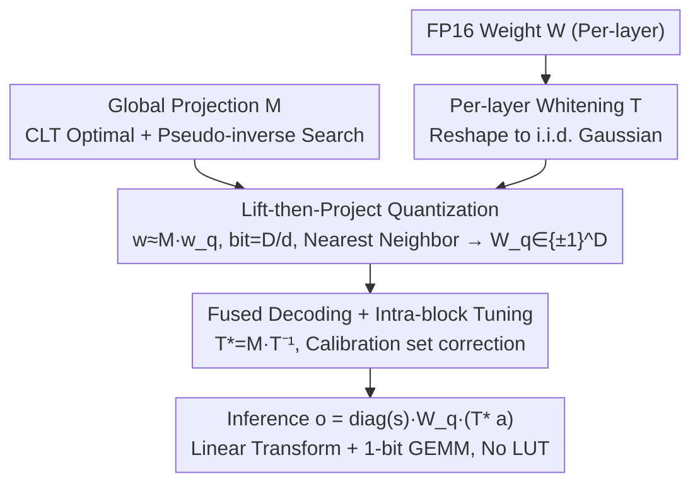

# LiftQuant: Continuous Bit-Width LLM via Dimensional Lifting and Projection

**Conference**: ICML 2026 Spotlight  
**arXiv**: [2606.04050](https://arxiv.org/abs/2606.04050)  
**Code**: https://github.com/Heliulu/LiftQuant  
**Area**: Model Compression / LLM Quantization / Deployment Optimization  
**Keywords**: Continuous bit-width, lift-then-project, high-dimensional projection, 1-bit lattice, Pareto-optimal deployment

## TL;DR
LiftQuant decouples LLM quantization bit-width from discrete integers (2/3/4 bit) into continuous fractions (e.g., 2.4-bit) through a "high-dimensional 1-bit lattice $\rightarrow$ low-dimensional weight space projection" mechanism called lift-then-project. This allows a 70B model to fit precisely into a 24GB GPU with PPL significantly better than a 2-bit baseline. The decoding path utilizes only linear transformations and 1-bit uniform quantizers, ensuring hardware friendliness.

## Background & Motivation

**Background**: Weight-only quantization is a necessity for LLM deployment. Two main branches exist: Uniform Quantization (UQ, e.g., AWQ, QLoRA, QuIP#, QuaRot, SpinQuant, which use INT2/3/4 after preprocessing) and Vector Quantization (VQ, e.g., AQLM, VPTQ, QTIP, which utilize learned codebooks for higher accuracy but suffer from slow LUT-based inference).

**Limitations of Prior Work**: (1) All methods are locked into integer bit-widths—for instance, Llama-3-70B cannot fit in 3-bit on a 24GB card, while 2-bit results in catastrophic accuracy drops, leaving the VRAM between 2-3 bits wasted; (2) UQ can provide coarse adjustments by varying group size (e.g., EfficientQAT from 128 to 64), but these are discrete "steps" rather than continuous; (3) Non-power-of-two codebooks (e.g., ternary 1.58-bit) require specialized kernels; (4) Q-Palette achieves fractional bits by mixing multiple quantizers but requires maintaining complex heterogeneous kernel libraries.

**Key Challenge**: Hardware budgets are continuous (24GB, 12GB, etc.), while model bit-widths are discrete (2/3/4). This mismatch leads to suboptimal VRAM utilization. Furthermore, VQ offers accuracy with slow LUTs, while UQ is fast but less accurate; the "accuracy vs. speed" trade-off is even harder to manage at fractional bits.

**Goal**: (1) Transform bit-width from integers to continuous fractions (2.0, 2.4, 2.5, etc.) to match hardware budgets precisely; (2) Maintain VQ-level accuracy while enjoying UQ-level hardware friendliness; (3) Use a unified operator for all bit-widths without writing separate kernels.

**Key Insight**: It is observed that by projecting a high-dimensional ($\mathbb{R}^D$) 1-bit lattice ($\{\pm 1\}^D$, 1 bit per dimension) via a matrix $\bm M$ into a low-dimensional space ($\mathbb{R}^d$, $d < D$), the effective bit-width becomes the ratio $D/d$. Since $D$ and $d$ are flexible structural parameters, the ratio can be any fraction. According to the CLT, the projection of a high-dimensional lattice naturally forms a Gaussian-like dense codebook, achieving VQ's expressiveness while using hardware-friendly 1-bit operators for decoding.

**Core Idea**: Lift-then-project — weights are represented as $\bm w \simeq \bm M \bm w_q$, where $\bm M$ is a learned global projection matrix and $\bm w_q \in \{\pm 1\}^D$ is a 1-bit quantized vector; the bit-width is $D/d$ and continuously adjustable.

## Method

### Overall Architecture

LiftQuant addresses the misalignment between continuous hardware budgets and discrete bit-widths by representing weights as a low-dimensional projection of a 1-bit lattice: $\bm w \simeq \bm M \bm w_q$, where the effective bit-width equals the ratio $D/d$. The pipeline consists of three offline steps: first, learning a global projection matrix $\bm M$ optimal for Gaussian weights; second, learning a per-layer whitening transform $\bm T$ to reshape real weights into i.i.d. Gaussian distributions to satisfy the projection assumption; and finally, fusing quantization and dequantization into the GEMM as $\bm o = \text{diag}(\bm s)\,\bm W_q\,(\bm M \bm T^{-1} \bm a)$, followed by intra-block fine-tuning using a calibration set to correct residuals. The decoding path involves only linear transformations and 1-bit uniform quantizers. LQ-$D/d$ denotes a configuration (e.g., LQ-24/10 means $D{=}24, d{=}10$, bit-width $=2.4$).

### Key Designs

**1. Lift-then-Project Quantization: Unlocking Continuous Bit-Widths**

Existing methods are locked into integer bits because they bind the "codebook" to the "bit-width"—VQ learns a codebook in $\mathbb{R}^d$ where bit-width is fixed by codebook size, while UQ uses scalar quantization. LiftQuant breaks this by lifting then projecting: weights $\bm w \in \mathbb{R}^d$ are expressed as $\bm w \simeq \bm M \bm w_q$, where $\bm w_q \in \{\pm 1\}^D$ is a high-dimensional 1-bit lattice (1 bit per dimension) and $\bm M \in \mathbb{R}^{d \times D}$ is a projection matrix. The storage cost is $D$ bits spread over $d$ weights, making the effective bit-width $D/d$. Since $D$ and $d$ are structural parameters, the ratio can be any fraction. Furthermore, each $w_i = \sum_j \bm M_{ij}\, \bm w_{q,j}$ is a weighted sum of independent $\pm 1$ variables; by the Central Limit Theorem (CLT), this projection naturally forms a Gaussian-like dense codebook, providing VQ-level expressiveness with 1-bit hardware friendliness.

**2. Optimizing $\bm M$ and Accelerating Nearest Neighbor Search**

Since the CLT only provides asymptotic guarantees, the projection distribution might be imperfect for finite $D$. Thus, $\bm M$ is explicitly learned to minimize reconstruction error for Gaussian weights:

$$\bm M^* = \arg\min_{\bm M}\ \mathbb{E}_{\bm w \sim \mathcal{N}}\Big[\min_{\bm w_q \in \{\pm 1\}^{D}} \|\bm w - \bm M \bm w_q\|^2\Big].$$

$\bm M$ is initialized as an orthogonal matrix to encourage uncorrelated projection directions. The inner discrete argmin is approximated with a soft-argmin (temperature 10) for end-to-end optimization. To solve the exponential $2^D$ complexity of nearest neighbor search in the lattice, LiftQuant uses a pseudo-inverse projection for a high-quality starting point and an auxiliary vector to reduce the search space to $2^{D-d}$. For $D-d \lesssim 20$, quantization completes in seconds.

**3. Per-layer Whitening Transform $\bm T$**

The lift-then-project theory assumes i.i.d. Gaussian weights, but LLM weights exhibit heavy tails, outliers, and varying channel importance. To bridge this, a lightweight whitening transform $\bm T$ is learned for each layer to reshape weights into an approximate i.i.d. Gaussian distribution. $\bm T$ is decomposed as $\bm T = \text{diag}(\bm s_1)\,(\bm P_1 \otimes \bm P_2)\,\text{diag}(\bm s_2)$, where $\bm P_{1,2}$ are small $\sqrt n \times \sqrt n$ matrices (Hadamard-initialized) that use Kronecker products to achieve channel mixing and decorrelation with $\mathcal{O}(n\sqrt n)$ cost. $\bm s_1$ performs importance-aware scaling (similar to AWQ), $\bm P_{1,2}$ decorrelate and spread outliers, and $\bm s_2$ performs isotropy refinement. For a 70B model, these FP16 parameters add only 0.008–0.011 bits per parameter.

**4. Fused Decoding + Intra-block Fine-tuning**

During inference, dequantization is fused into the matrix multiplication: $\bm o = \text{diag}(\bm s)\,\bm W_q\,(\bm M \bm T^{-1} \bm a)$, where $\bm T^{*} = \bm M \bm T^{-1}$ is the fused decoding matrix and $\bm W_q$ is the 1-bit quantized matrix. The runtime execution only requires a small matrix multiplication $\bm T^{*} \bm a$ followed by a standard 1-bit $\times$ float GEMM, avoiding the LUT memory bottleneck of VQ. Furthermore, since the path is differentiable, $\bm W_q$ (via STE) and $\bm T^{*}$ are fine-tuned on a small calibration set to minimize output reconstruction error.

## Key Experimental Results

### Llama-2-7B Wikitext-2 PPL (Standard Gaussian Source)

| Coding | bits | MSE | Info | PPL | Search Time (1M params) |
|------|------|-----|------|-----|----|
| LQ-32/20 | 1.60 | 0.146 | 1.39 | 7.71 | 0.3s |
| **LQ-16/8** | **2.00** | 0.089 | 1.75 | **6.60** | ≪0.1s |
| LQ-32/16 | 2.00 | 0.082 | 1.79 | 6.53 | 4s |
| **LQ-30/14** | **2.14** | **0.070** | **1.92** | **6.30** | 4s |
| **LQ-24/10** | **2.40** | **0.053** | **2.12** | **6.10** | 1s |
| Int2 | 2.00 | 0.119 | 1.53 | 7.62 | – |
| E8 (QuIP#) | 2.00 | 0.089 | 1.75 | 6.60 | – |
| TCQ (QTIP) | 2.00 | 0.073 | 1.89 | 6.28 | – |

At exactly 2.00 bits, LQ is slightly weaker than QTIP (as TCQ is highly efficient in 64D); however, by simply increasing to 2.14 bits, LQ surpasses QTIP. At 2.4 bits, the PPL of 6.10 significantly outperforms all 2-bit baselines.

### Pareto Deployment of 70B Model on 24GB GPU

| Method | bits | Memory (GB) | WikiText-2 PPL | C4 PPL |
|------|------|--------|--------------|--------|
| QTIP 2-bit | 2.00 | 17.5 | 5.21 | 6.94 |
| EfficientQAT 2-bit | 2.00 | 18.0 | 5.45 | 7.18 |
| QTIP 3-bit | 3.00 | 26.3 | – | OOM |
| **LQ-24/10 (2.4-bit)** | **2.40** | **23.6** | **4.92** | **6.51** |

Ours (LQ) precisely fits the 70B model into 24GB VRAM, with PPL significantly lower than 2-bit baselines, whereas 3-bit models exceed memory limits.

### Key Findings
- **Continuous bit-width unlocks the Pareto frontier**: Increasing from 2-bit to 2.4-bit (extra 0.4 bit) yields massive PPL improvements that integer bits cannot achieve.
- **CLT and explicit $\bm M$ optimization are both necessary**: CLT provides the direction, but explicit optimization for finite $D$ is required to match state-of-the-art efficiency.
- **2-3 bit is the sweet spot for LiftQuant**: Above 4-bit, quantization is nearly lossless, making fractional adjustments less impactful. This work focuses on the 2-3 bit gap where hardware budget misalignment is most severe.
- **Search complexity is manageable**: With $D-d \leq 20$, search completes in seconds using pseudo-inverse initialization.

## Highlights & Insights
- **Decoupling bit-width from coding format is a paradigm shift**: Traditional quantization binds these two (codebook size determines bit). This work uses lifting and projection to separate them, a concept applicable to various codebook designs.
- **CLT as a bridge**: Using high-dimensional lattice projections naturally yields Gaussian-like distributions that align with LLM weight characteristics, perfectly merging theory and engineering.
- **0.1-bit cost for hardware friendliness**: Compared to QTIP's complex Trellis Codes, LQ uses simple linear transforms and 1-bit operators. It is slightly weaker at the same bit-width but surpasses competitors with just an additional 0.1 bit—a highly practical trade-off.
- **Industrial Value**: The solution directly enables running 70B models on consumer 24GB GPUs, meeting a critical industrial demand.

## Limitations & Future Work
- Nearest neighbor search remains $2^{D-d}$, limiting practicality to $D-d \leq 20$. Larger dimensions ($D \geq 64$) for better coding gain require more efficient search algorithms.
- In scenarios above 4-bit, $d \leq 6$, which may lose high-dimensional inter-channel correlations—a common limitation for VQ.
- The whitening matrix $\bm T$ is learned per layer; significant distribution shifts might require recalibration.
- Currently weight-only; joint activation quantization (e.g., W4A4, W2A4) has not been explored.

## Related Work & Insights
- **vs. Uniform Quantization (AWQ / QuIP#)**: UQ is limited to discrete INT2/3/4; LiftQuant is continuous.
- **vs. Vector Quantization (AQLM / VPTQ / QTIP)**: VQ has good accuracy but slow LUTs; LiftQuant matches QTIP accuracy using linear operators for better hardware efficiency.
- **vs. Q-Palette**: Q-Palette requires heterogeneous kernels; LiftQuant uses a unified operator.
- **Insight**: The lift-then-project approach can be extended to KV-cache, activation, and optimizer state quantization where continuous compression ratios are beneficial.

## Rating
- Novelty: ⭐⭐⭐⭐⭐ 
- Experimental Thoroughness: ⭐⭐⭐⭐⭐ 
- Writing Quality: ⭐⭐⭐⭐⭐ 
- Value: ⭐⭐⭐⭐⭐ 

<!-- RELATED:START -->

## Related Papers

- [\[ICML 2026\] OSAQ: Outlier Self-Absorption for Accurate Low-bit LLM Quantization](osaq_outlier_self-absorption_for_accurate_low-bit_llm_quantization.md)
- [\[ICLR 2026\] Adaptive Width Neural Networks](../../ICLR2026/model_compression/adaptive_width_neural_networks.md)
- [\[NeurIPS 2025\] Q-Palette: Fractional-Bit Quantizers Toward Optimal Bit Allocation for Efficient LLM Deployment](../../NeurIPS2025/model_compression/q-palette_fractional-bit_quantizers_toward_optimal_bit_allocation_for_efficient_.md)
- [\[CVPR 2026\] Generative Video Compression with One-Dimensional Latent Representation](../../CVPR2026/model_compression/generative_video_compression_with_one-dimensional_latent_representation.md)
- [\[NeurIPS 2025\] Learning Grouped Lattice Vector Quantizers for Low-Bit LLM Compression](../../NeurIPS2025/model_compression/learning_grouped_lattice_vector_quantizers_for_low-bit_llm_compression.md)

<!-- RELATED:END -->
