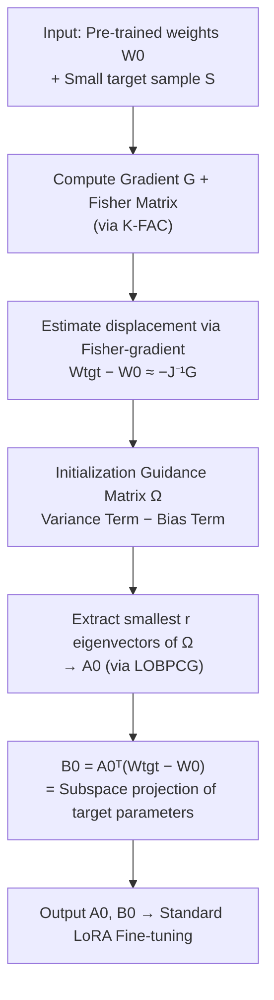

# LoRA-DA: Data-Aware Initialization for Low-Rank Adaptation via Asymptotic Analysis

**Conference**: ICML 2026  
**arXiv**: [2510.24561](https://arxiv.org/abs/2510.24561)  
**Code**: https://github.com/zqy0126/LoRA-DA  
**Area**: Model Compression / Parameter-Efficient Fine-Tuning (PEFT)  
**Keywords**: LoRA Initialization, Asymptotic Analysis, Fisher Information, Data-Aware, Anisotropy

## TL;DR
LoRA-DA reformulates the problem of "how to initialize LoRA matrices $A$ and $B$" as an optimization problem aimed at **minimizing the expected gap between the fine-tuned model and target model parameters**. Through asymptotic analysis, the objective is decomposed into **variance and bias terms**. Using Fisher Information to characterize sampling randomness while preserving the anisotropy of the parameter space, LoRA-DA provides an initialization superior to "single-step gradient" methods, achieving stable performance gains across multiple NLP benchmarks.

## Background & Motivation
**Background**: LoRA has become the mainstream approach for parameter-efficient fine-tuning of large models—freezing pre-trained weights $W_0$ and training only a pair of low-rank matrices $A\in\mathbb{R}^{d_1\times r}$ and $B\in\mathbb{R}^{r\times d_2}$ such that weight updates are $\hat W = W_0 + AB$. The standard practice is random initialization for $A$ (Kaiming) and zero initialization for $B$, ensuring the starting point is equivalent to the original model.

**Limitations of Prior Work**: This "random $A$ + zero $B$" initialization carries no task-specific information, leading to slow early convergence or suboptimal solutions. Two types of improvements have emerged: **data-independent** methods (PiSSA, MiLoRA), which perform SVD on pre-trained weights to utilize structural properties; and **data-aware** methods (LoRA-GA, LoRA-One), which use a small batch of target domain samples to compute gradients and perform SVD on those gradients to construct a low-rank subspace.

**Key Challenge**: The data-aware line of research appears promising but is applied "superficially" by relying solely on single-step gradient decomposition. Two issues arise: first, using raw gradients to approximate the gap between target and pre-trained parameters ($W_{\mathrm{tgt}}-W_0$) implicitly assumes an **isotropic** parameter space, whereas Transformer representations have been proven to be highly **anisotropic**. Second, the **variance introduced by sampling randomness** also contributes to training error, yet it is completely ignored by these methods. Experiments for LoRA-GA / LoRA-One even show that single-step fine-tuning results can be suboptimal or significantly worse than vanilla LoRA.

**Goal**: To establish a theoretically grounded framework for data-aware LoRA initialization that considers both bias and variance, utilizes data gradients, and respects anisotropy.

**Key Insight**: The authors start from a clean optimization objective—minimizing the expected distance between the fine-tuned estimator $\hat W$ and the true target parameters $W_{\mathrm{tgt}}$, i.e., $\min_A \mathbb{E}\big[\|\hat W - W_{\mathrm{tgt}}\|_F^2\big]$. They then use the asymptotic normality of MLE to expand this expectation into a solvable quadratic optimization.

**Core Idea**: The upper bound of the initialization objective is **asymptotically decomposed into variance and bias terms**, forming an "Initialization Guidance Matrix $\Omega$." The optimal $A_0$ consists of the eigenvectors corresponding to the smallest eigenvalues of $\Omega$. Furthermore, **Fisher-gradients (natural gradients)** are used instead of raw gradients to estimate $W_{\mathrm{tgt}}-W_0$, explicitly encoding anisotropy.

## Method

### Overall Architecture
LoRA-DA takes pre-trained weights $W_0$ and a **small batch** of target samples $\mathcal{S}$ (default 256) as input, and outputs a pair of task-informed initialization matrices $A_0$ and $B_0$. Standard LoRA fine-tuning then proceeds. The core step involves deriving the optimal $A_0$ under the more analytical LoRA-FA setting (frozen $A$, trainable $B$) and then demonstrating that the conclusion transfers to standard LoRA.

The pipeline is as follows: compute the **gradient $G$** and the **Fisher Information Matrix** (approximated via K-FAC) using the small batch; estimate the target displacement $W_{\mathrm{tgt}}-W_0$ using the Fisher-gradient $-J(W_0)^{-1}G$; assemble the "variance" and "bias" terms into the Initialization Guidance Matrix $\Omega$; obtain $A_0$ by taking the **smallest** $r$ eigenvectors of $\Omega$ (solved iteratively via LOBPCG to avoid full eigendecomposition); finally, set $B_0 = A_0^\top(W_{\mathrm{tgt}}-W_0)$ such that $W_0+A_0B_0$ is exactly the projection of the target parameters onto the LoRA subspace.

### Key Designs

**1. Formulating Initialization as Expected Parameter Gap Minimization with Asymptotic Decomposition**

This is the theoretical foundation of the method, addressing the lack of theory and the neglect of variance in existing work. The authors view LoRA fine-tuning as a **constrained MLE** maximized on the low-rank manifold $\{W_0+AB\}$. Utilizing MLE asymptotic normality $\sqrt{N}(\hat\theta_{\mathrm{MLE}}-\theta^*)\xrightarrow{d}\mathcal{N}(0, J(\theta^*)^{-1})$, the upper bound of the objective $\mathbb{E}\big[\|\hat W - W_{\mathrm{tgt}}\|_F^2\big]$ is expanded into a quadratic optimization problem with variable $A$ and orthogonal constraint $A^\top A=I_r$. The error naturally splits into two components: **variance** (sampling randomness, reflected via Fisher info and sample size $N$) and **bias** (the distance between $W_{\mathrm{tgt}}$ and the subspace spanned by $W_0+A$). This transforms heuristic initialization into a closed-form optimization problem.

**2. Initialization Guidance Matrix $\Omega$: Directing Variance and Bias via a Single Matrix**

Addressing the "bias-only" limitation, the authors combine both terms into a symmetric matrix $\Omega$. The optimal $A_0$ comprises the eigenvectors corresponding to the **smallest** $r$ eigenvalues (guaranteed by the Courant–Fischer theorem in Section 2.3). In the 1D case:

$$\Omega = \underbrace{\frac{J(W_0)^{-1}}{N}}_{\text{Variance Term}} \underbrace{-\,(W_{\mathrm{tgt}}-W_0)(W_{\mathrm{tgt}}-W_0)^\top}_{\text{Bias Term}}.$$

Intuitively: the bias term encourages $A$ to align with the "target displacement" direction (to minimize projection loss; the negative sign ensures the smallest eigenvectors align with the displacement). The variance term penalizes directions with small Fisher Information and high sampling noise. For high-dimensional LoRA, $\Omega$ generalized as a summation over columns $i$: $\sum_i J(W_0)^{-1}_{[i]}/N - (W_{\mathrm{tgt}}-W_0)_{(:,i)}(\cdot)^\top$. The authors emphasize that since $W$ columns are not independent, Fisher must be defined for the entire matrix and then diagonally blocked.

**3. Fisher-gradient for Target Displacement Estimation and Anisotropy Preservation**

The term $W_{\mathrm{tgt}}-W_0$ in the bias term is unknown and must be estimated. LoRA-GA / LoRA-One use the **negative raw gradient** $-G$, which assumes an isotropic loss surface. LoRA-DA instead uses the **Fisher-gradient (natural gradient)**: a second-order expansion of the loss at $W_0$ gives the first-order optimality condition $W_{\mathrm{tgt}}-W_0\approx -H_0^{-1}G$. Approximating the Hessian $H_0$ with Fisher Information (under MLE regularity conditions) yields:

$$W_{\mathrm{tgt}}-W_0 \approx -\,J(W_0)^{-1}G.$$

Compared to raw gradients, this Fisher-weighted form **adaptively scales directions based on information/uncertainty**, thereby incorporating the anisotropy of the parameter space. Since Fisher Information is already required for the variance term, it is reused here at almost no extra cost. In Remark 4.3, the authors prove that if the variance term is removed and Fisher-gradient is replaced by raw gradient, the method degenerates into $A_0^*=\arg\min_A -\mathrm{tr}(A^\top GG^\top A)$, which is SVD on gradients—exactly LoRA-GA / LoRA-One. Thus, previous methods are **degenerate special cases** of LoRA-DA.

**4. LoRA-DA Algorithm: Lightweight via K-FAC + LOBPCG**

Implementing the theory requires managing the overhead of Fisher estimation and eigenvalue decomposition. Fisher is approximated via **K-FAC** as the Kronecker product of two small matrices ($Z_{\text{fisher}}$ from inputs and $Y_{\text{fisher}}$ from gradients). Smallest eigenvectors of $\Omega$ are computed using the iterative **LOBPCG** method on the $d_1\times d_1$ matrix $\Omega$ with a small constant of iterations $T_{\text{LOBPCG}} \approx 10$. The cost per layer is $O(T_{\text{LOBPCG}}\,d_1^2\,r)$. Since $d_1$ does not scale with model size (larger models usually increase layers/FFN width), total overhead scales linearly with depth, adding negligible memory.

### Mechanism Example: Initializing a Single Layer
Given a linear layer $W_0\in\mathbb{R}^{d_1\times d_2}$ and rank $r$, following Algorithm 1: ① Compute average gradient $G$ using batch $\mathcal{S}$; ② Compute $Z_{\text{fisher}}=\frac{1}{|\mathcal{S}|}\sum z^j z^{j\top}$ and $Y_{\text{fisher}}=\frac{1}{|\mathcal{S}|}\sum \nabla_y\ell\,\nabla_y\ell^\top$; ③ Construct inverse Fisher blocks and compute displacement $(W_{\mathrm{tgt}}-W_0)_{(:,i)}=-J(W_0)^{-1}_{[i]}G_{(:,i)}$; ④ Sum variance and bias terms into $\Omega$ and extract smallest $r$ eigenvectors via LOBPCG for $A_0$; ⑤ Set $B_0=A_0^\top(W_{\mathrm{tgt}}-W_0)$.

## Key Experimental Results

### Main Results
Evaluated on LLaMA 2-7B / 13B. Baselines include vanilla LoRA, data-independent PiSSA / MiLoRA, and data-aware LoRA-One. To ensure fairness, only methods maintaining the original LoRA structure are compared. 256 samples are used for statistics.

| Task / Model | Metric | LoRA-DA | Prev. SOTA | Note |
|:---|:---|:---|:---|:---|
| 8 Commonsense Reasoning (7B) | Avg. Acc | **84.3** | 84.0 (MiLoRA) | Ranked 1st in 6/8 tasks |
| Math Reasoning (7B) | GSM8K / MATH Avg | **32.1** | 31.1 (LoRA-One) | GSM8K 53.7→55.0, MATH 8.5→9.2 |
| Math Reasoning (13B) | GSM8K / MATH Avg | **39.6** | 38.9 (PiSSA) | Effective on larger models |

### Ablation Study

| Configuration | Key Metric | Conclusion |
|:---|:---|:---|
| Frozen-$A$ (LoRA-FA) GSM8K | 41.5 → **49.4** | LoRA-DA init boosts LoRA-FA by +7.9 |
| Degenerate form (No Variance + Raw Grad) | ≈ LoRA-GA / One | Previous methods are special cases |
| Remove Variance Term | Performance Drop | Loses penalty on high sampling noise directions |
| Replace Fisher-grad with Raw Grad | Performance Drop | Higher displacement estimation bias due to isotropy assumption |

### Key Findings
- **Variance modeling and anisotropy are independent increments**: Remark 4.3 analytically shows that removing either leads back to gradient SVD (LoRA-One); thus, both contribute uniquely.
- **Frozen-$A$ setting yields the greatest gain** (GSM8K +7.9): Since $A$ is not updated, the quality of initialization is critical, amplifying the value of $A_0$.
- **Robust across ranks and model sizes**: Initialization requires only 256 samples with minimal memory overhead—theoretical depth with lightweight deployment.

## Highlights & Insights
- **Upgrading Initialization to an Optimization Problem**: The decomposition of variance and bias terms is intuitive and provable, with the optimal solution being the smallest eigenvectors of $\Omega$.
- **Efficient Dual Use of Fisher**: The same Fisher matrix serves both the variance term and the upgrade from raw gradients to natural gradients, incorporating anisotropy at almost zero additional cost.
- **Unification of Prior Work**: LoRA-GA / LoRA-One are explained as "degenerate" special cases (ignoring variance and assuming isotropy), making the "Ours = Prior + 2 Missing Terms" narrative highly compelling.

## Limitations & Future Work
- **Reliance on Asymptotic Assumptions**: MLE regularity, $\|W_{\mathrm{tgt}}-W_0\|_F=O(1/\sqrt{N})$ (target task close to pre-training), and Hessian≈Fisher might not hold under extreme distribution shifts.
- **Modest Gains on Commonsense Reasoning**: The average gain is +0.3, with most improvement seen in math reasoning and LoRA-FA, suggesting task-dependent utility.
- **Statistical Quality**: K-FAC and Fisher estimates depend on the small batch. While 256 samples proved stable, extreme low-resource scenarios remain unexplored.

## Related Work & Insights
- **vs LoRA-GA / LoRA-One**: They use SVD on gradients. Ours proves they are special cases lacking variance modeling and Fisher-gradient anisotropy.
- **vs PiSSA / MiLoRA**: They are data-independent, using only pre-trained weights. Ours is data-aware, using target samples to better approximate the target parameters.
- **vs LoRA-FA**: Ours not only adopts the "frozen $A$" setting for analysis but provides the optimal $A_0$, significantly boosting LoRA-FA performance (e.g., from 41.5 to 49.4 on GSM8K).

## Rating
- Novelty: ⭐⭐⭐⭐⭐ Uses asymptotic analysis to decompose LoRA init into variance+bias and unifies prior work.
- Experimental Thoroughness: ⭐⭐⭐⭐ Covers multiple tasks and scales, though commonsense gains are minor.
- Writing Quality: ⭐⭐⭐⭐⭐ Logical progression from theory to algorithm; Remark 4.3 is particularly insightful.
- Value: ⭐⭐⭐⭐ A near-zero-cost initialization upgrade that is theoretically sound and practically effective for PEFT.

<!-- RELATED:START -->

## Related Papers

- [\[ACL 2026\] TLoRA: Task-aware Low Rank Adaptation of Large Language Models](../../ACL2026/model_compression/tlora_task-aware_low_rank_adaptation_of_large_language_models.md)
- [\[ICML 2026\] Energy-Structured Low-Rank Adaptation for Continual Learning](energy-structured_low-rank_adaptation_for_continual_learning.md)
- [\[ACL 2026\] TalkLoRA: Communication-Aware Mixture of Low-Rank Adaptation for Large Language Models](../../ACL2026/model_compression/talklora_communication-aware_mixture_of_low-rank_adaptation_for_large_language_m.md)
- [\[ICML 2026\] ScaLoRA: Optimally Scaled Low-Rank Adaptation for Efficient High-Rank Fine-Tuning](scalora_optimally_scaled_low-rank_adaptation_for_efficient_high-rank_fine-tuning.md)
- [\[ACL 2026\] Not All Directions Matter: Towards Structured and Task-Aware Low-Rank Model Adaptation](../../ACL2026/model_compression/not_all_directions_matter_towards_structured_and_task-aware_low-rank_model_adapt.md)

<!-- RELATED:END -->
