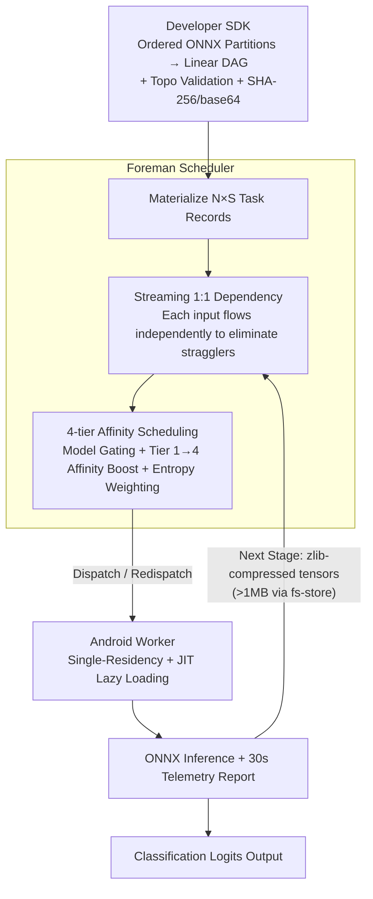

# Memory-Efficient Partitioned DNN Inference on Resource-Constrained Android Crowds

**Conference**: ICML 2026  
**arXiv**: [2605.20723](https://arxiv.org/abs/2605.20723)  
**Code**: Private (Subsystem of the CROWDio framework for DNN scheduling)  
**Area**: Model Compression / Edge Deployment / Mobile Crowdsourced Inference  
**Keywords**: Memory-efficient inference, model partitioning, edge ML, ONNX, Android, pipeline scheduling  

## TL;DR
This work presents the design of the "DNN Pipeline Scheduling Subsystem" within the CROWDio framework. Without modifying the model itself (no pruning, quantization, or distillation), a complete ONNX model is partitioned into layers and distributed across multiple Android devices with RAM as low as 3.3–7.4 GB for pipelined inference. By employing five mechanisms—**JIT lazy loading, single-partition residency constraint, 4-tier affinity scheduling, zlib-compressed tensor transfer, and streaming 1:1 dependencies**—the peak RSS on each device is suppressed to $43\pm 2$ MB, achieving batch latencies 34% faster than traditional barrier synchronization.

## Background & Motivation

**Background**: For running DNN inference on resource-constrained devices, the mainstream approach is **model reduction**—quantization, pruning, knowledge distillation, and low-rank decomposition—to minimize the "per-parameter cost." This route assumes the model is still fully hosted on a single device. A complementary approach is **deployment-aware partitioning**, which distributes layers across multiple memory-constrained devices, allowing the cluster's aggregate memory to accommodate a complete model where each individual device does not exceed its RAM limit.

**Limitations of Prior Work**:
- Commodity Android phones often have only 3.3–7.4 GB of RAM, yet a "medium" Transformer like DistilBERT requires 2–4 GB just for the ONNX session, leaving almost no space for the OS and background processes.
- Quantization, pruning, and distillation require model modification, resulting in long deployment cycles and sensitivity to accuracy loss. Partitioning systems like SPINN and Neurosurgeon assume a "mobile + reliable cloud" binary split, failing in **volunteer crowdsourcing** scenarios involving more than two stages, dynamic device churn, and heterogeneous RAM.
- Existing "intra-device layer offloading" (e.g., Melon) only addresses memory reuse within one device rather than cross-device sharing. GPipe and PipeDream are designed for GPU clusters, relying on stable networks and homogeneous hardware.

**Key Challenge**: To perform full Transformer inference in **heterogeneous, unstable, and memory-constrained** Android crowds, three requirements must be met simultaneously: (1) peak RSS on any device must not exceed its RAM budget; (2) network transfers across multiple pipeline stages must not saturate Wi-Fi bandwidth; and (3) the scheduling system must handle device disconnections by redispatching without interrupting in-flight tasks. Failure in any of these leads to system collapse.

**Goal**: To build an engineering system capable of running DistilBERT (≈67M parameters, SST-2) on an Android phone cluster with 3.3 GB RAM without modifying model weights, and to quantify its memory, latency, energy, and compression ratio.

**Key Insight**: Treat "memory pressure" as a first-class citizen in scheduling. Since a single device cannot hold the entire model, the system **restricts the number of concurrently resident partitions to one** and amortizes the JIT lazy loading overhead through affinity scheduling.

**Core Idea**: **Single-partition residency + JIT lazy loading** serves as the hard constraint for memory safety. The other four mechanisms (affinity scheduling, compressed transfer, streaming dependencies, and failure redispatching) aim to reduce latency and energy consumption to acceptable levels under this constraint.

## Method

### Overall Architecture

CROWDio solves the problem of how to perform complete Transformer inference across a group of Android phones that cannot individually host the entire model. It partitions a complete ONNX model into several segments, assigns each device to handle one segment, and links them via a persistent WebSocket pipeline. The system consists of three layers: the **Developer SDK** takes sequential ONNX partitions, generates a linear DAG, performs topological validation, and packages them via base64 with SHA-256 verification; the **Foreman (Scheduler)** instantiates $N$ inputs $\times S$ stages into $N \times S$ task records, maintains the dependency graph, dispatches tasks by affinity, and handles failures; the **Android Worker** performs ONNX inference under the single-partition residency constraint, reporting CPU/RAM/battery/RTT/thermal telemetry every 30 seconds. The reference workload is DistilBERT-SST2, partitioned into three parts: `cell_a` (Embedding + Layers 0–2), `cell_b` (Layers 3–5, the largest partition), and `cell_c` (Pre-classifier + Classifier).

### Key Designs

**1. JIT Lazy Loading + Single-Partition Residency Constraint: Capping Peak Memory**

A full DistilBERT ONNX session requires 2–4 GB, which would starve the OS on a 3.3 GB RAM device. This constraint is a prerequisite for deployment rather than an optimization. Two mechanisms are layered: the smallest `cell_a` is **eagerly broadcast** to all workers to ensure everyone can immediately accept Stage 0 tasks; the larger `cell_b` and `cell_c` use **JIT—instructions are only sent when an upstream task is completed and execution is certain**. Combined with a strict "one active ONNX session per worker" residency constraint, peak RSS is locked to the size of a single partition, regardless of pipeline depth or overall model size. Correctness was verified by comparing chained ONNX Runtime outputs against PyTorch, with max-abs errors $\approx 0$.

**2. Streaming 1:1 Dependency Model: Reducing Synchronous Granularity**

Volunteer phones exhibit significant performance variance (SoC, thermal throttling, Wi-Fi signal). Traditional batch barriers—waiting for all Stage-$(k-1)$ tasks to finish before starting Stage-$k$ (1:$N$ dependency)—are throttled by the slowest device. CROWDio materializes $N \times S$ tasks and assigns each Stage-$k$ task a 1:1 dependency only on the Stage-$(k-1)$ task for the **same input**. Each input flows through the pipeline independently; fast devices can immediately pull downstream tasks without waiting for slow ones. For a workload of $N=5, S=3$, this expands into 15 independent tasks with zero inter-stage barriers. This adopts PipeDream's micro-batching for heterogeneous mobile scenarios, improving latency by 34% purely through synchronization granularity.

**3. 4-tier Affinity Scheduler: Amortizing Cold Start Overhead**

With memory managed, "model loading" becomes the next bottleneck—cold starts (download + ONNX initialization) take $48\pm 4$ s, whereas hot starts (model resident in memory) take only $6\pm 1$ s. The scheduler prioritizes sending tasks to devices that already host the required partition. Two gates are added: **Model Gating** filters workers based on residency; **Affinity Boosting** sorts candidates across 4 tiers: Tier 1 (Resident) $\rightarrow$ Tier 2 (Disk Cache) $\rightarrow$ Tier 3 (Idle/No Residency) $\rightarrow$ Tier 4 (Explicit Offload & Reload). Tier 4 triggers an `UNLOAD_MODEL` followed by `LOAD_MODEL`, maintaining the residency invariant while incurring the highest latency. Within tiers, Shannon entropy weighting is used for telemetry (CPU/RAM/battery/RTT/thermal), prioritizing metrics with high variance.

**Supplementary Engineering Mechanisms**: Tensors are serialized via self-describing JSON (dtype/shape/compression/base64-zlib) cross-platform (Python $\leftrightarrow$ Kotlin), achieving a $62\pm 4\%$ compression ratio for $[1,768]$ FP32 tensors. For payloads exceeding $\tau_{\text{ws}}=1$ MB, data is written to a shared filesystem to prevent large tensors from saturating the WebSocket channel.

### Loss & Training

Ours utilizes existing pre-trained DistilBERT-SST2 weights partitioned into three ONNX segments; no training was performed. All tuning occurs at the system level—partition points, $\tau_{\text{ws}}$, affinity weights, and Tier boundaries.

## Key Experimental Results

### Main Results
5 heterogeneous Android devices (RAM 3.3–6 GB) ran DistilBERT-SST2 pipelines ($N=5, S=3$). Results represent 10 independent runs (mean $\pm$ standard deviation).

| Metric | Streaming | Barrier | Remarks |
|---|---|---|---|
| Peak RSS per Device | $43\pm 2$ MB | $43\pm 2$ MB | Residency constraint active; vs. 2–4 GB for full model |
| E2E Batch Latency | $18.4\pm 1.1$ s | $27.9\pm 2.3$ s | **34%** gain for Streaming |
| Cold Start Loading | $48\pm 4$ s | $48\pm 4$ s | Download + ONNX Init |
| Hot Start (Tier-1 Hit) | $6\pm 1$ s | $6\pm 1$ s | Benefit of Affinity Scheduling |
| Battery Usage | $50\pm 3$ mAh/run | $53\pm 4$ mAh/run | Streaming is slightly more efficient |
| Tensor Comp. Ratio | $62\pm 4\%$ | – | 3072 $\rightarrow$ ≈1168 bytes for $[1,768]$ FP32 |

### Ablation Study

| Dimension | Config | Conclusion |
|---|---|---|
| Streaming vs. Barrier | $N=5, S=3$ | -34% latency (18.4s vs 27.9s) |
| Residency Constraint | Enabled vs. Disabled | RSS locked at 43 MB; Disabled makes it undeployable |
| JIT Lazy Loading | Enabled vs. Eager | JIT prevents large `cell_b` from idling in memory |
| Affinity Tiers | Tier-1 vs. Tier-4 | Reduces loading latency from 48s to 6s |
| Compression | $[1,768]$ FP32 | $62\pm 4\%$ reduction; prevents Wi-Fi saturation |

### Key Findings
- **Single-partition residency is the watershed for feasibility**: Without it, 3.3 GB devices cannot run DistilBERT; with it, the entire cluster stays stable at 43 MB RSS.
- **The 34% gain from streaming is "free" performance**: It requires no model changes or additional memory, purely gaining tolerance against stragglers in heterogeneous clusters.
- **Affinity scheduling reduces amortized cold start by 8x**: Moving from 48s to 6s indicates that placement is a primary concern in edge deployment.
- **Compression and filesystem offloading** are critical engineering details that move the system from "working in theory" to "available in practice."

## Highlights & Insights
- **"Deployment-aware partitioning" as the fourth pillar of ML compression**: Ours emphasizes partitioning as orthogonal to pruning, quantization, and distillation.
- **The engineering aesthetic of "Hard Constraints + Soft Optimization"**: Single-residency and JIT are non-negotiable hard constraints for stability; affinity and streaming are soft optimizations for speed.
- **Entropy weighting**: Dynamically weighting telemetry based on Shannon entropy makes the scheduler robust against varying hardware profiles without manual weight tuning.

## Limitations & Future Work
- **Conservative for high RAM**: Devices with >6 GB could potentially host two partitions; adaptive multi-partition residency is a logical extension.
- **Cold start remains painful**: While Tier-1 hits reduce it to 6s, the initial 48s download/init is unavoidable without aggressive prefetching.
- **Linear topology**: Current planning only supports linear chains; complex DAGs (MoE, ResNet skip-connections) require manual specification.
- **Model scalability**: BERT-large or LLaMA-class models might have single partitions that still exceed the RAM of the smallest devices.

## Related Work & Insights
- **vs. Melon (MobiSys 2022)**: Ours extends Melon’s intra-device offloading to inter-device clusters, moving from "memory reuse" to "memory distribution."
- **vs. SPINN / Neurosurgeon**: These focus on mobile-cloud binary splits; CROWDio handles $S \ge 3$ dynamic crowdsourcing without cloud dependency.
- **vs. GPipe / PipeDream**: Ours adapts pipeline parallelism concepts to heterogeneous mobile environments via 1:1 streaming dependencies to eliminate stragglers.

## Rating
- Novelty: ⭐⭐⭐⭐
- Experimental Thoroughness: ⭐⭐⭐
- Writing Quality: ⭐⭐⭐⭐
- Value: ⭐⭐⭐⭐

<!-- RELATED:START -->

## Related Papers

- [\[ICML 2026\] EpiCache: Episodic KV Cache Management for Long-Term Conversation on Resource-Constrained Environments](epicache_episodic_kv_cache_management_for_long-term_conversation_on_resource-con.md)
- [\[ICML 2025\] FloE: On-the-Fly MoE Inference on Memory-constrained GPU](../../ICML2025/model_compression/floe_on-the-fly_moe_inference_on_memory-constrained_gpu.md)
- [\[ICML 2026\] A Queueing-Theoretic Framework for Stability Analysis of LLM Inference with KV Cache Memory Constraints](a_queueing-theoretic_framework_for_stability_analysis_of_llm_inference_with_kv_c.md)
- [\[ICML 2026\] Towards Resource-Efficient LLMs: End-to-End Energy Accounting of Distillation Pipelines](towards_resource-efficient_llms_end-to-end_energy_accounting_of_distillation_pip.md)
- [\[NeurIPS 2025\] KeyDiff: Key Similarity-Based KV Cache Eviction for Long-Context LLM Inference in Resource-Constrained Environments](../../NeurIPS2025/model_compression/keydiff_key_similarity-based_kv_cache_eviction_for_long-context_llm_inference_in.md)

<!-- RELATED:END -->
