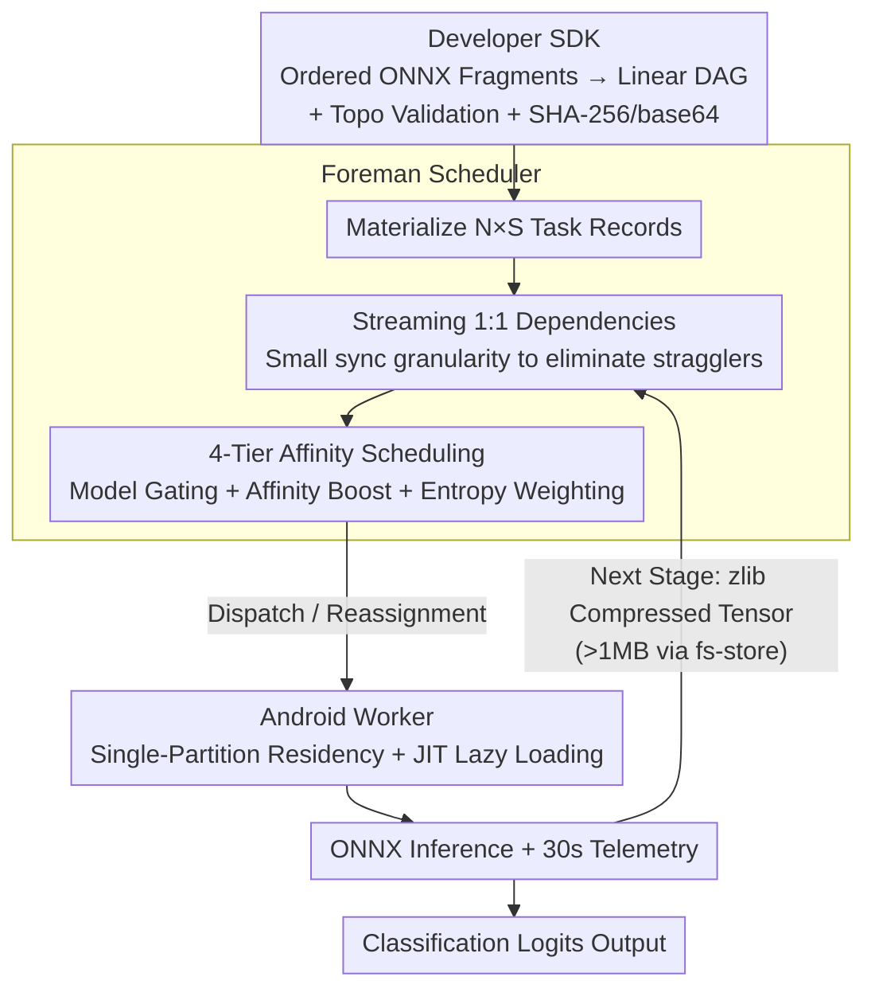

# Memory-Efficient Partitioned DNN Inference on Resource-Constrained Android Crowds

**Conference**: ICML 2026  
**arXiv**: [2605.20723](https://arxiv.org/abs/2605.20723)  
**Code**: Not disclosed (part of the DNN scheduling subsystem of the CROWDio framework)  
**Area**: Model Compression / Edge Deployment / Mobile Crowdsourced Inference  
**Keywords**: Memory-efficient inference, model partitioning, edge ML, ONNX, Android, pipeline scheduling  

## TL;DR
This paper details the "DNN Pipeline Scheduling Subsystem" within the CROWDio framework: without modifying the model itself (no pruning, quantization, or distillation), a complete ONNX model is partitioned stage-by-stage and distributed across multiple Android phones with RAM as low as 3.3–7.4 GB for pipeline inference. By integrating five mechanisms—**JIT lazy loading, single-partition residency constraint, 4-tier affinity scheduling, zlib-compressed tensor transfer, and streaming 1:1 dependencies**—the system constrains peak RSS on each device to $43\pm 2$ MB and accelerates batch latency by 34% compared to traditional barrier synchronization.

## Background & Motivation

**Background**: Running DNN inference on resource-constrained devices typically follows the **model reduction** path—quantization, pruning, knowledge distillation, and low-rank decomposition—to minimize the "per-parameter cost." This path assumes the model is still fully hosted by a single device. A complementary approach is **deployment-aware partitioning**: instead of reducing the model, layers are partitioned across multiple memory-constrained devices, allowing the collective memory of the group to "assemble" a complete model while ensuring no single device exceeds its RAM limit.

**Limitations of Prior Work**:
- Commercial Android phones often have only 3.3–7.4 GB of RAM, yet a "medium" Transformer like DistilBERT requires 2–4 GB just for the ONNX session, leaving almost no room for the OS and background processes.
- Quantization, pruning, and distillation require model modification, involving long deployment chains and sensitive performance impacts. Partitioning systems like SPINN and Neurosurgeon assume a "one mobile + one reliable cloud" split, failing in **volunteer crowdsourcing** scenarios with multi-stage partitioning, intermittent device connectivity, and heterogeneous RAM.
- Existing "intra-device layer offloading" (e.g., Melon) only addresses memory reuse on a single device rather than across a cluster; GPU-cluster designs like GPipe/PipeDream depend on stable networks and homogeneous hardware.

**Key Challenge**: In **heterogeneous, unstable, and extremely memory-constrained** Android crowds, executing full Transformer inference must simultaneously satisfy three conditions: (1) no single device's peak RSS can exceed its RAM budget; (2) network transfers across multiple pipeline stages must not saturate Wi-Fi channels; and (3) the scheduling system must reassign tasks during device churn without interrupting in-flight jobs. Failure in any of these leads to inference collapse.

**Goal**: To provide an engineering system capable of running DistilBERT (≈67M parameters, SST-2) on a cluster of Android phones with as little as 3.3 GB RAM without modifying model weights, while quantifying memory, latency, power consumption, and compression ratios.

**Key Insight**: Treat "memory pressure" as a first-class citizen in scheduling. Since a single device cannot hold the entire model, **the number of concurrently resident partitions is restricted to 1**, and the latency overhead of "on-demand loading" is amortized using JIT and affinity scheduling.

**Core Idea**: **Single-partition residency + JIT lazy loading** serves as the hard constraint for memory safety; the other four mechanisms (affinity scheduling, compressed transfer, streaming dependencies, and fault-tolerant reassignment) are designed to reduce latency and energy consumption to acceptable levels under this hard constraint.

## Method

### Overall Architecture

CROWDio solves the problem of how to assemble full Transformer inference across a group of Android phones that cannot individually store the model. It partitions a complete ONNX model into several fragments, assigns each device to handle one stage, and links them via a persistent WebSocket pipeline. The system consists of three layers: the **Developer SDK** takes ordered ONNX fragments to generate a linear DAG, performs topological validation, and base64-packages them with SHA-256 integrity checks; the **Foreman (Scheduler)** instantiates $N$ inputs × $S$ stages into $N\times S$ task records, maintains the dependency graph, dispatches work based on affinity, and handles reassignments; the **Android Worker** executes ONNX inference under the single-partition residency constraint, reporting CPU/RAM/battery/RTT/temperature telemetry every 30 seconds. The reference workload is DistilBERT-SST2, partitioned into three stages at the 3rd layer: `cell_a` (Embedding + Layers 0–2, smallest), `cell_b` (Layers 3–5, largest), and `cell_c` (Pre-classifier + Classifier).

### Key Designs

**1. JIT Lazy Loading + Single-Partition Residency Constraint: Capping Peak Memory**

The total ONNX session for DistilBERT requires 2–4 GB, which would starve the OS on a 3.3 GB RAM phone. Thus, memory capping is a prerequisite for deployment. Two mechanisms are overlaid: the smallest fragment, `cell_a`, is **eagerly broadcast** to all workers upon job arrival to ensure everyone can immediate start Stage 0; the larger fragments, `cell_b` and `cell_c`, use **JIT—downstream loading commands are issued only when an upstream task is actually completed**. Combined with a strict "one active ONNX session per worker" residency constraint, peak RSS is locked to the size of a single fragment, regardless of pipeline depth or overall model size. End-to-end correctness was verified by comparing chained ONNX Runtime outputs against PyTorch, with a max-abs error of $\approx 0$. Eagerly broadcasting the smallest and lazily loading the largest effectively pushes the heaviest memory load to the last possible moment, fitting exactly into the bottleneck of RAM-constrained scenarios.

**2. Streaming 1:1 Dependency Model: Reducing Sync Granularity to Eliminate Stragglers**

Volunteer phone performance varies significantly due to different SoCs, thermal throttling, and Wi-Fi signals. Traditional batch barriers—waiting for all Stage-$(k-1)$ tasks to finish before releasing Stage-$k$ (1:$N$ dependency)—inevitably cause the whole batch to be dragged down by the slowest device. CROWDio instead materializes $N\times S$ tasks and assigns each Stage-$k$ task a 1:1 dependency on its **identical input** from Stage-$(k-1)$ (see Task Table 1). Each input flows independently through the pipeline; fast devices can immediately pull their downstream tasks without waiting for slower ones. The overall latency is determined by the bottleneck input rather than the bottleneck batch. For a workload of $N=5, S=3$, this results in 15 independent tasks with zero inter-stage barriers. By porting PipeDream's micro-batching concept to heterogeneous mobile settings, the system gains a 34% speedup purely through synchronization granularity reduction.

**3. 4-Tier Affinity Scheduler: Amortizing Cold Start Costs**

Once memory is capped, the next bottleneck is model loading. Cold starts (downloading + ONNX initialization) take $48\pm 4$ s, whereas hot starts (model already in memory) take only $6\pm 1$ s. The scheduler's core logic is to send tasks to devices that already hold the required fragment. It wraps any base sorting algorithm (FIFO/EDAS/ARAS/MABAC) with two gates: **Model Gating** filters workers with the required partition in session memory; **Affinity Boosting** ranks candidates into 4 levels—Tier 1 Resident → Tier 2 Disk Cached → Tier 3 Idle/No Residency → Tier 4 Explicit Unload/Reload. Crucially, Tier 4 is not a constraint-free fallback; it triggers an explicit `UNLOAD_MODEL` → `LOAD_MODEL` sequence to maintain the **single-partition residency invariant**. Within the same Tier, workers are ranked using Shannon entropy-weighted heartbeat telemetry (CPU/RAM/battery/RTT/temp): metrics with high variance in the current pool dominate the sort. This MCCM approach makes Tier-1 hits the norm, reducing amortized cold starts from 48 s to 6 s.

**Additional Engineering Mechanisms.** Inter-stage tensor transfers use self-describing JSON (dtype/shape/compression/base64-zlib) for symmetric Python↔Kotlin serialization, achieving a $62\pm 4\%$ compression ratio for $[1,768]$ FP32 tensors (3072 → ≈1168 bytes). When a payload exceeds $\tau_{\text{ws}}=1$ MB, it is written to a shared file system with only a reference key passed via WebSocket to avoid saturating Wi-Fi channels. Fault recovery is handled by a dynamic topology planner that scores surviving workers to reassign in-flight tasks.

### Loss & Training

This is a system-focused paper and does not involve training: it utilizes off-the-shelf DistilBERT-SST2 pre-trained weights partitioned into three ONNX segments. End-to-end correctness is validated such that "Chained ONNX Output ≈ Full PyTorch Output." All tunable parameters are system-level—partition points, $\tau_{\text{ws}}$, affinity weights, and Tier boundaries.

## Key Experimental Results

### Main Results
5 heterogeneous Android phones (RAM 3.3–6 GB, Android 13–14, ONNX Runtime 1.17) ran the DistilBERT-SST2 pipeline ($N=5, S=3$) over local Wi-Fi. Metrics represent means and standard deviations over 10 independent runs. Comparison of CROWDio Streaming vs. CROWDio Barrier:

| Metric | Streaming | Barrier | Remarks |
|---|---|---|---|
| Peak RSS per Device | $43\pm 2$ MB | $43\pm 2$ MB | Residency constraint applied; much lower than 2–4 GB |
| End-to-End Batch Latency | $18.4\pm 1.1$ s | $27.9\pm 2.3$ s | Streaming is **34%** faster |
| Cold Start Loading | $48\pm 4$ s | $48\pm 4$ s | Includes segment download + session init |
| Hot Start Loading (Tier-2 hit)| $6\pm 1$ s | $6\pm 1$ s | Benefit of affinity scheduling |
| Battery Consumption | $50\pm 3$ mAh/run | $53\pm 4$ mAh/run | Streaming is slightly more efficient |
| Tensor Compression Ratio | $62\pm 4\%$ | – | $[1,768]$ FP32: 3072 → ≈1168 bytes |

### Ablation Study

| Dimension | Configuration | Conclusion |
|---|---|---|
| Streaming vs. Barrier | $N=5, S=3$ DistilBERT-SST2 | Streaming reduces latency by 34% |
| Residency Constraint | Enabled vs. Disabled | RSS locked at 43 MB vs. undeployable 2–4 GB |
| JIT Lazy Loading | Enabled vs. Eager Broadcast | JIT prevents large fragments from idling in memory |
| Affinity Tier-1 vs. Tier-4 | Hit Rate | Tier-1/2 hits reduce loading latency from 48s to 6s |
| Compressed Transfer | vs. Raw | $62\pm 4\%$ compression; auto-fallback to fs-store for >1MB |
| Minimum RAM Device | 3.3 GB Device | Stabilized participation; standalone inference impossible |

### Key Findings
- **The single-partition residency constraint is the watershed for deployment**: Without it, a 3.3 GB RAM device cannot host DistilBERT. With it, peak RSS remains steady at 43 MB across all devices. System constraints can be more decisive than algorithmic optimizations.
- **The 34% speedup from streaming 1:1 dependencies is a "free lunch"**: It achieves significant acceleration in heterogeneous clusters without model changes or extra memory by simply reducing synchronization granularity.
- **Affinity scheduling reduces amortized cold starts from 48 s to 6 s**: Tier-1/2 hits prove that "where a model is placed" is the core problem of edge deployment, often more critical than traditional CPU/RAM-only scheduling.
- **Compression + File System Fallback** prevents Wi-Fi saturation: The dual-path design (62% compression and threshold-based storage) is critical for moving from "theoretical operation" to "field-ready" stability.

## Highlights & Insights
- **"Deployment-aware partitioning" as the fourth leg of ML compression**: The paper positions partitioning alongside pruning, quantization, and distillation, emphasizing that they are **orthogonal and stackable**.
- **Engineering Aesthetics of "Hard Constraints + Soft Optimization"**: Single-residency and JIT are non-negotiable hard constraints for stability, while affinity and streaming are soft optimizations for performance. This tiered design ensures the system works in the worst case and excels in the best.
- **Entropy Weighting + Two-Stage Dispatch**: Using Shannon entropy to dynamically weight telemetry metrics allows high-variance metrics to drive sorting while neutralizing uniform metrics.
- **Strategic JIT for Largest Partitions**: Eagerly broadcasting the smallest fragment while lazily loading the largest is a subtle but sophisticated design choice that targets the specific bottleneck of RAM-limited environments.

## Limitations & Future Work
- **Single-partition residency is conservative for high-RAM devices**: Phones with >6 GB RAM could host multiple partitions while remaining safe; the paper suggests "memory-adaptive multi-partition residency" as a future extension.
- **48 s cold start is still painful for latency-sensitive apps**: While Tier-2 hits reduce this to 6 s, the initial cost remains high. Aggressive pre-fetching based on arrival patterns could be explored.
- **Linear chain topology only**: Branching/merging structures require explicit DAG definitions from the developer. Automatic planning for MoE or ResNet skip-connections is currently unsupported.
- **Evaluation limited to DistilBERT-SST2**: The 67M parameter model is "medium-sized." It remains to be seen if BERT-large or LLaMA-class models can be squeezed into 3.3 GB devices if a single partition itself exceeds the baseline memory limit.
- **Lack of Long-term Power Models**: The reported 50 mAh/run is a snapshot; the impact of thermal throttling and battery degradation over sustained operation is not modeled.

## Related Work & Insights
- **vs. Melon (MobiSys 2022)**: Melon performs intra-device offloading to reuse single-machine memory; CROWDio's JIT extends this to clusters, moving from "memory reuse" to "memory sharing."
- **vs. SPINN / Neurosurgeon**: These focus on binary "mobile-cloud" splits; CROWDio targets cloudless volunteer groups requiring dynamic multi-stage scheduling.
- **vs. GPipe / PipeDream**: While the pipeline concept is shared, CROWDio adapts micro-batching to the high variance of mobile hardware via 1:1 dependency streaming.
- **vs. EdgePipe**: EdgePipe notes that affinity reduces inter-stage transfer by 43%; CROWDio formalizes this into 4 explicit Tiers including a mandatory "unload-reload" fallback.

## Rating
- Novelty: ⭐⭐⭐⭐ Systematic integration of JIT and affinity for crowdsourced DNN inference is high, though individual mechanisms have precedents.
- Experimental Thoroughness: ⭐⭐⭐ Strong real-world results but limited in model diversity and cluster scale.
- Writing Quality: ⭐⭐⭐⭐ Clear architecture and well-defined constraints; the data is well-presented.
- Value: ⭐⭐⭐⭐ Provides a practical, non-intrusive solution for running Transformers on RAM-starved Android devices.

<!-- RELATED:START -->

## Related Papers

- [\[ICML 2026\] EpiCache: Episodic KV Cache Management for Long-Term Conversation on Resource-Constrained Environments](epicache_episodic_kv_cache_management_for_long-term_conversation_on_resource-con.md)
- [\[ICML 2025\] FloE: On-the-Fly MoE Inference on Memory-constrained GPU](../../ICML2025/model_compression/floe_on-the-fly_moe_inference_on_memory-constrained_gpu.md)
- [\[ICML 2026\] Towards Resource-Efficient LLMs: End-to-End Energy Accounting of Distillation Pipelines](towards_resource-efficient_llms_end-to-end_energy_accounting_of_distillation_pip.md)
- [\[ICML 2026\] A Queueing-Theoretic Framework for Stability Analysis of LLM Inference with KV Cache Memory Constraints](a_queueing-theoretic_framework_for_stability_analysis_of_llm_inference_with_kv_c.md)
- [\[NeurIPS 2025\] KeyDiff: Key Similarity-Based KV Cache Eviction for Long-Context LLM Inference in Resource-Constrained Environments](../../NeurIPS2025/model_compression/keydiff_key_similarity-based_kv_cache_eviction_for_long-context_llm_inference_in.md)

<!-- RELATED:END -->
