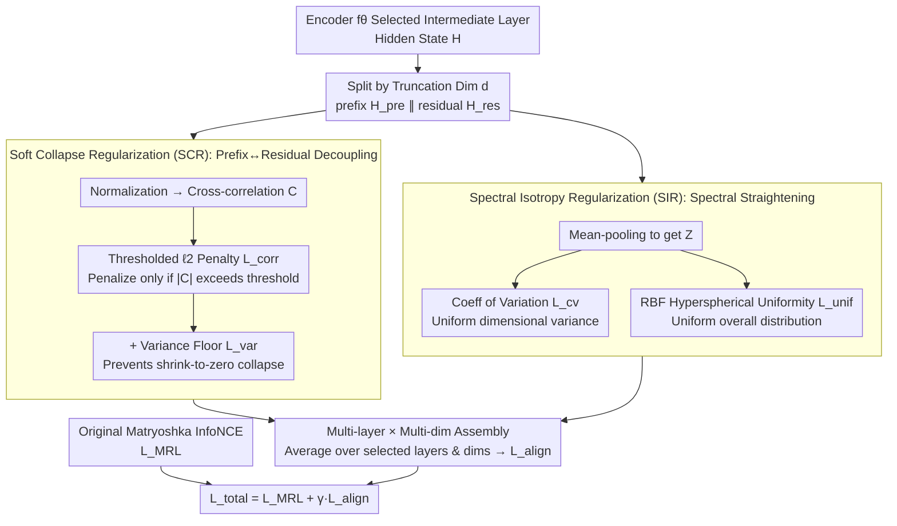

# MIC: Maximizing Informational Capacity in Adaptive Representations via Isotropic Subspace Alignment

**Conference**: ICML 2026  
**arXiv**: [2605.29987](https://arxiv.org/abs/2605.29987)  
**Code**: To be confirmed  
**Area**: Model Compression / Representation Learning / Matryoshka Embedding  
**Keywords**: Matryoshka Representation, Embedding Compression, Subspace Alignment, Spectral Isotropy, Self-distillation

## TL;DR
This paper proposes MIC, which adds two geometric regularizations—SCR (limiting correlation between prefix/residual subspaces) and SIR (enforcing uniform prefix variance + hyperspherical uniformity)—on top of Matryoshka Representation Learning (MRL). This ensures that the model maintains high discriminativeness even when truncated to extremely low dimensions (e.g., 16/32/64), on average surpassing baselines such as MRL and ESE.

## Background & Motivation

**Background**: Modern retrieval, semantic search, and clustering rely on dense embeddings. However, high-dimensional vectors are storage-heavy and computationally expensive, while low-dimensional vectors often lack sufficient representational capacity. Matryoshka Representation Learning (MRL, Kusupati 2022) addresses this by "nesting multiple low-dimensional sub-vectors within a single high-dimensional vector." By applying InfoNCE supervision simultaneously across multiple truncation dimensions $\mathcal{M}=\{m_1,\dots,m_k\}$, MRL allows a single model to be used at various resolutions.

**Limitations of Prior Work**: MRL only ensures that "truncation is functional" by calculating losses for each prefix, but it lacks mechanisms to constrain the geometric relationship between the prefix and the residual. Empirical observations show:
- **Subspace Redundancy**: Features learned by the prefix are highly correlated with the residual, where the cross-covariance $\boldsymbol{\Sigma}_{\mathrm{cross}}$ is non-zero, implying the prefix does not compress independent information.
- **Spectral Collapse / Anisotropy**: The prefix feature distribution degrades into a "narrow cone" (Ethayarajh 2019), where a few principal components dominate similarity, rendering other dimensions redundant.
- **Extreme Low-dimensional Crash**: Performance drops significantly when dimensions are reduced from 768 to 16, exceeding what information theory would predict for such a reduction.

**Key Challenge**: The multi-objective supervision in MRL optimizes for "usability" but **fails to constrain subspace geometry**. If the eigenvalues of the prefix covariance matrix decay too quickly or if it is strongly correlated with the residual, the **effective dimensionality** $\ll$ arithmetic dimensionality, leading to actual informational capacity far below the nominal 16/32/64.

**Goal**: To introduce geometric regularizations without modifying the MRL training framework to: (i) make the prefix and residual structurally "complementary rather than redundant," and (ii) ensure that prefix dimensions carry uniform variance while the total embedding is uniformly distributed on the hypersphere.

**Key Insight**: Borrow the "cross-correlation redundancy reduction" concept from Barlow Twins (Zbontar et al. 2021). However, while Barlow Twins performs global decorrelation, this paper applies constraints to the **ordered, structured dependency** specifically between prefix $\leftrightarrow$ residual, combined with hyperspherical uniformity (Wang & Isola 2020) to address anisotropy.

**Core Idea**: Replace hard orthogonality constraints with a "soft + thresholded" cross-correlation penalty (SCR). Additionally, use a dual regularization of "coefficient of variation for dimensional variance + RBF hyperspherical uniformity" to straighten the prefix spectral properties (SIR). These are integrated into the MRL self-distillation objective.

## Method

### Overall Architecture

The backbone remains a standard Transformer encoder $f_\theta$, outputting hidden states $\mathbf{H}\in\mathbb{R}^{B\times L\times d_{\mathrm{full}}}$. Training follows the original Matryoshka InfoNCE $\mathcal{L}_{\mathrm{MRL}}$ (summing over the truncation set $\mathcal{M}$). MIC splits the hidden states at truncation point $d$ into prefix $\mathbf{H}_{\mathrm{pre}}\in\mathbb{R}^{B\times L\times d}$ and residual $\mathbf{H}_{\mathrm{res}}\in\mathbb{R}^{B\times L\times d_{\mathrm{res}}}$ ($d_{\mathrm{res}}=d_{\mathrm{full}}-d$). For each pair $(l,d)$, it computes two geometric regularizations $\mathcal{L}_{\mathrm{SCR}}^{(l,d)}$ and $\mathcal{L}_{\mathrm{SIR}}^{(l,d)}$, forming $\mathcal{L}_{\mathrm{align}}$. The final objective is $\mathcal{L}_{\mathrm{total}}=\mathcal{L}_{\mathrm{MRL}}+\gamma\mathcal{L}_{\mathrm{align}}$. Regularization is applied to selected intermediate layers $L_{\mathrm{align}}$—early layers lack semantic maturity, and late layers might interfere with the classification head. The data flow is illustrated below:

### Key Designs

**1. Soft Collapse Regularization (SCR): Decoupling prefix and residual without hard orthogonality**

MRL does not prevent the prefix and residual from redundantly encoding the same information. SCR addresses this by first performing mask-aware sequence-wise normalization on $\tilde{\mathbf{X}}_{\mathrm{pre}}$ and $\tilde{\mathbf{X}}_{\mathrm{res}}$. It then computes the token-wise cross-correlation $\mathbf{C}=\frac{1}{B}\sum_i\frac{1}{N_i}\sum_l \tilde{\mathbf{X}}_{\mathrm{pre},i,l}\tilde{\mathbf{X}}_{\mathrm{res},i,l}^\top\in\mathbb{R}^{d\times d_{\mathrm{res}}}$ and applies a **thresholded** $\ell_2$ **penalty**: $\mathcal{L}_{\mathrm{corr}}^{(d)}=\frac{1}{d\cdot d_{\mathrm{res}}}\sum_{u,v}\max(0,|C_{u,v}|-\tau_{\mathrm{corr}})^2$. The threshold $\tau_{\mathrm{corr}}$ allows for natural fluctuations, only penalizing "true redundancy." This is superior to hard orthogonality ($\mathbf{C}=\mathbf{0}$), which might remove meaningful shared context and reduce representational capacity. 

To prevent the model from trivializing the penalty by shrinking variances to zero, a **variance floor** is added: $\mathcal{L}_{\mathrm{var}}^{(d)}=\max(0,1-\bar\sigma_{\mathrm{pre}})+0.5\max(0,1-\bar\sigma_{\mathrm{res}})$. The total is $\mathcal{L}_{\mathrm{SCR}}^{(d)}=\mathcal{L}_{\mathrm{corr}}^{(d)}+\lambda_{\mathrm{var}}\mathcal{L}_{\mathrm{var}}^{(d)}$.

**2. Spectral Isotropy Regularization (SIR): Straightening the spectral distribution and spreading embeddings**

Low-dimensional performance often crashes due to spectral collapse, where a few components carry all the variance. SIR operates on mean-pooled prefix representations $\mathbf{Z}^{(d)}\in\mathbb{R}^{B\times d}$. The **coefficient of variation loss** $\mathcal{L}_{\mathrm{cv}}^{(d)}=\frac{\sqrt{\frac{1}{d}\sum_j(v_j-\bar v)^2}}{\bar v+\epsilon}$ forces the variance distribution across dimensions to be flat. The **hyperspherical uniformity loss** $\mathcal{L}_{\mathrm{unif}}^{(d)}$ uses an RBF kernel $K_{ij}=\exp(-2t(1-S_{ij}))$ on normalized embeddings to ensure they are spread evenly across the hypersphere. The combination is $\mathcal{L}_{\mathrm{SIR}}^{(d)}=\frac{1}{2}(\mathcal{L}_{\mathrm{cv}}^{(d)}+\mathcal{L}_{\mathrm{unif}}^{(d)})$.

**3. Multi-layer + Multi-truncation Assembly:**
Geometric alignment is applied to a set of intermediate layers $L_{\mathrm{align}}$ across all truncation dimensions $d\in\mathcal{D}$: $\mathcal{L}_{\mathrm{align}}=\frac{1}{|L_{\mathrm{align}}||\mathcal{D}|}\sum_{l\in L_{\mathrm{align}}}\sum_{d\in\mathcal{D}}(\mathcal{L}_{\mathrm{SCR}}^{(l,d)}+\mathcal{L}_{\mathrm{SIR}}^{(l,d)})$.

### Loss & Training
The final loss is $\mathcal{L}_{\mathrm{total}}=\mathcal{L}_{\mathrm{MRL}}+\gamma\mathcal{L}_{\mathrm{align}}$. The training process is identical to standard MRL, but with the additional SCR/SIR terms computed at each step. Backbones used include TinyBERT-6L, BERT-base, and BGE-M3.

## Key Experimental Results

### Main Results
Evaluated on over 15 datasets (Text Classification, NLI, STS). Truncation dimensions: $\{16, 32, 64, 128, 256, 512, 768\}$.

| Dataset | Dim | Unsup SimCSE | MRL | ESE | MIC | Gain vs. ESE |
|--------|------|--------------|-----|-----|-----|-------------|
| Banking77 | 16 | 35.92 | 46.39 | 47.01 | **59.45** | +12.44 |
| Banking77 | 32 | 54.23 | 64.90 | 63.63 | **75.71** | +12.08 |
| Banking77 | 64 | 67.78 | 76.84 | 76.24 | **83.05** | +6.81 |
| TweetEval | 16 | 48.85 | 55.96 | 47.27 | **56.13** | +8.86 |
| STS12 (OOD) | 16 | 47.88 | 55.13 | 51.34 | **60.86** | +9.52 |
| STS16 (OOD) | 16 | 50.78 | 54.78 | 59.67 | **63.76** | +4.09 |
| SciTail (OOD) | 16 | 68.15 | 67.45 | 69.14 | **73.09** | +3.95 |

Performance in high-dimensional zones (256+) is comparable to baselines, but **gains in low-dimensional zones (16/32/64) are highly significant** (typically +5 to +12 points).

### Ablation Study

| Configuration | Key Observation |
|------|---------|
| Full MIC (SCR + SIR) | Best low-dimensional performance. |
| w/o SCR | Prefix-residual redundancy increases, performance drops at low dims. |
| w/o SIR | Anisotropy returns, extreme low-dimensional crash. |
| w/o $\mathcal{L}_{\mathrm{var}}$ | Dimensions collapse due to "shrink-to-zero" effect. |
| Hard Orthogonality ($\tau_{\mathrm{corr}}=0$) | Capacity loss occurs; performance drops overall. |
| Last Layer Only | Gains at low dimensions largely disappear. |

### Key Findings
- **Higher Compression, Higher Gain**: The gap between MIC and baselines is largest at $d=16$, proving its efficacy against capacity loss at high compression ratios.
- **Consistency Across Backbones**: The same patterns were observed in TinyBERT-6L, BERT, and BGE-M3.
- **Strong OOD Performance**: Improvements on OOD datasets (STS12-16, SciTail) are often larger than ID improvements, suggesting better transferability.
- **Necessity of Variance Floor**: Without $\mathcal{L}_{\mathrm{var}}$, the model tricks the SCR penalty by compressing variance to zero.

## Highlights & Insights
- **Addressing "Nested Subspace Geometry" as a First-Order Problem**: Unlike previous works that stack new loss objectives, MIC diagnoses the root causes—redundancy, anisotropy, and spectral collapse—and treats each specifically.
- **Soft Threshold + Variance Floor**: This combination avoids the rigidity of hard orthogonality while preventing trivial solutions, a strategy applicable to other regularization tasks.
- **Hyperspherical + Variance Uniformity**: Combining CV loss with RBF uniformity addresses both individual dimension variance and overall distribution, providing a roadmap for low-dimensional dense embedding tasks.

## Limitations & Future Work
- Layer-to-truncation mapping is fixed and requires re-calibration for different architectures (e.g., LLMs).
- SIR handles all truncation dimensions with equal weight, even though lower dimensions are more vulnerable.
- Experimental scope is limited to text; the transferability to multimodal (VLM) or diffusion models remains to be explored.
- Training cost: Token-wise cross-correlation is $O(d\cdot d_{\mathrm{res}})$, which may be expensive for very large models.

## Related Work & Insights
- **vs MRL**: MRL only optimizes multiple objectives without geometric constraints; MIC adds subspace complementarity.
- **vs ESE (LI et al. 2025)**: ESE is a structural modification ("compress-and-express"); MIC is a pure regularization approach that is lighter to deploy.
- **vs Barlow Twins**: MIC adapts cross-correlation to the specific "nested subspace" structure with thresholding and variance floors.
- **vs Whitening**: Conventional whitening is a post-processing step; MIC internalizes isotropy into the training objective.

## Rating
- **Novelty**: ⭐⭐⭐⭐ The individual components are known, but the combination of "soft threshold + variance floor + nested subspaces" for MRL is novel and effective.
- **Experimental Thoroughness**: ⭐⭐⭐⭐ Broad testing across 15+ datasets and 3 backbones, though finer ablation of CV vs. RBF would be beneficial.
- **Writing Quality**: ⭐⭐⭐⭐ Clear narrative from diagnosis to regularization.
- **Value**: ⭐⭐⭐⭐ High practical value for dense retrieval services, where 16-dimensional embeddings can significantly save storage and bandwidth.

<!-- RELATED:START -->

## Related Papers

- [\[ICML 2026\] LLMs as Noisy Channels: A Shannon Perspective on Model Capacity and Scaling Laws](llms_as_noisy_channels_a_shannon_perspective_on_model_capacity_and_scaling_laws.md)
- [\[AAAI 2026\] Prototype-Based Semantic Consistency Alignment for Domain Adaptive Retrieval](../../AAAI2026/model_compression/prototype-based_semantic_consistency_alignment_for_domain_adaptive_retrieval.md)
- [\[ICML 2026\] Event2Vec: Processing Neuromorphic Events Directly by Representations in Vector Space](event2vec_processing_neuromorphic_events_directly_by_representations_in_vector_s.md)
- [\[ICML 2026\] ReSpinQuant: Efficient Layer-Wise LLM Quantization via Subspace Residual Rotation Approximation](respinquant_efficient_layer-wise_llm_quantization_via_subspace_residual_rotation.md)
- [\[ICML 2026\] Task-Driven Subspace Decomposition for Knowledge Sharing and Isolation in LoRA-based Continual Learning](task-driven_subspace_decomposition_for_knowledge_sharing_and_isolation_in_lora-b.md)

<!-- RELATED:END -->
