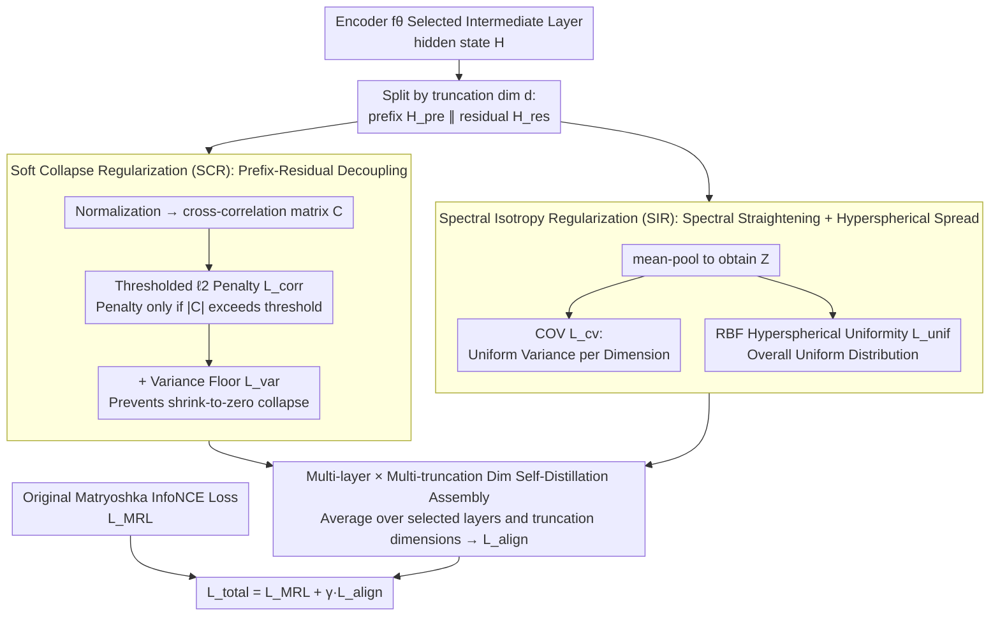

# MIC: Maximizing Informational Capacity in Adaptive Representations via Isotropic Subspace Alignment

**Conference**: ICML 2026  
**arXiv**: [2605.29987](https://arxiv.org/abs/2605.29987)  
**Code**: To be confirmed  
**Area**: Model Compression / Representation Learning / Matryoshka Embedding  
**Keywords**: Matryoshka Representations, Embedding Compression, Subspace Alignment, Spectral Isotropy, Self-Distillation

## TL;DR
This paper proposes MIC, which adds two geometric regularizations—SCR (limiting correlation between prefix/residual subspaces) and SIR (enforcing uniform variance for prefixes + hyperspherical uniformity)—on top of Matryoshka Representation Learning (MRL). This allows the model to maintain high discriminativeness even when truncated to extremely low dimensions such as 16/32/64, on average surpassing baselines like MRL and ESE.

## Background & Motivation

**Background**: Modern retrieval, semantic search, and clustering utilize dense embeddings. However, high-dimensional vectors are storage-intensive and computationally expensive, while low-dimensional vectors suffer from poor expressiveness. Matryoshka Representation Learning (MRL, Kusupati 2022) proposed "nesting multiple low-dimensional sub-vectors within a single high-dimensional vector," using InfoNCE for simultaneous supervision across multiple truncation dimensions $\mathcal{M}=\{m_1,\dots,m_k\}$, enabling "adaptive truncation" during inference to use the same model at multiple resolutions.

**Limitations of Prior Work**: MRL only ensures that "truncation is functional"—meaning each prefix dimension can compute a loss—but lacks any mechanism to constrain the geometric relationship between the prefix and the residual. Empirical tests show:
- **Subspace Redundancy**: Features learned by the prefix are highly correlated with the residual, where the cross-covariance $\boldsymbol{\Sigma}_{\mathrm{cross}}$ is non-zero, implying that low-dimensional prefixes do not compress independent information.
- **Spectral Collapse / Anisotropy**: The feature distribution of the prefix degenerates into a narrow cone (Ethayarajh 2019), where a few principal components dominate similarity, rendering the remaining dimensions redundant.
- **Performance Collapse at Extremely Low Dimensions**: Performance drops off a cliff when the dimension is reduced from 768 to 16, far exceeding the expected loss for an information-theoretic reduction of $\log$ times the dimensionality.

**Key Challenge**: The multi-objective supervision of MRL only optimizes for "usability" but **does not constrain subspace geometry**. If the eigenvalues of the prefix covariance matrix decay too quickly or are strongly correlated with the residual, the **effective dimensionality** $\ll$ arithmetic dimensionality, and the actual informational capacity is far lower than the nominal 16/32/64.

**Goal**: To implement geometric regularization without altering the MRL training framework to achieve two objectives: (i) making prefix and residual "complementary rather than redundant" in structure, and (ii) ensuring uniform variance across prefix dimensions and uniform overall distribution on the hypersphere.

**Key Insight**: Borrowing from the "cross-correlation de-redundancy" approach of Barlow Twins (Zbontar et al. 2021), but noting that Barlow Twins only performs global decorrelation and ignores the specific "nested subspace" structure of MRL. Ours applies constraints to the **ordered, structured dependency** between prefix and residual, combined with hyperspherical uniformity (Wang & Isola 2020) to address anisotropy.

**Core Idea**: Replace hard orthogonality constraints with a "soft + thresholded" cross-correlation penalty (SCR), and use a "coefficient of variation for dimensional variance + RBF hyperspherical uniformity" dual regularization to straighten the spectral properties (SIR) of the prefix, all integrated into the MRL self-distillation objective.

## Method

### Overall Architecture

The backbone remains a standard Transformer encoder $f_\theta$, outputting hidden states $\mathbf{H}\in\mathbb{R}^{B\times L\times d_{\mathrm{full}}}$. During training, the original Matryoshka InfoNCE $\mathcal{L}_{\mathrm{MRL}}$ (summed over all dimensions in the truncation set $\mathcal{M}$) is used as usual. The primary modifications in MIC are: layer-by-layer and dimension-by-dimension, the hidden state is partitioned at truncation point $d$ into prefix $\mathbf{H}_{\mathrm{pre}}\in\mathbb{R}^{B\times L\times d}$ and residual $\mathbf{H}_{\mathrm{res}}\in\mathbb{R}^{B\times L\times d_{\mathrm{res}}}$ ($d_{\mathrm{res}}=d_{\mathrm{full}}-d$). For each pair $(l,d)$, two geometric regularizations $\mathcal{L}_{\mathrm{SCR}}^{(l,d)}$ and $\mathcal{L}_{\mathrm{SIR}}^{(l,d)}$ are calculated to form $\mathcal{L}_{\mathrm{align}}$. The final training objective is $\mathcal{L}_{\mathrm{total}}=\mathcal{L}_{\mathrm{MRL}}+\gamma\mathcal{L}_{\mathrm{align}}$. Regularization is only applied to selected intermediate layers $L_{\mathrm{align}}$ rather than every layer—early layers lack semantic maturity, while late layers might interfere with the final classification head; Appendix D provides layer selection experiments. The data flow is illustrated below: after prefix/residual splitting, SCR handles "subspace decoupling" while SIR handles "spectral straightening," before aggregating across layers/dimensions and adding to the original MRL loss.

### Key Designs

**1. Soft Collapse Regularization (SCR): Decoupling Prefix and Residual without Compulsory Orthogonality**

MRL ensures each prefix can compute a loss but ignores whether the prefix and residual repeatedly encode the same information. Empirically, non-zero cross-covariance suggests low-dimensional prefixes do not compress independent information. SCR targets this correlation structure: first performing mask-aware sequence-wise normalization (calculating mean and variance per batch element based on effective length $N_i=\sum_l M_{i,l}$) to obtain $\tilde{\mathbf{X}}_{\mathrm{pre}}$ and $\tilde{\mathbf{X}}_{\mathrm{res}}$, then calculating token-wise cross-correlation $\mathbf{C}=\frac{1}{B}\sum_i\frac{1}{N_i}\sum_l \tilde{\mathbf{X}}_{\mathrm{pre},i,l}\tilde{\mathbf{X}}_{\mathrm{res},i,l}^\top\in\mathbb{R}^{d\times d_{\mathrm{res}}}$. Finally, a **thresholded** $\ell_2$ **penalty** is applied: $\mathcal{L}_{\mathrm{corr}}^{(d)}=\frac{1}{d\cdot d_{\mathrm{res}}}\sum_{u,v}\max(0,|C_{u,v}|-\tau_{\mathrm{corr}})^2$. The value $\tau_{\mathrm{corr}}$ is crucial: correlations below the tolerance threshold are treated as normal fluctuations and are not penalized. Only "true redundancy" that crosses the threshold is suppressed—this is more sophisticated than hard orthogonality $\mathbf{C}=\mathbf{0}$, which might delete meaningful shared overlaps, causing significant loss in expressiveness.

However, penalizing correlation alone has a numerical trap: the model can suppress both prefix and residual variances toward zero, making $\mathbf{C}$ look small. To prevent this, SCR adds a **variance floor** $\mathcal{L}_{\mathrm{var}}^{(d)}=\max(0,1-\bar\sigma_{\mathrm{pre}})+0.5\max(0,1-\bar\sigma_{\mathrm{res}})$ to keep the standard deviation of each dimension near 1. The residual term is weighted at 0.5 to prioritize prefix stability. Combined, they form $\mathcal{L}_{\mathrm{SCR}}^{(d)}=\mathcal{L}_{\mathrm{corr}}^{(d)}+\lambda_{\mathrm{var}}\mathcal{L}_{\mathrm{var}}^{(d)}$.

**2. Spectral Isotropy Regularization (SIR): Straightening Spectral Distribution and Spreading Embeddings on the Hypersphere**

Another reason for performance collapse in low-dimensional prefixes is spectral collapse and anisotropy—where a few principal components account for most variance, while remaining dimensions are negligible. SIR uses mean-pooled prefix representations $\mathbf{Z}^{(d)}\in\mathbb{R}^{B\times d}$ from two perspectives. The first is the **Coefficient of Variation (CV) loss**: calculating variance per dimension $v_j=\frac{1}{B}\sum_i (Z_{i,j}^{(d)}-\mu_j)^2$ and the mean variance $\bar v=\frac{1}{d}\sum_j v_j$, defined as $\mathcal{L}_{\mathrm{cv}}^{(d)}=\frac{\sqrt{\frac{1}{d}\sum_j(v_j-\bar v)^2}}{\bar v+\epsilon}$. A flatter variance distribution results in a smaller value. The second is the **hyperspherical uniformity loss**: row-normalizing $\mathbf{Z}^{(d)}$ to obtain $\hat{\mathbf{Z}}^{(d)}$ and calculating the cosine similarity matrix $\mathbf{S}$. Utilizing $\|\hat{\mathbf{z}}_i-\hat{\mathbf{z}}_j\|_2^2=2(1-S_{ij})$, an RBF kernel $K_{ij}=\exp(-2t(1-S_{ij}))$ ($t=2.0$) is constructed, defining $\mathcal{L}_{\mathrm{unif}}^{(d)}=\log\big(\frac{1}{B(B-1)}(\mathbf{1}^\top\mathbf{K}\mathbf{1}-\mathrm{Tr}(\mathbf{K}))+\epsilon\big)$.

**3. Multi-layer + Multi-truncation Dim Self-Distillation Assembly**

Representation geometry is not solely formed at the final layer—seeds of spectral dominance and inter-dimension correlation are sown in shallow layers. MIC applies regularization across a set of controlled intermediate layers $L_{\mathrm{align}}$ and averages across all truncation dimensions $d\in\mathcal{D}$: $\mathcal{L}_{\mathrm{align}}=\frac{1}{|L_{\mathrm{align}}||\mathcal{D}|}\sum_{l\in L_{\mathrm{align}}}\sum_{d\in\mathcal{D}}(\mathcal{L}_{\mathrm{SCR}}^{(l,d)}+\mathcal{L}_{\mathrm{SIR}}^{(l,d)})$. This process is self-distillatory: the same backbone is used, and each hidden state is subjected to both MRL supervision after pooling and direct geometric constraints via SCR/SIR, without introducing extra networks.

### Loss & Training

The final loss is $\mathcal{L}_{\mathrm{total}}=\mathcal{L}_{\mathrm{MRL}}+\gamma\mathcal{L}_{\mathrm{align}}$. The training process is identical to the original MRL (shared backbone, computing InfoNCE for all $m\in\mathcal{M}$ in one batch), with SCR/SIR regularization calculated at each step. Backbones tested include TinyBERT-6L, BERT-base, and BGE-M3.

## Key Experimental Results

### Main Results

Tasks span Text Classification, NLI, and STS across 15+ datasets, with truncation dimensions $\{16, 32, 64, 128, 256, 512, 768\}$. Representative results for the BERT backbone in low-dimensional regions follow:

| Dataset | Dimension | Unsup SimCSE | MRL | ESE | MIC | Gain vs ESE |
|---------|-----------|--------------|-----|-----|-----|-------------|
| Banking77 | 16 | 35.92 | 46.39 | 47.01 | **59.45** | +12.44 |
| Banking77 | 32 | 54.23 | 64.90 | 63.63 | **75.71** | +12.08 |
| Banking77 | 64 | 67.78 | 76.84 | 76.24 | **83.05** | +6.81 |
| TweetEval | 16 | 48.85 | 55.96 | 47.27 | **56.13** | +8.86 |
| STS12 (OOD) | 16 | 47.88 | 55.13 | 51.34 | **60.86** | +9.52 |
| STS16 (OOD) | 16 | 50.78 | 54.78 | 59.67 | **63.76** | +4.09 |
| SciTail (OOD) | 16 | 68.15 | 67.45 | 69.14 | **73.09** | +3.95 |

In high-dimensional regions (256/512/768), MIC is on par with or slightly ahead of baselines. However, **the improvements in low-dimensional regions (16/32/64) are extremely significant** (typically +5 to +12 points).

### Ablation Study

| Configuration | Key Finding |
|---------------|-------------|
| Full MIC (SCR + SIR) | Optimal low-dimensional performance. |
| w/o SCR | Prefix-residual redundancy increases; performance drops in low dimensions. |
| w/o SIR | Anisotropy returns; collapse at ultra-low dimensions. |
| w/o $\mathcal{L}_{\mathrm{var}}$ | "Shrink to zero" occurs; dimensional collapse. |
| Hard Orthogonality ($\tau_{\mathrm{corr}}=0$) | Expressiveness damaged; overall performance drop. |
| SCR/SIR only at last layer | Most low-dimensional gains disappear. |

### Key Findings

- **Higher Compression, Higher Gain**: The gap between MIC and baselines is largest at $d=16$ and nearly vanishes at $d=768$, indicating SCR/SIR effectively addresses "capacity loss at high compression."
- **Consistency across Backbones**: Patterns are consistent across TinyBERT-6L, BERT, and BGE-M3.
- **Strong OOD Performance**: Improvements on OOD datasets (STS12-16, SciTail) are $\ge$ ID improvements, suggesting geometric alignment improves transferability.
- **Variance Floor is Critical**: Removing $\mathcal{L}_{\mathrm{var}}$ allows the model to "cheat" SCR by crushing variance to zero.

## Highlights & Insights

- **Nested Subspace Geometry as a First-Order Problem**: While most research since MRL has focused on stacking new multi-objective losses, ours diagnoses "why low-dimensional segments collapse," identifying "redundancy + anisotropy + spectral collapse" as the root causes.
- **Soft Threshold + Variance Floor Combination**: The threshold handles the strictness of hard orthogonality, while the variance floor prevents trivial solutions.
- **Hyperspherical + Dimensional Variance Uniformity**: Combining CV loss and RBF uniformity loss addresses anisotropy from both "per-dimension variance" and "global distribution" angles.

## Limitations & Future Work

- Layer-to-truncation-dimension mapping is fixed and requires recalibration for different backbone depths/configurations.
- SIR treats all truncation dimensions with equal weight, whereas low dimensions might require more "care."
- Experiments are restricted to text tasks; multi-modal or generative scenarios (e.g., Diffusion, VLM) remain for future work.
- Training cost: Computing SCR/SIR across $|\mathcal{D}|$ dimensions per layer adds overhead; token-wise cross-correlation is $O(d\cdot d_{\mathrm{res}})$.

## Related Work & Insights
- **vs MRL (Kusupati et al. 2022)**: MRL only stacks InfoNCE without geometric constraints; MIC adds "subspace complementarity + spectral uniformity."
- **vs ESE (Li et al. 2025)**: ESE uses a "new structure" approach via compress-and-express modules; MIC adds only regularization, making it lighter for deployment.
- **vs Barlow Twins (Zbontar et al. 2021)**: BT uses global cross-correlation; MIC localizes this to "nested subspaces" and introduces thresholding with variance floors.
- **vs Whitening/Post-processing**: MIC internalizes "isotropy" into the training objective, removing the need for post-processing.

## Rating
- Novelty: ⭐⭐⭐⭐ While individual components aren't new, the combination of "soft threshold + variance floor + nested subspaces" is specifically tailored for MRL.
- Experimental Thoroughness: ⭐⭐⭐⭐ Extensive grid search across 15+ datasets and 3 backbones.
- Writing Quality: ⭐⭐⭐⭐ Clear narrative: "Diagnosis → Regularization → Anti-degeneration."
- Value: ⭐⭐⭐⭐ Highly valuable for practitioners deploying dense retrieval services, direct gains of 5-12 points allow for smaller storage/bandwidth.

<!-- RELATED:START -->

## Related Papers

- [\[ICLR 2026\] MASS: MoErging through Adaptive Subspace Selection](../../ICLR2026/model_compression/mass_moerging_through_adaptive_subspace_selection.md)
- [\[ICML 2026\] LLMs as Noisy Channels: A Shannon Perspective on Model Capacity and Scaling Laws](llms_as_noisy_channels_a_shannon_perspective_on_model_capacity_and_scaling_laws.md)
- [\[ICML 2026\] Event2Vec: Processing Neuromorphic Events Directly by Representations in Vector Space](event2vec_processing_neuromorphic_events_directly_by_representations_in_vector_s.md)
- [\[AAAI 2026\] Prototype-Based Semantic Consistency Alignment for Domain Adaptive Retrieval](../../AAAI2026/model_compression/prototype-based_semantic_consistency_alignment_for_domain_adaptive_retrieval.md)
- [\[CVPR 2026\] UniComp: Rethinking Video Compression Through Informational Uniqueness](../../CVPR2026/model_compression/unicomp_rethinking_video_compression_through_informational_uniqueness.md)

<!-- RELATED:END -->
