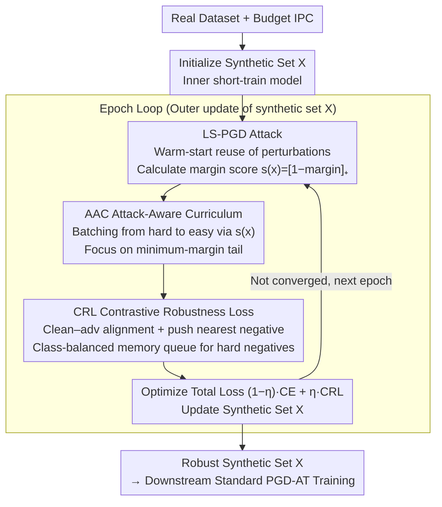

# Mind Your Margin and Boundary: Are Your Distilled Datasets Truly Robust?

**Conference**: ICML 2026  
**arXiv**: [2605.20606](https://arxiv.org/abs/2605.20606)  
**Code**: https://github.com/SLGSP/CCR  
**Area**: Model Compression / Dataset Distillation / Adversarial Robustness  
**Keywords**: Dataset Distillation, Robust Distillation, Adversarial Curriculum, Robust Margin, Contrastive Learning

## TL;DR
This paper proposes the C2R framework, which reframes the robustness issue in dataset distillation as a "minimum robust margin" problem. By utilizing a triad of "Attack-Aware Curriculum (AAC) + Contrastive Robustness Loss (CRL) + Line-Search PGD (LS-PGD)," models trained on the resulting synthetic sets achieve approximately 2.8% higher average robust accuracy across six types of attacks compared to previous robust distillation SOTAs.

## Background & Motivation

**Background**: Dataset Distillation (DD) compresses a large training set into a few dozen to thousands of synthetic samples, allowing small models trained on the synthetic set to approach the accuracy of full-data training. Mainstream approaches include gradient matching, trajectory matching (MTT), distribution matching, generative distillation, and decoupled methods like SRe2L/D4M. Most methods only optimize for clean accuracy, with adversarial robustness rarely entering the objective function.

**Limitations of Prior Work**: When distilled data is used in security-sensitive scenarios, attacks such as PGD, CW, VMI, and Jitter can easily compromise the models. Existing "robust distillation" works (e.g., curvature regularization in GUARD, information bottleneck alignment in ROME, NTK meta-learning by Tsilivis et al.) improve robustness but suffer from a **poor accuracy–robustness trade-off**: clean accuracy drops significantly, or robustness collapses under strong attacks.

**Key Challenge**: The authors identify two structural vulnerabilities in existing methods: (i) **Margin Mismatch**: Robust risk is dominated by a small subset of samples with the "minimum robust margin" (Schmidt et al. 2018), yet current methods treat all adversarial counterparts equally, diluting the optimization budget on many "already robust" easy points; (ii) **Boundary Neglect**: Popular "class-mean alignment" $\mathcal{L}_{\mathrm{rob}}=\sum_c \|\mathbb{E}[e(x_c)]-\mathbb{E}[e(\tilde x_c)]\|_2^2$ only seeks global intra-class similarity without explicitly increasing inter-class distance near decision boundaries, where adversarial errors occur.

**Goal**: Design a robust distillation objective that can (a) concentrate optimization on adversarial samples with the "minimum margin," (b) explicitly expand the class separation near decision boundaries, and (c) prevent distillation costs from exploding.

**Key Insight**: Starting from the robust hinge loss $\mathcal{L}_{\mathrm{hinge}}=\mathbb{E}[[1-\underline{m}(x;\theta)]_+]$, the authors prove that $\max_i v_i(\theta) = [1-\min_i \underline{m}(x_i;\theta)]_+$, meaning "improving the worst hinge loss = improving the minimum robust margin." This transforms the decision of "which sample to optimize" from a heuristic into a provable ranking.

**Core Idea**: Estimate the robust margin $\widehat{m}_{\mathrm{rob}}(x;\theta)=g_\theta(x+\delta_T)$ for each sample using PGD, and sequence the curriculum from hard to easy based on $s(x)=[1-\widehat{m}_{\mathrm{rob}}]_+$. This is coupled with instance-level supervised contrast to force "clean–adv intra-class closeness and nearest inter-class separation," while controlling costs via LS-PGD and class-balanced queues.

## Method

### Overall Architecture

C2R follows the standard bi-level structure of DD: the outer loop updates the synthetic set $X=\{(x_s,y_s)\}_{s=1}^N$, while the inner loop short-trains a model $f_\theta$ on $X$. The input is a real dataset and distillation budget IPC (images per class), and the output is a synthetic set $X$ optimized for robust training. Downstream, standard adversarial training (PGD-AT) is performed on $X$. Each epoch loop functions as follows: first, LS-PGD computes an adversarial counterpart $\tilde x=x+\delta$ for each synthetic sample $x$, deriving a robust margin score $s(x)=[1-\widehat{m}_{\mathrm{rob}}(x;\theta)]_+$ (higher values indicate proximity to the decision boundary). Then, batches are formed from hard to easy via AAC, concentrating the CRL optimization on the low-margin tail. Finally, the total objective $\mathcal{L}_{\mathrm{C^2R}}=(1-\eta)\mathcal{L}_{\mathrm{perf}}+\eta\mathcal{L}_{\mathrm{CRL}}$ is optimized, where clean CE maintains accuracy and CRL secures the boundaries, supported by a class-balanced memory queue to provide sufficient hard negatives while minimizing computation.

### Key Designs

**1. Attack-Aware Curriculum (AAC): Allocating update budget to the "Minimum Robust Margin" subset**

This targets "margin mismatch." Previous robust DD used class-mean alignment or averaged all adversarial samples, diluting optimization on easy points. AAC is justified by the identity $\arg\max_i [1-\underline{m}(x_i)]_+ = \arg\min_i \underline{m}(x_i)$: improving the worst hinge loss is equivalent to improving the minimum robust margin. In practice, PGD inner loops $\delta_{t+1}=\Pi_\Delta(\delta_t+\alpha\,\mathrm{sign}(\nabla_x\ell(f_\theta(x+\delta_t),y)))$ approximate the worst-case perturbation, with scores $s(x)=[1-g_\theta(x+\delta_T)]_+$ used to sort batches in descending order. This is effective because it directly incorporates the robust theory statistic (minimum margin) into the training loop.

**2. Contrastive Robustness Loss (CRL): Explicitly expanding class intervals near decision boundaries**

This targets "boundary neglect." Class-mean alignment $\|\mathbb{E}[e(x_c)]-\mathbb{E}[e(\tilde x_c)]\|^2$ only pursues intra-class invariance, failing to apply pressure to fragile sub-patterns near margins. CRL uses instance-level supervised contrast: for an anchor $x_i$, define the positive set $P(i)=\{\tilde x_i\}\cup\{x_j,\tilde x_j: y_j=y_i\}$ and candidate set $A(i)=P(i)\cup\{x_k,\tilde x_k: y_k\neq y_i\}$, with loss:

$$\mathcal{L}_{\mathrm{CRL}}=\frac{1}{M}\sum_i \Big[-\sum_{a\in P(i)} \frac{1}{|P(i)|}\log\frac{\exp(g_{i,a}/\tau)}{\sum_{b\in A(i)}\exp(g_{i,b}/\tau)}\Big],\quad g_{i,a}=\mathrm{sim}(e(x_i),e(a)).$$

The numerator aligns clean–adv pairs, while the denominator exerts maximum pressure on the most similar negatives (including their adv versions)—this $\max$ term directly corresponds to $\max_{k\neq y}f_k(x+\delta)$ in the robust margin formula. CRL thus aligns "adversarial geometry" with "contrastive learning" to push boundaries.

**3. LS-PGD + Class-Balanced Memory Queue: Scaling inner attacks and contrastive sampling**

LS-PGD uses warm-starts: caching the previous perturbation $\hat\delta(x)$; if the loss at $x+\hat\delta(x)$ has not decreased, it is reused. Otherwise, **one backward pass** computes the direction $v=\mathrm{sign}(\nabla_x \ell)$, followed by **pure forward passes** in a line search over a geometric sequence $\mathcal{S}=\{\alpha\beta^q\}_{q=0}^{Z-1}$ to find the optimal $\delta'$. This reduces $T$ backward passes to nearly 1 without losing attack strength. The memory queue maintains historical embeddings per class; a random projection $R\in\mathbb{R}^{r\times d}$ identifies top-$k$ hard negatives, reducing cost from $O(M^2)$ to $O(Mk)$ and solving the hardware-limited batch size issue for contrastive learning.

### Loss & Training

The outer objective is $\mathcal{L}_{\mathrm{C^2R}}=(1-\eta)\mathcal{L}_{\mathrm{perf}}+\eta\mathcal{L}_{\mathrm{CRL}}$, where $\eta\in[0,1]$ controls the robust/clean trade-off. AAC **does not introduce additional loss terms**; it simply reorders batch sampling to concentrate gradients. Downstream training on the distilled set uses standard PGD-AT with a perturbation budget of $|\varepsilon|=2/255$.

## Key Experimental Results

### Main Results

Evaluated across 3 datasets (CIFAR-10/100, Tiny-ImageNet) × 5 IPCs × 5 attacks (FGSM/PGD/CW/VMI/Jitter) plus 6 ImageNet-1K subsets. Representative results for IPC=10 are shown below:

| Dataset / Attack | IPC | SRe2L | D4M | ROME | C2R | Gain vs ROME |
|--------------|-----|-------|-----|------|-----|--------------|
| CIFAR-10 / PGD | 10 | 13.09 | 20.14 | 24.01 | 28.49 | **+4.37** |
| CIFAR-10 / VMI | 10 | 13.28 | 20.14 | ≈ROME | 28.49 | +4.37 |
| CIFAR-100 / PGD | 10 | 7.08 | 4.25 | 8.42 | 12.92 | **+2.82** |
| Tiny-ImageNet / PGD | 10 | 1.59 | 0.97 | 1.36 | 3.27 | +1.73 |
| CIFAR-10 / Clean | 10 | 37.53 | 48.16 | 47.94 | ~46–48 | Comparable |

Averaged across six attacks: **C2R achieves ~2.8% higher robust accuracy** than previous SOTA robust DD without significant clean accuracy degradation.

### Ablation Study

| Configuration | Key Observation | Description |
|------|---------|------|
| Full C2R | Best robust accuracy | AAC + CRL + LS-PGD |
| w/o AAC (uniform sampling) | Robust accuracy drops significantly | Validates "low-margin samples drive robust risk" |
| w/o CRL (Mean alignment) | Fragile at boundaries, collapses under strong attacks | Validates necessity of boundary-level separation |
| LS-PGD → Standard $T$-step PGD | Similar accuracy, higher memory/time | LS-PGD matches performance at lower cost |
| w/o memory queue | Insufficient hard negatives, CRL gain halved | Queue is essential for CRL scalability |

### Key Findings

- **Theory-Practice Alignment**: Removing AAC results in the largest robust accuracy drop, confirming the proposition that minimum margins dominate robust risk.
- **CRL > Class-Mean Alignment**: CRL wins across all IPCs, suggesting mean alignment is an under-fitted objective for boundary geometry.
- **Greater Gains at Small IPC**: C2R relative improvements are most significant at IPC=1, as fewer samples make margin optimization more critical.
- **Gap Widens under Strong Attacks**: The gap between C2R and baselines is larger for VMI/CW than FGSM, proving boundary regularization truly widens robust margins.

## Highlights & Insights

- **Translates robust distillation into a "minimum margin optimization" problem**, providing a computable proxy $s(x)=[1-\widehat{m}_{\mathrm{rob}}]_+$ to turn heuristics into provable rankings.
- **CRL explicitly encodes the robust margin formula $\max_{k\neq y}f_k(x+\delta)$ into the loss**: Hard negatives in the denominator directly map to the $\max$ term, making it more theoretically sound than class-mean alignment.
- **LS-PGD as an efficient engineering trick**: Warm-starts and forward probes maintain PGD strength while reducing inner costs to nearly one backward pass, applicable to any task requiring repeated inner-loop attacks.

## Limitations & Future Work

- Experiments focus on classification and small $\ell_\infty$ budgets ($\varepsilon=2/255$); performance under larger budgets, $\ell_2$ perturbations, or AutoAttack was not exhaustively explored.
- AAC scores depend on the current $\theta$; early-stage estimates of "minimum margin" may be unstable when the model is poorly trained.
- CRL depends on hyperparameters like queue capacity $Q$ and projection dimension $r$, which currently require manual tuning.
- While it includes a clean accuracy constraint, the paper does not explore if AAC logic can simultaneously improve hard samples for clean accuracy.

## Related Work & Insights
- **vs ROME (Information Bottleneck)**: ROME uses global distribution alignment; C2R shifts focus to "minimum margin + boundary geometry," proving more stable under strong attacks.
- **vs GUARD (Curvature Reg.)**: GUARD regularizes curvature; C2R achieves robustness via margin theory, offering clearer theoretical motivation.
- **vs Standard Robust Training (Madry et al.)**: Madry's AT targets per-sample worst-case; C2R targets per-dataset worst-case via curricula, fitting the extreme low-data regime of DD.
- **vs SupCon**: CRL is a natural extension of supervised contrast to adversarial geometry by including $\tilde x$ in positive sets and "nearest negatives" in the denominator.

## Rating
- Novelty: ⭐⭐⭐⭐ Successfully bundles "minimum robust margin" theory, curricula, and contrastive loss into a clean framework. 
- Experimental Thoroughness: ⭐⭐⭐⭐ Extensive coverage across datasets, IPCs, and attack types with theoretical validation via ablation.
- Writing Quality: ⭐⭐⭐⭐ Propositions 8/9 provide concise and accurate theoretical grounding for the curriculum.
- Value: ⭐⭐⭐⭐ Advancing robust DD is critical for deployment; +2.8% gain in high-compression regimes is significant.

<!-- RELATED:START -->

## Related Papers

- [\[NeurIPS 2025\] Graph Your Own Prompt](../../NeurIPS2025/model_compression/graph_your_own_prompt.md)
- [\[ICML 2026\] DIVER: Diving Deeper into Distilled Data via Expressive Semantic Recovery](diverdiving_deeper_into_distilled_data_via_expressive_semantic_recovery.md)
- [\[ICML 2026\] IDLM: Inverse-distilled Diffusion Language Models](idlm_inverse-distilled_diffusion_language_models.md)
- [\[ICML 2026\] ArcVQ-VAE: A Spherical Vector Quantization Framework with ArcCosine Additive Margin](arcvq-vae_a_spherical_vector_quantization_framework_with_arccosine_additive_marg.md)
- [\[ICML 2026\] Critique-Guided Distillation for Robust Reasoning via Refinement](critique-guided_distillation_for_robust_reasoning_via_refinement.md)

<!-- RELATED:END -->
