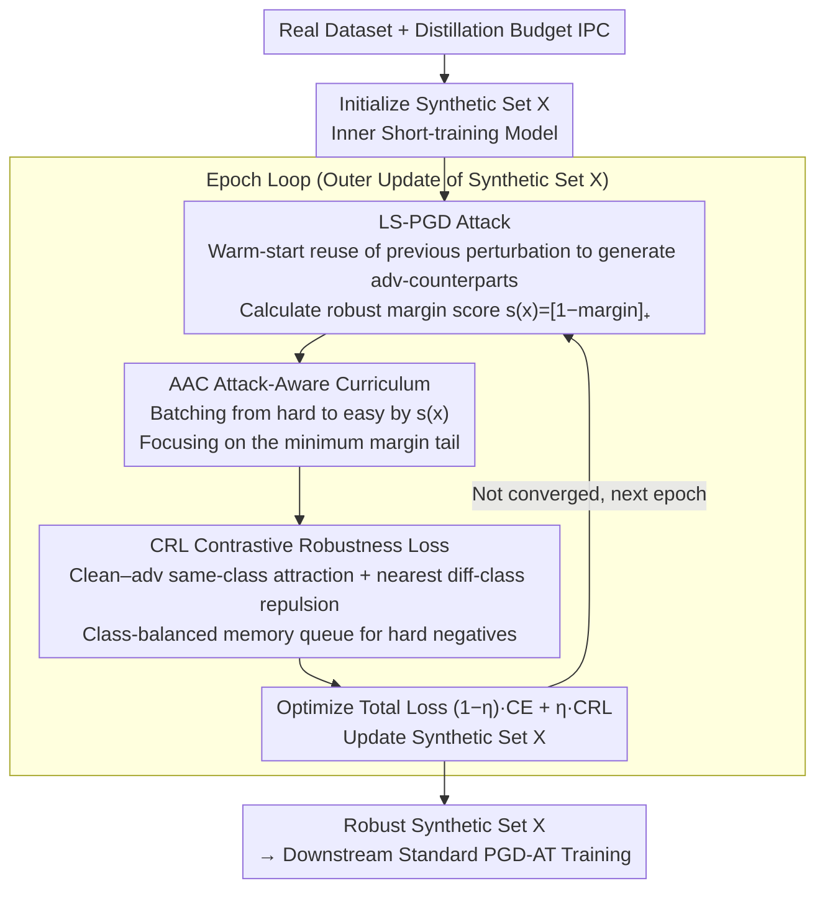

# Mind Your Margin and Boundary: Are Your Distilled Datasets Truly Robust?

**Conference**: ICML 2026  
**arXiv**: [2605.20606](https://arxiv.org/abs/2605.20606)  
**Code**: https://github.com/SLGSP/CCR  
**Area**: Model Compression / Dataset Distillation / Adversarial Robustness  
**Keywords**: Dataset Distillation, Robust Distillation, Adversarial Curriculum, Robust Margin, Contrastive Learning

## TL;DR
This paper proposes the C2R framework, which decomposes the robustness problem in dataset distillation into a "minimum robust margin" problem. By utilizing a "triad" of Attack-Aware Curriculum (AAC), Contrastive Robustness Loss (CRL), and Line Search PGD (LS-PGD), models trained on the synthetic sets achieve an average improvement of approximately 2.8% in robust accuracy across six types of attacks compared to previous robust distillation SOTA.

## Background & Motivation

**Background**: Dataset Distillation (DD) compresses a large training set into tens to thousands of synthetic samples, allowing small models trained on the synthetic set to approach the accuracy of those trained on the full dataset. Mainstream approaches include gradient matching, matching training trajectories (MTT), distribution matching, generative distillation, and decoupled methods like SRe2L/D4M. Most methods optimize only for clean accuracy, with adversarial robustness rarely entering the objective function.

**Limitations of Prior Work**: When distilled data is used in security-sensitive scenarios, attacks such as PGD/CW/VMI/Jitter can easily compromise the model. Existing "robust distillation" works (e.g., curvature regularization in GUARD, information bottleneck alignment in ROME, NTK meta-learning by Tsilivis et al.) improve robustness but suffer from a **poor accuracy–robustness trade-off**: clean accuracy drops too much, or they still collapse under strong attacks.

**Key Challenge**: The authors identify two structural vulnerabilities in existing methods—(i) **Margin Mismatch**: Robust risk is dominated by a small fraction of samples with the "minimum robust margin" (Schmidt et al. 2018), but existing methods treat all adversarial counterparts equally, diluting the optimization budget on many "already robust enough" easy points; (ii) **Boundary Neglect**: Popular "class-mean alignment" $\mathcal{L}_{\mathrm{rob}}=\sum_c \|\mathbb{E}[e(x_c)]-\mathbb{E}[e(\tilde x_c)]\|_2^2$ only pursues global intra-class similarity without explicitly widening inter-class distances near the decision boundary, where adversarial errors actually occur.

**Goal**: Design a robust distillation objective that can (a) concentrate optimization on adversarial samples with "minimum margin," (b) explicitly expand class margins near decision boundaries, and (c) avoid exploding distillation costs.

**Key Insight**: Starting from the robust hinge loss $\mathcal{L}_{\mathrm{hinge}}=\mathbb{E}[[1-\underline{m}(x;\theta)]_+]$, it is proven that $\max_i v_i(\theta) = [1-\min_i \underline{m}(x_i;\theta)]_+$, meaning "improving the worst hinge = improving the minimum robust margin." This transforms the question of "whom to optimize" from a heuristic into a provable ranking.

**Core Idea**: Use PGD to estimate the robust margin of each sample $\widehat{m}_{\mathrm{rob}}(x;\theta)=g_\theta(x+\delta_T)$, arrange a curriculum from hard to easy according to $s(x)=[1-\widehat{m}_{\mathrm{rob}}]_+$, and employ an instance-level supervised contrast to force "clean–adv intra-class attraction and nearest inter-class repulsion," while controlling costs via Line Search PGD and class-balanced queues.

## Method

### Overall Architecture

C2R follows the standard bi-level structure of DD: the outer loop updates the synthetic set $X=\{(x_s,y_s)\}_{s=1}^N$, and the inner loop short-trains a model $f_\theta$ on $X$. The input is the real dataset and a distillation budget IPC (images per class), and the output is a synthetic set $X$ optimized for robust training. Downstream, standard adversarial training (PGD-AT) is performed on $X$. The cycle of each epoch involves: first using LS-PGD to calculate an adversarial counterpart $\tilde x=x+\delta$ for each synthetic sample $x$ and determining the robust margin score $s(x)=[1-\widehat{m}_{\mathrm{rob}}(x;\theta)]_+$ (higher scores indicate proximity to the decision boundary); then organizing batches from hard to easy (AAC) to focus the Contrastive Robustness Loss (CRL) on the low-margin tail; finally optimizing $\mathcal{L}_{\mathrm{C^2R}}=(1-\eta)\mathcal{L}_{\mathrm{perf}}+\eta\mathcal{L}_{\mathrm{CRL}}$, where clean CE maintains accuracy and CRL protects the boundary, with a class-balanced memory queue providing sufficient hard negatives for CRL while suppressing computation.

### Key Designs

**1. Attack-Aware Curriculum (AAC): Allocating update budgets to samples with the "minimum robust margin"**

Specifically addressing "margin mismatch"—where previous robust DD diluted optimization across many easy points—AAC relies on the identity $\arg\max_i [1-\underline{m}(x_i)]_+ = \arg\min_i \underline{m}(x_i)$. Improving the worst hinge loss is equivalent to improving the minimum robust margin. Implementation-wise, an inner PGD loop $\delta_{t+1}=\Pi_\Delta(\delta_t+\alpha\,\mathrm{sign}(\nabla_x\ell(f_\theta(x+\delta_t),y)))$ approximates the worst-case perturbation, and the score is set as $s(x)=[1-g_\theta(x+\delta_T)]_+$. Batches are assembled by $s(x)$ in descending order each epoch. This is effective because it directly incorporates the decisive statistic (minimum margin) that determines robust risk in theory into the training loop.

**2. Contrastive Robustness Loss (CRL): Explicitly pushing class intervals near the decision boundary**

Addressing "boundary neglect"—where class-mean alignment $\|\mathbb{E}[e(x_c)]-\mathbb{E}[e(\tilde x_c)]\|^2$ lacks pressure on vulnerable sub-patterns near margins—CRL utilizes instance-level supervised contrast. For an anchor $x_i$, define the positive set $P(i)=\{\tilde x_i\}\cup\{x_j,\tilde x_j: y_j=y_i\}$ and candidate set $A(i)=P(i)\cup\{x_k,\tilde x_k: y_k\neq y_i\}$. The loss is:

$$\mathcal{L}_{\mathrm{CRL}}=\frac{1}{M}\sum_i \Big[-\sum_{a\in P(i)} \frac{1}{|P(i)|}\log\frac{\exp(g_{i,a}/\tau)}{\sum_{b\in A(i)}\exp(g_{i,b}/\tau)}\Big],\quad g_{i,a}=\mathrm{sim}(e(x_i),e(a)).$$

The numerator pulls "clean-adv same-class" pairs together, while the denominator applies maximum pressure to the most similar different classes (including their adv versions), which corresponds to the $\max_{k\neq y}f_k(x+\delta)$ term in robust margin formulas. CRL aligns the "adversarial geometry" with "contrastive learning," explicitly pushing the robust boundary.

**3. LS-PGD + Class-Balanced Memory Queue: Amortizing costs of inner attacks and full contrast**

The first two designs introduce high costs—AAC requires multi-step PGD, and a naive CRL is $O(M^2)$. LS-PGD utilizes warm-starts: caching the previous perturbation $\hat\delta(x)$. If the loss does not decrease at $x+\hat\delta(x)$, it is reused; otherwise, it calculates **one backward pass** to obtain direction $v=\mathrm{sign}(\nabla_x \ell)$, then performs a line search via **pure forward passes** on a geometric sequence $\mathcal{S}=\{\alpha\beta^q\}_{q=0}^{Z-1}$ ($Z\in\{2,3\}$). By starting from the "last optimal $\delta$," the $T$ backward passes are amortized to nearly 1 without decaying attack strength. The memory queue maintains a FIFO buffer of capacity $Q$ for each class. Using low-dimensional random projections $R\in\mathbb{R}^{r\times d}$, it filters the top-$k$ hard negatives, reducing CRL complexity from $O(M^2)$ to $O(Mk)$ and providing a steady supply of informative impostors.

### Loss & Training

The outer objective is $\mathcal{L}_{\mathrm{C^2R}}=(1-\eta)\mathcal{L}_{\mathrm{perf}}+\eta\mathcal{L}_{\mathrm{CRL}}$, where $\eta\in[0,1]$ controls the robust/clean trade-off. Note that AAC itself **does not introduce additional loss terms**; it only changes the batch sampling order to concentrate CRL gradients on the low-margin tail. Downstream training on the distilled set follows standard PGD adversarial training with a perturbation budget $|\varepsilon|=2/255$.

## Key Experimental Results

### Main Results

Evaluated across 3 foundation datasets (CIFAR-10/100, Tiny-ImageNet) × 5 IPC levels × 5 attack types (FGSM/PGD/CW/VMI/Jitter), plus 6 ImageNet-1K subsets. Representative results for IPC=10 are shown below:

| Dataset / Attack | IPC | SRe2L | D4M | ROME | C2R | Gain vs ROME |
|--------------|-----|-------|-----|------|-----|--------------|
| CIFAR-10 / PGD | 10 | 13.09 | 20.14 | 24.01 | 28.49 | **+4.37** |
| CIFAR-10 / VMI | 10 | 13.28 | 20.14 | ≈ROME | 28.49 | +4.37 |
| CIFAR-100 / PGD | 10 | 7.08 | 4.25 | 8.42 | 12.92 | **+2.82** |
| Tiny-ImageNet / PGD | 10 | 1.59 | 0.97 | 1.36 | 3.27 | +1.73 |
| CIFAR-10 / Clean | 10 | 37.53 | 48.16 | 47.94 | ~46–48 | On par with ROME |

Averaged across six attacks: **C2R is approximately 2.8% more robust than the previous best robust DD** without significantly sacrificing clean accuracy.

### Ablation Study

| Configuration | Key Observation | Explanation |
|------|---------|------|
| Full C2R | Best robust accuracy | AAC + CRL + LS-PGD |
| w/o AAC (uniform sampling) | Significant drop in robust accuracy | Validates "low-margin samples drive robust risk" prediction |
| w/o CRL (return to mean alignment) | Vulnerable near boundaries | Validates necessity of boundary-level class separation |
| LS-PGD → Standard $T$-step PGD | Similar accuracy, higher VRAM/Time | LS-PGD is efficient within fixed compute budgets |
| w/o memory queue | Insufficient hard negatives | Queue is necessary for CRL scalability |

### Key Findings

- **Theory-Empirical Consistency**: Disabling AAC leads to the largest loss in robust accuracy, matching the proposition that "min margin dominates robust risk."
- **CRL > Class-Mean Alignment**: CRL wins across all IPCs, suggesting class-mean alignment is an underfitting objective for boundary geometry.
- **Larger Gains at Small IPC**: Improvements are most significant at IPC=1/5, as each sample is more critical when the synthetic set is smaller.
- **Wider Gap under Strong Attacks**: The gap between C2R and baselines is larger under VMI/CW than FGSM, indicating boundary regularization truly widens the robust margin rather than just stopping weak attacks.

## Highlights & Insights

- **Translates robust distillation into a "minimum margin optimization" problem**, providing a computable proxy $s(x)=[1-\widehat{m}_{\mathrm{rob}}]_+$. This approach of "theory points to the worst sample, engineering provides the curriculum" is directly applicable to other robust training tasks.
- **CRL explicitly encodes the robust margin formula $\max_{k\neq y}f_k(x+\delta)$ into the loss**: The hard negatives in the denominator directly correspond to the $\max$ term, making it more theoretically sound than "class-mean alignment."
- **LS-PGD is a lightweight engineering trick**: Warm-starts and forward probes maintain PGD intensity while reducing inner costs to nearly 1 backward pass, useful for any method requiring repeated inner-loop attacks.

## Limitations & Future Work

- Experiments focus on classification with a small $\ell_\infty$ budget ($\varepsilon=2/255$); performance under larger budgets, $\ell_2$/general perturbations, or adaptive/AutoAttack is not systematically shown.
- AAC scores depend on the current $\theta$; early in distillation, $\theta$ is immature, and margin estimates may be unstable.
- CRL depends on hyperparameters for the memory queue (capacity $Q$, projection dimension $r$), which may require per-dataset tuning.
- While it includes a clean accuracy constraint, future work could explore if the AAC concept can simultaneously improve clean accuracy by targeting clean hard samples.

## Related Work & Insights
- **vs ROME (Information Bottleneck Alignment)**: ROME uses distribution alignment; C2R moves the focus down to "minimum margin + boundary geometry," proving more stable under strong attacks.
- **vs GUARD (Curvature Regularization)**: GUARD reduces adversarial sensitivity via curvature; C2R avoids explicit curvature constraints, using a margin-based perspective with clearer theoretical motivation.
- **vs Standard Robust Training (Madry et al.)**: Madry's AT is a "per-sample worst-case"; C2R elevates this to a "per-dataset worst-case" via curriculum-level selection of min-margin samples, which is better suited for the low-sample regime of DD.
- **vs SupCon (Khosla et al.)**: CRL is a natural extension of supervised contrast for adversarial geometry, explicitly including $\tilde x$ in the positive set and "nearest inter-class samples" in the negative set.

## Rating
- Novelty: ⭐⭐⭐⭐ Combines margin theory, curriculum, and contrastive loss into a clean framework. 
- Experimental Thoroughness: ⭐⭐⭐⭐ Coverage of multiple datasets, IPCs, and attacks with propositions validated by ablations.
- Writing Quality: ⭐⭐⭐⭐ Propositions 8/9 clearly explain the "why" behind the minimum margin.
- Value: ⭐⭐⭐⭐ Robust DD is a key bottleneck for deployment; +2.8% average gain is significant in high-compression scenarios.

<!-- RELATED:START -->

## Related Papers

- [\[ICML 2026\] DIVER: Diving Deeper into Distilled Data via Expressive Semantic Recovery](diverdiving_deeper_into_distilled_data_via_expressive_semantic_recovery.md)
- [\[NeurIPS 2025\] Graph Your Own Prompt](../../NeurIPS2025/model_compression/graph_your_own_prompt.md)
- [\[CVPR 2026\] How to Choose Your Teacher for Fine Grained Image Recognition](../../CVPR2026/model_compression/how_to_choose_your_teacher_for_fine_grained_image_recognition.md)
- [\[ICML 2026\] IDLM: Inverse-distilled Diffusion Language Models](idlm_inverse-distilled_diffusion_language_models.md)
- [\[ICML 2026\] ArcVQ-VAE: A Spherical Vector Quantization Framework with ArcCosine Additive Margin](arcvq-vae_a_spherical_vector_quantization_framework_with_arccosine_additive_marg.md)

<!-- RELATED:END -->
