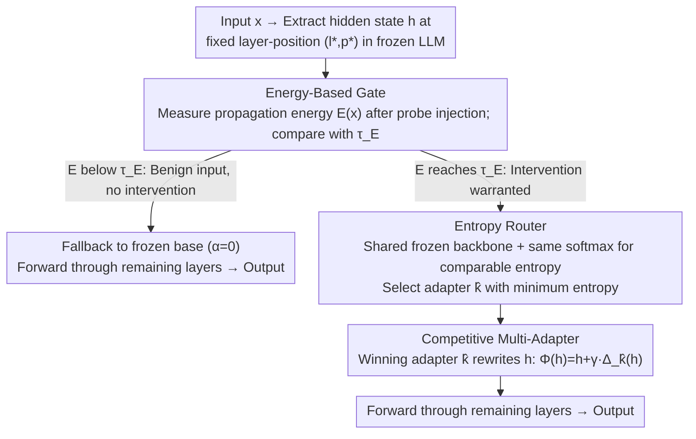

# Multi-Adapter Representation Interventions via Energy Calibration

**Conference**: ICML 2026  
**arXiv**: [2605.28722](https://arxiv.org/abs/2605.28722)  
**Code**: https://github.com/V1centNevwake/MARI  
**Area**: LLM Alignment / Representation Intervention  
**Keywords**: Representation Intervention, Multi-adapter routing, Energy gating, Truthfulness alignment, Inference-time editing  

## TL;DR
MARI identifies that existing "representation intervention" methods rely on a linear representation hypothesis—adding a single global steering vector to all inputs—which is unreliable because the optimal correction direction varies significantly across samples and can degrade general capabilities on benign inputs. It replaces the single adapter with multiple low-rank adapters and utilizes "competitive training + entropy routing" for sample-adaptive intervention. An independently trained low-rank probe calculates "propagation energy" for threshold gating to decide whether to enable intervention. This achieves a significant lead over ReFT in TruthfulQA/BBQ/Safety while maintaining or slightly improving MMLU/ARC scores.

## Background & Motivation

**Background**: Representation Intervention is one of the fastest-growing non-training paradigms in LLM alignment. It involves freezing model weights and modifying hidden states at specific layers and positions only during inference to guide model behavior toward being "more truthful," "safer," or "less biased." Activation Steering, CAA, ITI, and ReFT all follow this path, with the technical core being a global steering vector or a low-rank update $\Phi_\psi(\mathbf{h})=\mathbf{h}+\gamma s_\psi\Delta_\psi(\mathbf{h})$.

**Limitations of Prior Work**: All these methods assume the "Linear Representation Hypothesis"—that an attribute (e.g., truthfulness) corresponds to a fixed direction in the hidden space, making a single steering vector valid for all inputs. However, diagnostic tests conducted by the authors on TruthfulQA reveal that the required correction vector for each sample $\Delta(x)=a(x,y^\star)-a(x,\hat{y})$ shifts drastically in both magnitude and direction, with no consistent direction observed even when moving averages are taken along principal components.

**Key Challenge**: (i) A single static intervention cannot cover heterogeneous needs—some samples require pushing toward $+\mathbf{v}$ and others toward $-\mathbf{v}$, leading to conflicts when forced into an average. (ii) Even with the correct direction, applying intervention to benign inputs that "do not need correction" disturbs internal representations and degrades general capabilities like MMLU/ARC by several points.

**Goal**: (1) Enable intervention direction/intensity to vary by sample; (2) Provide a **label-free** criterion for "whether to intervene" to avoid over-intervention on benign inputs; (3) Ensure the mechanism does not require ground-truth access during inference and uses significantly fewer training parameters than full fine-tuning.

**Key Insight**: Replace the single adapter with a collection of multiple adapters and use hard routing during training to make them occupy different subspaces. During inference, the most confident adapter is selected via predictive entropy (parameter-free). An independently trained low-rank probe generates "propagation energy" for disturbances in subsequent layers, serving as a signal for whether the input deserves intervention.

**Core Idea**: Upgrade global linear intervention to piecewise-affine intervention using "multi-adapters + entropy routing." Use "probe propagation energy + threshold" as a sample-level trigger switch for label-free activation.

## Method

### Overall Architecture
MARI aims to make representation intervention sample-adaptive and capable of auto-deactivation on benign inputs without touching model weights. It inserts a set of intervention modules at a fixed layer-position $(l^\star,p^\star)$ of a frozen LLM $f_\theta$. During inference, an input passes through three stages: first, the hidden state $\mathbf{h}=\mathbf{h}^{(l^\star)}_{p^\star}(x)$ is extracted, and an independent probe calculates its "propagation energy" $E(x;\alpha_\text{probe})$. If the energy is below the threshold $\tau_E$, it is judged as "not requiring intervention," and the input follows the frozen base ($\alpha=0$). Inputs passing the gate select the most confident adapter among $K$ low-rank adapters based on predictive entropy. The winning adapter rewrites $\mathbf{h}$ with intensity $\alpha_\text{full}$, and subsequent layers proceed normally. Training occurs in two phases: first, $K$ adapters are trained using "hard routing, winner-takes-gradient" to occupy distinct subspaces, then a probe is independently trained with off-subspace regularization to align its perturbation direction with the intervention subspaces.

### Key Designs

**1. Competitive Multi-Adapter + Entropy Routing: Splitting the Global Vector into $K$ Segments**

Diagnostic experiments proved that the required correction vector $\Delta(x)$ shifts drastically in magnitude and direction. A static steering vector cannot cover this heterogeneity. MARI places $K$ parallel adapters of rank $r$, $\Delta_{\psi_k}(\mathbf{h})=\mathbf{U}_k(\mathbf{V}_k^\top\mathbf{h}+\mathbf{b}_k)$, at the same injection point. During training, $K$ losses $\ell_k(x,y)$ are calculated for each sample $(x,y)$ (CE for multiple-choice, teacher-forced NLL for generation). Gradients are backpropagated only to the current "winner" $k^\star(x,y)=\arg\min_k\ell_k(x,y)$, with the objective $\mathcal{L}_\text{route}=\mathbb{E}[\ell_{k^\star}]$, plus a minibatch usage balancing term to prevent mode collapse. This hard routing encourages specialization more effectively than a mixture-of-experts (soft routing), as soft routing gradients pull adapters toward an average solution. During inference, where $y$ is unavailable, "least entropy equals most confidence" is used as a proxy: $\hat{k}(x)=\arg\min_k u_k(x)$, where $u_k$ is the entropy of the output distribution for adapter $k$. The paper provides a risk bound $R_\text{ent}\le R_\text{min}+L\cdot\eta$; as long as the specialization gain $\Delta_\text{spec}$ exceeds the misrouting rate $\eta$ multiplied by the loss upper bound $L$, the system strictly outperforms a single adapter.

**2. Energy-Based Gate + Off-Subspace Reg: A Label-Free Signal for Intervention Decisions**

Even with the correct direction, forcing intervention on benign inputs disturbs internal representations and harms performance on MMLU/ARC. MARI trains an independent low-rank probe $g_\phi$ (rank $r_\text{probe}<r$, sharing the same expression as actuation adapters but not participating in generation). It calculates a probe update $\delta_\phi(x)=g_\phi(\mathbf{h}(x))$, injects it with intensity $\alpha_\text{probe}$, and measures the perturbation $e_m(x;\alpha)=\|\mathbf{h}^{(\alpha,m)}_{p^\star}(x)-\mathbf{h}^{(m)}_{p^\star}(x)\|_2$ across subsequent layers. The median $E(x;\alpha)=\mathrm{median}\{e_m\}_{m=l^\star}^L$ serves as the "**propagation energy**." High energy indicates the input is sensitive to intervention. The training objective is:

$$\mathcal{L}_\text{cal}=\mathbb{E}[\ell_\phi(x,y)]+\lambda_\text{off}\,\mathcal{R}_\text{off},\qquad \mathcal{R}_\text{off}=\mathbb{E}\big\|\Pi_B^\perp(\delta_\phi(x))\big\|_2^2$$

The off-subspace regularization constrains the probe update within the "in-field calibration subspace" $B$ (derived via PCA on unlabeled inputs), ensuring energy reflects the actual intervention direction. The threshold $\tau_E$ is calibrated once on a small control set of applicable/non-applicable inputs by taking the $(1-\rho)$ quantile of the energy distribution for non-applicable samples (e.g., $\rho=0.9$). Theoretically, Theorem 5.2 provides an energy upper bound for non-applicable inputs $E(x;\alpha)\le\alpha(\kappa_\text{non}S+\Gamma(x)\varepsilon)+o(\alpha)$—smaller off-subspace residual $\varepsilon$ and larger in-field decay $\kappa_\text{non}$ lead to better gate separation. Decoupling the "decision to intervene" (probe) from the "intervention itself" (adapter) avoids conflicting objectives for a single set of parameters.

**3. Frozen Backbone + Shared Softmax: Ensuring Comparable Entropy**

A hidden prerequisite for entropy routing is that the entropy $u_k(x)$ across $K$ adapters must be on the same scale. MARI ensures all adapters share the same frozen backbone and output head, with a uniform softmax temperature. It does not introduce per-expert temperatures or logit scaling. Each adapter only learns $\mathbf{U}_k,\mathbf{V}_k,\mathbf{b}_k$ while $\theta$ remains frozen. If adapters learned different temperatures or heads, entropy would lose numerical comparability, and routing would degenerate into simply picking the "coldest" expert.

### Loss & Training
Two-stage training: (1) Multi-Adapter stage using hard routing + minibatch usage balancing, objective $\mathcal{L}_\text{route}+\lambda_\text{usage}\mathcal{L}_\text{usage}$; (2) Probe stage using $\mathcal{L}_\text{cal}=\mathbb{E}[\ell_\phi]+\lambda_\text{off}\|\Pi_B^\perp\delta_\phi\|_2^2$. During inference, the threshold $\tau_E$ is calibrated once on a control set. The trigger rate $\rho=0.9$ is the primary tunable hyperparameter; $K$, $r$, $r_\text{probe}$, $\alpha_\text{probe}$, and $\alpha_\text{full}$ are fixed.

## Key Experimental Results

### Main Results
Evaluated on Llama-2-7B/13B, Llama-3-8B, Qwen2-7B, and Qwen2.5-14B/32B across alignment metrics (TruthfulQA MC1/MC2, BBQ, Refusal/Safety) and general capability metrics (MMLU, ARC-E, ARC-C).

| Backbone | Method | TruthfulQA MC1 ↑ | BBQ ↑ | MMLU ↑ | ARC-C ↑ |
|---|---|---|---|---|---|
| Llama-2-7B | Vanilla | 32.03 | 0.329 | 23.3 | 33.8 |
| Llama-2-7B | Prev. SOTA (ReFT) | 50.46 | 0.540 | 23.2 | 34.0 |
| Llama-2-7B | **Ours (MARI)** | **64.35** | **0.751** | 23.2 | 33.5 |
| Llama-3-8B | Prev. SOTA (ReFT) | 50.58 | 0.637 | 66.0 | 51.6 |
| Llama-3-8B | **Ours (MARI)** | **61.81** | **0.792** | **66.6** | **52.1** |
| Qwen2.5-14B | Prev. SOTA (ReFT) | 52.33 | 0.646 | 80.8 | 63.6 |
| Qwen2.5-14B | **Ours (MARI)** | **67.93** | **0.821** | **81.6** | **64.1** |
| Qwen2.5-32B | Prev. SOTA (ReFT) | 55.60 | 0.821 | 83.4 | 59.5 |
| Qwen2.5-32B | **Ours (MARI)** | **81.94** | **0.876** | **84.2** | **60.0** |

### Ablation Study

| Configuration (Llama-3-8B) | TruthfulQA MC1 | BBQ | MMLU | ARC-C |
|---|---|---|---|---|
| Vanilla | 28.70 | 0.608 | 65.9 | 51.4 |
| w/o Energy Gating (Multi-adapter only) | 65.15 | 0.800 | 57.5 ↓↓ | 44.8 ↓↓ |
| w/o Multi-Adapter (Energy gating only) | 45.80 | 0.680 | 66.2 | 51.8 |
| **Full EG-MARI** | 61.81 | 0.792 | **66.6** | **52.1** |

### Key Findings
- "Removing Energy Gating" yields higher alignment scores (MC1 65.15 vs 61.81) but leads to a collapse in general capabilities (MMLU 65.9 → 57.5), validating the core argument that always-on intervention incurs an over-intervention cost.
- "Removing Multi-Adapter" significantly drops alignment performance (MC1 45.80 vs 61.81), proving that a single global steering vector is insufficient for heterogeneous needs.
- The gain in TruthfulQA MC1 (+14~28 points) is exceptionally large for "frozen weight" representation intervention methods, outperforming ReFT by 11–26 points, demonstrating that expanding expressivity from rank $r$ to $K$-segment rank $r$ provides significant capacity in small subspaces.
- On Qwen2.5-32B, MARI pushes TruthfulQA MC1 to 81.94 and Safety to 0.876, approaching the levels of some RLHF models with negligible parameter overhead.

## Highlights & Insights
- **Conceptual Counter-consensus**: The authors falsify the "linear representation hypothesis" with a simple sliding-window diagnosis. This "diagnosis → theory → design" pipeline is rare and exemplary in the representation engineering field.
- **Entropy Routing as an Inference-time Oracle Proxy**: This trick is lightweight, introduces no extra parameters, and requires no trained gating network; it works as long as the backbone and head are shared. It can be migrated to any scenario requiring inference-time expert selection.
- **Decoupled Energy Gating Design**: Separating "whether to intervene" from "how to intervene" using two sets of parameters, and aligning the probe to the actuation subspace via off-subspace regularization, is an elegant label-free OOD/applicability signal design.
- **Geometric Perspective on Piecewise-Affine**: Interpreting multi-adapters + routing as a partition of the input space $\mathcal{R}_k=\{x:\pi(x)=k\}$ with rank-$r$ affine mappings bridges representation intervention with classic piecewise-linear network theory.

## Limitations & Future Work
- The injection point $(l^\star,p^\star)$ remains fixed at a single layer/token; if intervention needs correspond to different layers for different samples (as hinted by the diagnosis), a layer-selection mechanism might be needed.
- The energy threshold $\tau_E$ depends on a control set of applicable/non-applicable inputs, which might be difficult to construct in specialized domains (e.g., medical, legal).
- While benchmarks like MMLU/ARC are comprehensive, evaluation on open-ended generation quality, readability, and long-context dialogue is missing. Inference overhead for $K$ entropy calculations + 1 probe pass is not explicitly reported.
- The theoretical section provides risk bounds and energy upper bounds that are "conditional"—specialization gain $\Delta_\text{spec}$ and misrouting rate $\eta$ require empirical estimation.

## Related Work & Insights
- **vs ReFT (Wu et al., 2024)**: ReFT is a single global rank-$r$ update, while MARI is equivalent to "$K$-segment rank-$r$ updates + selector," offering strictly broader expressivity. MARI avoids the general capability loss seen in ReFT's always-on mode.
- **vs Activation Steering / CAA / ITI**: Earlier methods are "zero-parameter" versions that add constant vectors (equivalent to rank-1 intervention). MARI strictly subsumes this family with low-rank matrices and routing.
- **vs LoRA / IA³ (PEFT)**: PEFT modifies weights rather than representations for task adaptation. MARI shares the "multi-expert + routing" philosophy with LoRA-MoE but focuses on input heterogeneity within the same task rather than task diversity.
- **vs RLHF / DPO**: RLHF/DPO requires full weight updates and alignment datasets. MARI freezes weights and can be deactivated during inference, making it suitable as a "plug-in safety layer."
- **Insight**: The paradigm of using propagation energy as an OOD/applicability signal can extend beyond alignment to LLM agents (e.g., "should I call a tool"), retrieval (e.g., "should I retrieve"), and reasoning (e.g., "should I think multi-step").

## Rating
- Novelty: ⭐⭐⭐⭐ Multi-adapter + entropy routing uses known PEFT/MoE tricks, but the combination with representation intervention and energy gating is novel.
- Experimental Thoroughness: ⭐⭐⭐⭐ Covers 6 backbones and 7 benchmarks with full ablation, but lacks generation quality and inference overhead reports.
- Writing Quality: ⭐⭐⭐⭐⭐ Excellent structure: diagnosis falsifies consensus, followed by design and theoretical support.
- Value: ⭐⭐⭐⭐ Provides a strong training-free alignment baseline that preserves general capabilities with low deployment barriers.

<!-- RELATED:START -->

## Related Papers

- [\[ICML 2026\] Energy-Structured Low-Rank Adaptation for Continual Learning](energy-structured_low-rank_adaptation_for_continual_learning.md)
- [\[ICML 2026\] Towards Steering without Sacrifice: Principled Training of Steering Vectors for Prompt-only Interventions](towards_steering_without_sacrifice_principled_training_of_steering_vectors_for_p.md)
- [\[ICML 2026\] Towards Resource-Efficient LLMs: End-to-End Energy Accounting of Distillation Pipelines](towards_resource-efficient_llms_end-to-end_energy_accounting_of_distillation_pip.md)
- [\[ICML 2026\] ProjQ: Project-and-Quantize for Adapter-Aware LLM Compression](projq_project-and-quantize_for_adapter-aware_llm_compression.md)
- [\[AAAI 2026\] QuEPT: Quantized Elastic Precision Transformers with One-Shot Calibration for Multi-Bit Switching](../../AAAI2026/model_compression/quept_quantized_elastic_precision_transformers_with_one-shot_calibration_for_mul.md)

<!-- RELATED:END -->
