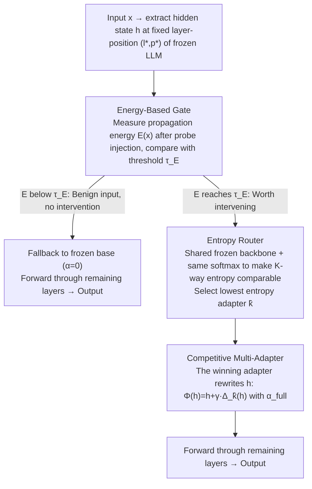

# Multi-Adapter Representation Interventions via Energy Calibration

**Conference**: ICML 2026  
**arXiv**: [2605.28722](https://arxiv.org/abs/2605.28722)  
**Code**: https://github.com/V1centNevwake/MARI  
**Area**: LLM Alignment / Representation Intervention  
**Keywords**: Representation intervention, multi-adapter routing, energy gating, truthfulness alignment, inference-time editing

## TL;DR
MARI identifies that existing "representation intervention" methods rely on a linear representation hypothesis—applying a single global steering vector to all inputs—which is unreliable because optimal correction directions fluctuate significantly across samples and may harm general capabilities on benign inputs. It replaces the single adapter with multiple low-rank adapters and uses "competitive training + entropy routing" for sample-adaptive intervention, coupled with an independently trained low-rank probe to calculate "propagation energy" for threshold gating to decide whether to enable intervention. This achieves a significant lead over ReFT on TruthfulQA/BBQ/Safety while maintaining or slightly improving MMLU/ARC performance.

## Background & Motivation

**Background**: Representation Intervention is one of the fastest-growing non-training paradigms in current LLM alignment—freezing model weights and modifying hidden states at specific layers and positions only during inference to steer model behavior toward being "more truthful," "safer," and "less biased." Activation Steering / CAA / ITI / ReFT all follow this line, with the technical core being a global steering vector or low-rank update $\Phi_\psi(\mathbf{h})=\mathbf{h}+\gamma s_\psi\Delta_\psi(\mathbf{h})$.

**Limitations of Prior Work**: All these methods assume the "linear representation hypothesis"—that an attribute (e.g., truthfulness) corresponds to a fixed direction in hidden space, meaning a single steering vector holds for all inputs. However, diagnostics conducted by the authors on TruthfulQA show that the required correction vector $\Delta(x)=a(x,y^\star)-a(x,\hat{y})$ for each sample shifts drastically in magnitude and direction, show no consistent direction when moving-averaged along any principal component.

**Key Challenge**: (i) Static interventions cannot cover heterogeneous needs—some samples require pushing toward $+\mathbf{v}$ and others toward $-\mathbf{v}$, where forced averaging leads to conflicts; (ii) even if the direction is correct, applying intervention to benign inputs that "do not need correction" disturbs internal representations, degrading general capabilities like MMLU/ARC by several points.

**Goal**: (1) Enable intervention direction/intensity to adapt per sample; (2) provide a **label-free** criterion for "whether to intervene" to avoid over-intervention on benign inputs; (3) ensure the mechanism does not require ground-truth access during inference and uses significantly fewer parameters than full fine-tuning.

**Key Insight**: Replace a single adapter with a set of multi-adapters and use hard routing during training to occupy different subspaces; use prediction entropy (parameter-agnostic) to select the most confident adapter during inference; use an independently trained low-rank probe to generate propagation energy of disturbances in subsequent layers as a signal for "whether the input is worth intervening."

**Core Idea**: Upgrade global linear intervention to piecewise-affine intervention using "multi-adapters + entropy routing"; implement a label-free sample-level trigger switch using "probe propagation energy + threshold."

## Method

### Overall Architecture
MARI aims to make "representation intervention" sample-adaptive and capable of automatically withdrawing on benign inputs without touching model weights. It inserts a set of intervention modules at a fixed layer-position $(l^\star,p^\star)$ of a frozen LLM $f_\theta$. During inference, an input passes three stages: first, the hidden state $\mathbf{h}=\mathbf{h}^{(l^\star)}_{p^\star}(x)$ is extracted, and an independent probe calculates its "propagation energy" $E(x;\alpha_\text{probe})$ to compare with a threshold $\tau_E$. If energy is insufficient, it is judged as "no intervention needed" and directly proceeds through the frozen base ($\alpha=0$). Inputs passing the gate calculate prediction entropy for $K$ low-rank adapters and select the most confident one. The winning adapter rewrites $\mathbf{h}$ with intensity $\alpha_\text{full}$, and the remaining layers proceed normally. Training involves two stages—first training $K$ adapters occupying distinct subspaces via "hard routing, winner-takes-gradient," then independently training the probe with off-subspace regularization to pull its disturbance direction toward the intervention subspace.

### Key Designs

**1. Competitive Multi-Adapter + Entropy Routing: Splitting a single global vector into $K$ segments with sample-adaptive selection**

Diagnostic experiments proved that the required correction vector $\Delta(x)$ shifts drastically in magnitude and direction, making a static steering vector insufficient for heterogeneous needs. MARI places $K$ adapters of rank $r$ at the same injection point, defined as $\Delta_{\psi_k}(\mathbf{h})=\mathbf{U}_k(\mathbf{V}_k^\top\mathbf{h}+\mathbf{b}_k)$. During training, $K$-way losses $\ell_k(x,y)$ (CE for multiple-choice, teacher-forced NLL for generation) are calculated for each sample $(x,y)$, and gradients are backpropagated only to the "winner" $k^\star(x,y)=\arg\min_k\ell_k(x,y)$. The objective is $\mathcal{L}_\text{route}=\mathbb{E}[\ell_{k^\star}]$, plus a minibatch usage balancing term to prevent mode collapse. This hard routing forces true specialization compared to soft routing (mixture-of-gates), as soft routing pulls adapters toward an average solution. During inference, since $y$ is unavailable, the "most confident is lowest entropy" proxy is used: $\hat{k}(x)=\arg\min_k u_k(x)$, where $u_k$ is the entropy of the output distribution for adapter $k$. The paper provides a risk bound $R_\text{ent}\le R_\text{min}+L\cdot\eta$; as long as the specialization gain $\Delta_\text{spec}$ exceeds the misrouting rate $\eta$ times the loss bound $L$, the system strictly outperforms a single adapter.

**2. Energy-Based Gate + Off-Subspace Regularization: Using a label-free signal to decide "whether to intervene"**

Even with the correct direction, forcing intervention on benign inputs ruins internal representations. MARI trains an independent low-rank probe $g_\phi$ (rank $r_\text{probe}<r$), calculates the probe update $\delta_\phi(x)=g_\phi(\mathbf{h}(x))$, and measures the disturbance $e_m(x;\alpha)=\|\mathbf{h}^{(\alpha,m)}_{p^\star}(x)-\mathbf{h}^{(m)}_{p^\star}(x)\|_2$ across subsequent layers. The median $E(x;\alpha)=\mathrm{median}\{e_m\}_{m=l^\star}^L$ is used as "propogation energy"—measuring how much a small perturbation resonates deep in the network. The training objective is:

$$\mathcal{L}_\text{cal}=\mathbb{E}[\ell_\phi(x,y)]+\lambda_\text{off}\,\mathcal{R}_\text{off},\qquad \mathcal{R}_\text{off}=\mathbb{E}\big\|\Pi_B^\perp(\delta_\phi(x))\big\|_2^2$$

The off-subspace regularization constrains the probe update within the "in-field calibration subspace" $B$ (derived via PCA on unlabeled inputs), ensuring the energy aligns with the intervention direction. The threshold $\tau_E$ is calibrated on a small control set of applicable/non-applicable inputs, typically capturing the $(1-\rho)$ quantile of the benign energy distribution ($\rho=0.9$). Theorem 5.2 gives an energy upper bound for non-applicable inputs $E(x;\alpha)\le\alpha(\kappa_\text{non}S+\Gamma(x)\varepsilon)+o(\alpha)$—smaller off-subspace residual $\varepsilon$ and larger in-field decay $\kappa_\text{non}$ yield better gate separation.

**3. Frozen Backbone + Shared Softmax: Making entropy comparable across $K$ adapters**

Entropy routing requires $u_k(x)$ to be measured on the same scale. MARI ensures all adapters share the same frozen backbone and output head with a unified softmax temperature—no per-expert temperatures or logit scaling. Each adapter only learns $\mathbf{U}_k,\mathbf{V}_k,\mathbf{b}_k$ while $\theta$ is frozen. If adapters learned different temperatures, entropy would lose numerical comparability, and routing would degrade into simply selecting the expert with the lowest temperature.

### Loss & Training
Two-stage training: (1) Multi-adapter stage using hard routing + minibatch usage balancing, objective $\mathcal{L}_\text{route}+\lambda_\text{usage}\mathcal{L}_\text{usage}$; (2) Probe stage using $\mathcal{L}_\text{cal}=\mathbb{E}[\ell_\phi]+\lambda_\text{off}\|\Pi_B^\perp\delta_\phi\|_2^2$. During inference, the threshold $\tau_E$ is pre-calibrated on a control set with a target trigger rate $\rho=0.9$.

## Key Experimental Results

### Main Results
Evaluated on 6 backbones including Llama-2-7B/13B, Llama-3-8B, Qwen2-7B, and Qwen2.5-14B/32B across TruthfulQA, BBQ, Safety, MMLU, and ARC.

| Backbone | Method | TruthfulQA MC1 ↑ | BBQ ↑ | MMLU ↑ | ARC-C ↑ |
|---|---|---|---|---|---|
| Llama-2-7B | Vanilla | 32.03 | 0.329 | 23.3 | 33.8 |
| Llama-2-7B | ReFT (Prev. SOTA) | 50.46 | 0.540 | 23.2 | 34.0 |
| Llama-2-7B | **Ours** | **64.35** | **0.751** | 23.2 | 33.5 |
| Llama-3-8B | ReFT (Prev. SOTA) | 50.58 | 0.637 | 66.0 | 51.6 |
| Llama-3-8B | **Ours** | **61.81** | **0.792** | **66.6** | **52.1** |
| Qwen2.5-14B | ReFT (Prev. SOTA) | 52.33 | 0.646 | 80.8 | 63.6 |
| Qwen2.5-14B | **Ours** | **67.93** | **0.821** | **81.6** | **64.1** |
| Qwen2.5-32B | ReFT (Prev. SOTA) | 55.60 | 0.821 | 83.4 | 59.5 |
| Qwen2.5-32B | **Ours** | **81.94** | **0.876** | **84.2** | **60.0** |

### Ablation Study
| Configuration (Llama-3-8B) | TruthfulQA MC1 | BBQ | MMLU | ARC-C |
|---|---|---|---|---|
| Vanilla | 28.70 | 0.608 | 65.9 | 51.4 |
| w/o Energy Gating (Always-on multi-adapter) | 65.15 | 0.800 | 57.5 ↓↓ | 44.8 ↓↓ |
| w/o Multi-Adapter (Single adapter + energy gate) | 45.80 | 0.680 | 66.2 | 51.8 |
| **Full EG-MARI** | 61.81 | 0.792 | **66.6** | **52.1** |

### Key Findings
- **Over-intervention cost**: Removing energy gating results in higher alignment scores (MC1 65.15 vs 61.81) but causes general capability collapse (MMLU 65.9 → 57.5), validating the hypothesis that always-on intervention is costly.
- **Heterogeneous needs**: Removing multi-adapters significantly drops alignment scores (MC1 45.80 vs 61.81), proving a single global steering vector is insufficient.
- **Substantial gains**: The TruthfulQA MC1 improvement (+14-28 points) is exceptionally high for weight-frozen methods, outperforming ReFT by 11-26 points.
- **Efficiency**: On Qwen2.5-32B, MARI pushes TruthfulQA MC1 to 81.94, nearing the level of RLHF models with negligible parameter overhead.

## Highlights & Insights
- **Counter-consensus**: The authors falsify the "linear representation hypothesis" with simple diagnostic sliding-windows—a "diagnose first, then hypothesize, then design" approach that is rare but effective in representation engineering.
- **Entropy routing**: This creates an inference-time substitute for an oracle. It is lightweight, requires no extra parameters, and can be applied to any scenario requiring expert selection (MoE, tool routing).
- **Decoupled gate design**: Separating "whether to intervene" and "how to intervene" across two sets of parameters, while using off-subspace regularization to align the probe with the actuation subspace, provides an elegant label-free applicability signal.
- **Piecewise-affine geometry**: Interpreting multi-adapters + routing as input space partitioning $\mathcal{R}_k=\{x:\pi(x)=k\}$ links representation intervention to classic piecewise-linear network theory.

## Limitations & Future Work
- **Static injection point**: The $(l^\star,p^\star)$ location is fixed; if intervention needs vary by layer across samples, a "layer selection" mechanism would be needed.
- **Control set dependency**: Calibrating $\tau_E$ requires an applicable/non-applicable set, which may be difficult to construct in domains like medicine or law.
- **Missing metrics**: Lack of evaluations for open-ended generation quality, readability, or long-context dialogue, and no public report on the overhead of $K$ entropy calculations + 1 probe pass.
- **Theoretical gaps**: Risk bounds are conditional on empirical estimates of specialization gains and misrouting rates.

## Related Work & Insights
- **vs ReFT (Wu et al., 2024)**: ReFT is a single rank-$r$ global update; MARI is piecewise rank-$r$ updates with a selector, offering strictly greater expressivity and avoiding capability loss via energy gating.
- **vs PEFT**: While "multi-expert + routing" is similar to LoRA-MoE, MARI targets input heterogeneity within the same task for alignment rather than task diversity.
- **vs RLHF/DPO**: RLHF modifies all weights; MARI freezes weights and learns low-rank matrices, serving as a "pluggable safety layer."
- **Insight**: The energy propagation paradigm can be generalized to LLM agents (routing to tools) or reasoning (triggering multi-step thought), providing label-free decision gating for external modules.

## Rating
- Novelty: ⭐⭐⭐⭐ (Multi-adapter/entropy routing are known, but the combination for intervention with energy gating is novel)
- Experimental Thoroughness: ⭐⭐⭐⭐ (6 backbones + 7 benchmarks, but lacks generation/latency reports)
- Writing Quality: ⭐⭐⭐⭐⭐ (Strong logical structure: diagnose, design, theoretical support)
- Value: ⭐⭐⭐⭐ (Provides a strong training-free alignment baseline with no loss to general capabilities)

<!-- RELATED:START -->

## Related Papers

- [\[ICML 2026\] Energy-Structured Low-Rank Adaptation for Continual Learning](energy-structured_low-rank_adaptation_for_continual_learning.md)
- [\[ICML 2026\] Towards Steering without Sacrifice: Principled Training of Steering Vectors for Prompt-only Interventions](towards_steering_without_sacrifice_principled_training_of_steering_vectors_for_p.md)
- [\[ICML 2026\] ProjQ: Project-and-Quantize for Adapter-Aware LLM Compression](projq_project-and-quantize_for_adapter-aware_llm_compression.md)
- [\[ICML 2026\] Towards Resource-Efficient LLMs: End-to-End Energy Accounting of Distillation Pipelines](towards_resource-efficient_llms_end-to-end_energy_accounting_of_distillation_pip.md)
- [\[AAAI 2026\] QuEPT: Quantized Elastic Precision Transformers with One-Shot Calibration for Multi-Bit Switching](../../AAAI2026/model_compression/quept_quantized_elastic_precision_transformers_with_one-shot_calibration_for_mul.md)

<!-- RELATED:END -->
