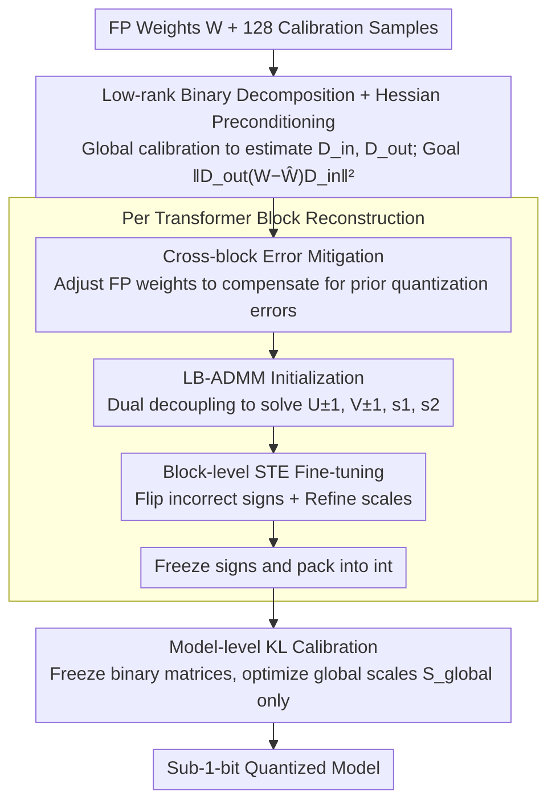

# NanoQuant: Efficient Sub-1-Bit Quantization of Large Language Models

**Conference**: ICML 2026  
**arXiv**: [2602.06694](https://arxiv.org/abs/2602.06694)  
**Code**: Not yet public  
**Area**: Model Compression / LLM Quantization  
**Keywords**: Post-training Quantization, Sub-1-bit, Low-rank Binary Decomposition, ADMM, Large Model Deployment  

## TL;DR
NanoQuant reformulates weight quantization as a "low-rank binary decomposition" problem. It employs Hessian-aware ADMM to precisely initialize $\pm 1$ factors and floating-point scales, followed by block-level STE reconstruction and global-scale KL calibration. Utilizing only 0.26M tokens of calibration data on a single H100 card, it enables PTQ to compress LLMs to true 1-bit or even sub-1-bit for the first time. For instance, it compresses Llama2-70B from 138 GB to 5.35 GB, allowing it to run on 8 GB consumer-grade GPUs.

## Background & Motivation

**Background**: Weight quantization has become a standard practice for LLM deployment. Post-Training Quantization (PTQ) methods such as GPTQ, AWQ, and QuIP can stably push to 2-bit. Recent binary PTQ efforts (BiLLM, ARB-LLM, STBLLM, HBLLM) attempt to reach 1-bit. Meanwhile, binary Quantization-Aware Training (QAT) like OneBit, LittleBit, and DBF can already achieve 1-bit or even sub-1-bit precision.

**Limitations of Prior Work**: Binary PTQ generally relies on an "on-the-fly binarization + full-precision scale" structure $\mathbf{W}\approx\alpha\mathbf{B}_{\pm 1}$, which possesses a structural lower bound of at least 1 bit/parameter. Together with various group masks and scale metadata, the effective BPW often requires 2.5–4 bits to achieve usable PPL. Conversely, sub-1-bit QAT requires hundreds of millions of tokens and several days of multi-GPU training, making it scaling to 70B models nearly impossible.

**Key Challenge**: PTQ is efficient in data and compute but constrained by its representation structure; QAT offers flexible representation but its overhead prevents scaling to 70B models. The essence of the problem is whether a more compact representation than direct binarization can be found within a PTQ budget.

**Goal**: This work addresses three sub-problems: (1) finding a binary representation structurally capable of sub-1-bit compression; (2) precisely initializing this representation with a small calibration set; and (3) enabling the entire quantization pipeline for a 70B model to run on a single GPU.

**Key Insight**: Borrowing the "low-rank binary decomposition" representation from LittleBit/DBF, the weights are expressed as two $\pm 1$ low-rank matrices plus two floating-point scales, where storage complexity is controlled by the rank $r/d$ and can fall below 1 bit. While QAT learns this decomposition end-to-end, the authors propose a two-stage method consisting of "precise initialization + block-level reconstruction" to approximate QAT accuracy within a PTQ budget.

**Core Idea**: Reformulate sub-1-bit PTQ as "Hessian-weighted low-rank binary matrix decomposition + block-level STE fine-tuning + global scale KL calibration." ADMM is used to decouple combinatorial optimization from continuous relaxation, thereby bypassing the NP-hard difficulty of binary optimization.

## Method

### Overall Architecture
NanoQuant decomposes each linear layer weight $\mathbf{W}\in\mathbb{R}^{d_\text{out}\times d_\text{in}}$ into $\widehat{\mathbf{W}}=\mathbf{s}_1\odot(\mathbf{U}_{\pm 1}\mathbf{V}_{\pm 1}^\top)\odot\mathbf{s}_2^\top$, where $\mathbf{U}_{\pm 1}\in\{-1,+1\}^{d_\text{out}\times r}$, $\mathbf{V}_{\pm 1}\in\{-1,+1\}^{d_\text{in}\times r}$, and $\mathbf{s}_1, \mathbf{s}_2$ are full-precision channel-wise scale vectors. The pipeline consists of three stages: **(1) Global Calibration**—128 samples are fed into the FP teacher to calculate K-FAC style input/output diagonal preconditioners $\widetilde{\mathbf{D}}_\text{in}, \widetilde{\mathbf{D}}_\text{out}$ for each layer; **(2) Block-level Reconstruction**—Iterating through Transformer blocks, FP weights are adjusted to cancel prior quantization errors, followed by LB-ADMM to initialize $\mathbf{U}, \mathbf{V}, \mathbf{s}_1, \mathbf{s}_2$, and STE jointly fine-tunes continuous latents and scales before freezing signs; **(3) Model Reconstruction**—Binary matrices are frozen, and only the set of global scales $\mathbf{S}_\text{global}$ is optimized using KL divergence to align logits with the FP teacher.

### Key Designs

**1. Low-rank Binary Decomposition + Hessian Preconditioning: A structure to break the 1-bit lower bound**

Binary PTQ is limited to 1 bit because every parameter requires a sign. NanoQuant changes the target to the product of two $\pm 1$ low-rank factors, where storage is controlled by the rank $r$. To optimize this, the authors utilize Hessian-weighted reconstruction: $\mathcal{L}(\widehat{\mathbf{W}})\approx\|\widetilde{\mathbf{D}}_\text{out}(\mathbf{W}-\widehat{\mathbf{W}})\widetilde{\mathbf{D}}_\text{in}\|_F^2$. This is equivalent to low-rank binary approximation under an ellipsoid norm spanned by activation/gradient statistics. Diagonal preconditioners $\widetilde{\mathbf{D}}_\text{in}, \widetilde{\mathbf{D}}_\text{out}$ are derived from K-FAC and stabilized via shrinkage: $[\widetilde{\mathbf{D}}]_{ii}\leftarrow(1-\gamma)[\mathbf{D}]_{ii}+\gamma\,\mathrm{mean}(\mathbf{D})$.

**2. Error Mitigation: Compensating for prior errors before quantizing the current block**

Sequential block quantization can cause errors to accumulate. NanoQuant borrows the sequential error compensation approach: before quantizing block $i$, the FP target weights of the current block are adjusted using the actual outputs from the already quantized blocks $1 \dots i-1$. This allows the current block to absorb prior quantization errors before LB-ADMM decomposition. Ablation shows that without this, PPL for Qwen3-8B (0.8 bit) jumps from 15.07 to 206.03.

**3. Latent-Binary ADMM (LB-ADMM): High-quality binary initialization under PTQ budgets**

Low-rank $\pm 1$ decomposition is NP-hard. LB-ADMM uses dual variables to decouple continuous reconstruction from binary constraints: $\min_{\mathbf{U},\mathbf{V},\mathbf{Z}_U,\mathbf{Z}_V}\tfrac{1}{2}\|\widetilde{\mathbf{W}}_\text{target}-\mathbf{U}\mathbf{V}^\top\|_F^2+\tfrac{\lambda}{2}(\|\mathbf{U}\|_F^2+\|\mathbf{V}\|_F^2)$ s.t. $\mathbf{U}=\mathbf{Z}_U, \mathbf{V}=\mathbf{Z}_V$. Continuous factors $\mathbf{U}$ and $\mathbf{V}$ are updated via a linear system solved by Cholesky decomposition. Auxiliary variables $\mathbf{Z}$ are updated using Sign-Value Independent Decomposition (SVID) to project continuous solutions onto the binary manifold.

**4. Block-level STE Fine-tuning + Scale-only Model KL Calibration: Aligning local initialization with global models while saving VRAM**

To prevent the high VRAM costs of full QAT, NanoQuant splits fine-tuning into two stages. At the block level, the Straight-Through Estimator (STE) is used to jointly optimize latents and scales within a single block. At the model level, all binary matrices are frozen and packed into integers, and only the global floating-point scales $\mathbf{S}_\text{global}$ are optimized using KL divergence between the quantized model's logits and the teacher:

$$\min_{\mathbf{S}_\text{global}}D_\text{KL}\big(\text{Logits}(\mathcal{M}(\mathbf{X}))\,\|\,\text{Logits}(\widehat{\mathcal{M}}(\mathbf{X};\mathbf{S}_\text{global}))\big).$$

This strategy ensures that the entire 70B quantization process can fit on a single H100 GPU.

### Loss & Training
MSE is used for block-level targets and KL divergence for model-level targets. Hyperparameters include iteration counts $(T_\text{pre}, T_\text{post}, T_\text{glob})$, ADMM penalty $\rho$, ridge regularizer $\lambda$, and convergence threshold $\epsilon$. The calibration set consists of 128 WikiText-2 samples (approx. 0.26M tokens) with a sequence length of 2048.

## Key Experimental Results

### Main Results
Evaluation covers Llama-2/3, Gemma-3, Qwen-3, and Rnj-1 families (17 models from 0.6B to 70B) using WikiText-2 PPL and zero-shot accuracy across 6 reasoning tasks.

| Model / Bitrate | Method | Effective BPW | WikiText-2 PPL ↓ | Notes |
|---|---|---|---|---|
| Llama-2-7B / 1 bit | NanoQuant | 1.00 | 10.34 | Single H100, 0.26M tokens |
| Llama-2-7B / 1 bit | HBLLM_R | 3.25 | 7.60 | 3.25× more storage |
| Llama-2-7B / 1 bit | BiLLM | 2.88 | 19.87 | Outperformed by NanoQuant |
| Llama-2-70B / 1 bit | NanoQuant | 1.00 | 6.52 | 138 GB → 5.35 GB |
| Llama-3-8B / 0.8 bit | NanoQuant | 0.80 | 18.16 | First sub-1 bit PTQ |
| Llama-3-8B / 0.55 bit | NanoQuant | 0.55 | 25.69 | Extreme compression |
| Llama-2-7B vs QAT DBF | NanoQuant 1.05M tokens | 1.00 | 9.01 vs DBF 9.25 | DBF used 1.38B tokens |

### Ablation Study

| Configuration | PPL ↓ | Zero-shot ↑ | Explanation |
|---|---|---|---|
| LB-ADMM Initialization only | 206.03 | 36.89 | Failure without reconstruction |
| + Error Mitigation | 15.07 | 46.40 | Offsets prior block errors |
| + Factorized Refinement | 13.58 | 46.75 | STE fine-tuning of signs/scales |
| Full (including Model KL) | 12.47 | 48.94 | Results for Qwen3-8B 0.8 bit |
| Dual-SVID Initialization | 167.73 | 35.11 | LittleBit style |
| DBF-ADMM Initialization | 30.27 | 37.20 | DBF style |
| LB-ADMM Initialization | 20.06 | 39.29 | Ours, Rnj-1 0.8 bit |

### Key Findings
- **Initialization is vital**: Simply switching initialization strategies reduces PPL from 167 to 20, proving that solving the binary combinatorial problem within ADMM is more effective than relying on STE to find good signs.
- **Pipeline modularity**: Missing Error Mitigation causes PPL to explode to over 200, highlighting the severity of error accumulation in sub-1-bit settings.
- **Equivalent Bitrate Performance**: NanoQuant outperforms higher-bitrate methods like BiLLM (1.00 bit vs 2.88 bit) in PPL, suggesting low-rank decomposition is a more compact representation for small budgets.
- **Deployment**: On an RTX 3050 8GB, Llama-3.2-3B achieves 3.7× higher throughput and 5.4× lower VRAM usage than BF16. A 70B model runs at 20.11 tok/s on the same consumer card.

## Highlights & Insights
- **Novelty**: Breaking the 1-bit lower bound conceptually by moving from "scale × binary matrix" to "scale × product of binary factors" without needing codebooks or secondary sparsity.
- **Mechanism**: ADMM serves as a paradigm for handling non-convex discrete constraints in quantization, which can be extended to pruning or sparse tasks.
- **Engineering Value**: Localizing STE to blocks and using only vector scales for global optimization allows 70B models to be quantized on a single H100 card within 13 hours.

## Limitations & Future Work
- PPL remains significantly higher than the BF16 baseline (e.g., Llama-2-7B 5.47 → 10.34). Performance on complex reasoning tasks like GSM8K or MMLU requires further evaluation.
- The comparison to QAT methods relied on the author's reproduction; accuracy boundaries after training on massive datasets weren't fully aligned.
- The calibration set is small and potentially biased; the shrinkage coefficient $\gamma$ requires manual tuning for different model families.

## Related Work & Insights
- **vs Binary PTQ (BiLLM, HBLLM)**: NanoQuant breaks the structural 1-bit limit and avoids the ambiguity of "salient weight" binarization, outperforming them at equivalent bitrates.
- **vs Binary QAT (OneBit, DBF)**: NanoQuant approaches their accuracy with 1/1000th of the data and compute budget, specifically enabling the jump to 70B models.
- **vs Integer PTQ (GPTQ, AWQ)**: While integer quantization is locked to discrete bit-widths, NanoQuant's BPW is continuously adjustable via rank $r$, providing a true Pareto frontier.

## Rating
- Novelty: ⭐⭐⭐⭐
- Experimental Thoroughness: ⭐⭐⭐⭐
- Writing Quality: ⭐⭐⭐⭐
- Value: ⭐⭐⭐⭐⭐

<!-- RELATED:START -->

## Related Papers

- [\[ICLR 2026\] Quant-dLLM: Post-Training Extreme Low-Bit Quantization for Diffusion Large Language Models](../../ICLR2026/model_compression/quant-dllm_post-training_extreme_low-bit_quantization_for_diffusion_large_langua.md)
- [\[ICML 2026\] UniSVQ: 2-bit Unified Scalar-Vector Quantization](unisvq_2-bit_unified_scalar-vector_quantization.md)
- [\[ICML 2026\] NeUQI: Near-Optimal Uniform Quantization Parameter Initialization for Low-Bit LLMs](neuqi_near-optimal_uniform_quantization_parameter_initialization_for_low-bit_llm.md)
- [\[ICML 2026\] TWLA: Achieving Ternary Weights and Low-Bit Activations for LLMs via Post-Training Quantization](twla_achieving_ternary_weights_and_low-bit_activations_for_llms_via_post-trainin.md)
- [\[ICML 2026\] Model Merging Scaling Laws in Large Language Models](model_merging_scaling_laws_in_large_language_models.md)

<!-- RELATED:END -->
