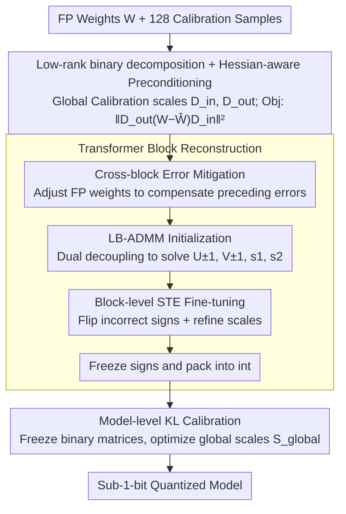

# NanoQuant: Efficient Sub-1-Bit Quantization of Large Language Models

**Conference**: ICML 2026  
**arXiv**: [2602.06694](https://arxiv.org/abs/2602.06694)  
**Code**: Not yet public  
**Area**: Model Compression / LLM Quantization  
**Keywords**: Post-Training Quantization, Sub-1-bit, Low-rank binary decomposition, ADMM, LLM Deployment  

## TL;DR
NanoQuant reformulates weight quantization as a "low-rank binary decomposition" problem. It employs Hessian-aware ADMM to precisely initialize $\pm 1$ factors and floating-point scales, followed by block-level STE reconstruction and global scale KL calibration. Using only 0.26M calibration tokens and a single H100 card, it marks the first time PTQ has compressed LLMs to true 1-bit and even sub-1-bit levels, shrinking Llama2-70B from 138 GB to 5.35 GB and enabling execution on 8 GB consumer-grade GPUs.

## Background & Motivation

**Background**: Weight quantization has become a standard practice for LLM deployment. Post-training quantization (PTQ) methods like GPTQ, AWQ, and QuIP can reliably reach 2-bit levels. Recent binary PTQ methods (BiLLM, ARB-LLM, STBLLM, HBLLM) attempt to reach 1-bit, while binary Quantization-Aware Training (QAT) like OneBit, LittleBit, and DBF have already achieved 1-bit or even sub-1-bit quantization.

**Limitations of Prior Work**: Binary PTQ generally utilizes an "in-place binarization + full-precision scale" structure $\mathbf{W}\approx\alpha\mathbf{B}_{\pm 1}$, which possesses a structural lower bound of at least 1 bit per parameter. Coupled with various group masks and scale metadata, the effective bits-per-weight (BPW) often requires 2.5–4 bits to achieve acceptable perplexity (PPL). Conversely, sub-1-bit binary QAT requires hundreds of millions of tokens and days of multi-GPU training, making it nearly impossible for 70B models.

**Key Challenge**: PTQ is data and compute-efficient but is hindered by rigid representation structures, while QAT offers flexible representation but incurs prohibitive data and compute costs that do not scale to 70B. The core problem is whether it is possible to find a representation more compact than direct binarized weights within a PTQ budget.

**Goal**: Address three sub-problems: (1) finding a binary representation structurally capable of sub-1-bit compression; (2) precisely initializing this representation with a small calibration set; and (3) enabling a 70B model to complete the entire quantization pipeline on a single GPU.

**Key Insight**: Adopt the "low-rank binary decomposition" representation from LittleBit/DBF, where weights are represented as two $\pm 1$ low-rank matrices plus two floating-point scales. The storage complexity is controlled by $r/d$, which can be lower than 1 bit. Unlike QAT, which learns this decomposition end-to-end, this paper explores whether a two-stage "precise initialization + block-level reconstruction" method can approximate QAT accuracy within a PTQ budget.

**Core Idea**: Reformulate sub-1-bit PTQ as "Hessian-weighted low-rank binary matrix decomposition + block-level STE fine-tuning + global scale KL calibration." Use ADMM to decouple combinatorial optimization from continuous relaxation, thereby bypassing the NP-hard difficulty of binary combinatorial optimization.

## Method

### Overall Architecture
NanoQuant decomposes each linear layer weight $\mathbf{W}\in\mathbb{R}^{d_\text{out}\times d_\text{in}}$ as $\widehat{\mathbf{W}}=\mathbf{s}_1\odot(\mathbf{U}_{\pm 1}\mathbf{V}_{\pm 1}^\top)\odot\mathbf{s}_2^\top$, where $\mathbf{U}_{\pm 1}\in\{-1,+1\}^{d_\text{out}\times r}$, $\mathbf{V}_{\pm 1}\in\{-1,+1\}^{d_\text{in}\times r}$, and $\mathbf{s}_1,\mathbf{s}_2$ are channel-wise floating-point scale vectors. The pipeline consists of three segments: **(1) Global Calibration**—128 samples are processed through the floating-point (FP) teacher to calculate K-FAC style input/output diagonal preconditioners $\widetilde{\mathbf{D}}_\text{in},\widetilde{\mathbf{D}}_\text{out}$ for each linear layer; **(2) Block-level Reconstruction**—Iterating through transformer blocks, FP weights are first adjusted to cancel preceding quantization errors, then LB-ADMM precisely initializes $\mathbf{U},\mathbf{V},\mathbf{s}_1,\mathbf{s}_2$, followed by STE joint fine-tuning of continuous latents and scales, and finally freezing signs into packed integers; **(3) Model Reconstruction**—All packed binary matrices are frozen, and only the global floating-point scale set $\mathbf{S}_\text{global}$ is optimized using KL divergence to align the quantized model's logits with the FP teacher.

### Key Designs

**1. Low-rank Binary Decomposition + Hessian-aware Preconditioning: Breaking the 1-bit barrier.**

Binary PTQ is stuck at 1-bit because "in-place binarization" ($\mathbf{W}\approx\alpha\mathbf{B}_{\pm 1}$) must store one sign bit per parameter. NanoQuant changes the target to the product of two $\pm 1$ low-rank factors, where storage is controlled by the rank $r$. To optimize this, the paper utilizes a Hessian-weighted objective $\mathcal{L}(\widehat{\mathbf{W}})\approx\|\widetilde{\mathbf{D}}_\text{out}(\mathbf{W}-\widehat{\mathbf{W}})\widetilde{\mathbf{D}}_\text{in}\|_F^2$, representing the task loss under a second-order Taylor expansion. This prioritization suppresses errors in directions that most affect downstream loss. Diagonal preconditioners $\widetilde{\mathbf{D}}_\text{in},\widetilde{\mathbf{D}}_\text{out}$ use K-FAC estimation with shrinkage stability: $[\widetilde{\mathbf{D}}]_{ii}\leftarrow(1-\gamma)[\mathbf{D}]_{ii}+\gamma\,\mathrm{mean}(\mathbf{D})$.

**2. Cross-block Error Mitigation: Compensating for preceding errors.**

Sequential block quantization in binary settings causes cumulative error amplification. NanoQuant borrows GPTQ-style error compensation: before quantizing block $i$, the FP target weights of the current block are adjusted based on the actual output of the previously quantized $i-1$ blocks. This "pre-compensated" weight is then decomposed via LB-ADMM. This module provides the highest individual gain; without it, PPL can soar to 206.03, while its inclusion drops PPL to 15.07.

**3. Latent-Binary ADMM (LB-ADMM): Precise binary initialization within PTQ budgets.**

As low-rank $\pm 1$ decomposition is NP-hard, LB-ADMM decouples "continuous reconstruction" and "binary constraints" using dual variables: $\min_{\mathbf{U},\mathbf{V},\mathbf{Z}_U,\mathbf{Z}_V}\tfrac{1}{2}\|\widetilde{\mathbf{W}}_\text{target}-\mathbf{U}\mathbf{V}^\top\|_F^2+\tfrac{\lambda}{2}(\|\mathbf{U}\|_F^2+\|\mathbf{V}\|_F^2)$ subject to $\mathbf{U}=\mathbf{Z}_U,\mathbf{V}=\mathbf{Z}_V$. Updates rotate through continuous factors (Linear system solved via Cholesky), auxiliary variables $\mathbf{Z}$ (Sign-Value Independent Decomposition), and dual variables $\boldsymbol{\Lambda}$. This approach is significantly more stable on small calibration sets compared to prior methods.

**4. Block-level STE Fine-tuning + Scale-only Global KL Calibration: Aligning for global performance.**

NanoQuant splits alignment into two stages. At the block level, the Straight-Through Estimator (STE) allows gradients to flow through $\mathrm{sign}(\cdot)$ to optimize $\mathcal{U},\mathcal{V},\mathbf{s}_1,\mathbf{s}_2$, minimizing block output error. This flips few incorrect signs and refines local scales. At the model level, all binary matrices are frozen/packed, and only global scales $\mathbf{S}_\text{global}$ are optimized using KL divergence. By restricting STE backpropagation to individual blocks, the 70B quantization can be completed on a single H100.

### Loss & Training
The block-level objective uses MSE, while the model-level uses KL divergence. Optimization steps $(T_\text{pre},T_\text{post},T_\text{glob})$ are set independently. Core hyperparameters include ADMM iterations $K$, penalty $\rho$, ridge regularization $\lambda$, and convergence threshold $\epsilon$. The calibration set consists of only 128 WikiText-2 samples (approx. 0.26M tokens) with a sequence length of 2048.

## Key Experimental Results

### Main Results
Evaluation covers 17 models from 5 families (Llama-2/3, Gemma-3, Qwen-3, Rnj-1) ranging from 0.6B to 70B, reporting WikiText-2 PPL and zero-shot accuracy across 6 common-sense reasoning tasks.

| Model / Bitrate | Method | Effective BPW | WikiText-2 PPL ↓ | Notes |
|---|---|---|---|---|
| Llama-2-7B / 1 bit | NanoQuant | 1.00 | 10.34 | Single H100, 0.26M tokens |
| Llama-2-7B / 1 bit | HBLLM_R | 3.25 | 7.60 | 3.25× more storage |
| Llama-2-7B / 1 bit | BiLLM | 2.88 | 19.87 | Worse than NanoQuant |
| Llama-2-70B / 1 bit | NanoQuant | 1.00 | 6.52 | 138 GB → 5.35 GB |
| Llama-3-8B / 0.8 bit | NanoQuant | 0.80 | 18.16 | First sub-1 bit PTQ |
| Llama-3-8B / 0.55 bit | NanoQuant | 0.55 | 25.69 | Extreme compression |
| Llama-2-7B vs QAT DBF | NanoQuant 1.05M | 1.00 | 9.01 vs DBF 9.25 | DBF used 1.38B tokens |

### Ablation Study

| Configuration | PPL ↓ | Zero-shot ↑ | Explanation |
|---|---|---|---|
| LB-ADMM Init Only | 206.03 | 36.89 | Failure without reconstruction |
| + Error Mitigation | 15.07 | 46.40 | Compensates cumulative block error |
| + Factorized Refinement | 13.58 | 46.75 | STE fine-tuning of signs/scales |
| Full (+ Global KL) | 12.47 | 48.94 | Qwen3-8B 0.8 bit |
| Dual-SVID Init | 167.73 | 35.11 | LittleBit style |
| DBF-ADMM Init | 30.27 | 37.20 | DBF style |
| LB-ADMM Init | 20.06 | 39.29 | Ours, Rnj-1 0.8 bit |

### Key Findings
- Initialization is the deciding factor in sub-1-bit PTQ. Changing only the initialization strategy drops PPL from 167 to 20.
- All four pipeline modules are essential; without cross-block error mitigation, PPL explodes to 206.
- At equivalent bitrates, NanoQuant outperforms HBLLM/STBLLM. For example, BiLLM (2.88 bit) on Llama-2-7B yields PPL 19.87, whereas NanoQuant (1.00 bit) yields 10.34.
- Deployment: On an RTX 3050 8GB, Llama-3.2-3B achieves 3.7× throughput and 5.4× memory efficiency over BF16. A 70B model fits into an 8GB card at 20.11 tok/s.

## Highlights & Insights
- **Structural Innovation**: Changing the quantization target to a "product of binary factors" breaks the 1-bit structural lower bound without requiring codebooks or sparsity.
- **Proper ADMM Usage**: Using dual variables to isolate discrete constraints is a paradigm case for handling non-convex discrete optimization.
- **Budget Allocation**: Locking expensive STE backpropagation to the block level and only optimizing vectors globally is the engineering philosophy that allows 70B models to scale.
- **Preconditioner Shrinkage**: Explicitly combining K-FAC diagonal factors with the mean (shrinkage) is crucial for models with sharp output distributions like Gemma.

## Limitations & Future Work
- PPL numbers remain significantly higher than the BF16 baseline (e.g., Llama-2-7B 5.47 → 10.34). Performance on complex reasoning tasks (GSM8K, MMLU) remains to be explored.
- The 128-token calibration set might be biased for multi-language or high-code models.
- Shrinkage coefficient $\gamma$ must be tuned per model family.
- There is no theoretical convergence guarantee for ADMM in sub-1-bit settings; the claim that "Hessian-aware initialization is key" remains primarily empirical.

## Related Work & Insights
- **vs Binary PTQ (BiLLM, HBLLM)**: Prior methods store salient weights or masks, keeping effective BPW at 2.5–4 bits. NanoQuant switches representation to low-rank decomposition, dominating at equivalent bitrates.
- **vs Binary QAT (OneBit, DBF)**: Prior QAT methods require 100M–1B tokens. NanoQuant reduces data/compute by 1/100–1/1000 while maintaining comparable accuracy and scaling to 70B models.
- **vs Integer PTQ (GPTQ, AWQ)**: Integer BPW must be an integer. NanoQuant allows BPW to be continuously adjusted via rank $r$ (e.g., 0.55, 0.8 bit).
- **vs QMoE / BTC-LLM**: QMoE is restricted to MoE architectures. NanoQuant is architecture-agnostic and does not require codebooks.

## Rating
- Novelty: ⭐⭐⭐⭐
- Experimental Thoroughness: ⭐⭐⭐⭐
- Writing Quality: ⭐⭐⭐⭐
- Value: ⭐⭐⭐⭐⭐ Bringing 70B models to 8GB consumer cards makes high-level AI deployment far more accessible.

<!-- RELATED:START -->

## Related Papers

- [\[ICML 2026\] NeUQI: Near-Optimal Uniform Quantization Parameter Initialization for Low-Bit LLMs](neuqi_near-optimal_uniform_quantization_parameter_initialization_for_low-bit_llm.md)
- [\[ICML 2026\] LFQ: Logit-aware Final-block Quantization for Boosting the Generation Quality of Low-Bit Quantized LLMs](lfq_logit-aware_final-block_quantization_for_boosting_the_generation_quality_of_.md)
- [\[ICML 2026\] Model Merging Scaling Laws in Large Language Models](model_merging_scaling_laws_in_large_language_models.md)
- [\[ICML 2026\] Bounded Hyperbolic Tangent: A Stable and Efficient Alternative to Pre-Layer Normalization in Large Language Models](bounded_hyperbolic_tangent_a_stable_and_efficient_alternative_to_pre-layer_norma.md)
- [\[ACL 2025\] Outlier-Safe Pre-Training for Robust 4-Bit Quantization of Large Language Models](../../ACL2025/model_compression/outlier-safe_pre-training_for_robust_4-bit_quantization_of_large_language_models.md)

<!-- RELATED:END -->
