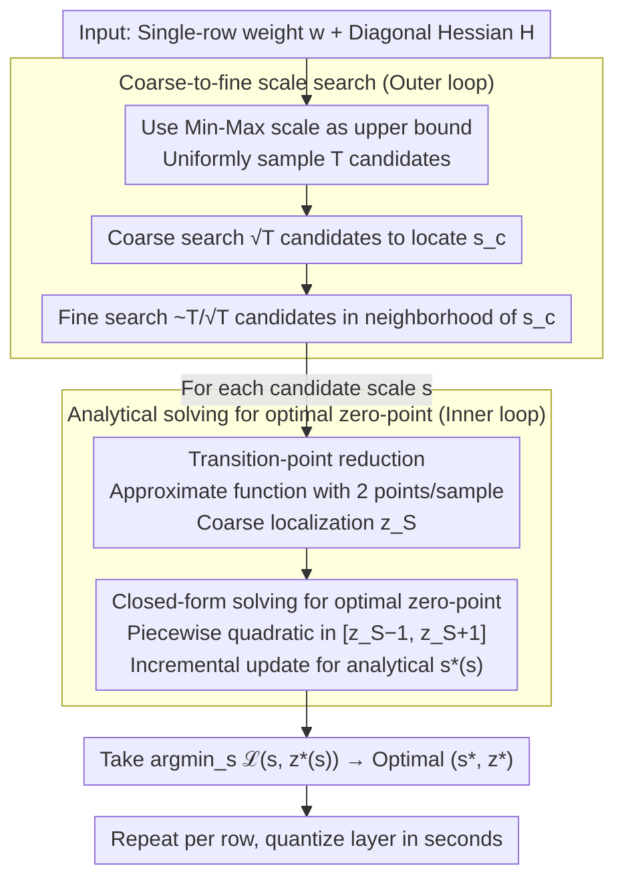

# NeUQI: Near-Optimal Uniform Quantization Parameter Initialization for Low-Bit LLMs

**Conference**: ICML 2026  
**arXiv**: [2505.17595](https://arxiv.org/abs/2505.17595)  
**Code**: Not yet public (Inference supported via BitBLAS for floating zero-points)  
**Area**: Model Compression / Low-bit Quantization / PTQ  
**Keywords**: Post-training quantization, uniform quantization, quantization parameter initialization, scale-zero point optimization, LLM deployment

## TL;DR
This paper points out that prevailing Post-Training Quantization (PTQ) methods all follow the Min-Max formula for initializing scale and zero-point. This legacy formula contains two long-overlooked constraints: "parameters determined by extreme values" and "zero-point must be an integer." The authors propose NeUQI, which removes these constraints by analytically solving for the optimal zero-point given a scale and employing a coarse-to-fine scale search. In LLaMA-2 7B 2-bit per-channel quantization, NeUQI reduces the C4 perplexity from 47.55 (Prev. SOTA MagR) to 17.50 and allows lightweight distillation to outperform the significantly more expensive PV-tuning.

## Background & Motivation

**Background**: Local deployment of LLMs (consumer GPUs, laptops) is gaining traction. The mainstream approach is PTQ to quantize BF16 weights to int2/3/4. In all PTQ paradigms, **uniform quantization (affine quantization)** is the de facto industry standard due to native hardware support and simple inference kernels. The academic community has refined quantization methods through GPTQ → AWQ → QuIP → QuaRot → MagR → GPTAQ.

**Limitations of Prior Work**: The two core parameters of quantization — scale $s$ and zero-point $z$ — are initialized by almost all methods using the same legacy formula (Jacob et al. 2017 Min-Max): $s = (\max(\bm{x}) - \min(\bm{x}))/(2^k - 1)$, $z = -\lfloor \min(\bm{x})/s \rceil$. While sufficient for 8-bit/4-bit, performance collapses at 3-bit/2-bit (e.g., GPTQ on LLaMA-2 7B 2-bit yields a C4 PPL of 2592). The fact that initialization remained unchanged while methods became increasingly complex is a blind spot in the field.

**Key Challenge**: The Min-Max formula hides two long-overlooked hard constraints: (i) **Parameters determined by extreme values**: Both scale and zero-point are tied to the extreme values of $\bm{x}$. Search algorithms (like LeanQuant) are forced to search on a 2D grid of "extreme value candidate pairs" with a massive candidate size $T^2$ ($T=2048$); searching directly in the $(s, z)$ space would only require $2^k T$, several orders of magnitude smaller. (ii) **Zero-point must be a $k$-bit unsigned integer**: Restricting $z$ to discrete integers compresses the parameter space; at $k=2$, only 4 candidates remain, leading to high search failure rates.

**Goal**: (i) Decouple the two Min-Max constraints, allowing $z$ to be floating-point and optimizing scale and zero-point independently; (ii) analytically solve for the optimal floating zero-point for a given scale in $\mathcal{O}(n \log n)$ time; (iii) demonstrate that "better initialization" can defeat "more complex fine-tuning."

**Key Insight**: The authors revisit the weight quantization loss (GPTQ-style, diagonal Hessian approximation) $\mathcal{L}(s, z) = \sum_i H_{i,i} (Q_{s,z}(w_i) - w_i)^2$. They find that **for a fixed scale, $\mathcal{L}(z)$ is a piecewise quadratic function** with $n(2^k - 1)$ transition points. This implies that for every fixed scale, the optimal zero-point can be solved precisely in closed form, reducing 2D joint optimization to 1D.

**Core Idea**: Decompose the "joint scale and zero-point search" into an "outer 1D scale search + inner analytical zero-point optimization," further accelerated by transition-point reduction and coarse-to-fine searching to reduce per-layer quantization time from 112 seconds to several seconds.

## Method

### Overall Architecture

NeUQI aims to select the truly optimal scale $s$ and zero-point $z$ for a given layer of weights. It independently quantizes each row $\bm{w}$ of the weight matrix $\bm{W}$ using the row weights and a GPTQ-style diagonal Hessian $\bm{H} = \mathbb{E}_{\bm{X}}[\bm{X}^\top \bm{X}]$. The core mechanism decomposes the 2D joint optimization into two layers: the outer layer samples scale candidates starting from the Min-Max upper bound using a coarse-to-fine strategy; the inner layer analytically solves for the floating zero-point that minimizes error for each candidate scale. Finally, it takes $\arg\min_s \mathcal{L}(s, z^*(s))$ as the final parameters.

### Key Designs

**1. Closed-form solving for optimal zero-point: Converting inner 2D search to 1D analytical extrema**

Prevailing methods lock $z$ as a $k$-bit integer tied to extreme values, leaving only 4 candidates at 2-bit. NeUQI releases $z$ as a floating-point value and utilizes a key structural observation: with a fixed scale, the single-sample loss $\mathcal{L}_i(z) = h_i (x_i + z - \mathrm{clip}(\lfloor x_i+z \rceil, 0, 2^k-1))^2$ (where $x_i = w_i/s$, $h_i = H_{i,i} s^2$) is a piecewise quadratic function of $z$ with $2^k - 1$ transition points and $2^k$ intervals. The total loss $\mathcal{L}(z) = \sum_i \mathcal{L}_i(z)$ remains piecewise quadratic across the union of all transition points ($n(2^k-1)$ total). Since each segment is quadratic, the optimal $z^*$ can be found by calculating the extrema in each segment and taking the global minimum. While recomputing the sum for each segment is $\mathcal{O}(n \cdot 2^k \cdot n)$, Algorithm 1 uses a trick where adjacent intervals only differ by the "switching contribution" of one $\mathcal{L}_i$. By incrementally updating the current interval's quadratic $\mathcal{L}^I(z) \leftarrow \mathcal{L}^I(z) + \delta(z)$, the complexity is reduced to $\mathcal{O}(n \cdot 2^k \log(n \cdot 2^k))$ primarily due to sorting. This is necessary because the optimal $z$ might not fall on any $w_i + j$ grid point; only piecewise analytical extrema can find it precisely.

**2. Transition-point reduction: Compressing $2^k-1$ transition points per sample to 2**

The previous step is fast for $k=2$, but the $2^k$ factor slows down the inner loop for $k=4$. NeUQI observes that $\mathcal{L}_i(z)$ in the middle interval $[-1/2 - x_i,\ 2^k - 1/2 - x_i]$ is capped by the rounding loss upper bound $h_i/4$ — samples further away are already saturated and cannot pull the global minimum. Thus, an approximation function $\mathcal{L}_i^S(z)$ is constructed, replacing the middle section with the constant $h_i/4$ while keeping the quadratics at both ends, leaving only two transition points per sample. Algorithm 1 first finds a coarse position $z^S$ on this approximation, then refines within a small window $[z^S - 1, z^S + 1]$ using the original $\mathcal{L}_i(z)$. Both passes are $\mathcal{O}(n \log n)$, making $k=4$ solvable in seconds with almost zero precision loss (Relative loss in Table 1 is only 1.00001×–1.00003×). This is a clean application of the "outer bound localization + local refinement" strategy.

**3. Coarse-to-fine scale search: Reducing $T$ inner loop evaluations to $\mathcal{O}(\sqrt{T})$**

The outer loop requires one inner loop execution per candidate scale. A naive search of all $T=2048$ candidates is too expensive. Scale candidates are sampled from $\mathcal{S}_T = \{ ((\max(\bm{w}) - \min(\bm{w}))/(2^k - 1)) \cdot (i/T) : i = 1, \dots, T \}$. Empirically, $\mathcal{L}(s, z^*(s))$ is unimodal and smooth relative to $s$. Thus, NeUQI performs a coarse search on $T_c = O(\sqrt{T})$ candidates to find $s^c$, then a fine search on $\sim T/T_c$ candidates near $s^c$, totaling $O(\sqrt{T}) \approx 90$ evaluations. Combined with previous steps, per-layer quantization time drops from 112 seconds to seconds.

### Loss & Training

NeUQI is pure PTQ with no gradient training. The loss is the diagonal Hessian weighted MSE from Eq. 5: $\mathcal{L}(s, z) = \sum_i H_{i,i} (Q_{s,z}(w_i) - w_i)^2$. The calibration set is consistent with GPTQ (a few WikiText / C4 samples). It can optionally be combined with strong downstream fine-tuning (PV-tuning, EfficientQAT); NeUQI provides a superior starting point, allowing subsequent fine-tuning to reach or exceed original performance with fewer resources.

## Key Experimental Results

### Main Results

LLaMA-2 7B 2-bit per-channel quantization (Wiki2 ↓ / C4 ↓ PPL, Avg. ↑ Acc across 5 zero-shot benchmarks):

| Method | Wiki2 PPL | C4 PPL | Avg. Acc | Notes |
|------|-----------|--------|----------|------|
| GPTQ | 6953 | 2592 | 35.08% | Complete collapse |
| GPTAQ | 1269 | 246 | 34.97% | Still collapsed |
| MagR† | 129 | 47.55 | 39.54% | Previous best |
| **NeUQI** | **17.14** | **17.50** | **47.24%** | Gain ~3× / +7.7 pp |

Trends are consistent across LLaMA-3 8B 2-bit, LLaMA-2 70B 2-bit, and Qwen-2.5 7B/14B 2-bit. NeUQI outperforms both collapsed GPTQ/GPTAQ and barely-functional MagR. On LLaMA-2 70B 2-bit, NeUQI achieves Wiki2 7.03 / C4 8.88 / Acc 65.13%, whereas MagR† is 13.95 / 68.62 / 61.80%.

### Ablation Study

Acceleration ablation (LLaMA-2 7B 2-bit, time for a single query projection layer):

| Configuration | Relative Loss | Relative Time | Absolute Time (s) |
|------|-----------|----------|--------------|
| Baseline (No acceleration) | 1.0000× | 1.000× | 112 |
| w/ transition-point reduction (no coarse-to-fine) | 1.00197× | 0.548× | ~61 |
| **NeUQI (Full)** | **1.00193×** | **0.027×** | **~3** |

- Transition-point reduction saves ~50% time; adding coarse-to-fine reduces another ~95%.
- The total regression in loss from all accelerations is < 0.2%, which is negligible.

### Key Findings
- **Better initialization is more cost-effective than expensive fine-tuning**: NeUQI alone (without fine-tuning) drops LLaMA-2 7B 2-bit C4 PPL from 47.55 to 17.50. Adding lightweight distillation allows it to surpass PV-tuning, which uses much higher resources.
- **Integer zero-point is the primary constraint**: Allowing $z$ to be floating-point reduces PPL by up to 15.54% and increases average Accuracy by 3.95 pp at the same bit-width. The overhead is minimal (~0.05 bit per channel to store one float zero-point).
- **3-bit NeUQI can outperform BF16 small models within the same memory budget**: Figure 1 shows that at the same memory footprint, Qwen-2.5 quantized to 3-bit with NeUQI is strictly superior to synonymous smaller BF16 models in C4 PPL and average Acc — a feat rarely achieved by previous PTQ.

## Highlights & Insights
- **Revisiting "Defaults"**: The Min-Max formula from 2017 has been the default for years. While everyone iterated on the "quantization method," no one questioned the "parameter initialization." The author's insight to break this down into specific, challengeable constraints is highly practical.
- **Efficient Algorithmic Engineering**: The combination of "piecewise quadratic + incremental update + transition-point reduction" successfully compresses an $\mathcal{O}(n^2 \cdot 2^k)$ problem to $\mathcal{O}(n \log n)$. Every trick has clear geometric motivation and can transfer to other piecewise-convex quantization loss scenarios.
- **"Initialization > Fine-tuning" Insight**: Current consensus assumes fine-tuning is required to "save" low-bit models. This paper demonstrates that PV-tuning applied to a superior initialization outperforms its original version, suggesting that fine-tuning cannot salvage a poor starting point.

## Limitations & Future Work
- **Weight-only per-channel focus**: Activation quantization and group-wise/mixed-precision setups were not systematically tested; transition-point reduction constants might worsen at small group sizes.
- **Dependency on diagonal Hessian**: It ignores cross-weight interactions, which might be less accurate for highly coupled attention matrices.
- **Hardware friendliness of floating zero-points**: While the authors argue for hardware support in Appendix E, comparative throughput data for actual deployment kernels is missing.
- **Generalization**: The logic of "fix one param, solve the other analytically" could potentially be extended to logarithmic or power-of-two quantization schemes.

## Related Work & Insights
- **vs GPTQ / GPTAQ (Frantar et al. 2023)**: These use OBS to round weights but maintain Min-Max for scale/zero-point. NeUQI modifies the initialization layer they share and is orthogonal to rounding strategies.
- **vs LeanQuant (Zhang & Shrivastava 2025)**: LeanQuant searches a 2D grid on Min-Max extremes ($\sim 4.1M$ evaluations). NeUQI decouples this into $\mathcal{O}(\sqrt{T})$ scale evaluations and analytical $z$ solving, being theoretical 1000× more efficient.
- **vs OmniQuant (Shao et al. 2024) / EfficientQAT (Chen et al. 2025)**: They treat clipping as learnable parameters. NeUQI solves it analytically without backward passes, matching or exceeding their performance.
- **vs MagR (Zhang et al. 2024)**: MagR is a magnitude reduction preprocessing step. It is orthogonal to and can theoretically be combined with NeUQI.

## Rating
- Novelty: ⭐⭐⭐⭐ Highlighting the "two constraints" in legacy formulas is an underrated insight; the analytical solving algorithm is a solid contribution.
- Experimental Thoroughness: ⭐⭐⭐⭐⭐ Comprehensive coverage across model families, sizes, and bits, plus combination experiments with PV-tuning.
- Writing Quality: ⭐⭐⭐⭐ Clear motivation and execution, though some algorithmic details are relegated to the Appendix.
- Value: ⭐⭐⭐⭐⭐ Bringing LLaMA-2 70B 2-bit to a usable level (65% Acc) is significant for consumer-grade deployment; plug-and-play with existing PTQ pipelines.

<!-- RELATED:START -->

## Related Papers

- [\[ICML 2026\] WUSH: Near-Optimal Adaptive Transforms for LLM Quantization](wush_near-optimal_adaptive_transforms_for_llm_quantization.md)
- [\[ICML 2026\] TWLA: Achieving Ternary Weights and Low-Bit Activations for LLMs via Post-Training Quantization](twla_achieving_ternary_weights_and_low-bit_activations_for_llms_via_post-trainin.md)
- [\[ICML 2026\] LFQ: Logit-aware Final-block Quantization for Boosting the Generation Quality of Low-Bit Quantized LLMs](lfq_logit-aware_final-block_quantization_for_boosting_the_generation_quality_of_.md)
- [\[ICML 2026\] UniSVQ: 2-bit Unified Scalar-Vector Quantization](unisvq_2-bit_unified_scalar-vector_quantization.md)
- [\[ICLR 2026\] TurboQuant: Online Vector Quantization with Near-Optimal Distortion Rate](../../ICLR2026/model_compression/turboquant_online_vector_quantization_with_near-optimal_distortion_rate.md)

<!-- RELATED:END -->
