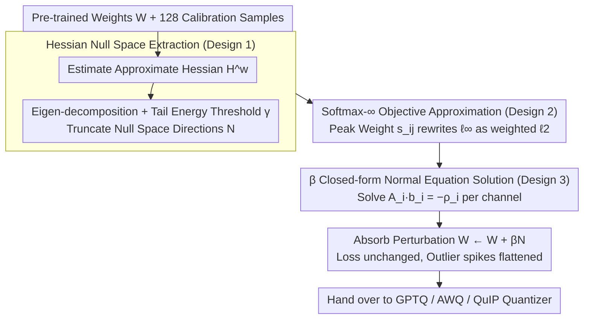

# OSAQ: Outlier Self-Absorption for Accurate Low-bit LLM Quantization

**Conference**: ICML 2026  
**arXiv**: [2605.04738](https://arxiv.org/abs/2605.04738)  
**Code**: None  
**Area**: Model Compression / LLM Weight-only Quantization  
**Keywords**: Weight-only quantization, Outlier suppression, Hessian null space, Additive transformation, Closed-form solution  

## TL;DR
OSAQ leverages the consistent low-rank null space of the Hessian across different inputs in LLM layers to construct an additive weight perturbation $\Delta W$ from a linear combination of null space vectors. This "self-absorbs" outlier weights without altering the second-order task loss, reducing the perplexity of 2-bit weight-only quantization by over 40% compared to vanilla GPTQ.

## Background & Motivation

**Background**: The bottleneck in LLM deployment resides in the memory bandwidth during the decoding stage (memory wall), making weight-only quantization (W4/W3/W2A16) a mainstream compression approach. Representative methods include GPTQ, which uses approximate Hessians for error compensation; AWQ, which performs per-channel scaling based on activation distributions; and QuIP/QuaRot/SpinQuant, which use orthogonal rotations to "flatten" outliers across other dimensions.

**Limitations of Prior Work**: All these methods essentially rely on **multiplicative equivalent transformations between adjacent layers** $(XW_1)W_2 = (XW_1T^{-1})(TW_2)$. In extreme low-bit scenarios such as 2-bit, multiplicative transformations alone struggle to suppress outlier spikes within the coverage of the quantization grid, leading to severe perplexity degradation.

**Key Challenge**: The multiplicative paradigm inevitably "transfers" the transformation to adjacent layers. It is limited by network topology (non-absorbable paths crossing Residuals or LayerNorm) and numerical range coupling, resulting in limited degrees of freedom for outlier suppression. Meanwhile, a large number of "loss-insensitive" directions within a single layer remain unutilized.

**Goal**: To find a **purely additive** outlier suppression method that **acts only on the current layer's weights**, **strictly avoids affecting second-order task loss**, and is **absorbed in a one-time offline process**.

**Key Insight**: The authors empirically found that while activation covariance structures vary significantly across different inputs, the **Hessian of the task loss with respect to weights exhibits a consistent low-rank structure across different samples**. A group of tail eigenvalues together accounts for only 0.01% of the energy, and these null space directions remain stable across samples. This implies the existence of a set of directions along which weight modifications barely affect the loss.

**Core Idea**: By taking a weighted sum of these Hessian null space vectors, the method constructs an additive perturbation $\Delta W = \beta \mathcal{N}$ to minimize $\|W + \Delta W\|_\infty$ and flatten outliers. Simultaneously, it ensures $\Delta w^\top H^w \Delta w \approx 0$ so that the loss remains nearly unchanged. Using a Softmax-$\infty$ approximation, the non-differentiable $\ell_\infty$ is rewritten as a weighted $\ell_2$ with a temperature coefficient, yielding a closed-form solution for $\beta$ without requiring training or iteration.

## Method

### Overall Architecture
OSAQ is a plug-and-play PTQ pre-processing step. Its goal is to "flatten" outlier spikes in each layer's weights offline without touching adjacent layers or affecting second-order task loss. Given a pre-trained LLM and a small amount of calibration data (128 samples, sequence length 2048), it processes each linear weight $W \in \mathbb{R}^{M\times N}$ independently: first, it estimates the approximate Hessian $H^w$ for the layer, performs eigen-decomposition, and truncates a set of "loss-insensitive" null space directions $\mathcal{N} \in \mathbb{R}^{K\times N}$ based on a tail energy threshold $\gamma$. It then calculates the combination coefficients $b_i$ for each output channel to form a coefficient matrix $\beta \in \mathbb{R}^{M\times K}$. Finally, it sets $W \leftarrow W + \beta\mathcal{N}$, absorbing the additive perturbation directly into the weights before passing them to an existing quantizer like GPTQ, AWQ, or QuIP. Since the perturbation falls within the null space and only modifies the current layer, the process adds no inference overhead.

### Key Designs

**1. Hessian Null Space Extraction: Identifying "Loss-Invariant" Directions**

The foundation of OSAQ is that moving weights without damaging the loss requires knowing which directions the loss is "indifferent" to. By performing a second-order Taylor expansion of the task loss with respect to weights, the dominant term is the Hessian term $\frac{1}{2}\Delta w^\top H^w \Delta w$. Thus, if the perturbation $\Delta w$ lies in the low-curvature directions of $H^w$, this term is approximately zero, and the loss remains nearly unchanged. Specifically, $H^w$ undergoes eigen-decomposition $H^w = V\,\mathrm{diag}(\lambda_1,\dots,\lambda_N)V^\top$. Eigenvalues are accumulated in ascending order of $|\lambda|$ until the tail energy reaches a threshold $\gamma\in(0,1)$, i.e., $K = \min_k\{\sum_{i=1}^k|\lambda_i| \ge \gamma\sum_{i=1}^N|\lambda_i|\}$. The corresponding first $K$ eigenvectors form the null space matrix $\mathcal{N}$. Using a "tail energy ratio" instead of a fixed numerical threshold is crucial; a fixed threshold might result in empty null spaces for some layers or dimension explosions for others, whereas the tail energy strategy ensures a roughly equal degree of freedom for each layer while guaranteeing low curvature.

**2. Softmax-$\infty$ Objective Approximation: Converting Non-differentiable Objectives to Weighted $\ell_2$**

With the null space directions, the actual optimization goal is to minimize the maximum absolute value of the weights after perturbation: $\min_\beta \|W + \beta\mathcal{N}\|_\infty$. This directly targets outlier spikes. However, $\ell_\infty$ is non-smooth and non-differentiable; solving it directly usually requires subgradient iterations like MagR, which are slow and lack closed-form solutions. OSAQ adopts a log-sum-exp/softmax trick from convex optimization (Boyd & Vandenberghe) to perform temperature normalization on absolute values, assigning each element a peak weight $s_{ij} = \exp(|W_{ij}|/\tau) / \sum_t \exp(|W_{it}|/\tau)$. As the temperature $\tau\to0^+$, $s_{ij}$ concentrates on the "maximum element," so the weighted sum of squares $\sum_j s_{ij}(W_{ij}+\cdot)^2$ approximately penalizes only the peak. This preserves the focus on outliers while allowing for a normal equation solution since the objective returns to a squared loss.

**3. Closed-form Normal Equation Solution for $\beta$: Solving Independent Linear Systems per Channel**

Combining the previous steps, the objective for the $i$-th output channel becomes $\min_{b_i} \tfrac{1}{2}\sum_j s_{ij}(W_{ij}+b_i^\top n_j)^2 + \tfrac{\mu_1}{2}\|b_i\|_2^2 + \tfrac{\mu_2}{2}(b_i^\top v)^2$. The three terms are peak-weighted fitting, $\ell_2$ regularization to prevent large coefficients, and anti-translation regularization to avoid uniform channel shifts. Setting the first-order condition to zero yields $A_i b_i = -\rho_i$, where $A_i = \sum_j s_{ij}n_j n_j^\top + \mu_1 I_K + \mu_2 v v^\top$. Since $A_i \succeq \mu_1 I_K \succ 0$ is strictly positive definite, the optimal solution $b_i^\ast = -A_i^{-1}\rho_i$ is unique. Stacking the solutions for $M$ channels yields $\beta^\ast$. This means there is no hyperparameter search for training, no convergence issues, and no GPU training required—the end-to-end process is merely one eigen-decomposition and one $K\times K$ matrix inversion per channel, processing all layers of a 70B model in minutes.

### Loss & Training
OSAQ has no training loss; the entire process follows a PTQ calibration style. $H^w$ is estimated using 128 samples with a sequence length of 2048. The only hyperparameters involved are the tail energy threshold $\gamma$, temperature $\tau$, and regularization coefficients $\mu_1, \mu_2$. The authors use a simple grid search to demonstrate that the results are robust to these values. It is orthogonal to and plug-and-play with downstream quantizers (GPTQ/AWQ/QuIP). In extreme 2-bit settings, coordinate descent iterations (denoted as $\dagger$) can be added to further reduce perplexity.

## Key Experimental Results

### Main Results
Models include LLaMA2-{7B, 13B, 70B}, LLaMA3-{8B, 70B}, Mistral-Large-123B-Instruct, and Llama-3.1-405B-Instruct. Evaluations cover language generation (WikiText2 / C4 Perplexity), commonsense QA (PIQA / ARC / WinoGrande zero-shot accuracy), MMLU, and MT-Bench. Baselines include GPTQ, AWQ, QuIP, MagR, and OmniQuant.

| Model / Setting | Metric | FP16 | GPTQ | OSAQ+GPTQ | Gain |
|---|---|---|---|---|---|
| LLaMA2-7B W4A16 | WikiText2 PPL | 5.47 | 5.83 | **5.73** | -0.10 |
| LLaMA2-13B W4A16 | WikiText2 PPL | 4.88 | 5.13 | **5.04** | -0.09 |
| LLaMA3-70B W4A16 | WikiText2 PPL | 2.90 | 3.60 | **3.42** | -0.18 |
| LLaMA3-70B W4A16 | C4 PPL | 6.90 | 7.40 | **7.24** | -0.16 |
| LLaMA2-7B W4A16 | C4 PPL | 6.97 | 7.37 | **7.34** | -- |

Results combined with AWQ are similar: on LLaMA3-8B, OSAQ+AWQ reduces WikiText2 PPL from 7.10 to 6.82 and C4 PPL from 10.1 to 9.93. The "40% perplexity reduction compared to vanilla GPTQ" emphasized in the abstract refers to the results of OSAQ$^\dagger$+GPTQ in the extreme W2A16 setting.

### Ablation Study

| Configuration | LLaMA2-7B WikiText2 W4A16 PPL | Description |
|---|---|---|
| Vanilla GPTQ | 5.83 | GPTQ only |
| OSAQ+GPTQ | 5.73 | With null space additive transformation |
| OSAQ+AWQ | 5.99 | Equally effective with AWQ |
| OSAQ+GPTQ (varying $\gamma$) | Insensitive to $\gamma$ | Robustness confirmed via grid search (Fig. 5) |
| Fixed Threshold Null Space | Unbalanced layer dimensions | Tail energy strategy proven necessary |

### Key Findings
- The low-rank structure of the Hessian is highly consistent across different inputs: projecting null spaces calculated from different batches onto a 2D plane shows they nearly overlap (Figure 1, right), whereas input null spaces diverge. This is the experimental foundation of OSAQ.
- As the model scale increases and bit-width decreases, the relative gain from OSAQ becomes more significant, aligning with the observation that outliers intensify with scale.
- OSAQ is orthogonal to all multiplicative transformation methods (scaling/rotation). Combining it with any of them yields stable improvements, indicating it utilizes "intra-layer degrees of freedom" that the multiplicative paradigm cannot cover.

## Highlights & Insights
- The perspective of "perturbation directions that do not affect loss" transforms the quantization outlier problem into an **optimization within the $H^w$ null space**, representing a elegant transfer from the traditional OBS (Optimal Brain Surgeon) approximation to the LLM era.
- The Softmax-$\infty$ approximation converts the non-differentiable $\ell_\infty$ into a weighted $\ell_2$ with temperature, enabling a closed-form solution and avoiding the expensive iterations of MagR. This technique can be applied to many "minimax with closed-form" scenarios.
- The orthogonality between "additive vs. multiplicative" equivalent transformations identifies a new axis: future PTQ designs can simultaneously consider the topological constraints of multiplicative transformations and the null-space utilization of additive transformations.

## Limitations & Future Work
- Calibration relies on approximate Hessians (actually using Fisher / empirical second-order estimates), making it sensitive to calibration data distribution; the stability of the null space under distribution shift needs further verification.
- Currently, each layer is processed independently without considering cumulative perturbations across layers; the second-order approximation of global loss may become inaccurate after stacking multiple layers.
- The code has not been released, and the engineering costs for Hessian estimation and eigen-decomposition on ultra-large models (405B) were not discussed in detail.

## Related Work & Insights
- **vs GPTQ**: GPTQ uses the Hessian for error compensation during quantization ("post-repair"). OSAQ uses the Hessian null space to flatten weights before quantization ("pre-processing"). The two are naturally complementary.
- **vs AWQ / QuIP / SpinQuant**: These methods rely on multiplicative transformations (scaling or rotation) between adjacent layers, which are limited by network topology. OSAQ uses intra-layer additive transformations, filling the gaps in the multiplicative paradigm.
- **vs MagR**: MagR also minimizes $\ell_\infty$ but uses iterative subgradient solvers. OSAQ achieves a closed-form solution via Softmax-$\infty$ approximation, making it an order of magnitude more efficient.

## Rating
- Novelty: ⭐⭐⭐⭐⭐ "Additive transformation + Hessian null space" is a rare and fresh perspective in LLM quantization.
- Experimental Thoroughness: ⭐⭐⭐⭐ Covers a full spectrum from 7B to 405B and multiple baselines, though detailed W2A16 ablation is less transparent.
- Writing Quality: ⭐⭐⭐⭐ Rigorous mathematical derivation and smooth narrative; null space consistency illustrations are highly persuasive.
- Value: ⭐⭐⭐⭐⭐ Plug-and-play, zero overhead, and combinable with all existing PTQ methods, making it friendly for industrial deployment.

<!-- RELATED:START -->

## Related Papers

- [\[ICML 2026\] NeUQI: Near-Optimal Uniform Quantization Parameter Initialization for Low-Bit LLMs](neuqi_near-optimal_uniform_quantization_parameter_initialization_for_low-bit_llm.md)
- [\[ICML 2026\] TWLA: Achieving Ternary Weights and Low-Bit Activations for LLMs via Post-Training Quantization](twla_achieving_ternary_weights_and_low-bit_activations_for_llms_via_post-trainin.md)
- [\[ACL 2025\] Accurate KV Cache Quantization with Outlier Tokens Tracing](../../ACL2025/model_compression/accurate_kv_cache_quantization_with_outlier_tokens_tracing.md)
- [\[ICML 2026\] LFQ: Logit-aware Final-block Quantization for Boosting the Generation Quality of Low-Bit Quantized LLMs](lfq_logit-aware_final-block_quantization_for_boosting_the_generation_quality_of_.md)
- [\[ICLR 2026\] SSDi8: Accurate and Efficient 8-bit Quantization for State Space Duality](../../ICLR2026/model_compression/ssdi8_accurate_and_efficient_8-bit_quantization_for_state_space_duality.md)

<!-- RELATED:END -->
