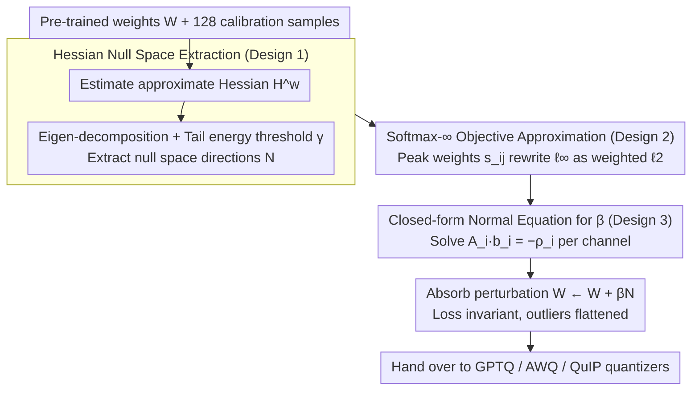

# OSAQ: Outlier Self-Absorption for Accurate Low-bit LLM Quantization

**Conference**: ICML 2026  
**arXiv**: [2605.04738](https://arxiv.org/abs/2605.04738)  
**Code**: None  
**Area**: Model Compression / LLM Weight-Only Quantization  
**Keywords**: Weight-only quantization, Outlier suppression, Hessian null space, Additive transformation, Closed-form solution  

## TL;DR
OSAQ leverages the consistent low-rank null space of LLM per-layer Hessians across various inputs. It linearly combines null space vectors into an additive weight perturbation $\Delta W$, "self-absorbing" outlier weights without altering the second-order task loss. This reduces the perplexity of 2-bit weight-only quantization by over 40% compared to vanilla GPTQ.

## Background & Motivation

**Background**: The bottleneck of LLM deployment lies in the memory bandwidth during the decoding stage (the memory wall), making weight-only quantization (W4/W3/W2A16) a mainstream compression technique. Representative methods include GPTQ, which uses approximate Hessians for error compensation; AWQ, which uses activation distributions for per-channel scaling; and QuIP/QuaRot/SpinQuant, which use orthogonal rotations to "flatten" outliers across other dimensions.

**Limitations of Prior Work**: All these methods essentially rely on **multiplicative equivalent transformations between adjacent layers** $(XW_1)W_2 = (XW_1T^{-1})(TW_2)$. In extreme low-bit scenarios such as 2-bit, multiplicative transformations alone struggle to compress outlier peaks into the range covered by the quantization grid, leading to severe perplexity degradation.

**Key Challenge**: The multiplicative paradigm inevitably "transfers" the transformation to preceding or succeeding layers. It is limited by network topology (e.g., non-absorbable paths crossing residuals or LayerNorm) and numerical range coupling, resulting in restricted degrees of freedom for outlier suppression. Meanwhile, a wealth of "loss-insensitive" directions within a single layer remains unutilized.

**Goal**: To find a **purely additive** outlier suppression method that **acts only on the weights of the current layer**, **strictly does not affect second-order task loss**, and is **absorbed offline in a single pass**.

**Key Insight**: The authors empirically found that while activation covariance structures vary significantly across inputs, the **Hessian of the task loss with respect to weights exhibits a consistent low-rank structure across different samples**. A tail section of eigenvalues collectively accounts for only 0.01% of the energy, and these null space directions remain stable across samples. This implies the existence of a set of directions along which weight modifications barely affect the loss.

**Core Idea**: By taking a weighted sum of these Hessian null space vectors, an additive perturbation $\Delta W = \beta \mathcal{N}$ is constructed to minimize $\|W + \Delta W\|_\infty$, thereby flattening outlier weights. Simultaneously, it ensures $\Delta w^\top H^w \Delta w \approx 0$ to keep the loss virtually unchanged. Using a Softmax-$\infty$ approximation, the non-differentiable $\ell_\infty$ objective is converted into a weighted $\ell_2$ with a temperature coefficient, allowing for a closed-form solution for $\beta$ without the need for training or iteration.

## Method

### Overall Architecture
OSAQ serves as a plug-and-play PTQ preprocessing step designed to "flatten" outlier peaks offline within each layer's weights without modifying adjacent layers or affecting the second-order task loss. Given a pre-trained LLM and a small amount of calibration data (128 sequences of length 2048), it executes a pipeline independently for each linear weight matrix $W \in \mathbb{R}^{M\times N}$: first, it estimates the approximate Hessian $H^w$ for that layer, performs eigen-decomposition, and extracts a set of "loss-insensitive" null space directions $\mathcal{N} \in \mathbb{R}^{K\times N}$ based on a tail energy threshold $\gamma$; then, it solves for the combination coefficients $b_i$ for each output channel to form a coefficient matrix $\beta \in \mathbb{R}^{M\times K}$; finally, it sets $W \leftarrow W + \beta\mathcal{N}$, directly absorbing the additive perturbation into the weights before passing them to an existing quantizer like GPTQ, AWQ, or QuIP. Since the perturbation lies in the null space and only modifies the current layer, the process incurs zero inference overhead.

### Key Designs

**1. Hessian Null Space Extraction: Finding "Loss-Neutral" Directions for Weight Modification**

The premise of OSAQ is that to shift weights without damaging performance, one must identify directions that the loss "does not care about." Applying a second-order Taylor expansion to the task loss with respect to weights, the dominant term is the Hessian term $\frac{1}{2}\Delta w^\top H^w \Delta w$. If the perturbation $\Delta w$ lies in the low-curvature directions of $H^w$, this term is approximately zero, leaving the loss nearly unchanged. Specifically, $H^w$ is decomposed as $H^w = V\,\mathrm{diag}(\lambda_1,\dots,\lambda_N)V^\top$. Eigenvalues are accumulated in ascending order of $|\lambda|$ until the tail energy reaches a threshold $\gamma\in(0,1)$, i.e., $K = \min_k\{\sum_{i=1}^k|\lambda_i| \ge \gamma\sum_{i=1}^N|\lambda_i|\}$. The first $K$ eigenvectors form the null space matrix $\mathcal{N}$. Using a "tail energy ratio" rather than a fixed threshold is critical: it prevents certain layers from having empty null spaces or excessive dimensions, ensuring each layer receives a similar amount of freedom while maintaining negligible curvature.

**2. Softmax-$\infty$ Objective Approximation: Converting Minimax to Weighted $\ell_2$**

Once null space directions are obtained, the optimization goal is to minimize the maximum absolute value of weights after perturbation: $\min_\beta \|W + \beta\mathcal{N}\|_\infty$. However, the $\ell_\infty$ norm is non-smooth. OSAQ employs the log-sum-exp/softmax technique from convex optimization to apply temperature-based normalization to absolute values. Each element is assigned a peak weight $s_{ij} = \exp(|W_{ij}|/\tau) / \sum_t \exp(|W_{it}|/\tau)$. As the temperature $\tau\to0^+$, $s_{ij}$ concentrates on the "maximum element," so the weighted squared sum $\sum_j s_{ij}(W_{ij}+\cdot)^2$ effectively penalizes only the peaks. This maintains the semantics of targeting outliers while returning the objective to a squared loss, which can be solved analytically.

**3. Closed-form Normal Equation for $\beta$: Solving Independent Linear Systems per Channel**

Combining the previous steps, for the $i$-th output channel, the objective becomes $\min_{b_i} \tfrac{1}{2}\sum_j s_{ij}(W_{ij}+b_i^\top n_j)^2 + \tfrac{\mu_1}{2}\|b_i\|_2^2 + \tfrac{\mu_2}{2}(b_i^\top v)^2$, where the three terms represent peak-weighted fitting, $\ell_2$ regularization to prevent large coefficients, and anti-translation regularization to avoid uniform channel shifts. Setting the first-order condition to zero results in $A_i b_i = -\rho_i$, where $A_i = \sum_j s_{ij}n_j n_j^\top + \mu_1 I_K + \mu_2 v v^\top$. Since $A_i \succeq \mu_1 I_K \succ 0$ is strictly positive definite, the optimal solution $b_i^\ast = -A_i^{-1}\rho_i$ is unique. Solving this across all $M$ channels yields $\beta^\ast$. The entire process involves no hyperparameter search, no convergence issues, and no GPU training—it consists only of one eigen-decomposition and one $K\times K$ matrix inversion per channel, allowing a 70B model to be processed in minutes.

### Loss & Training
OSAQ does not involve a training loss; the entire workflow follows a PTQ calibration style. It uses 128 sequences of length 2048 to estimate $H^w$. The only hyperparameters are the tail energy threshold $\gamma$, temperature $\tau$, and regularization coefficients $\mu_1, \mu_2$. The authors demonstrated robustness via grid search. OSAQ is orthogonal to downstream quantizers (GPTQ/AWQ/QuIP) and can be stacked with coordinate descent iteration (denoted as $\dagger$) to further lower perplexity in extreme 2-bit settings.

## Key Experimental Results

### Main Results
The models evaluated include LLaMA2-{7B, 13B, 70B}, LLaMA3-{8B, 70B}, Mistral-Large-123B-Instruct, and Llama-3.1-405B-Instruct. Evaluations span language generation (WikiText2 / C4 perplexity), commonsense QA (PIQA / ARC / WinoGrande zero-shot accuracy), MMLU, and MT-Bench. Baselines include GPTQ, AWQ, QuIP, MagR, and OmniQuant.

| Model / Setup | Metric | FP16 | GPTQ | OSAQ+GPTQ | Gain |
|---|---|---|---|---|---|
| LLaMA2-7B W4A16 | WikiText2 PPL | 5.47 | 5.83 | **5.73** | -0.10 |
| LLaMA2-13B W4A16 | WikiText2 PPL | 4.88 | 5.13 | **5.04** | -0.09 |
| LLaMA3-70B W4A16 | WikiText2 PPL | 2.90 | 3.60 | **3.42** | -0.18 |
| LLaMA3-70B W4A16 | C4 PPL | 6.90 | 7.40 | **7.24** | -0.16 |
| LLaMA2-7B W4A16 | C4 PPL | 6.97 | 7.37 | **7.34** | -- |

Combining with AWQ yields similar results: on LLaMA3-8B, OSAQ+AWQ reduced WikiText2 PPL from 7.10 to 6.82 and C4 PPL from 10.1 to 9.93. The 40% perplexity reduction highlighted in the abstract refers to the comparison between OSAQ$^\dagger$+GPTQ and vanilla GPTQ in extreme 2-bit (W2A16) scenarios.

### Ablation Study

| Configuration | LLaMA2-7B WikiText2 W4A16 PPL | Description |
|---|---|---|
| Vanilla GPTQ | 5.83 | GPTQ only |
| OSAQ+GPTQ | 5.73 | With null space additive transformation |
| OSAQ+AWQ | 5.99 | Equally effective when applied to AWQ |
| OSAQ+GPTQ (varying $\gamma$) | Insensitive to $\gamma$ | Grid search (Fig. 5) confirms robustness |
| Fixed threshold for null space | Unbalanced per-layer dimensionality | Energy-tail strategy is shown to be necessary |

### Key Findings
- The low-rank structure of the Hessian is highly consistent across different inputs: projecting null spaces calculated from different batches onto a 2D plane shows they nearly overlap (Figure 1, right), whereas input null spaces diverge. This provides the experimental foundation for OSAQ.
- The relative gain from OSAQ becomes more significant as model size increases and bit-width decreases, which aligns with the empirical observation that outliers worsen with scale.
- OSAQ is orthogonal to all multiplicative transformation methods (scaling/rotation). Stacking OSAQ with any of these methods leads to stable improvements, indicating that it successfully utilizes "intra-layer degrees of freedom" that multiplicative paradigms cannot reach.

## Highlights & Insights
- The perspective of "perturbation directions that do not affect loss" transforms the quantization outlier problem into an **optimization within the $H^w$ null space**, representing an elegant transfer of the Optimal Brain Surgeon (OBS) tradition to the LLM era.
- The Softmax-$\infty$ approximation converts non-differentiable $\ell_\infty$ into a weighted $\ell_2$ with temperature, enabling a closed-form solution and avoiding the expensive iterations of methods like MagR. This technique is useful for any scenario requiring an analytical minimax solution.
- The orthogonality between "additive vs. multiplicative" equivalent transformations identifies a new design axis: future PTQ methods can simultaneously consider the topological constraints of multiplicative transforms and the null space utilization of additive transforms.

## Limitations & Future Work
- Calibration relies on an approximate Hessian (typically Fisher or empirical second-order estimates), making it sensitive to the calibration data distribution. The stability of the null space under distribution shifts requires further verification.
- Currently, each layer is processed independently without considering cumulative perturbations across layers. The second-order approximation of the total loss may become inaccurate after stacking multiple layers.
- The code has not been released, presenting a barrier to reproduction. While results were provided for ultra-large models (405B), the engineering overhead for Hessian estimation and eigen-decomposition was not detailed.

## Related Work & Insights
- **vs GPTQ**: GPTQ uses the Hessian for error compensation during quantization (post-hoc repair); OSAQ uses the Hessian null space to flatten weights before quantization (pre-processing). They are naturally complementary.
- **vs AWQ / QuIP / SpinQuant**: These methods rely on multiplicative transformations (scaling or rotation) between adjacent layers, which are limited by network topology. OSAQ uses intra-layer additive transformations, making it independent of adjacent layers and filling the gaps left by multiplicative paradigms.
- **vs MagR**: MagR also minimizes $\ell_\infty$ but uses iterative subgradient descent. OSAQ achieves a closed-form solution via Softmax-$\infty$ approximation, making it an order of magnitude more efficient.

## Rating
- Novelty: ⭐⭐⭐⭐⭐ The "additive transformation + Hessian null space" is a rare and fresh perspective in LLM quantization.
- Experimental Thoroughness: ⭐⭐⭐⭐ Covers 7B-405B models and stacks multiple baselines, though detailed W2A16 ablations were not fully open.
- Writing Quality: ⭐⭐⭐⭐ Rigorous mathematical derivation and smooth motivation; the null space consistency illustrations are highly convincing.
- Value: ⭐⭐⭐⭐⭐ Plug-and-play, zero overhead, and compatible with all existing PTQ methods, making it highly friendly for industry deployment.

<!-- RELATED:START -->

## Related Papers

- [\[ICML 2026\] NeUQI: Near-Optimal Uniform Quantization Parameter Initialization for Low-Bit LLMs](neuqi_near-optimal_uniform_quantization_parameter_initialization_for_low-bit_llm.md)
- [\[ACL 2025\] Accurate KV Cache Quantization with Outlier Tokens Tracing](../../ACL2025/model_compression/accurate_kv_cache_quantization_with_outlier_tokens_tracing.md)
- [\[ICML 2026\] LFQ: Logit-aware Final-block Quantization for Boosting the Generation Quality of Low-Bit Quantized LLMs](lfq_logit-aware_final-block_quantization_for_boosting_the_generation_quality_of_.md)
- [\[ICML 2026\] NanoQuant: Efficient Sub-1-Bit Quantization of Large Language Models](nanoquant_efficient_sub-1-bit_quantization_of_large_language_models.md)
- [\[NeurIPS 2025\] ParetoQ: Improving Scaling Laws in Extremely Low-bit LLM Quantization](../../NeurIPS2025/model_compression/paretoq_improving_scaling_laws_in_extremely_low-bit_llm_quantization.md)

<!-- RELATED:END -->
