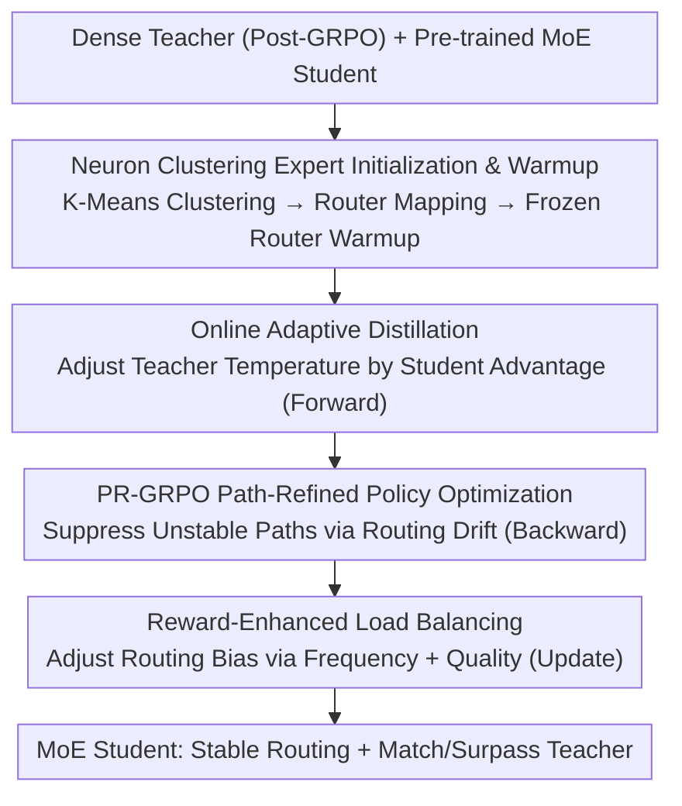

# PADD: Path-Aligned Decompression Distillation for Non-Router Teacher to Guide MoE Student Learning

**Conference**: ICML 2026  
**arXiv**: [2606.10369](https://arxiv.org/abs/2606.10369)  
**Code**: TBD  
**Area**: Model Compression / Knowledge Distillation / MoE / Reinforcement Learning  
**Keywords**: Dense-to-MoE Distillation, Expert Routing, Neuron Clustering Initialization, Online Adaptive Distillation, GRPO

## TL;DR
PADD decomposes the task of "guiding a pre-trained MoE student to learn high-quality routing using a dense teacher without a router" into a unified two-stage, four-step pipeline. By first initializing and warming up student experts through teacher FFN neuron clustering, and then simultaneously performing online adaptive distillation, path-refined policy optimization (PR-GRPO), and reward-enhanced load balancing in a single training run, PADD enables small-activation MoE students to match or even surpass 7B dense teachers in mathematical reasoning at the same inference cost.

## Background & Motivation
**Background**: While model scales continue to grow, dense models encounter bottlenecks in training throughput, inference latency, and memory bandwidth under fixed compute budgets. Mixture-of-Experts (MoE) decouples "parameter capacity" from "inference FLOPs per token" via sparsely activated expert sub-networks, providing a mainstream path for "decompressing" entangled dense representations into structured expert modules.

**Limitations of Prior Work**: Most high-quality models remain dense. Training MoE from scratch is expensive, and MoE-to-MoE distillation lacks generality due to expert decomposition and routing policy incompatibility. "Dense Teacher to MoE Student" distillation is highly desirable—as it allows selecting the best dense teacher per domain without increasing inference cost—but faces a fundamental obstacle: **MoE operates via routing decisions, whereas dense models lack an explicit router**.

**Key Challenge**: The lack of routing supervision from the dense teacher triggers four structural issues: ① **Router cold start**: New routers learning from scratch fail to distinguish syntactic from reasoning tokens, causing logical noise to diffuse randomly (logic diffusion); ② **Capacity gap**: When the student's active parameters per token are significantly smaller than the teacher's, they fail to absorb fine-grained logits; ③ **Path rupture**: Discrete routing jumps break the continuity of the Chain-of-Thought, destabilizing gradients; ④ **Expert homogenization**: Traditional load balancing focus only on activation frequency, ignoring expert quality and leading to uniform, unspecialized experts. Conventional distillation only aligns outputs and fails to transfer "internal processing preferences." Existing stable routing methods like RSPO/StableMoE/R3 assume an existing expert structure and cannot recover path-level semantics from a dense teacher.

**Goal**: To transfer the implicit modular structure and routing preferences of a router-less dense teacher into a pre-trained MoE student with an existing router under fixed inference budgets. This setup is complementary to sparse upcycling; PADD does not rebuild the expert structure but restores and stabilizes the existing one.

**Core Idea**: PADD employs "Path-Aligned Decompression Distillation" to address the four aforementioned issues in a single pipeline: solving cold start and homogenization at the source during initialization, and addressing the capacity gap, path rupture, and quality imbalance during forward, backward, and update steps.

## Method

### Overall Architecture
PADD organizes dense-to-MoE distillation into **two stages and four steps**. Stage I (Initialization) clusters teacher FFN neurons to construct the target functional structure for student experts and performs expert warmup with a frozen router. Stages II–IV are executed **concurrently in a single training run** on a data subset $\mathcal{D}_C$: Stage II (Online Adaptive Distillation) during the forward pass, Stage III (PR-GRPO) during the backward pass, and Stage IV (Reward-Enhanced Load Balancing) during parameter updates. Data is split into four non-overlapping subsets: $\mathcal{D}_A$ for clustering statistics, $\mathcal{D}_B$ for expert warmup, $\mathcal{D}_C$ for main training, and $\mathcal{D}_D$ for evaluation. Standard GRPO is applied to the dense teacher before training to ensure it learns effective reasoning strategies for distillation.

### Key Designs

**1. Neuron Clustering Expert Initialization & Warmup (Stage I)**

Initialization addresses router cold start and homogenization by excavating the implicit modular structure from the dense teacher's FFN. Each row $w_k$ in the teacher’s FFN first linear layer $W_1$ represents a neuron weight vector. PADD performs **K-Means clustering with cardinality constraints** on $w_k$ to partition neurons into $N$ clusters $C_j$ ($|C_j|=d_{ff}/N$), each corresponding to a student expert $E_{j,\mathrm{S}}$:

$$\min_{C}\sum_{j=1}^{N}\sum_{k\in C_j}\|w_k-\mu_j\|^2,\quad \text{s.t. } |C_j|=\frac{d_{ff}}{N}$$

Cluster centroids $\mu_j$ are mapped to router linear layer weights for initialization. Subsequently, the **router is frozen with uniform routing $1/N$** during a warmup phase on $\mathcal{D}_B$. This ensures each expert receives equal training signals before learning specialized routing. The warmup loss is: $\mathcal{L}_{\text{warmup}}=\mathcal{L}_{\text{LM}}+\alpha\mathcal{L}_{\text{KD}}+\beta\mathcal{L}_{\text{init}}$, where $\mathcal{L}_{\text{init}}=\sum_{j=1}^{N}\mathrm{KL}(p_{j,\mathrm{S}}\|p_{j,\mathrm{T}})$ aligns student expert activations with teacher clusters.

**2. Online Adaptive Distillation: Bridging the Capacity Gap (Stage II)**

Fixed-temperature distillation fails to bridge the capacity gap between a 7B teacher and a 3.3B active parameter student. PADD adaptively supervises the teacher along the student’s actual routing path during the forward pass. For $G$ sampled student responses, the relative group advantage $A_{i,\mathrm{S}}=(r(x,y_i)-\bar r)/\sigma_r$ evaluates the path quality, which is used to modulate the teacher's logit temperature:

$$p^{*}_{\mathrm{T}}(y|x)=\mathrm{Softmax}\!\left(\frac{\text{Logits}_{\mathrm{T}}}{\tau\cdot\Phi(A_{i,\mathrm{S}})}\right),\qquad \Phi(A_{i,\mathrm{S}})=1+\tanh(\kappa A_{i,\mathrm{S}})$$

This "advantage-temperature coupling" ensures that when $A_{i,\mathrm{S}}>0$ (good path), the effective temperature decreases to provide confident supervision; when $A_{i,\mathrm{S}}<0$ (poor path), the temperature increases to encourage exploration.

**3. PR-GRPO Path-Refined Policy Optimization: Stabilizing Gradients (Stage III)**

Discrete Top-$K$ routing jumps between steps can destabilize policy gradients. PR-GRPO explicitly measures **routing drift** $\Gamma_{i,t,\mathrm{S}}=\|G_{\theta,\mathrm{S}}(x_t)-G_{\theta_{\text{old}},\mathrm{S}}(x_t)\|_2$ and incorporates it into the importance ratio:

$$\hat\rho_t(\theta)=\frac{\pi_{\theta,\mathrm{S}}(a_t|s_t)}{\pi_{\theta_{\text{old}},\mathrm{S}}(a_t|s_t)}\cdot\exp\!\big(-\lambda\cdot\Gamma_{i,t,\mathrm{S}}\cdot\mathbb{I}(A_{i,\mathrm{S}}<0)\big)$$

The exponential term downweights samples on unstable and poor paths ($A_{i,\mathrm{S}}<0$), while stable or high-quality paths remain unpenalized. This significantly improves the stability of MoE reinforcement learning.

**4. Reward-Enhanced Load Balancing: Fighting Homogenization (Stage IV)**

Traditional load balancing only enforces activation frequency $\bar f=1/N$, ignoring expert performance. PADD injects both "frequency" and "quality" into routing biases during parameter updates. For expert $j$, PADD tracks activation frequency $f_{j,\mathrm{S}}$ and an EMA of group advantage $A_{j,\mathrm{S}}$ ($\text{EMA}(A_{j,\mathrm{S}})_u$) to update the bias:

$$b_{j,\mathrm{S}}^{(\text{new})}=b_{j,\mathrm{S}}^{(\text{old})}+\eta(f_{j,\mathrm{S}}-\bar f)+\gamma\cdot\text{EMA}(A_{j,\mathrm{S}})_u$$

The bias is added to the router logits before Top-$K$ selection, promoting "general flow balance + preference for high-quality experts."

### Loss & Training
The warmup phase uses $\mathcal{L}_{\text{warmup}}=\mathcal{L}_{\text{LM}}+\alpha\mathcal{L}_{\text{KD}}+\beta\mathcal{L}_{\text{init}}$. Main training utilizes the PR-GRPO objective $\mathcal{J}_{\text{PR-GRPO}}$ with verifiable rule-based rewards (RLVR, primarily exact match and format consistency). Stages II–IV operate as co-dependent mechanisms within each training step across forward, backward, and update operations.

## Key Experimental Results

### Main Results
Testing on two families: Qwen (Qwen2.5-Math-7B Dense → Qwen3-30B-A3B MoE, 3.3B active) and DeepSeek (DeepSeek-Math-7B → DeepSeek-V2-Lite, 2.4B active).

| Method | Qwen Family Avg | DeepSeek Family Avg | Description |
|------|--------------|-------------------|------|
| Teacher (GRPO) | 77.7 | 58.1 | 7B Dense Teacher (Upper bound) |
| Base (Untrained) | 72.9 | 37.2 | Pre-trained MoE Student |
| Dense-GRPO | 53.5 | 45.6 | Dense model with same active params |
| MoE-Vanilla-GRPO | 71.4 | 46.8 | GRPO only, no distillation |
| GSPO | 76.3 | 53.2 | Sequence-level ratio variant |
| RSPO | 77.2 | 54.3 | Routing drift weighting |
| Online KD | 73.6 | 46.7 | Online KD + GRPO |
| **Ours (PADD)** | **80.2** | **55.2** | Four-stage unified pipeline |

PADD **surpasses the 7B teacher** in the Qwen family (80.2% vs 77.7%) and closely approaches the teacher in the DeepSeek family. Compared to MoE-Vanilla-GRPO, PADD shows an 8.8%/8.4% gain, proving that improvements stem from the four-stage design rather than student capacity alone.

### Ablation Study
Ablations on the Qwen family:
- **w/o Stage I**: OlympiadBench −10.4. Using random initialization causes the router to fail in distinguishing token types, leading to expert collapse into noise.
- **w/o Stage II**: OlympiadBench −9.9. Fixed temperature prevents bridging the 7B → 3.3B capacity gap.
- **w/o Stage III**: Minerva −3.8. Standard GRPO exhibits routing jumps that disrupt CoT continuity.
- **w/o Stage IV**: Avg −0.6 to −1.5. Performance degrades slightly due to slower expert specialization.

### Key Findings
- **Stages I and II are critical**: Removing either leads to a ~10% drop on difficult benchmarks, indicating that structural initialization and adaptive distillation are the core pillars.
- **Generalization without Degradation**: Evaluation on MMLU-Pro and Code shows that PADD maintains general capabilities (only 0.2-0.4% drop from Base), whereas Vanilla-GRPO drops significantly (~3.5% on LiveCodeBench).
- **Expert-Subdomain Alignment**: NMI and ESI scores confirm that Stage I initialization successfully induces specialized experts compared to random initialization.

## Highlights & Insights
- **FFN Neurons as Implicit Experts**: Excavating the modular structure of a dense FFN via K-Means is a clever way to bridge the architecture gap between dense and MoE models.
- **Advantage-Temperature Coupling**: Passing the "supervision intensity" decision to the student's current performance elegantly handles the "hard vs. soft" trade-off in distillation across capacity gaps.
- **Routing Drift as a Stabilizer**: PR-GRPO turns MoE routing instability into a differentiable suppression term that only penalizes "poor and jittery" samples.
- **Load Balancing via Quality**: Incorporating reward EMA into routing bias solves the homogenization problem inherent in frequency-only balancing.

## Limitations & Future Work
- **Teacher Dependence**: Effectiveness is capped by the 7B dense teacher's modular clarity and reasoning quality.
- **Domain Specificity**: Primarily validated on mathematical reasoning; cross-domain performance (code/chat) requires more comprehensive validation.
- **Hyperparameter Complexity**: The method introduces multiple coefficients ($\alpha, \beta, \kappa$, etc.) and a complex four-stage data partitioning scheme.
- **MoE Requirement**: Specifically requires an "already pre-trained" MoE student, limiting its use in scenarios without existing MoE checkpoints.

## Related Work & Insights
- **vs Sparse Upcycling**: While upcycling builds experts from dense weights, PADD restores routing preferences in existing expert structures, making them complementary settings.
- **vs RSPO/StableMoE**: These methods stabilize routing in trained MoE models but cannot recover path semantics from dense teachers.
- **vs Online KD**: Fixed-temperature KD fails to bridge capacity gaps or preserve general skills as effectively as PADD's adaptive mechanism.

## Rating
- Novelty: ⭐⭐⭐⭐⭐ 
- Experimental Thoroughness: ⭐⭐⭐⭐ 
- Writing Quality: ⭐⭐⭐⭐ 
- Value: ⭐⭐⭐⭐⭐ 

<!-- RELATED:START -->

## Related Papers

- [\[ACL 2026\] Find Your Optimal Teacher: Personalized Data Synthesis via Router-Guided Multi-Teacher Distillation](../../ACL2026/model_compression/find_your_optimal_teacher_personalized_data_synthesis_via_router-guided_multi-te.md)
- [\[ECCV 2024\] Adversarially Robust Distillation by Reducing the Student-Teacher Variance Gap](../../ECCV2024/model_compression/adversarially_robust_distillation_by_reducing_the_student-teacher_variance_gap.md)
- [\[CVPR 2026\] Masking Teacher and Reinforcing Student for Distilling Vision-Language Models](../../CVPR2026/model_compression/masking_teacher_and_reinforcing_student_for_distilling_vision-language_models.md)
- [\[CVPR 2026\] Memory-Efficient Transfer Learning with Fading Side Networks via Masked Dual Path Distillation](../../CVPR2026/model_compression/memory_efficient_transfer_learning_with_fading_side_networks.md)
- [\[ICML 2026\] xKV: Cross-Layer KV-Cache Compression via Aligned Singular Vector Extraction](xkv_cross-layer_kv-cache_compression_via_aligned_singular_vector_extraction.md)

<!-- RELATED:END -->
