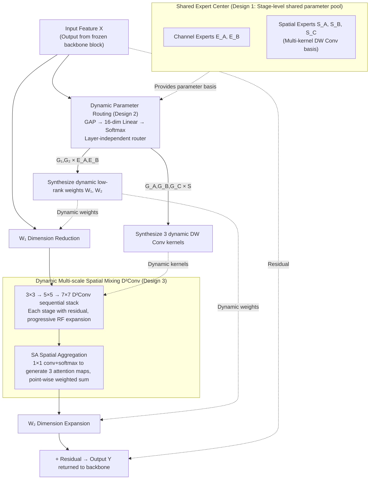

# Parameters as Experts: Adapting Vision Models with Dynamic Parameter Routing

**Conference**: ICML 2026  
**arXiv**: [2602.06862](https://arxiv.org/abs/2602.06862)  
**Code**: https://github.com/LMMMEng/ParaX  
**Area**: Model Compression / Parameter-Efficient Fine-Tuning  
**Keywords**: PEFT, MoE Adapter, Shared Expert Center, Dynamic Parameter Routing, Dense Prediction  

## TL;DR
The authors treat "parameters themselves as experts"—maintaining a per-stage shared trainable parameter reservoir (shared expert center). A lightweight router **dynamically synthesizes** weights for low-rank projections and multi-scale depthwise convolutions for each ParaX adapter based on the current input. This simultaneously addresses the "input-agnosticism" and "cross-layer redundancy" of traditional adapters, consistently surpassing full fine-tuning with <5% trainable parameters on dense prediction tasks.

## Background & Motivation

**Background**: Parameter-Efficient Fine-Tuning (PEFT) for vision models is currently divided into two main categories: the prompt-based approach (e.g., VPT), which inserts learnable tokens into the input sequence, and the adapter-based approach (e.g., LoRA, AdaptFormer, Mona), which embeds pairs of low-rank matrices $W_1\in\mathbb{R}^{C\times\hat C}, W_2\in\mathbb{R}^{\hat C\times C}$ into each layer. Currently, the adapter approach demonstrates a clear advantage in dense prediction tasks (segmentation, detection), with Mona further strengthening spatial modeling by integrating multi-kernel depthwise convolutions into the adapter.

**Limitations of Prior Work**: The authors empirically identify two "fatal flaws" in existing adapters.

- **Representation Deficiency**: Once finished training, adapter weights are **input-agnostic**. Visualizing Swin-L fine-tuned with Mona or AdaptFormer on COCO using Effective Receptive Field (ERF) reveals that the ERF is significantly smaller than that of full fine-tuning. This implies that low-rank, input-independent transformations cannot customize optimal spatial responses for different image contents.
- **Feature Redundancy**: Parameters of adapters in different layers are isolated. CKA analysis shows that patterns learned by different layers are extremely similar, indicating a lack of explicit information interaction across layers and redundant learning of the same features.

**Key Challenge**: Under strict parameter budgets (LoRA-style, a few million trainable parameters), **static and isolated** low-rank adapters cannot adapt to inputs nor utilize cross-layer information flow, resulting in "universal but mediocre" transformations. Fixing these issues cannot be achieved by simply increasing $\hat C$ (which exceeds the parameter budget) or forcing adapters to share the same set of weights (which forces all layers to perform identical transformations, causing representation collapse).

**Goal**: (1) Enable adapter weights to change dynamically with the input to recover the ERF; (2) Establish implicit information flow between layers to reduce CKA redundancy; (3) Achieve both without significantly increasing the trainable parameter budget.

**Key Insight**: Transfer the concept of "using a router to select different experts" from MoE **to the parameter level**. Here, an "expert" is not a sub-network but a **trainable parameter matrix** of the same size. Different layers share the same set of experts, but each layer has its own router providing different mixing coefficients. This achieves both "input-dependency" (as the router views the input) and "cross-layer coupling" (as shared experts must serve multiple layers, forcing them to learn versatile yet diverse bases).

**Core Idea**: Deploy a **shared expert center** (a collection of trainable parameter matrices) in each stage. Each layer's ParaX module uses an ultra-lightweight router to **linearly mix** these into unique low-rank projections and multi-scale depthwise convolution kernels for the current input and layer. Parameters are experts, and routing is synthesis.

## Method

### Overall Architecture
ParaX aims to make adapter weights dynamic relative to inputs and shared across layers without exceeding the PEFT parameter budget. Using a four-stage hierarchical backbone (Swin / ConvNeXt) as an example: each stage is equipped with a shared expert center, and each building block contains a ParaX adapter (Swin blocks place them after both token mixer and channel mixer; ConvNeXt blocks place one after the entire residual module). During the forward pass, each adapter independently uses a lightweight router to read current input features and output dynamic coefficients. These coefficients linearly synthesize a layer-specific $W_1, W_2$ and three-scale depthwise convolution kernels from the expert center. These dynamic weights then perform a low-rank transformation (dimension reduction → multi-scale spatial mixing → dimension expansion) on the input, which is returned to the backbone via a residual connection. No additional trainable parameters are introduced except for the expert center, routers, and task heads; the backbone remains frozen.

The flowchart below illustrates the forward process of a single ParaX adapter: solid lines represent the feature data flow, and dashed lines represent the dynamic weights synthesized by the router using the parameter basis from the expert center.

### Key Designs

**1. Shared Expert Center: Sharing parameters at the expert pool level to fix cross-layer redundancy and representation collapse**

This addresses the adapter dilemma—isolating parameters across layers leads to CKA redundancy (repetitive patterns), while direct weight sharing forces identical transformations and representation collapse. ParaX maintains a pool of trainable parameter matrices at the stage granularity as a "base" for dynamic synthesis: channel-wise low-rank projection experts are stored in pairs $\mathbf{E}_A\in\mathbb{R}^{M\times C\times\hat C},\ \mathbf{E}_B\in\mathbb{R}^{M\times\hat C\times C}$, where expert capacity $M$ and adapter hidden dimension $\hat C$ are core hyperparameters. Spatial experts $\mathbf{S}_A, \mathbf{S}_B, \mathbf{S}_C\in\mathbb{R}^{M\times\hat C\times K_i^2}$ are added for different kernel sizes. All ParaX modules pull weights from the same stage-level expert center, but each has its own router. Sharing occurs at the pool level rather than the adapter level, achieving cross-layer coupling while retaining diverse representation.

**2. Dynamic Parameter Routing: Linear mixing instead of sparse MoE to recover input-dependency and maintain stability**

This directly addresses "Representation Deficiency." ParaX allows weights to be synthesized based on the input: input $\mathbf{X}\in\mathbb{R}^{HW\times C}$ undergoes GAP to get a channel descriptor, passes through a linear layer to reach a 16-dimensional hidden vector, and then two parallel linear layers with softmax generate gating vectors $\mathbf{G}_1, \mathbf{G}_2\in\mathbb{R}^M$. Dynamic weights are synthesized via tensor contraction: $\mathbf{W}_1=\sum_{m=1}^M \mathbf{G}_1[m]\,\mathbf{E}_A[m]\in\mathbb{R}^{C\times\hat C}$ and $\mathbf{W}_2=\sum_{m=1}^M \mathbf{G}_2[m]\,\mathbf{E}_B[m]\in\mathbb{R}^{\hat C\times C}$, followed by a standard LoRA-style residual update $\mathbf{Y}=\mathbf{X}+\sigma(\mathbf{X}\mathbf{W}_1)\mathbf{W}_2$. Replacing "top-k" sparse selection with "full linear mixing" retains input-dependency while avoiding training instability, with complexity reducing to an $O(M)$ weighted sum. The router's hidden dimension is compressed to 16 to ensure minimal parameter overhead.

**3. Dynamic Multi-scale Spatial Mixing (D²Conv): Synthesizing convolution kernels to boost dense prediction**

ParaX extends dynamics to the spatial domain: the router outputs three additional gates $\mathbf{G}_A, \mathbf{G}_B, \mathbf{G}_C\in\mathbb{R}^M$ to synthesize three dynamic depthwise convolution kernels (e.g., $3\times3, 5\times5, 7\times7$). Spatial mixing uses a sequential stack with residual shortcuts to progressively expand the RF. Finally, a Spatially-varying Aggregation (SA) module uses a $1\times1$ conv and softmax to generate three spatial attention maps, which are used to weight and sum the three-scale features. This depthwise dynamic convolution meets the PEFT budget constraints. The SA module allows for further fine-tuning of scale selection at each pixel location.

### Loss & Training
ParaX operates in a pure PEFT setting: the backbone is frozen, and only the expert centers, routers, and task heads are trained. Standard training recipes are used (e.g., UperNet/ADE20K for 160K iterations; Mask R-CNN/COCO). The expert capacity $M$ and hidden dimension $\hat C$ control the budget.

## Key Experimental Results

### Main Results

Comparison on ADE20K (mIoU) and COCO2017 (AP$^b$/AP$^m$):

| Backbone | Method | Trainable Params (M) | ADE20K mIoU | COCO AP$^b$ | COCO AP$^m$ |
|---|---|---|---|---|---|
| Swin-B | Full fine-tuning | 86.8 | 50.2 | 47.5 | 42.8 |
| Swin-B | LoRA | 5.4 | 49.4 | 40.1 | 38.5 |
| Swin-B | Mona | 5.2 | 49.8 | 46.6 | 42.4 |
| Swin-B | **ParaX** | **5.2** | **50.3** | **47.3** | **42.7** |
| Swin-L | Full fine-tuning | 195.0 | 51.2 | 48.6 | 43.8 |
| Swin-L | Mona | 7.5 | 51.6 | 48.1 | 43.9 |
| Swin-L | **ParaX** | **7.3** | **52.0** | **48.6** | **44.0** |
| ConvNeXt-B | Full fine-tuning | 87.6 | 51.4 | 47.8 | 43.0 |
| ConvNeXt-B | Mona | 6.5 | 50.7 | 47.5 | 43.2 |
| ConvNeXt-B | **ParaX** | **6.5** | **51.1** | **48.0** | **43.5** |
| ConvNeXt-L | Full fine-tuning | 196.2 | 52.4 | 48.1 | 43.2 |
| ConvNeXt-L | Mona | 9.1 | 51.5 | 48.9 | 44.4 |
| ConvNeXt-L | **ParaX** | **9.2** | **52.0** | **49.5** | **44.8** |

**Gain**: ParaX achieves the best performance across all settings. For large models like Swin-L and ConvNeXt-L, it outperforms full fine-tuning with <5% parameters. ERF/CKA visualizations confirm ParaX's ERF is close to full fine-tuning while cross-layer redundancy is significantly reduced.

### Ablation Study: Cross-task Transferability (Panoptic Segmentation, COCO2017)

| Backbone | Method | Params (M) | PQ | SQ | RQ |
|---|---|---|---|---|---|
| Swin-B | Full-tuning | 86.8 | 50.3 | 81.3 | 60.6 |
| Swin-B | AdaptFormer | 5.4 | 47.1 | 79.4 | 57.4 |
| Swin-B | Mona | 5.2 | 48.1 | 79.9 | 58.3 |
| Swin-B | **ParaX** | **5.2** | **48.8** | **80.8** | **59.0** |
| Swin-L | Full-tuning | 195.0 | 51.4 | 81.5 | 61.9 |
| Swin-L | Mona | 7.5 | 49.7 | 80.7 | 60.2 |
| Swin-L | **ParaX** | **5.2** | **50.2** | **81.3** | **60.5** |

Panoptic segmentation is demanding on representations. ParaX outperforms Mona and AdaptFormer significantly, narrowing the gap with full fine-tuning to 1.2–1.5 PQ.

### Key Findings
- **Alignment of ERF/CKA with failure modes**: The authors used ERF/CKA to diagnose "representation deficiency" and "feature redundancy," then showed that ParaX moves these metrics toward full fine-tuning.
- **Expert center scale vs task difficulty**: Optimal $M$ and $\hat C$ ratios vary by task. Dense prediction benefits from larger $M$, while classification is more sensitive to $\hat C$.
- **Sequential stacking of D²Conv > Parallel**: Sequential stacking with residuals expands ERF more smoothly than parallel branches.

## Highlights & Insights
- **"Parameters as experts" perspective**: ParaX scales MoE down to parameter matrices and uses dense linear mixing, making the MoE concept feasible within a "few million parameter" budget.
- **Shared expert center resolves conflicting demands**: Cross-layer sharing facilitates information flow (lower CKA), while layer-specific routers ensure diverse representation (higher ERF).
- **Transferability of dynamic kernel synthesis**: The "coefficients × basis" approach can be transferred to other adapter forms like LoRA or AdaLoRA.
- **PEFT surpassing full fine-tuning**: When the backbone is sufficiently pre-trained, too many trainable parameters can lead to overfitting. ParaX outperforming full-tuning on ConvNeXt-L validates that PEFT can be more than just a cost-saving measure.

## Limitations & Future Work
- **Inference computational overhead**: Dynamic synthesis requires a router and tensor contraction for every sample, which prevents the zero-overhead inference possible with LoRA.
- **Manual scale selection for expert centers**: $M$ and $\hat C$ need to be searched per task; no automatic selection rule is provided.
- **Minimalist router**: The image-level routing might be less effective than token-level routing for dense tasks, but token-level routing presents synergy issues with depthwise convolution.
- **Lack of LLM/VLM validation**: Experiments are currently limited to vision backbones and dense prediction tasks.

## Related Work & Insights
- **vs LoRA**: ParaX is a dynamic, cross-layer sharing version of LoRA. It degenerates to LoRA when $M=1$ and the router outputs a constant.
- **vs AdaptFormer / Mona**: AdaptFormer is a static, non-spatial special case of ParaX. Mona uses static kernels; ParaX dynamizes these and moves them to a shared pool.
- **vs MoELoRA / MoLA**: These use MoE in LoRA but maintain experts as sub-modules with sparse routing. ParaX uses parameter matrices and dense mixing for more stable training.
- **vs KernelWarehouse**: ParaX uses depthwise kernels for PEFT budgets and extends the pool to the entire adapter (projections + kernels).

## Rating
- Novelty: ⭐⭐⭐⭐ Refreshing perspective on the adapter family by treating parameters as experts.
- Experimental Thoroughness: ⭐⭐⭐⭐ Extensive coverage of vision tasks and backbones, though lacks LLM/VLM experiments.
- Writing Quality: ⭐⭐⭐⭐ Convincing narrative with strong diagnostic-remedy alignment.
- Value: ⭐⭐⭐⭐ Consistently outperforms full-tuning in PEFT settings; dynamic synthesis is a valuable primitive.

<!-- RELATED:START -->

## Related Papers

- [\[CVPR 2026\] Teacher-Guided Routing for Sparse Vision Mixture-of-Experts](../../CVPR2026/model_compression/teacher-guided_routing_for_sparse_vision_mixture-of-experts.md)
- [\[ICLR 2026\] LD-MoLE: Learnable Dynamic Routing for Mixture of LoRA Experts](../../ICLR2026/model_compression/ld-mole_learnable_dynamic_routing_for_mixture_of_lora_experts.md)
- [\[ICLR 2026\] Dr.LLM: Dynamic Layer Routing in LLMs](../../ICLR2026/model_compression/drllm_dynamic_layer_routing_in_llms.md)
- [\[ICML 2026\] SSR-Merge: Subspace Signal Routing for Training-Free LoRA Merging in Diffusion Models](ssr-merge_subspace_signal_routing_for_training-free_lora_merging_in_diffusion_mo.md)
- [\[ICML 2026\] PRISM: Synergizing Vision Foundation Models via Self-Organized Expert Specialization](prism_synergizing_vision_foundation_models_via_self-organized_expert_specializat.md)

<!-- RELATED:END -->
