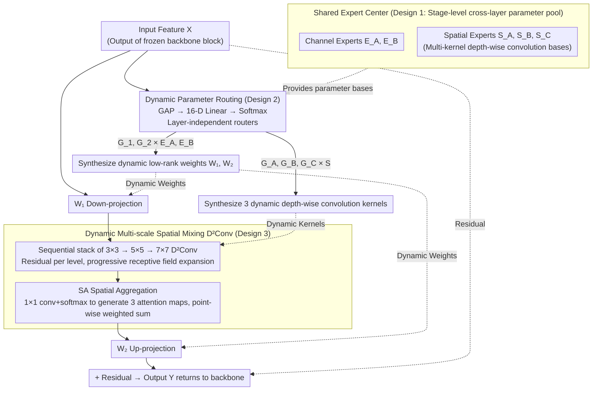

# Parameters as Experts: Adapting Vision Models with Dynamic Parameter Routing

**Conference**: ICML 2026  
**arXiv**: [2602.06862](https://arxiv.org/abs/2602.06862)  
**Code**: https://github.com/LMMMEng/ParaX  
**Area**: Model Compression / Parameter-Efficient Fine-Tuning  
**Keywords**: PEFT, MoE Adapter, Shared Expert Center, Dynamic Parameter Routing, Dense Prediction  

## TL;DR
The authors treat "parameters as experts"—maintaining a per-stage shared pool of trainable parameter matrices (shared expert center). ParaX adapters in each layer use a lightweight router to **dynamically synthesize** weights for low-rank projections and multi-scale depth-wise convolutions based on the current input. This simultaneously addresses the "input-agnosticism" and "cross-layer redundancy" issues of traditional adapters, consistently outperforming full fine-tuning on dense prediction tasks with <5% trainable parameters.

## Background & Motivation

**Background**: Parameter-Efficient Fine-Tuning (PEFT) for vision models currently follows two main directions: prompting-based (e.g., VPT), which inserts learnable tokens into the input sequence, and adapter-based (e.g., LoRA, AdaptFormer, Mona), which embeds pairs of low-rank matrices $W_1\in\mathbb{R}^{C\times\hat C}, W_2\in\mathbb{R}^{\hat C\times C}$ in each layer. Adapter-based methods currently dominate dense prediction tasks (segmentation, detection). Mona further incorporates multi-kernel depth-wise convolutions within the adapter to enhance spatial modeling.

**Limitations of Prior Work**: The authors empirically identify two "fatal flaws" in existing adapters:

- **Representation Deficiency**: Once trained, adapter weights are **input-agnostic**. Visualizing Swin-L fine-tuned with Mona or AdaptFormer on COCO using Effective Receptive Fields (ERF) shows significantly smaller ERFs compared to full fine-tuning. This implies that low-rank, input-agnostic transformations cannot customize optimal spatial responses for different image contents.
- **Feature Redundancy**: Parameters for each layer's adapter are isolated. CKA analysis reveals that patterns learned by different layers are highly similar, indicating a lack of explicit information interaction across layers and redundant learning of similar features.

**Key Challenge**: Under strict parameter budgets (LoRA-style, a few million trainable parameters), **static and isolated** low-rank adapters can neither be customized based on input nor facilitate cross-layer information flow, leading to "universal but mediocre" transformations. Simply increasing $\hat C$ exceeds parameter budgets, while sharing the same weight set across adapters forces identical transformations, further collapsing expressiveness.

**Goal**: (1) Enable adapter weights to vary dynamically with input to restore ERF; (2) Introduce implicit information flow between layers to reduce CKA redundancy; (3) Achieve both without significantly increasing the trainable parameter budget.

**Key Insight**: Transfer the MoE concept of "using a router to select experts" to the **parameter level**. Here, "experts" are not sub-networks but **trainable parameter matrices** of the same size. Different layers share the same set of experts but have their own routers to provide different mixing coefficients. This achieves both "input-dependency" (router observes input) and "cross-layer coupling" (shared experts must serve multiple layers, forcing them to learn universal and diverse bases).

**Core Idea**: Deploy a **shared expert center** (a pool of trainable parameter matrices) at each stage. Each layer's ParaX module uses an ultra-lightweight router to **linearly mix** these into layer-specific and input-specific low-rank projections and multi-scale depth-wise convolution kernels—parameters are experts, and routing is synthesis.

## Method

### Overall Architecture
ParaX enables adapter weights to be both input-dynamic and cross-layer shared within PEFT budgets. Taking a four-stage hierarchical backbone (Swin / ConvNeXt) as an example: each stage is equipped with a shared expert center. A ParaX adapter is inserted into each building block (Swin blocks include one after the token mixer and another after the channel mixer; ConvNeXt blocks include one after the entire residual module). During the forward pass, each adapter independently uses a lightweight router to read input features and output dynamic coefficients. These coefficients linearly synthesize module-specific $W_1, W_2$ and three-scale depth-wise convolution kernels from the expert center. The input undergoes a "dimension reduction → multi-scale spatial mixing → dimension expansion" transformation using these dynamic weights before being added back to the backbone via a residual connection. No additional trainable parameters are introduced except for the expert centers, routers, and task heads; the backbone remains frozen.

The following diagram illustrates the forward pass of a single ParaX adapter: solid lines represent the feature data flow, and dashed lines represent the dynamic weights synthesized by the router using parameter bases from the expert center.

### Key Designs

**1. Shared Expert Center: Sharing parameters at the expert pool level to resolve cross-layer redundancy and expressiveness collapse**

This addresses the adapter dilemma: isolating parameters for each layer causes CKA redundancy, but directly sharing identical weights forces identical transformations. ParaX maintains a stage-level pool of trainable parameter matrices as bases for dynamic synthesis: channel-wise low-rank projection experts are stored in pairs $\mathbf{E}_A\in\mathbb{R}^{M\times C\times\hat C}$ and $\mathbf{E}_B\in\mathbb{R}^{M\times\hat C\times C}$, where expert capacity $M$ and adapter hidden dimension $\hat C$ are the core hyperparameters. For the spatial dimension, three sets of depth-wise convolution experts $\mathbf{S}_A, \mathbf{S}_B, \mathbf{S}_C\in\mathbb{R}^{M\times\hat C\times K_i^2}$ correspond to different kernel sizes. All ParaX modules pull weights from the same stage-level expert center, but each layer uses its own router. Since sharing occurs at the expert pool level rather than the adapter level, the design achieves cross-layer coupling (shared experts are forced to learn universal and diverse bases) while maintaining representational diversity through layer-specific routers.

**2. Dynamic Parameter Routing: Replacing sparse MoE expert selection with linear mixing for input-dependency and training stability**

This step directly addresses "representation deficiency." Conventional adapters have input-agnostic weights, resulting in smaller ERFs than full fine-tuning. ParaX synthesizes weights based on the input $\mathbf{X}\in\mathbb{R}^{HW\times C}$ by first performing GAP to obtain a channel descriptor, passing it through a 16-D linear layer to get a hidden vector, and then using two parallel linear layers with softmax to produce gating vectors $\mathbf{G}_1, \mathbf{G}_2\in\mathbb{R}^M$. Dynamic weights are synthesized via tensor contraction: $\mathbf{W}_1=\sum_{m=1}^M \mathbf{G}_1[m]\,\mathbf{E}_A[m]\in\mathbb{R}^{C\times\hat C}$ and $\mathbf{W}_2=\sum_{m=1}^M \mathbf{G}_2[m]\,\mathbf{E}_B[m]\in\mathbb{R}^{\hat C\times C}$. A standard LoRA-style residual update $\mathbf{Y}=\mathbf{X}+\sigma(\mathbf{X}\mathbf{W}_1)\mathbf{W}_2$ (including spatial mixing) follows. Replacing sparse "top-k" selection with "all-expert linear mixing" retains input-dependent weight dynamics while avoiding training instability. The complexity is reduced to $O(M)$ matrix weighted sums. The router's hidden dimension is compressed to 16, making its parameters and computation negligible.

**3. Dynamic Multi-scale Spatial Mixing (D²Conv): Synthesizing convolution kernels based on input for dense prediction**

Prior work like Mona demonstrated the importance of multi-kernel depth-wise convolutions for dense prediction, but their kernels are static. ParaX extends dynamics to the spatial dimension: the router outputs three more gating vectors $\mathbf{G}_A, \mathbf{G}_B, \mathbf{G}_C\in\mathbb{R}^M$ to synthesize three dynamic depth-wise kernels from $\mathbf{S}_A, \mathbf{S}_B, \mathbf{S}_C$ (e.g., $3\times3, 5\times5, 7\times7$). Spatial mixing uses a sequential stack with residual shortcuts to progressively expand the receptive field. Finally, a Spatially-varying Aggregation (SA) module uses a $1\times1$ convolution and softmax to generate three spatial attention maps, which are point-wise multiplied with the three-scale features and summed. Using depth-wise dynamic convolutions differentiates this from standard dynamic convolutions (e.g., KernelWarehouse) and is a necessity for PEFT budgets. SA performs the final spatial dynamic weighting, refining the scale selection for each pixel position.

### Loss & Training
ParaX operates in a standard PEFT setting: the backbone is frozen, and only the expert centers, routers, and task heads (standard heads for segmentation/detection/classification) are trained. Standard training recipes are used (UperNet/ADE20K 160K iter; Mask R-CNN/COCO; MAE-pretrained ViT-B/16 for classification) without new loss functions. Expert capacity $M$ and hidden dimension $\hat C$ control the trainable parameter budget. Multi-kernel combinations $\{K_1, K_2, K_3\}$ are ablated in Section 4.5.

## Key Experimental Results

### Main Results

Semantic segmentation (mIoU) on ADE20K and detection/instance segmentation (AP$^b$/AP$^m$) on COCO2017 (summarized from Table 1 and Table 2):

| Backbone | Method | Trainable Params (M) | ADE20K mIoU | COCO AP$^b$ | COCO AP$^m$ |
|---|---|---|---|---|---|
| Swin-B | Full fine-tuning | 86.8 | 50.2 | 47.5 | 42.8 |
| Swin-B | LoRA | 5.4 | 49.4 | 40.1 | 38.5 |
| Swin-B | Mona | 5.2 | 49.8 | 46.6 | 42.4 |
| Swin-B | **ParaX** | **5.2** | **50.3** | **47.3** | **42.7** |
| Swin-L | Full fine-tuning | 195.0 | 51.2 | 48.6 | 43.8 |
| Swin-L | Mona | 7.5 | 51.6 | 48.1 | 43.9 |
| Swin-L | **ParaX** | **7.3** | **52.0** | **48.6** | **44.0** |
| ConvNeXt-B | Full fine-tuning | 87.6 | 51.4 | 47.8 | 43.0 |
| ConvNeXt-B | Mona | 6.5 | 50.7 | 47.5 | 43.2 |
| ConvNeXt-B | **ParaX** | **6.5** | **51.1** | **48.0** | **43.5** |
| ConvNeXt-L | Full fine-tuning | 196.2 | 52.4 | 48.1 | 43.2 |
| ConvNeXt-L | Mona | 9.1 | 51.5 | 48.9 | 44.4 |
| ConvNeXt-L | **ParaX** | **9.2** | **52.0** | **49.5** | **44.8** |

Ours achieves state-of-the-art results across all 8 settings. For large models like Swin-L (segmentation) and ConvNeXt-L (detection), ParaX outperforms full fine-tuning by 0.8% mIoU and 1.4% AP$^b$ with <5% trainable parameters. ERF and CKA visualizations confirm that ParaX's ERF approaches full fine-tuning while cross-layer CKA redundancy is significantly reduced.

### Ablation Study: Cross-task Transferability (Panoptic Segmentation, COCO2017)

| Backbone | Method | Params (M) | PQ | SQ | RQ |
|---|---|---|---|---|---|
| Swin-B | Full-tuning | 86.8 | 50.3 | 81.3 | 60.6 |
| Swin-B | AdaptFormer | 5.4 | 47.1 | 79.4 | 57.4 |
| Swin-B | Mona | 5.2 | 48.1 | 79.9 | 58.3 |
| Swin-B | **ParaX** | **5.2** | **48.8** | **80.8** | **59.0** |
| Swin-L | Full-tuning | 195.0 | 51.4 | 81.5 | 61.9 |
| Swin-L | Mona | 7.5 | 49.7 | 80.7 | 60.2 |
| Swin-L | **ParaX** | **7.3** | **50.2** | **81.3** | **60.5** |

Panoptic segmentation is a demanding hybrid task. ParaX outperforms AdaptFormer by 1.7 PQ and Mona by 0.7 PQ on Swin-B, reducing the gap with full fine-tuning to 1.2–1.5 PQ. This performance demonstrates the value of the "dynamic + cross-layer shared" representation for unified dense prediction tasks.

### Key Findings
- **Alignment of ERF and CKA with Failure Modes**: The authors used ERF/CKA to diagnose "representation deficiency" and "feature redundancy." ParaX aligns these metrics with full fine-tuning, which translates to improved accuracy.
- **Expert Center Scale vs. Task Complexity**: Optimal ratios of $M$ and $\hat C$ vary by task granularity. Dense prediction benefits from a larger $M$, while classification is more sensitive to $\hat C$.
- **Sequential D²Conv Stacking > Parallel**: Sequential stacking with residuals facilitates smoother ERF expansion compared to parallel branches, consistent with findings in SegFormer regarding "progressive receptive fields."

## Highlights & Insights
- **Perspective of "Parameters as Experts"**: Unlike classical MoE which selects sub-networks, this work uses parameter matrices as experts and linear mixing. This allows MoE concepts to operate within strict PEFT budgets.
- **Balancing Conflicting Goals**: Cross-layer sharing facilitates information flow (lower CKA), while layer-specific routers ensure representational diversity (higher ERF).
- **Transferability of Dynamic Kernel Synthesis**: Using "coefficients × bases" for kernels is similar to KernelWarehouse but tailored here for PEFT via depth-wise kernels and residual stacking. This primitive can transfer to other adapter types like LoRA or AdaLoRA.
- **PEFT can outperform Full Fine-Tuning**: When a backbone is sufficiently pre-trained, excessive trainable parameters can lead to overfitting. ParaX's superiority on ConvNeXt-L (+1.4% AP$^b$ over full-tuning) reinforces this.

## Limitations & Future Work
- **Inference Computational Overhead**: Dynamic synthesis of $\mathbf{W}_1, \mathbf{W}_2$ and kernels requires running the router and tensor contractions for each input. This is a disadvantage compared to LoRA, which can be merged into the backbone for zero-overhead inference.
- **Expert Center Scaling**: $M$ and $\hat C$ currently require per-task tuning. The risk of expert collapse when $M$ is too large is not deeply explored.
- **Simple Router Constraints**: The ultra-lightweight router uses image-level pooling. Dense prediction might benefit more from token-level routing, though linking this to depth-wise convolutions is a challenge.
- **Lack of VLM/LLM Validation**: While the architecture is theoretically neutral, experiments are limited to vision backbones and dense prediction tasks.

## Related Work & Insights
- **vs. LoRA (Hu et al. 2022)**: LoRA uses static low-rank updates. ParaX is a dynamic and cross-layer shared version of LoRA; it degrades to LoRA if $M=1$ and the router outputs 1.
- **vs. AdaptFormer / Mona**: AdaptFormer is a static, non-spatial special case of ParaX. Mona added static multi-kernel depth-wise convolutions; ParaX dynamizes these kernels and places them in a shared pool.
- **vs. MoELoRA / HydraLoRA / MoLA**: These introduce MoE within LoRA but keep experts as sub-modules with sparse routing. ParaX uses parameter matrices and dense mixing for better stability.
- **vs. KernelWarehouse / OmniNet**: While the "coefficients × bases" concept is similar, ParaX adapts it for PEFT budgets using depth-wise kernels and extends the pool to the entire adapter (channel and spatial).

## Rating
- Novelty: ⭐⭐⭐⭐ Treats MoE as "parameters-as-experts," a fresh perspective for the adapter family.
- Experimental Thoroughness: ⭐⭐⭐⭐ Covers various dense prediction tasks and backbones with both performance and diagnostic metrics (ERF/CKA), though it lacks LLM/VLM results.
- Writing Quality: ⭐⭐⭐⭐ The "diagnosis-and-remedy" narrative using Figure 1 (c) is compelling and clear.
- Value: ⭐⭐⭐⭐ Consistently outperforms full fine-tuning in PEFT settings; the dynamic synthesis primitive is widely applicable.

<!-- RELATED:START -->

## Related Papers

- [\[ICLR 2026\] LD-MoLE: Learnable Dynamic Routing for Mixture of LoRA Experts](../../ICLR2026/model_compression/ld-mole_learnable_dynamic_routing_for_mixture_of_lora_experts.md)
- [\[CVPR 2026\] Teacher-Guided Routing for Sparse Vision Mixture-of-Experts](../../CVPR2026/model_compression/teacher-guided_routing_for_sparse_vision_mixture-of-experts.md)
- [\[ICML 2026\] Continual Model Routing in Evolving Model Hubs](continual_model_routing_in_evolving_model_hubs.md)
- [\[ICML 2026\] PRISM: Synergizing Vision Foundation Models via Self-Organized Expert Specialization](prism_synergizing_vision_foundation_models_via_self-organized_expert_specializat.md)
- [\[CVPR 2026\] Quant Experts: Token-aware Adaptive Error Reconstruction with Mixture of Experts for Large Vision-Language Models Quantization](../../CVPR2026/model_compression/quant_experts_token_aware_vlm_quantization.md)

<!-- RELATED:END -->
