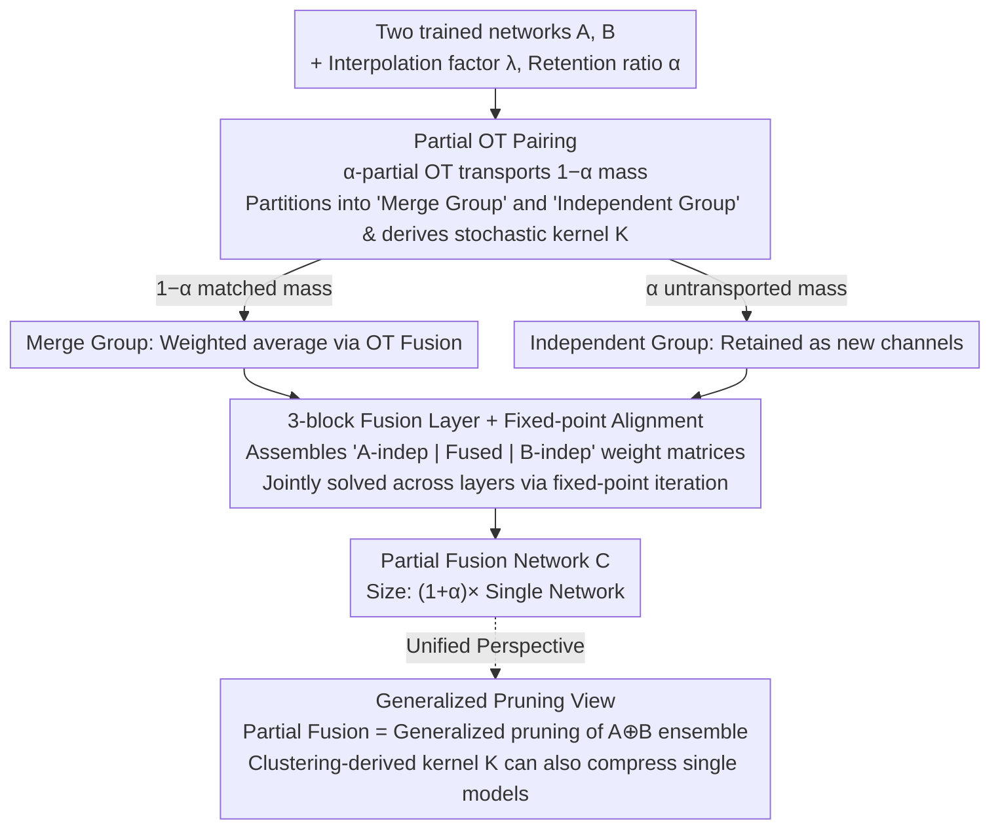

# Partial Fusion of Neural Networks: Efficient Tradeoffs Between Ensembles and Weight Aggregation

**Conference**: ICML 2026  
**arXiv**: [2605.22350](https://arxiv.org/abs/2605.22350)  
**Code**: https://github.com/Fabian-Mor/partial_fusion_nn  
**Area**: Model Compression  
**Keywords**: Model Fusion, Ensembles, Partial Optimal Transport, Generalized Pruning, Neuron Similarity  

## TL;DR
The authors propose **Partial Fusion**: a method using partial optimal transport (partial OT) to merge only the "most similar" neurons between two networks while allowing the remaining neurons to exist independently. This creates a smooth, monotonic, and tunable accuracy–parameter curve between "weight aggregation (1× parameters)" and "full ensemble (2× parameters)". Furthermore, it is unified under a "generalized pruning of ensembles" perspective, enabling the same toolkit to compress individual models.

## Background & Motivation

**Background**: There are two primary paradigms for combining multiple independently trained neural networks. One is **ensembling**: retaining all models and averaging their outputs during inference. It is robust and highly accurate, but parameter count and inference time grow linearly with the number of models. The other is **weight aggregation / model fusion**: aligning neurons from different networks via permutation (Git Re-Basin, Ainsworth et al. 2023) or optimal transport (OT Fusion, Singh & Jaggi 2020) before weight averaging, resulting in a fused model the same size as a single network.

**Limitations of Prior Work**: These two paradigms represent opposite ends of the efficiency-accuracy spectrum, leaving the **intermediate region empty**. Ensembles are costly but accurate; fusion is efficient but often yields lower accuracy, especially when networks are trained on heterogeneous data slices. In such cases, forcing all neurons to pair up leads to the averaging of functionally distinct neurons, causing unnecessary performance degradation.

**Key Challenge**: Existing methods force a binary choice between "full pairing (fusion)" and "full retention (ensemble)". However, the most informative signal lies in **neuron-level diversity**: which neurons are truly similar and deserve merging, and which are unique and should remain separate. Leveraging this diversity allows for the construction of a continuous and smooth Pareto curve between accuracy and parameter count.

**Goal**: (1) Propose a fusion method capable of arbitrary interpolation between weight aggregation and ensembling; (2) Integrate it into a broader framework of "generalized pruning of ensembles"; (3) Apply the same framework to individual model compression.

**Key Insight**: Retaining the "least similar neurons" without merging causes the average similarity of the "merged portion" to increase significantly (Appendix L). Thus, **pairing only the most similar subset** while keeping others as independent branches recovers substantial accuracy with minimal parameter overhead.

**Core Idea**: Use **partial optimal transport (partial OT)** to match only $(1-\alpha)$ of the neuron mass. The remaining $\alpha$ mass is preserved as independent channels in the fused network, resulting in a "partial fusion network" with size $(1+\alpha)\times$ a single network. Here, $\alpha=0$ corresponds to OT Fusion, and $\alpha=1$ corresponds to an ensemble.

## Method

### Overall Architecture
Given two $L$-layer feedforward networks $A$ and $B$, an interpolation factor $\lambda\in[0,1]$, and a "retention ratio" $\alpha\in[0,1]$, the goal is to produce a **partial fusion network** $C$ where each layer's scale is continuously adjustable between a single network ($\alpha=0$) and an ensemble ($\alpha=1$). The procedure treats neurons as support points in a probability measure. Layer by layer, $\alpha$-partial OT is used to automatically partition neurons into "merge" and "independent" groups. The merge group is weighted-averaged as in OT Fusion, while the independent groups are retained as new channels. The resulting weights for each layer are organized into a 3-block matrix (independent $A$ block, fused block, independent $B$ block). Transitions between blocks are stitched using stochastic kernels derived from OT. Since layer alignments are coupled when using weight columns as features, all layer pairings are solved jointly via **fixed-point iteration**. This post-hoc weight restructuring requires no retraining. The authors unify this as **generalized pruning**, viewing it as mapping a large network (e.g., an ensemble) to a smaller one via stochastic kernels.

### Key Designs

**1. Partial OT Pairing: Automatically deciding which neurons to merge**

Standard OT Fusion requires the coupling $\pi$ to transport the **total** mass of $\mu^A$ to $\mu^B$, effectively forcing every neuron to find a pair. This degrades accuracy by forcing the averaging of non-overlapping functional units. This method relaxes this constraint by treating neurons as support points where similarity is measured by the Euclidean distance of feature vectors (activation vectors or weight columns). It solves for $\alpha$-partial OT: minimizing the transport cost subject to $\sum_j \tilde\pi[i,j]\le\mu^A[i]$ and a total transport mass of only $\sum_{i,j}\tilde\pi[i,j]=1-\alpha$. Neurons corresponding to the untransported $\alpha$ mass remain "independent." The matched portion is normalized to stochastic kernels $K_\ell^{A\to B}=(\pi^{A,B})^T/\mu^A$ and $K_\ell^{B\to A}=\pi^{A,B}/\mu^B$. This converts the merge decision into a continuous dial $\alpha$, smoothing the tradeoff between model size and accuracy without increasing the complexity of the OT solver.

**2. 3-block Fusion Layer + Global Fixed-point Alignment: Unified weight representation and joint optimization**

To simultaneously represent independent and fused channels in a single tensor, the authors partition the weights $W_\ell^C$ for layer $\ell\to\ell+1$ into a $3\times3$ block structure. Diagonal blocks either copy original weights or perform fusion as $W_\ell^C=(1-\lambda)W_\ell^B+\lambda K_{\ell+1}^{A\to B} W_\ell^A[F,F] K_\ell^{B\to A}$. Off-diagonal blocks use the stochastic kernel $K$ to manage transitions between independent and fused branches. This allows independent channels to contribute to the fused channels (via $K$) while preventing interference. Because alignment at layer $\ell$ depends on layer $\ell+1$ when using weights as features, a greedy layer-wise solution is suboptimal. Following Ainsworth et al. (2023), the alignment is formulated as a global objective $(\pi_\ell^{A,B})_\ell=\arg\min\sum_\ell\int\|x-y\|^2\pi_\ell(dx,dy)$ and solved via **fixed-point iteration**: updating one $\pi_\ell$ at a time while freezing others, ensuring each step remains a standard partial OT subproblem.

**3. Generalized Pruning and Clustering: Unifying fusion, ensemble, and pruning**

Partial fusion is shown to be a special case of a broader framework: mapping an over-parameterized model $E$ (like an ensemble) to a smaller model $S$. By introducing stochastic kernels $K_\ell^{E\to S}\in\mathbb{R}^{n_\ell^S\times n_\ell^E}$ and $K_\ell^{S\to E}$, one defines $W_\ell^S:=K_{\ell+1}^{E\to S} W_\ell^E K_\ell^{S\to E}$. Standard pruning is a subset where $K$ is a sparse 0/1 matrix. The authors generalize this using **clustering**: solving $\pi_\ell^{E,S}=\arg\min_{\pi\in\Pi(\mu^E,*_m)}\int\|x-y\|^2\,\pi(dx,dy)$, where the second marginal supports at most $m$ centroids (equivalent to K-means under uniform $\mu^E$). Neurons within a cluster are linearly combined into a single centroid in $S$. Here, pruning is not just "deletion" but also "linear combination." The former loses processing steps, while the latter blurs them; clustering-based pruning automatically weighs these costs. For practical implementation, **hierarchical clustering** is used as it outperforms Lloyd's K-means in the relevant compression regimes.

### Loss & Training
The entire process is **post-hoc** and requires **no retraining**. Partial fusion and generalized pruning involve only weight restructuring. In comparative experiments (Section 3.2), **fine-tuning** with 1% of MNIST or 5% of CIFAR-10 data is performed to evaluate the further potential of fused models. The core tunable parameters are $\alpha$ (retention ratio) and $\lambda$ (interpolation factor), both in $[0,1]$.

## Key Experimental Results

### Main Results

Accuracy comparison under heterogeneous data splits and fine-tuning (Table 1):

| Model / Data | $\alpha=0.0$ (OT Fusion) | $\alpha=0.4$ | $\alpha=0.5$ | $\alpha=0.8$ | $\alpha=1.0$ (Ensemble) | Single A / B |
|---|---|---|---|---|---|---|
| MLP/MNIST Fusion (No FT) | 84.1 | 87.4 | 87.5 | 87.9 | 88.1 | 93.8 / 87.8 |
| MLP/MNIST FT (1% data) | 95.1 | 96.1 | 96.2 | 96.5 | 96.5 | 93.8 / 87.8 |
| ResNet-18/CIFAR-10 Fusion | 66.4 | 83.4 | 87.4 | 90.6 | 91.3 | 79.8 / 76.7 |
| ResNet-18/CIFAR-10 FT (5%) | 85.3 | 90.0 | 90.3 | 91.4 | 91.8 | 79.8 / 76.7 |

Key Observations: (i) Accuracy increases **monotonically** with $\alpha$, validating that partial fusion provides a truly continuous interpolation between OT Fusion and ensembles. (ii) On ResNet-18, $\alpha=0.4$ recovers 83.4% accuracy (vs. 66.4% for OT Fusion) with only $\sim1.4\times$ the single model's parameters. (iii) After fine-tuning, all $\alpha$ configurations outperform individual models, suggesting independent neurons provide the capacity for the optimizer to bridge domain distributions efficiently.

### Ablation Study

Comparative performance of partial fusion and generalized pruning methods on MLP-MNIST:

| Configuration | Key Phenomenon | Explanation |
|------|---------|------|
| Partial OT (weight feat., fixed-point) | Highest, most monotonic curve | Best joint alignment; recommended config |
| Partial OT (weight feat., greedy) | Slightly lower than fixed-point | Greedy steps miss cross-layer coupling |
| Partial OT (activation feat.) | Lower than weight-based | Activation features are noisier |
| Generalized Pruning (Clustering) | Outperforms Partial OT at large $\alpha$ | Clustering explores a larger solution space |
| Unstructured Pruning of Ensemble | **Non-monotonic**; $\lambda{=}0.3$ exceeds ensemble | Scaling collision between output weights and importance |
| Single VGG11 Pruning (Clustering vs. OT) | Clustering wins slightly | Better at balancing deletion and blurring |
| Partial Fusion with fixed Ensemble layers | Significant gains with 3 fixed layers | Reflects massive layer-wise heterogeneity |

### Key Findings
- **Core Mechanism**: Excluding the most dissimilar neurons from fusion raises the average similarity of the merged group, which is the root cause of the effectiveness of partial fusion and clustering-based pruning.
- **Task-Dependent Performance**: Inductive biases in partial OT (merging only across networks, pairwise combinations) are more beneficial for CNNs, while flexible clustering wins on MLPs.
- **Layer Heterogeneity**: Treating wide layers as ensembles and narrow layers as partial fusions allows a VGG11 to outperform both constituent models with only 38% extra channels. This suggests a future for **automated layer-wise $\alpha$**.
- **Pruning Anomalies**: The non-monotonicity in unstructured ensemble pruning is attributed to implementation issues where $\lambda$ scales both output weights and neuron importance scores simultaneously.

## Highlights & Insights
- **Unified Framework**: The mapping of model fusion, ensemble, and pruning into a single framework using stochastic kernels $K$ provides significant theoretical clarity. It frames "pruning" not just as deletion but as a choice of kernel that can include linear combinations.
- **Effective Tool Choice**: Standard OT Fusion's requirement to transport all mass was a mathematical artifact rather than a requirement of the problem. Relaxing this via Partial OT aligns the mathematics with the semantic reality of "incomplete matching."
- **Deletion vs. Blurring**: The taxonomy of pruning errors into "deleted steps" and "blurred steps" provides a clean cognitive framework applicable to modern large-scale model compression (e.g., LLMs).
- **Layer-wise Adaptivity**: The observation that ensembling just three specific layers significantly improves performance suggests that the real value of partial fusion lies in layer-wise adaptive configuration rather than a global $\alpha$.

## Limitations & Future Work
- **Scaling**: Experiments are confined to small architectures (MLP, VGG11, ResNet-18) and datasets (MNIST, CIFAR-10). Scalability to ViTs or LLMs remains unverified, especially since clustering can be computationally expensive.
- **Similarity Metrics**: Currently limited to Euclidean distance and permutation invariance. More sophisticated metrics like CCA or Procrustes distances might yield better alignments.
- **Automated $\alpha$ Selection**: There is no principled criterion yet for determining which layers should remain as ensembles versus which should be fused; currently, this requires manual selection.
- **Pruning Implementations**: Limitations in the current unstructured pruning baseline (the dual scaling issue) need resolution to fully explore the generalized pruning space.

## Related Work & Insights
- **vs. OT Fusion (Singh & Jaggi 2020)**: This work is a strict generalization; $\alpha=0$ recovers OT Fusion. It also adds global fixed-point optimization to the OT-based pipeline.
- **vs. Git Re-Basin (Ainsworth et al. 2023)**: While Git Re-Basin is limited to permutations of equal-sized layers, this method handles heterogeneous sizes and partial matches through stochastic kernels.
- **vs. ZipIt! (Stoica et al. 2024)**: Both share the "concatenate then merge" philosophy; this work formalizes it as generalized pruning and identifies the specific inductive biases of partial fusion.
- **vs. Luenam et al. 2025**: While both use clustering-like aggregation, this work explicitly integrates it into a pruning framework and demonstrates the advantage of clustering-based kernels.

## Rating
- Novelty: ⭐⭐⭐⭐ Significant contribution in unifying fusion, ensembling, and pruning via Partial OT.
- Experimental Thoroughness: ⭐⭐⭐ Diverse tasks but limited to small-scale benchmarks.
- Writing Quality: ⭐⭐⭐⭐ Well-paced with clear visualizations of the 3-block matrix design.
- Value: ⭐⭐⭐⭐ High theoretical value in defining the "Generalized Pruning" coordinate system.

<!-- RELATED:START -->

## Related Papers

- [\[ICLR 2026\] KLAS: Using Similarity to Stitch Neural Networks for Improved Accuracy-Efficiency Tradeoffs](../../ICLR2026/model_compression/klas_using_similarity_to_stitch_neural_networks_for_improved_accuracy-efficiency.md)
- [\[ICML 2026\] SURGE: Surrogate Gradient Adaptation in Binary Neural Networks](surge_surrogate_gradient_adaptation_in_binary_neural_networks.md)
- [\[ICML 2026\] Quantifying the Uncertainty of Foundation Models with Singular Value Ensembles](quantifying_the_uncertainty_of_foundation_models_with_singular_value_ensembles.md)
- [\[ICML 2026\] DAG-MoE: From Simple Mixture to Structural Aggregation in Mixture-of-Experts](dag-moe_from_simple_mixture_to_structural_aggregation_in_mixture-of-experts.md)
- [\[ICML 2026\] AREA: Attribute Extraction and Aggregation for CLIP-Based Class-Incremental Learning](area_attribute_extraction_and_aggregation_for_clip-based_class-incremental_learn.md)

<!-- RELATED:END -->
