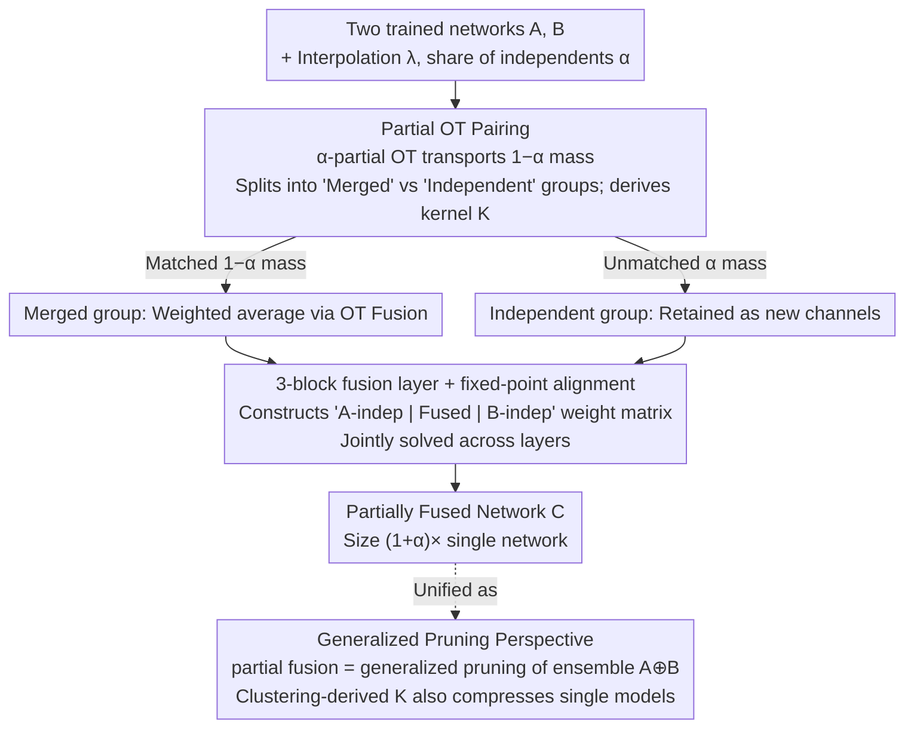

# Partial Fusion of Neural Networks: Efficient Tradeoffs Between Ensembles and Weight Aggregation

**Conference**: ICML 2026  
**arXiv**: [2605.22350](https://arxiv.org/abs/2605.22350)  
**Code**: https://github.com/Fabian-Mor/partial_fusion_nn  
**Area**: Model Compression  
**Keywords**: Model Fusion, Ensemble, Partial Optimal Transport, Generalized Pruning, Neuron Similarity  

## TL;DR
The authors propose **Partial Fusion**: using partial optimal transport (partial OT) to merge only the "most similar" neurons between two networks while allowing others to remain independent. This creates a smooth, monotonic, and tunable accuracy–parameter curve between "weight aggregation (1× parameters)" and "full ensemble (2× parameters)". The method is further unified under the perspective of "generalized pruning of ensembles," enabling the same framework to compress individual models.

## Background & Motivation

**Background**: There are two main paradigms for combining multiple independently trained neural networks. One is **ensemble**: maintaining all models and averaging their outputs during inference, which is robust and accurate but has parameter and inference costs that grow linearly with the number of models. The other is **weight aggregation / model fusion**: aligning neurons across networks via permutation (Git Re-Basin, Ainsworth et al. 2023) or optimal transport (OT Fusion, Singh & Jaggi 2020) and then averaging the weights to produce a single fused model of the same size.

**Limitations of Prior Work**: These two paradigms occupy extreme ends of the spectrum, leaving the **middle region empty**. Ensembles are expensive but accurate; fusion is cheap but often lags in accuracy, especially when networks are trained on heterogeneous data shards where functional differences between neurons are large, causing forced averaging of non-overlapping neurons.

**Key Challenge**: Existing methods force a choice between "full pairing (fusion)" or "no pairing (ensemble)." However, the most informative aspect is the **neuron-level heterogeneity**—identifying which neurons are truly similar enough to merge and which are unique enough to keep separate. Utilizing this variance could yield a continuous Pareto curve between accuracy and parameter count.

**Goal**: (1) Provide a fusion method capable of interpolating between weight aggregation and ensembles; (2) unify it under a more general framework of "generalized pruning of ensembles"; (3) apply this framework back to single-model compression.

**Key Insight**: Leaving the "least similar neurons" independent causes the average similarity of the "merged portion" to increase significantly (Appendix L). By **pairing only the most similar subset** and keeping others as independent branches, significant accuracy can be recovered with minimal additional parameters.

**Core Idea**: Use **partial optimal transport (partial OT)** to match only a $(1-\alpha)$ fraction of neuron mass. The remaining $\alpha$ fraction is preserved as independent channels in the fused network, resulting in a "partially fused network" of size $(1+\alpha)\times$ the original model. $\alpha=0$ corresponds to OT Fusion, while $\alpha=1$ recovers the full ensemble.

## Method

### Overall Architecture
Given two $L$-layer feedforward networks $A$ and $B$, an interpolation factor $\lambda\in[0,1]$, and a "share of independents" $\alpha\in[0,1]$, the goal is to produce a **partially fused network** $C$ whose layer sizes are continuously adjustable between a single network ($\alpha=0$) and an ensemble ($\alpha=1$). Neurons are treated as support points of a probability measure layer-by-layer. First, $\alpha$-partial OT automatically partitions neurons into "mergeable" and "independent" groups. The mergeable group is weighted-averaged as in OT Fusion, while the independent groups remain as new channels. The resulting weights comprise a 3-block matrix (block $A$ independent, fusion block, block $B$ independent), with transitions between blocks handled via OT-derived stochastic kernels. Since alignments across layers are coupled, the pairings for all layers are solved jointly using **fixed-point iteration**. This post-hoc weight reorganization requires no retraining. The authors further unify this as **generalized pruning**, where an ensemble is mapped to a smaller network via stochastic kernels.

### Key Designs

**1. Partial OT Pairing: Automatically deciding which neurons to merge**

Standard OT Fusion requires the coupling $\pi$ to transport **all** mass from $\mu^A$ to $\mu^B$, forcing every neuron into a pair even if their functions do not overlap, leading to accuracy loss. This work relaxes the "full transport" constraint. In the probability measure view, each neuron is a support point with similarity measured by the Euclidean distance of feature vectors (activation vectors or weight columns). The problem becomes $\alpha$-partial OT: minimizing $\sum_{i,j} \tilde\pi[i,j] \|x_i - y_j\|^2$ subject to $\sum_j \tilde\pi[i,j] \le \mu^A[i]$ and a total transport of $1-\alpha$. **Neurons corresponding to the $\alpha$ fraction of untransported mass become "independent neurons"**. Matched portions are converted to stochastic kernels $K_\ell^{A\to B}=(\pi^{A,B})^T/\mu^A$ and $K_\ell^{B\to A}=\pi^{A,B}/\mu^B$ for fusion. This allows the tradeoff between model size and accuracy to be a smooth, layer-wise adjustable knob $\alpha$, with computational complexity identical to standard OT.

**2. 3-block Fusion Layer + Global Fixed-point Alignment**

The "independent" and "fused" channels are represented simultaneously in a single weight matrix. For a layer $\ell\to\ell+1$, weights $W_\ell^C$ are divided into a $3\times3$ block structure. Diagonal blocks represent either original weights or merged weights (e.g., $W_\ell^C=(1-\lambda)W_\ell^B+\lambda K_{\ell+1}^{A\to B} W_\ell^A[F,F] K_\ell^{B\to A}$). Off-diagonal blocks use the stochastic kernels $K$ to manage transitions between independent and fused branches. This structure ensures that independent channels can linearly sum with fused channels while avoiding interference. To handle the coupling where alignment at layer $\ell$ depends on layer $\ell+1$, the authors optimize the global objective $(\pi_\ell^{A,B})_\ell = \arg\min \sum_\ell \int \|x-y\|^2 \pi_\ell(dx,dy)$ via **fixed-point iteration**, updating one $\pi_\ell$ at a time. This approach yields higher accuracy than greedy single-layer alignment.

**3. Generalized Pruning and Clustering: Unifying fusion and compression**

Partial fusion is a special case of a broader framework. For an over-parameterized large model $E$ (e.g., an ensemble), stochastic kernels $K_\ell^{E\to S} \in \mathbb{R}^{n_\ell^S \times n_\ell^E}$ and $K_\ell^{S\to E}$ map it to a smaller model $S$ via $W_\ell^S := K_{\ell+1}^{E\to S} W_\ell^E K_\ell^{S\to E}$. While standard pruning uses 0/1 matrices, this work uses kernels derived from **clustering**: solving for $\pi_\ell^{E,S}$ where the second marginal supports at most $m$ centroids (equivalent to K-means for uniform $\mu^E$). This generalizes pruning from "deletion" to "linear combination." Since deletion and blurring (combination) have different error characteristics at different compression rates, clustering-based pruning can balance both, outperforming standard unstructured pruning on MLP-on-MNIST.

### Loss & Training
The entire process is **post-hoc weight reorganization** and requires **no retraining**. In comparative experiments (Section 3.2), **minimal fine-tuning** (1% MNIST or 5% CIFAR-10 data) is used to explore the further potential of the fused models. Core hyperparameters are $\lambda$ (weighting between networks) and $\alpha$ (share of independents), both in $[0, 1]$.

## Key Experimental Results

### Main Results

Accuracy comparison under heterogeneous data shards and fine-tuning (Table 1):

| Model / Data | $\alpha=0.0$ (OT Fusion) | $\alpha=0.4$ | $\alpha=0.5$ | $\alpha=0.8$ | $\alpha=1.0$ (Ensemble) | Single A / B |
|---|---|---|---|---|---|---|
| MLP/MNIST Fusion (No FT) | 84.1 | 87.4 | 87.5 | 87.9 | 88.1 | 93.8 / 87.8 |
| MLP/MNIST FT (1% data) | 95.1 | 96.1 | 96.2 | 96.5 | 96.5 | 93.8 / 87.8 |
| ResNet-18/CIFAR-10 Fusion | 66.4 | 83.4 | 87.4 | 90.6 | 91.3 | 79.8 / 76.7 |
| ResNet-18/CIFAR-10 FT (5%) | 85.3 | 90.0 | 90.3 | 91.4 | 91.8 | 79.8 / 76.7 |

Key Observations: (i) Accuracy rises **monotonically** with $\alpha$, providing a truly continuous interpolation between OT Fusion and ensembles. (ii) On ResNet-18, $\alpha=0.4$ recovers 83.4% accuracy (vs. 66.4% for OT Fusion) using only $\sim 1.4\times$ parameters. (iii) After fine-tuning, all $\alpha > 0$ configurations outperform single models, indicating that independent neurons provide the capacity needed for the optimizer to bridge distribution shifts.

### Ablation Study

Relative performance of partial fusion / generalized pruning configurations on MLP-MNIST:

| Configuration | Key Phenomenon | Explanation |
|------|---------|------|
| Partial OT (weight feat., fixed-point) | Highest, most monotonic curve | Best joint alignment; recommended config |
| Partial OT (weight feat., greedy) | Slightly lower than fixed-point | Greedy optimization misses cross-layer coupling |
| Partial OT (activation feat.) | Lower than weight-based | Activation features are noisier |
| Generalized Pruning (Clustering) | Better than Partial OT at large $\alpha$ | Clustering finds more flexible global solutions |
| Unstructured Pruning of Ensemble | **Non-monotonic**; peaks near $\lambda=0.3$ | Implementation artifact: dual scaling of weights and importance |
| Single VGG11 Pruning | Clustering slightly superior | Clustering automatically balances deletion vs. blurring |

### Key Findings
- **Mechanism Validation**: Retaining a few dissimilar neurons increases the average similarity of the merged portion, which is the fundamental reason for the effectiveness of partial fusion and clustering-based pruning.
- **Task-Dependent Performance**: On CNNs, the inductive bias of partial OT (matching across networks, pairwise combinations) is more effective; on MLPs, more flexible clustering wins.
- **Layer Heterogeneity**: Fixing wider layers as ensembles while merging narrower layers (partial fusion) allows a VGG11 to outperform both single models with only a 38% increase in width. This suggests a need for **layer-wise automatic $\alpha$**.

## Highlights & Insights
- **Unified Perspective**: Framing model fusion, ensembles, and pruning under the mapping of a large network $E$ to a smaller network $S$ via kernels $K$ is a major theoretical contribution. It redefines pruning as a choice of kernels beyond 0/1 matrices.
- **Precise Application of Partial OT**: Relaxing the standard OT constraint to allow partial transport fits the semantic requirement of "only merging what is similar." The fact that this adds no computational complexity makes it a powerful tool for alignment problems.
- **Deletion vs. Blurring**: The distinction between error from "dropping steps" and "merging steps" provides a clean cognitive framework for model compression, potentially applicable to LLMs.

## Limitations & Future Work
- **Scale**: Experiments are limited to small architectures (VGG11, ResNet-18) and datasets (MNIST, CIFAR-10). Scalability to ViTs or LLMs remains unverified.
- **Similarity Metrics**: The use of Euclidean distance and permutation invariance is basic. Metrics like CCA or Procrustes might yield better alignments.
- **Manual Layer-wise $\alpha$**: Currently, determining which layers should remain as ensembles versus which should be fused relies on manual heuristics. Principled automated criteria are required.

## Related Work & Insights
- **vs. OT Fusion (Singh & Jaggi 2020)**: This work is a strict generalization ($\alpha=0$ recovers OT Fusion) and introduces cross-layer fixed-point optimization to the OT framework.
- **vs. Git Re-Basin (Ainsworth et al. 2023)**: While Git Re-Basin is restricted to permutation matrices and equal-width layers, this framework uses stochastic kernels to handle heterogeneous and unequal widths.
- **vs. ZipIt! (Stoica et al. 2024)**: Shares the "concatenate then merge" philosophy but formalizes it as generalized pruning of an ensemble.

## Rating
- Novelty: ⭐⭐⭐⭐ Strong framework contribution by unifying partial OT with generalized pruning.
- Experimental Thoroughness: ⭐⭐⭐ Good range of backbones but lacks large-scale (LLM/ImageNet) verification.
- Writing Quality: ⭐⭐⭐⭐ Clear presentation of the 3-block matrix design and a well-paced mathematical narrative.
- Value: ⭐⭐⭐⭐ High theoretical value for the model merging/pruning community; engineering impact depends on future scalability.

<!-- RELATED:START -->

## Related Papers

- [\[ICML 2026\] SURGE: Surrogate Gradient Adaptation in Binary Neural Networks](surge_surrogate_gradient_adaptation_in_binary_neural_networks.md)
- [\[ICML 2026\] Quantifying the Uncertainty of Foundation Models with Singular Value Ensembles](quantifying_the_uncertainty_of_foundation_models_with_singular_value_ensembles.md)
- [\[ICLR 2026\] Adaptive Width Neural Networks](../../ICLR2026/model_compression/adaptive_width_neural_networks.md)
- [\[NeurIPS 2025\] Synergy between the Strong and the Weak: Spiking Neural Networks Are Inherently Superior in Temporal Processing](../../NeurIPS2025/model_compression/synergy_between_the_strong_and_the_weak_spiking_neural_networks_are_inherently_s.md)
- [\[AAAI 2026\] Explore and Establish Synergistic Effects between Weight Pruning and Coreset Selection](../../AAAI2026/model_compression/explore_and_establish_synergistic_effects_between_weight_pruning_and_coreset_sel.md)

<!-- RELATED:END -->
