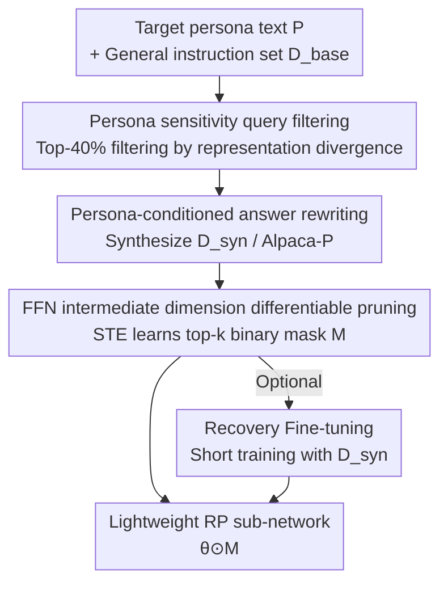

# Persona-Pruner: Sculpting Lightweight Models for Role-Playing

**Conference**: ICML 2026  
**arXiv**: [2606.14695](https://arxiv.org/abs/2606.14695)  
**Code**: https://github.com/jsu-kim/Persona-Pruner  
**Area**: Model Compression / Role-playing LLM  
**Keywords**: Structured Pruning, Role-playing, FFN Sub-network, Differentiable Mask, Data Synthesis

## TL;DR
Instead of equipping every character with a full general-purpose large model, this work uses only a text-based persona description to synthesize persona-specific calibration data. It then learns a binary mask on the intermediate dimensions of FFNs to "sculpt" the sub-network responsible for the character's identity from the base model. Under 50% sparsity, it recovers up to 93.8% of the performance loss in role-playing scores compared to the strongest pruning baselines while preserving general capabilities.

## Background & Motivation
**Background**: Role-playing chatbots (game NPCs, personalized assistants, simulated users) typically rely on feeding a persona prompt to a general LLM, fine-tuning on character dialogue data, or intervening in latent spaces. Each character is powered by a full-parameter general model.

**Limitations of Prior Work**: Scenarios requiring role-playing are often highly sensitive to cost, scalability, and deployment—such as hundreds of NPCs online simultaneously in a game ecosystem or real-time assistants with strict latency and resource budgets. However, a persona's behavior occupies only a small fraction of the model's capacity, yet activates all parameters, representing a structural mismatch between the "breadth of model capability" and the "narrowness of the persona target."

**Key Challenge**: Is it possible to identify a parameter subset sufficient to support a single persona? Existing methods fail: general pruning (SliceGPT, LLM-Pruner, Depth Pruning, etc.) cannot distinguish between "redundant knowledge" and "critical character traits," causing specific persona performance to collapse at 50% sparsity (scores dropping from 83 to single digits). Meanwhile, task-specific pruning depends on massive task data, which is unavailable for highly personalized targets like an arbitrary persona description.

**Goal**: To compress a general base model into a high-fidelity lightweight role-playing agent given only a natural language persona definition, without requiring any character dialogue corpora.

**Key Insight**: The authors hypothesize that a single character identity depends on a small portion of the total model capacity, and persona behaviors are concentrated in the FFNs (which constitute the majority of LLM parameters). Furthermore, persona influence is **query-dependent**—objective knowledge questions receive similar answers regardless of identity, whereas only questions requiring specific perspectives or tones trigger the unique activation patterns of a persona.

**Core Idea**: A two-stage pipeline consisting of "persona-driven data synthesis + differentiable mask FFN sub-network discovery" to align the pruning objective directly with the target persona, identifying and preserving persona-critical weights.

## Method

### Overall Architecture
Given a pre-trained LLM (parameters $\theta$) and a text persona $P$, the model defines a "persona-conditioned" QA distribution $p_P(q,a) := p_\theta(a\mid P, q)$. The goal of Persona-Pruner is to find a binary mask $\mathbf{M}$ such that the sub-network $\theta\odot\mathbf{M}$ performs well in role-playing, i.e., minimizing the negative log-likelihood $\mathcal{L}(\mathbf{M};\theta) = \mathbb{E}_{(q,a)\sim p_P}[-\log p_{(\theta\odot\mathbf{M})}(a\mid P, q)]$.

The entire process involves two stages and requires only a persona description without dialogue corpora: first, **synthesizing** persona-specific calibration data from a general instruction set, then **learning** a mask to select persona-critical FFN neurons using this data, followed by an optional brief recovery fine-tuning.

### Key Designs

**1. Persona Sensitivity Query Filtering: Selecting questions that "evoke" personality**

A major pain point is that most questions in general instruction sets are persona-insensitive (objective facts). Using them as calibration data provides weak signals, and the learned mask fails to distinguish character traits. The authors define **Persona-Sensitivity Score** based on the intuition that persona influence is query-dependent. For a query $q$, let $\mathbf{h}^{(b)}_P(q)\in\mathbb{R}^d$ be the hidden state of the last token in the $b$-th transformer block. The score is defined as the average cosine distance between the target persona and a set of random reference personas across all blocks:

$$s(q; P_{\text{target}}) = \frac{1}{Br}\sum_{b=1}^{B}\sum_{j=1}^{r}\Big(1-\cos\big(\mathbf{h}^{(b)}_{P_j}(q),\, \mathbf{h}^{(b)}_{P_{\text{target}}}(q)\big)\Big)$$

High scores indicate unique activation patterns under the target persona. A filtered subset $\mathcal{D}_{\text{filtered}}$ is formed by taking the top 40% of queries. Results show that LLM-judged role-playing scores are significantly higher for sensitive queries than random ones.

**2. Persona-Conditioned Answer Rewriting and Alpaca-P Dataset**

Filtering "correct questions" is insufficient, as original answers are neutral. The authors use a strong LLM (Llama-3.1-70B-Instruct) to rewrite answers $a$ from $(q, a) \in \mathcal{D}_{\text{filtered}}$ into $\tilde a$ that reflects the target persona's tone and style while **preserving semantics**, resulting in $\mathcal{D}_{\text{syn}} = \{(q,\tilde a)\}$. This bypasses the data bottleneck for arbitrary personas. The authors synthesized and open-sourced **Personalized-Alpaca (Alpaca-P)**: 10 synthetic user personas, with sensitive queries and rewritten answers split into disjoint train/test sets.

**3. FFN Intermediate Dimension Differentiable Mask Pruning: Learning the Sub-network via STE**

FFNs are pruned because they contain the majority of LLM parameters, and **structured** pruning of FFN intermediate dimensions allows models to run directly on standard hardware without sparse operators. FFN computation is $\text{FFN}(\mathbf{x}) = \sigma(\mathbf{x}\mathbf{W}_{\text{in}})\mathbf{W}_{\text{out}}$. A binary mask $\mathbf{M}\in\{0,1\}^{d_{ff}}$ is applied to the intermediate hidden states, equivalent to pruning corresponding columns of $\mathbf{W}_{\text{in}}$ and rows of $\mathbf{W}_{\text{out}}$:

$$\text{FFN}(\mathbf{x};\mathbf{M}) = \big(\sigma(\mathbf{x}\mathbf{W}_{\text{in}})\odot\mathbf{M}\big)\mathbf{W}_{\text{out}}$$

A real-valued score vector $\mathbf{z}\in\mathbb{R}^{d_{ff}}$ is introduced for each layer. During the forward pass, the top-$k$ values of $\mathbf{z}$ are set to 1 and the rest to 0 based on the target sparsity ratio. Since this is non-differentiable, the **Straight-Through Estimator (STE)** is used during the backward pass as an identity approximation $\frac{\partial\mathbf{M}}{\partial\mathbf{z}}\approx\mathbb{I}$. Critically, **the original weights $\theta$ are frozen, and only mask scores are optimized** using the cross-entropy loss $\mathcal{L}_{\text{mask}}$ on $\mathcal{D}_{\text{syn}}$.

### Loss & Training
During the mask learning phase, weights are frozen while the score vector $\mathbf{z}$ is optimized using $\mathcal{L}_{\text{mask}}$. This is followed by optional **recovery fine-tuning**. At high sparsity (e.g., 50%), $\theta$ is optimized briefly using the same small-scale synthetic data $\mathcal{D}_{\text{syn}}$ after mask learning to regain performance. This step is lightweight due to the small data volume.

## Key Experimental Results

### Main Results
Using Llama-3.2-3B-Instruct / Llama-3.1-8B-Instruct as backbones, role-playing is evaluated on RoleBench and Alpaca-P (LLM-as-a-judge, 0–100), and general capability on OBQA / PIQA. Persona-Pruner reports the average of 10 personas. "Ratio" refers to the FFN intermediate dimension sparsity.

| Backbone / Sparsity | Method | RoleBench (w/o Rec.) | RoleBench (w/ Rec.) | OBQA/PIQA |
|------|------|------|------|------|
| 3B / 0% | Dense Model | 83.35 | 83.35 | 0.36 / 0.76 |
| 3B / 25% | LLM-Pruner (Strong Baseline) | 48.43 | 30.00 | 0.35 / 0.72 |
| 3B / 25% | **Persona-Pruner** | **81.20** | **84.26** | 0.36 / 0.71 |
| 3B / 50% | LLM-Pruner | 25.61 | 23.95 | 0.30 / 0.67 |
| 3B / 50% | **Persona-Pruner** | **52.82** | **70.37** | 0.32 / 0.64 |
| 8B / 25% | **Persona-Pruner** | **82.62** | **84.33** | 0.39 / 0.75 |
| 8B / 50% | **Persona-Pruner** | **67.86** | — | — |

At 3B / 25% without recovery, the dense model scores 83.35, while the baseline LLM-Pruner drops to 48.43 (loss of 34.92). Persona-Pruner maintains 81.20 (loss of 2.15)—reclaiming $(34.92-2.15)/34.92 \approx 93.8\%$ of the loss. With recovery, the 3B / 25% score (84.26) even **exceeds** the dense model.

### Key Findings
- The strongest gains come from the high-signal calibration set created via "filtering + rewriting" combined with FFN-only pruning: while baselines collapse at 50% sparsity, Persona-Pruner retains most role-playing capacity.
- Recovery fine-tuning is a cost-effective remedy for high sparsity, pulling 50% sparsity performance back toward 25% levels.
- The objective of "picking character traits while retaining general knowledge" is achieved—OBQA/PIQA scores remain stable, indicating no sacrifice in basic reasoning.

## Highlights & Insights
- **Defining "Persona-Sensitive Queries" via Representation Divergence**: Quantifying which questions "evoke personality" using average cosine distance across blocks and reference personas provides a highly reusable signal for any task-specific pruning.
- **Exclusive Model Compression via Text Description**: The method removes dependence on character dialogue corpora, making it ideal for "thousand faces" personalized deployments (one persona per user).
- **Structured FFN Pruning + STE top-k Masking**: The resulting "sculpted" models run on standard hardware without specialized kernels. Freezing weights during initial mask learning keeps training costs low.
- **The "Sculpting" Metaphor**: Pruning shifts from "cutting redundancy" to "preserving identity," creating a clean paradigm for task-aligned compression.

## Limitations & Future Work
- Evaluation relies heavily on LLM-as-a-judge scores; long-term consistency and multi-turn interaction quality might not be fully captured.
- Pruning is limited to FFN intermediate dimensions; the benefits of pruning attention heads, depth, or hidden dimensions remain unexplored.
- Rewriting depends on a strong teacher model (Llama-3.1-70B); synthetic data quality is sensitive to the teacher's capability and prompts.
- Training a unique mask per persona introduces system overhead for storage and switching in massive NPC scenarios, which requires further quantification.

## Related Work & Insights
- **Vs. General Pruning (SliceGPT / LLM-Pruner / Depth Pruning)**: These aim to preserve broad capabilities and cut persona-specific traits indiscriminately, leading to collapse. Ours aligns pruning with the persona.
- **Vs. Task-Specific Pruning**: Traditional methods rely on task data; this work replaces "task data" with "synthetic data from persona text," solving the data scarcity issue for personalized targets.
- **Vs. RP Fine-tuning / Latent Intervention**: Prior works run full models and aim for quality rather than efficiency. This work treats "lightweight" as a first-class constraint for role-playing.

## Rating
- Novelty: ⭐⭐⭐⭐⭐ Aligning pruning with persona text and defining divergence-based filtering is highly innovative.
- Experimental Thoroughness: ⭐⭐⭐⭐ Solid comparisons across backbones and ratios; multi-turn evaluation could be more extensive.
- Writing Quality: ⭐⭐⭐⭐⭐ The "sculpting" narrative is clear and well-supported by math.
- Value: ⭐⭐⭐⭐⭐ Directly addresses deployment costs for large-scale multi-persona systems.

<!-- RELATED:START -->

## Related Papers

- [\[ICML 2026\] Hard Labels In! Rethinking the Role of Hard Labels in Mitigating Local Semantic Drift](hard_labels_in_rethinking_the_role_of_hard_labels_in_mitigating_local_semantic_d.md)
- [\[ICLR 2026\] Sculpting Subspaces: Constrained Full Fine-Tuning in LLMs for Continual Learning](../../ICLR2026/model_compression/sculpting_subspaces_constrained_full_fine-tuning_in_llms_for_continual_learning.md)
- [\[ICML 2025\] WildChat-50m: A Deep Dive Into the Role of Synthetic Data in Post-Training](../../ICML2025/model_compression/wildchat-50m_a_deep_dive_into_the_role_of_synthetic_data_in_post-training.md)
- [\[ICML 2026\] Turning Stale Gradients into Stable Gradients: Coherent Coordinate Descent with Implicit Landscape Smoothing for Lightweight Zeroth-Order Optimization](turning_stale_gradients_into_stable_gradients_coherent_coordinate_descent_with_i.md)
- [\[ICLR 2026\] LightMem: Lightweight and Efficient Memory-Augmented Generation](../../ICLR2026/model_compression/lightmem_lightweight_and_efficient_memory-augmented_generation.md)

<!-- RELATED:END -->
