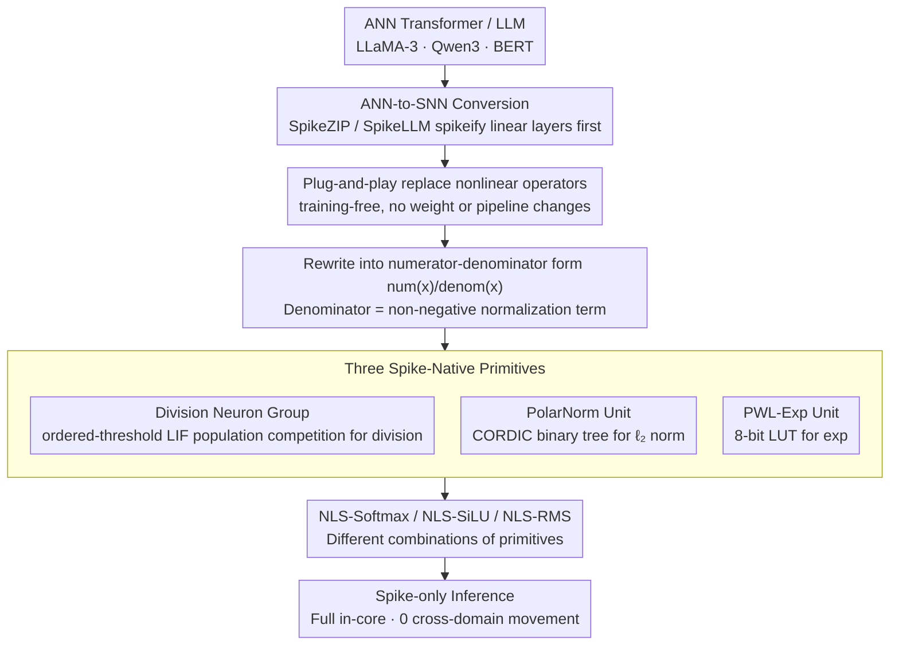

# Plug-and-Play Spiking Operators: Breaking the Nonlinearity Bottleneck in Spiking Transformers

**Conference**: ICML 2026  
**arXiv**: [2605.20289](https://arxiv.org/abs/2605.20289)  
**Code**: Not yet available  
**Area**: Model Compression / Spiking Neural Networks / ANN-to-SNN / Neuromorphic Hardware  
**Keywords**: Spiking Neural Networks, Transformer Nonlinear Operators, ANN-to-SNN Conversion, LIF Neurons, Training-free

## TL;DR
The authors decompose the three most difficult nonlinear operators to spikeify in Transformers (Softmax, SiLU, RMSNorm) into three common primitives: "division / exponential / $\ell_2$ norm". These are implemented as spike-friendly modules using LIF neuron population competition and shift scaling. These modules can be reassembled like building blocks and plugged into existing ANN-to-SNN pipelines without any fine-tuning, maintaining accuracy loss < 1% for models such as LLaMA-3-8B, Qwen3-8B, and BERT.

## Background & Motivation

**Background**: Deploying large models on neuromorphic hardware (e.g., Loihi, TrueNorth) for event-driven inference is a clear path for energy efficiency optimization. Recently, ANN-to-SNN conversion (mapping activations to spike firing rates without retraining) has been extended to Transformers and LLMs, represented by works like SpikeZIP-TF and SpikeLLM.

**Limitations of Prior Work**: The vast majority of existing ANN-to-SNN works only process linear operators (Matrix Multiplication, FFN projections) within Transformers. Nonlinear operators like Softmax, SiLU, and RMSNorm are either bypassed or offloaded to external CPUs. The core data paths of neuromorphic chips only support lightweight operations such as spikes, shifts, and additions, and are not efficient at floating-point division, exponentials, or square roots. Offloading nonlinear operators to external processors introduces significant cross-domain data movement overhead, which offsets the energy efficiency advantages of spiking computation.

**Key Challenge**: To achieve "strictly spike-only" deployment, these nonlinear operators must also be spikeified. However, standard LIF dynamics $v(t) = \lambda v(t-1) + I(t)$, $s(t) = \mathbb{I}[v(t) \geq \theta]$ are naturally constrained to approximately linear "accumulation-threshold-reset" mappings. Directly embedding division or $\sqrt{\cdot}$ into neurons either requires training or breaks compatibility with existing conversion pipelines.

**Goal**: Design a set of **training-free**, **modular**, and **LIF-primitive-based** nonlinear operator implementations that can be directly plugged into existing ANN-to-SNN pipelines like SpikeZIP or SpikeLLM without modifying weights or the pipeline.

**Key Insight**: The authors observe that Softmax, SiLU, and RMSNorm share a similar algebraic structure: the numerator is an input-dependent term, and the denominator is a non-negative normalization term. If "numerator-denominator-division" can be decomposed into independent modules where each module is implemented using only LIF neurons and shifts, then different nonlinear operators become mere combinations of these primitives.

**Core Idea**: Decompose nonlinear operators into three spike-native primitives—"division + exponential + $\ell_2$ norm"—and then recombine them modularly to construct NLS-Softmax, NLS-SiLU, and NLS-RMS.

## Method

### Overall Architecture
NLSpiking consists of a three-layer structure: the bottom layer comprises three spike-native primitives (division, $\ell_2$ norm, and exponential); the middle layer rewrites target nonlinear operators into a "numerator-denominator" form $\phi(x) = \text{num}(x)/\text{denom}(x)$ approximated by the primitives; the top layer consists of NLSpiking operators (NLS-Softmax / NLS-SiLU / NLS-RMS), which are different combinations of these primitives. Crucially, it is completely decoupled from the original ANN-to-SNN conversion framework—one can replace nonlinear operators with NLSpiking versions independently after SpikeZIP-TF has converted the linear layers, without touching weights or the pipeline.

### Key Designs

**1. Division Neuron Group: Translating "Division" into Neuron Population Competition**

The biggest obstacle to spikeifying nonlinear operators is division—neuromorphic chips excel at spikes, shifts, and additions, but not floating-point division. The authors' approach approximates integer division $q \approx I_A/I_B$ using a group of ordered-threshold LIF neurons in two stages. In the first stage, the spike denominator is accumulated over time to obtain $I_B = \sum_{t=1}^T I_B(t)$, then right-shifted to get a reference threshold $\theta = I_B \gg n = \lfloor I_B/2^n \rfloor$ (where $n = \log_2(TL)$). The threshold of the $i$-th neuron in the population is set to $\theta_i = i\theta$, effectively encoding the "magnitude" of the denominator into threshold gradients. In the second stage, the spike numerator $I_A(t)$ is fed into the population; neuron $i$ fires if and only if $I_A(t) \geq i\theta$. Counting the active neurons $q = \sum_i s_i$ and right-shifting yields the quotient $\hat q = q \gg n = \lfloor \sum_t I_A(t)/\theta \rfloor$. Thus, division is transformed into a table-lookup-style population competition to "find the largest $i$ such that $v(t) \geq i\theta$," which is naturally supported by hardware and involves only threshold comparisons and shifts.

**2. PolarNorm Unit: Mapping $\ell_2$ Norm to Shift-Adds via CORDIC**

RMSNorm requires $\|\mathbf v\|_2 = \sqrt{\sum_i x_i^2 + \epsilon d}$, but sum-of-squares and square roots are nearly impossible to expand directly in the spike domain. The authors borrow CORDIC iterations, a mature technique from 1970s floating-point hardware: the input is expanded as $\mathbf v = [x_1, \dots, x_d, \sqrt{\epsilon d}]$ and elements are merged pairwise in a binary tree. Each merge executes CORDIC-Hypot iterations $x_{k+1} = x_k + d_k \cdot y_k/2^k$, $y_{k+1} = y_k - d_k \cdot x_k/2^k$ (where $d_k = \text{sign}(y_k)$), such that after $n$ steps, $x_n \approx \sqrt{x^2 + y^2}$. Finally, a fixed gain reciprocal $1/K_n$, which is a power of 2, is used for scaling. The CORDIC approach unifies sum-of-squares and square roots into "shifts + adds/subs + sign checks," fitting perfectly within neuromorphic instruction sets.

**3. PWL-Exp Unit: 8-bit LUT Replacing Runtime Exponentials**

Both Softmax and SiLU require $\exp$, which is equally difficult in the spike domain. The authors partition the interval $[-L, L]$ into $K$ equal segments (width $\gamma = 2L/K$) and use linear interpolation for each segment: $e^x \approx ax + b = \frac{e^{x_{i+1}} - e^{x_i}}{x_{i+1} - x_i}(x - x_i) + e^{x_i}$ (where $x_i = -L + \gamma i$). Precomputed slopes $a$ and intercepts $b$ are stored in an 8-bit Look-Up Table (LUT). During runtime, only one LUT access and one fixed-point multiply-accumulate are required. This replaces the "runtime exponential" with "precomputed coefficients + shift scaling," providing analytical error bounds (Theorem 5.1 gives $\varepsilon_{\exp} = \frac{L^2}{2K^2} e^{2L/K}$) while compressing memory to a few dozen bytes, fitting within the limited on-chip SRAM of chips like Loihi.

### Loss & Training
The method is **training-free**, meaning no loss function is introduced and no fine-tuning is performed. All approximation errors are exposed through operator-level replacement after ANN-to-SNN conversion. Theoretically, the authors provide relative error bounds for each operator:

- Softmax: $|\tilde\phi_i - \phi_i| / \phi_i \leq \frac{2}{1 - \varepsilon_{\exp}}(\varepsilon_{\exp} + \Delta)$
- SiLU: $|\tilde\phi(x) - \phi(x)| \leq |x| \cdot \frac{2\varepsilon_{\exp}}{1 - \varepsilon_{\exp}} + |x|\Delta$
- RMSNorm: $|\tilde\phi_i - \phi_i| / \phi_i \leq \frac{2\varepsilon_{\text{pol}} + \Delta}{1 - \varepsilon_{\text{pol}}} + \sqrt{d}\Delta$

where $\Delta = 1/n$ is the quantization step for $(T, L)$-Division, and $\varepsilon_{\text{pol}} = \lceil \log_2 d\rceil \cdot 2^{-2n-1}$ is the error for the PolarNorm CORDIC tree. Recommended settings $H = 5, K = 64$ yield $\varepsilon_{\exp} \leq 3.63 \times 10^{-3}$.

## Key Experimental Results

### Main Results
Model-level evaluation covers two categories: (1) SNN-LLMs converted via SpikeLLM/SpikeZIP; (2) standard ANN-LLMs not explicitly covered by existing ANN-to-SNN pipelines.

| Model | Task Avg | Original Op | NLSpike Op | $\Delta$ |
|------|---------|---------|-------------|---------|
| LLaMA-3-8B (5-task avg) | Avg Acc | 0.730 | 0.727 | -0.003 |
| LLaMA-2-7B (5-task avg) | Avg Acc | 0.686 | 0.684 | -0.002 |
| Mistral-7B (5-task avg) | Avg Acc | 0.724 | 0.724 | +0.000 |
| Qwen3-8B (5-task avg) | Avg Acc | 0.734 | 0.748 | **+0.014** |
| SpikeLLM T=2,W2A16 LLaMA-2-7B | Avg Acc | 0.477 | 0.477 | -0.000 |
| SpikeLLM T=2,W2A16 LLaMA-2-13B | Avg Acc | 0.516 | 0.515 | -0.001 |
| SpikeZIP BERT (4-task avg) | Avg Acc | 0.807 | 0.810 | +0.003 |

Across WinoGrande, HellaSwag, ArcC, ArcE, and PIQA, accuracy fluctuations for all models are $< 1\%$, with NLSpike even leading slightly in some tasks (e.g., +1.4% on Qwen3-8B).

### Ablation Study

| Configuration | Key Metric | Description |
|------|---------|------|
| NLS-Softmax | Lowest mean error across dims | Better than Padé / PWL / Sorbet / hardmax |
| NLS-SiLU | Mean error comparable to 64-segment PWL-sigmoid | Optimal among training-free baselines |
| NLS-RMS | Stable across dimensions | Solves alignment issues in blockwise RMS |
| $H = 3/4/5$ (SiLU interval) | Minimal mean/max error | $H=5$ recommended; error rises for $H \geq 8$ |
| Increasing $H$ (Softmax, $d=64$) | Monotonic error decrease | Softmax requires larger truncation intervals |

### Key Findings
- The assumption that "nonlinear energy is negligible" is false for spike-only deployment—offloading them results in dominant cross-domain data movement costs.
- The three primitives share a single LUT requiring only $K$ 8-bit and 16-bit values, much smaller than traditional floating-point tables and well within on-chip SRAM limits.
- Latency analysis (Table 3) shows NLSpike requires only $n$ shift-adds/LUT calls per time step with zero cross-domain movement, whereas SpikeZIP/SpikeLLM still rely on external processors.
- Empirical results align with theoretical error bounds, proving that modular decomposition does not lead to error explosion.

## Highlights & Insights
- Treating division as a "spike-native primitive" is a counter-intuitive yet pivotal design. Prior SNN works avoided division; here, it is transformed into a hardware-friendly population competition for finding the "maximum active neuron."
- Using CORDIC for $\ell_2$ norm is a clever transfer of hardware expertise from the 1970s to SNN operator design, unifying complex operations into shifts and additions.
- The "numerator-denominator" abstraction provides an extensible template: future additions like GeLU, LayerNorm, or $\sin/\cos$ in RoPE only require new primitive modules rather than a full pipeline redesign.
- The training-free attribute is vital for practical engineering, allowing NLSpike to be applied directly to pretrained weights without degrading precision, unlike traditional SNN methods that require retraining for hardware migration.

## Limitations & Future Work
- The authors acknowledge that end-to-end deployment on physical neuromorphic hardware (Loihi / TrueNorth) for LLMs has not been completed; results currently rely on software simulation.
- Operator coverage is limited to Softmax, SiLU, and RMSNorm; GeLU, Mish, and implicit calculations in position encodings (RoPE / ALiBi) are not yet covered.
- Segment truncated interval $H$ is task-dependent (SiLU prefers small $H$, Softmax prefers large $H$), potentially leading to hardware configuration fragmentation.
- Future work: Combining NLSpike with Quantization-Aware Training (QAT) to let models adapt to LIF noise, or extending the "numerator-denominator" abstraction to MoE gating.

## Related Work & Insights
- **vs SpikeZIP-TF (You et al. 2024)**: SpikeZIP spikeifies linear layers but leaves nonlinearities to external CPUs; NLSpike completes the puzzle for fully spike-only backends.
- **vs SpikeLLM (Xing et al. 2025)**: Focuses on saliency-driven spike allocation for W2A16; NLSpike is orthogonal and can be reused within the SpikeLLM framework.
- **vs Sorbet (Tang et al. 2025)**: Sorbet uses shift-based discrete operations but requires knowledge distillation; NLSpike is training-free and more suitable for large-scale LLMs.
- **vs XNOR-Net / DoReFa-Net**: High-bit quantization baselines show large errors on SiLU/Softmax; NLSpike proves that "shift-add + LUT" can significantly reduce error at similar hardware costs.

<!-- RELATED:START -->

## Related Papers

- [\[NeurIPS 2025\] Spiking Brain Compression: Post-Training Second-Order Compression for Spiking Neural Networks](../../NeurIPS2025/model_compression/spiking_brain_compression_post-training_second-order_compression_for_spiking_neu.md)
- [\[AAAI 2026\] A Closer Look at Knowledge Distillation in Spiking Neural Network Training](../../AAAI2026/model_compression/a_closer_look_at_knowledge_distillation_in_spiking_neural_ne.md)
- [\[CVPR 2025\] Plug-and-Play Versatile Compressed Video Enhancement](../../CVPR2025/model_compression/plug-and-play_versatile_compressed_video_enhancement.md)
- [\[CVPR 2026\] ReFTA: Breaking the Weight Reconstruction Bottleneck in Tensorized Parameter-Efficient Fine-Tuning](../../CVPR2026/model_compression/refta_breaking_the_weight_reconstruction_bottleneck_in_tensorized_parameter-effi.md)
- [\[NeurIPS 2025\] S2M-Former: Spiking Symmetric Mixing Branchformer for Brain Auditory Attention Detection](../../NeurIPS2025/model_compression/s2m-former_spiking_symmetric_mixing_branchformer_for_brain_auditory_attention_de.md)

<!-- RELATED:END -->
