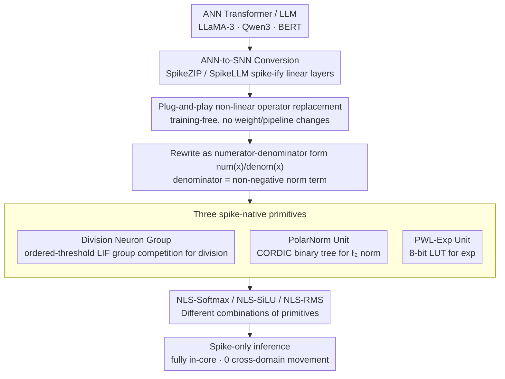

# Plug-and-Play Spiking Operators: Breaking the Nonlinearity Bottleneck in Spiking Transformers

**Conference**: ICML 2026  
**arXiv**: [2605.20289](https://arxiv.org/abs/2605.20289)  
**Code**: Not yet public  
**Area**: Model Compression / Spiking Neural Networks / ANN-to-SNN / Neuromorphic Hardware  
**Keywords**: Spiking Neural Networks, Transformer Nonlinear Operators, ANN-to-SNN Conversion, LIF Neurons, Training-free

## TL;DR
The authors decompose the three most difficult nonlinear operators in Transformers (Softmax, SiLU, RMSNorm) into three common primitives: "division / exponential / $\ell_2$ norm." These are implemented as spike-friendly modules using LIF neuron group computation and shift-scaling, which can be assembled like building blocks back into the original operators. This plug-and-play approach requires no fine-tuning and integrates directly into existing ANN-to-SNN pipelines, resulting in $<1\%$ accuracy loss for models like LLaMA-3-8B / Qwen3-8B / BERT.

## Background & Motivation

**Background**: Deploying large models on neuromorphic hardware (Loihi, TrueNorth) for event-driven inference is a clear path for energy efficiency optimization. Recently, ANN-to-SNN conversion (mapping activations to spike rates without retraining) has been extended to Transformers and LLMs, with representative works like SpikeZIP-TF and SpikeLLM.

**Limitations of Prior Work**: Most existing ANN-to-SNN works only handle linear operators in Transformers (matrix multiplication, FFN projections), while nonlinear operators like Softmax, SiLU, and RMSNorm are either bypassed or computed on an external CPU. The problem is that the core data path of neuromorphic chips only supports lightweight operations like spikes, shifts, and additions; they are not proficient in floating-point division, exponentials, or square roots. Moving nonlinear operators to external processors introduces significant cross-domain data movement overhead, negating the energy benefits of spiking computation.

**Key Challenge**: To achieve "strictly spike-only" deployment, these nonlinear operators must also be converted to spiking versions. However, standard LIF dynamics $v(t) = \lambda v(t-1) + I(t)$, $s(t) = \mathbb{I}[v(t) \geq \theta]$ naturally perform an approximately linear "accumulate-threshold-reset" mapping. Forcing division or $\sqrt{\cdot}$ into them usually requires training or breaks compatibility with existing conversion pipelines.

**Goal**: Design a **training-free**, **modular**, **LIF-only** implementation of nonlinear operators that can be directly inserted into pipelines like SpikeZIP/SpikeLLM without modifying weights or the pipeline.

**Key Insight**: The authors noted that Softmax, SiLU, and RMSNorm share a similar algebraic structure: the numerator is an input-related term, and the denominator is a non-negative normalization term. If "numerator, denominator, and division" can be split into independent modules implemented using only LIF and shifts, different nonlinear operators become mere combinations of these primitives.

**Core Idea**: Decompose nonlinear operators into three spike-native primitives—"division, exponential, and $\ell_2$ norm"—and recombine them modularly to construct Softmax, SiLU, and RMSNorm.

## Method

### Overall Architecture
NLSpiking features a three-layer structure: the bottom layer consists of three spike-native primitives (division, $\ell_2$ norm, exponential). The middle layer rewrites each target nonlinear operator into a "numerator-denominator" form $\phi(x) = \text{num}(x)/\text{denom}(x)$, approximating each with primitives. The top layer NLSpiking operators (NLS-Softmax / NLS-SiLU / NLS-RMS) are simply different combinations of these primitives. Crucially, it is completely decoupled from the original ANN-to-SNN framework—after converting linear layers with SpikeZIP-TF, nonlinear operators can be individually replaced with NLSpiking versions without touching weights or pipelines.

### Key Designs

**1. Division Neuron Group: Translating "Division" into Neuron Group Competition**

The biggest obstacle to nonlinear operator spike-ification is division—neuromorphic chips excel at spikes, shifts, and additions but struggle with floating-point division. The authors use a group of ordered-threshold LIF neurons to achieve an integer approximation $q \approx I_A/I_B$ in two stages. First, the spike denominator is accumulated over time to get $I_B = \sum_{t=1}^T I_B(t)$, then right-shifted to get a base threshold $\theta = I_B \gg n = \lfloor I_B/2^n \rfloor$ ($n = \log_2(TL)$). The threshold of the $i$-th neuron in the group is set to $\theta_i = i\theta$, effectively encoding the "magnitude" of the denominator into threshold gradients. In the second stage, the spike numerator $I_A(t)$ is fed to this group; neuron $i$ fires if and only if $I_A(t) \geq i\theta$. Counting active neurons $q = \sum_i s_i$ and right-shifting yields the quotient $\hat q = q \gg n = \lfloor \sum_t I_A(t)/\theta \rfloor$. Thus, division is transformed into a lookup-style competition of finding the largest $i$ such that $v(t) \geq i\theta$, which hardware supports naturally with only threshold comparisons and shifts.

**2. PolarNorm Unit: Resolving $\ell_2$ Norm using CORDIC Shift-Adds**

RMSNorm requires $\|\mathbf v\|_2 = \sqrt{\sum_i x_i^2 + \epsilon d}$, but sum-of-squares and square roots are nearly impossible to implement directly in the spiking domain. The authors adopt CORDIC iterations from 1970s hardware: the input is expanded as $\mathbf v = [x_1, \dots, x_d, \sqrt{\epsilon d}]$, merged in a binary tree, where each merge performs CORDIC-Hypot iterations $x_{k+1} = x_k + d_k \cdot y_k/2^k$, $y_{k+1} = y_k - d_k \cdot x_k/2^k$ ($d_k = \text{sign}(y_k)$). After $n$ steps, $x_n \approx \sqrt{x^2 + y^2}$. A fixed gain reciprocal $1/K_n$ (precisely a power of 2) is used for scaling. CORDIC unifies sum-of-squares and square roots into "shift + add/sub + sign check," matching neuromorphic instruction sets; the binary tree depth $\mathcal O(\log d)$ ensures provable error bounds.

**3. PWL-Exp Unit: Substituting Runtime Exponentials with 8-bit LUT**

Softmax and SiLU require $\exp$, which is unavailable in the spiking domain. The authors divide the range $[-L, L]$ into $K$ segments (width $\gamma = 2L/K$) and use linear interpolation $e^x \approx ax + b = \frac{e^{x_{i+1}} - e^{x_i}}{x_{i+1} - x_i}(x - x_i) + e^{x_i}$ ($x_i = -L + \gamma i$). Precomputed slopes $a$ and intercepts $b$ are stored in an 8-bit LUT. Runtime computation becomes a single LUT lookup and fixed-point multiply-accumulate. This replaces "runtime exponentials" with "precomputed coefficients + shift-scaling," ensuring an analytical error bound (Theorem 5.1 gives $\varepsilon_{\exp} = \frac{L^2}{2K^2} e^{2L/K}$) while keeping memory footprint within tens of bytes—fitting easily into the on-chip SRAM of chips like Loihi.

### Loss & Training
The method is **training-free**—it introduces no loss and requires no fine-tuning. All approximation errors are exposed via operator-level replacement after ANN-to-SNN conversion. Theoretically, the authors provide relative error bounds for each operator:

- Softmax: $|\tilde\phi_i - \phi_i| / \phi_i \leq \frac{2}{1 - \varepsilon_{\exp}}(\varepsilon_{\exp} + \Delta)$
- SiLU: $|\tilde\phi(x) - \phi(x)| \leq |x| \cdot \frac{2\varepsilon_{\exp}}{1 - \varepsilon_{\exp}} + |x|\Delta$
- RMSNorm: $|\tilde\phi_i - \phi_i| / \phi_i \leq \frac{\varepsilon_{\text{pol}} + \Delta}{1 - \varepsilon_{\text{pol}}} + \sqrt{d}\Delta$

Where $\Delta = 1/n$ is the quantization step for $(T, L)$-Division, and $\varepsilon_{\text{pol}} = \lceil \log_2 d\rceil \cdot 2^{-2n-1}$ is the CORDIC tree error. $H = 5, K = 64$ is recommended, yielding $\varepsilon_{\exp} \leq 3.63 \times 10^{-3}$.

## Key Experimental Results

### Main Results
Model-level evaluation covers two categories: (1) SNN-LLMs converted via SpikeLLM/SpikeZIP; (2) standard ANN-LLMs not explicitly covered by existing conversion pipelines.

| Model | Task Avg | Orig. Op | NLSpike Op | $\text{Gain}$ |
|-------|----------|----------|------------|---------------|
| LLaMA-3-8B (5 tasks) | Avg Acc | 0.730 | 0.727 | -0.003 |
| LLaMA-2-7B (5 tasks) | Avg Acc | 0.686 | 0.684 | -0.002 |
| Mistral-7B (5 tasks) | Avg Acc | 0.724 | 0.724 | +0.000 |
| Qwen3-8B (5 tasks) | Avg Acc | 0.734 | 0.748 | **+0.014** |
| SpikeLLM T=2,W2A16 LLaMA-2-7B | Avg Acc | 0.477 | 0.477 | -0.000 |
| SpikeLLM T=2,W2A16 LLaMA-2-13B | Avg Acc | 0.516 | 0.515 | -0.001 |
| SpikeZIP BERT (4 tasks) | Avg Acc | 0.807 | 0.810 | +0.003 |

Accuracy changes across WinoGrande, HellaSwag, ArcC, ArcE, and PIQA tasks are all $< 1\%$, with NLSpike even slightly outperforming on some (e.g., +1.4% on Qwen3-8B).

### Ablation Study

| Configuration | Key Metrics | Description |
|---------------|-------------|-------------|
| NLS-Softmax | Lowest dimension-wise mean error | Better than Padé / PWL / Sorbet / hardmax |
| NLS-SiLU | Mean error on par with 64-segment PWL-sigmoid | Best among training-free baselines |
| NLS-RMS | Dimension-stable performance | Solves alignment issues in blockwise RMS |
| $H = 3/4/5$ (SiLU range) | Minimal mean/max error; error jumps at $H \geq 8$ | $H = 5$ recommended |
| Increasing $H$ (Softmax, $d = 64$) | Monotonic error decrease; large error if $H \leq 4$ | Softmax requires larger truncation range |

### Key Findings
- The assumption that "nonlinear energy is negligible" is false for spike-only deployment; once moved to external processors, cross-domain movement costs dominate.
- Primitives share a single LUT of $K$ 8-bit and 16-bit values, much smaller than floating-point tables and fitting chip-limited SRAM.
- Latency analysis (Table 3) shows NLSpike requires only $n$ shift-adds or LUT calls per timestep with zero cross-domain traffic. It is the only fully "in-core" solution compared to SpikeZIP or SpikeLLM.
- Theoretical error bounds match empirical results, proving modular decomposition prevents error accumulation.

## Highlights & Insights
- Using division as a spike-native primitive is counter-intuitive but key. While previous SNN works avoided division, the authors transform it into finding the maximum active neuron via ordered thresholds, leveraging hardware's strengths in group competition.
- Adopting CORDIC for $\ell_2$ norms successfully migrates hardware floating-point expertise into SNN operator design, unifying complex math into mere shift-adds.
- The "numerator-denominator" abstraction provides an extensible template; future operators like GeLU or RoPE sine/cosine only need supplementary primitive modules.
- The training-free nature is vital for deployment, as it allows NLSpike to support pretrained weights without retraining—a significant departure from traditional SNN research.

## Limitations & Future Work
- The authors acknowledge that end-to-end deployment on real neuromorphic hardware (Loihi / TrueNorth) is not yet implemented; results are software-simulated due to memory and latency trade-offs.
- Coverage is limited to Softmax, SiLU, and RMSNorm; GeLU or trigonometric operations in RoPE/ALiBi are not yet addressed.
- Choice of $H$ is task-dependent (SiLU prefers small $H$, Softmax large), leading to potential fragmentation in LUT configurations.
- PWL-Exp is near its error limit under 8-bit quantization; further precision may require non-uniform segmentation or multi-level LUTs.
- Future work: Combining NLSpike with Quantization-Aware Training (QAT) to adapt models to LIF noise, or extending the abstraction to MoE gating.

## Related Work & Insights
- **vs SpikeZIP-TF (You et al. 2024)**: SpikeZIP handles linear layers but leaves non-linearities to external CPUs; this work completes the puzzle.
- **vs SpikeLLM (Xing et al. 2025)**: SpikeLLM focuses on saliency-driven spike allocation; NLSpike is orthogonal and can be used in tandem by rewriting the operators themselves.
- **vs Sorbet (Tang et al. 2025)**: Sorbet uses shift-based discrete math but requires distillation/fine-tuning; NLSpike is entirely training-free.
- **vs FAS / LAS (Chen et al. 2025)**: While these focus on lossless conversion, they rely on external non-linearities; NLSpike providing the "strictly spike-only" missing link.
- **vs XNOR-Net / DoReFa-Net**: These suffer high errors on SiLU/Softmax; NLSpike proves modular shift-adds with LUTs significantly improve accuracy at similar costs.

<!-- RELATED:START -->

## Related Papers

- [\[ICLR 2026\] TP-Spikformer: Token Pruned Spiking Transformer](../../ICLR2026/model_compression/tp-spikformer_token_pruned_spiking_transformer.md)
- [\[NeurIPS 2025\] Spiking Brain Compression: Post-Training Second-Order Compression for Spiking Neural Networks](../../NeurIPS2025/model_compression/spiking_brain_compression_post-training_second-order_compression_for_spiking_neu.md)
- [\[CVPR 2025\] Plug-and-Play Versatile Compressed Video Enhancement](../../CVPR2025/model_compression/plug-and-play_versatile_compressed_video_enhancement.md)
- [\[ICLR 2026\] Cannistraci-Hebb Training on Ultra-Sparse Spiking Neural Networks](../../ICLR2026/model_compression/cannistraci-hebb_training_on_ultra-sparse_spiking_neural_networks.md)
- [\[AAAI 2026\] A Closer Look at Knowledge Distillation in Spiking Neural Network Training](../../AAAI2026/model_compression/a_closer_look_at_knowledge_distillation_in_spiking_neural_ne.md)

<!-- RELATED:END -->
