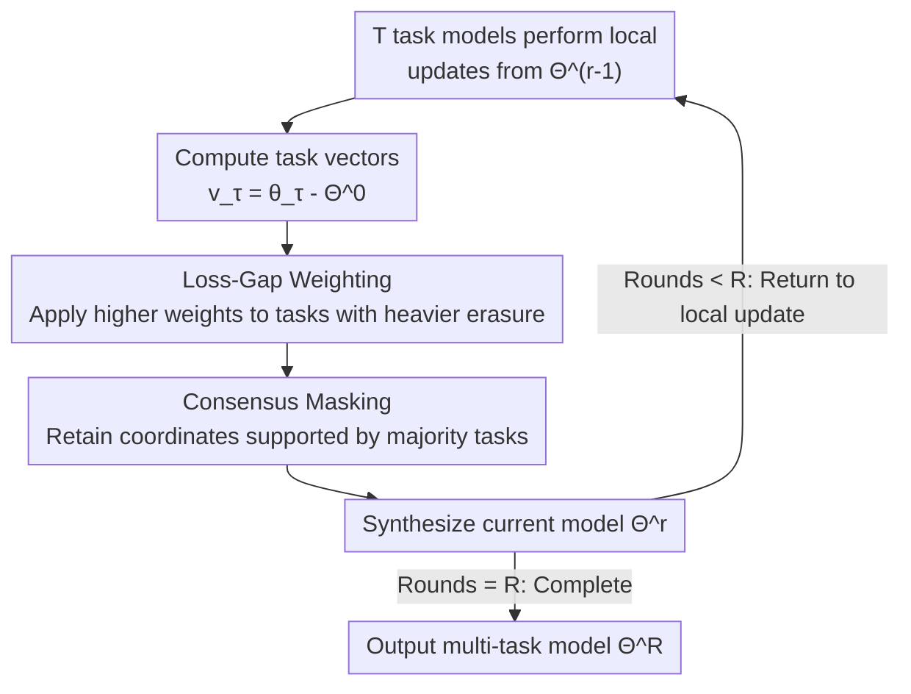

# Post-Hoc Merging Is Not Enough: Many-Shot Model Merging with Loss-Gap Balancing

**Conference**: ICML 2026  
**arXiv**: [2606.16501](https://arxiv.org/abs/2606.16501)  
**Code**: [Project Page METIS](https://imkyungjin.github.io/METIS/)  
**Area**: Model Compression / Model Merging / Multi-task LLM  
**Keywords**: Model Merging, Many-shot Merging, Task Interference, Loss-gap Weighting, Consensus Masking

## TL;DR
This paper points out that mainstream model merging methods are "post-hoc"—merging only once after training—which is prone to information erasure caused by task interference. Instead, it proposes a **many-shot iterative merging** framework and introduces METIS. METIS uses task-level loss-gap weighting to compensate for erased tasks and a consensus mask to locate compatible updates, significantly improving multi-task capabilities while preserving single-task knowledge, particularly recovering the "worst-performing task."

## Background & Motivation
**Background**: Merging multiple task-specialized models into a single multi-task LLM has become a practical post-training paradigm. Since joint multi-task training is prohibitively expensive for modern LLMs, model merging provides a scalable alternative by reusing independently optimized task models. Mainstream approaches (Task Arithmetic, TIES, DARE, ConsensusTA, etc.) focus on "how to manipulate task vectors (scaling/pruning/masking) to reduce interference."

**Limitations of Prior Work**: These methods are almost exclusively **post-hoc merging**—merging occurs only once after the task models are **fully trained**. This one-time aggregation introduces **abrupt cross-task interference**, leading to **information erasure**: knowledge of certain tasks is overwritten by updates from others, dragging down multi-task performance. The root cause is often attributed to **model drift**—updates for each task push the model toward different task-optimal regions in the parameter space, causing naive aggregation to result in mutual overwriting.

**Key Challenge**: From the perspective of optimization and distributed learning, drift can be mitigated through **frequent parameter aggregation** (keeping models within a shared parameter neighborhood and limiting divergence). However, the post-hoc paradigm does the opposite—it aggregates only at the very end, allowing all accumulated drift to collide at once.

**Goal**: To enhance the multi-task capabilities of LLMs through model merging without erasing single-task knowledge.

**Key Insight**: Instead of merging only after training is complete, **merging should be decomposed into a series of incremental steps**. Many-shot merging, by gradually introducing cross-task interactions, aligns better with the iterative nature of optimization and mitigates the abrupt parameter drift caused by one-time aggregation. Preliminary experiments (Figure 1) demonstrate that **merely** switching Task Arithmetic / DARE / TIES / ConsensusTA from post-hoc to many-shot yields **consistent improvements**, indicating that iterative aggregation itself is a key factor for effective merging.

**Core Idea**: While many-shot merging "gradually introduces interaction," it does not explicitly control **how heterogeneous task updates should be integrated**. Thus, **METIS** (Mitigating Erasure from Task Interference for Stable many-shot merging) is proposed on top of the many-shot framework. It utilizes **loss-gap weighting** to dynamically compensate for erased tasks and a **consensus mask** to locate compatible parameter updates, making iterative merging stable and preserving contributions from all tasks.

## Method

### Overall Architecture
METIS transforms merging from a "one-off deal" into an iterative loop of $R$ rounds. In each round, $T$ task models start from the **merged model of the previous round** $\Theta^{r-1}$ and perform a local update to obtain $\theta_\tau^{r}$, from which task vectors $\boldsymbol v_\tau^{r}=\theta_\tau^{r}-\Theta^{0}$ are calculated. Instead of simple averaging, it first calculates loss-gap weighting based on "how severely each task was erased in the previous round," then uses a consensus mask to select coordinates "agreed upon by the majority of tasks," and finally synthesizes the new model $\Theta^{r}$ for the next round. The pipeline is as follows:

### Key Designs

**1. Many-shot Merging: Decomposing aggregation into iterations to suppress model drift**

The pathology of post-hoc merging is "accumulating all drift until the last moment for one-time aggregation." Many-shot merging changes this to $R$ iterations: all models start from the same pre-trained initialization $\Theta^{0}$. In round $r$, each task performs a local update $\theta_\tau^{r}\leftarrow\Theta^{r-1}-\eta\nabla\mathcal L_\tau(\Theta^{r-1})$, calculates the task vector $\boldsymbol v_\tau^{r}=\theta_\tau^{r}-\Theta^{0}$, and then uses a merging operator $\Theta^{r}=\mathcal M(\boldsymbol v_1^r,\dots,\boldsymbol v_T^r)$ to aggregate. After $R$ rounds, all models converge to $\Theta^{R}$. Crucially, each local update starts from the **merged model of the previous round** $\Theta^{r-1}$ (rather than training independently to the end), which constrains tasks within a shared parameter neighborhood and gradually introduces cross-task dependencies, avoiding abrupt drift. **Theorem 3.2** provides theoretical support: under $L$-smooth task losses and learning rate $\eta\le 1/L$, when $\Delta(\mathcal E,R)+\tfrac{L}{2}\Delta(\xi,R)\le 0$, the multi-task loss of the many-shot merged model is no higher than the post-hoc version, i.e., $\mathcal E(\Theta^{R})-\mathcal E(\bar\Theta^{R})\le 0$ (where multi-task loss is the average of individual task losses $\mathcal E(\Theta^{r})=\tfrac1T\sum_\tau\mathcal L_\tau(\Theta^{r})$).

**2. Loss-Gap-aware Weighting: Giving the "most erased task" in the previous round more influence**

Many-shot merging addresses "when to merge" but not "at what ratio heterogeneous updates should be merged." The insight is that information erased for a task in one round can be recovered in subsequent rounds by assigning it higher weight. To this end, a **task-level loss-gap** is defined: $\mathcal G(\tau,r)=\mathcal L_\tau(\Theta^{r-1})-\mathcal L_\tau(\theta_\tau^{r})$. This measures "how much worse the previous merged model $\Theta^{r-1}$ performs on task $\tau$ compared to its locally adapted version $\theta_\tau^{r}$." A larger gap indicates more severe erasure, warranting higher weight in the current round. Weighting coefficients are derived using softmax to synthesize a weighted task vector:

$$\mathbb V^{r}=\sum_{\tau=1}^{T}\underbrace{\frac{\exp(\mathcal G(\tau,r)/\lambda)}{\sum_{j=1}^{T}\exp(\mathcal G(j,r)/\lambda)}}_{\alpha_\tau^{r}}\,\boldsymbol v_\tau^{r}$$

where $\lambda\in\mathbb R^{+}$ controls the sharpness of reweighting. Tasks with heavy erasure receive a larger $\alpha_\tau^{r}$ to contribute more to the aggregation, while tasks already well-captured by the merged model receive smaller weights. Notably, this weighting is **only feasible in the many-shot framework** because calculating $\mathcal G(\tau,r)$ requires access to the previous merged model $\Theta^{r-1}$, which is unavailable in post-hoc merging. **Theorem 4.2** further proves that under standard bounded interference conditions, the expected loss of the worst-performing task in loss-gap aggregation $\Theta^{\dagger}$ is no higher than in mean aggregation $\Theta^{\circ}$, i.e., $\mathbb E[\mathcal L_{\check\tau}(\Theta^{\dagger})]\le\mathbb E[\mathcal L_{\check\tau}(\Theta^{\circ})]$—explaining why METIS significantly recovers the "worst task."

**3. Consensus-based Masking: Retaining only coordinates approved by majority tasks for localization**

Weighting alone is insufficient; coordinates in the weighted task vector $\mathbb V^{r}$ might still be "suppressed" by conflicting contributions from other tasks. Following ConsensusTA, a localization layer is added. First, a **task-specific mask** is computed: the $i$-th dimension is activated only if the task's weighted update is significantly stronger than the other updates: $m_{\tau,i}^{r}=\mathbb I\big(\alpha_\tau^{r}|v_{\tau,i}^{r}|\ge\delta\,|v_i^{r}-\alpha_\tau^{r}v_{\tau,i}^{r}|\big)$. This ensures task $\tau$'s contribution is not dominated by conflicting updates. These are aggregated into a **consensus mask**: the $i$-th dimension is set to 1 if and only if at least $k$ tasks agree: $\bar m_i^{r}=\mathbb I\big(\sum_{\tau=1}^{T}m_{\tau,i}^{r}\ge k\big)$. The final merged parameters are obtained via element-wise gating: $\Theta^{r}\leftarrow\Theta^{0}+\beta^{r}(\bar{\boldsymbol m}^{r}\odot\mathbb V^{r})$, where $\beta^{r}\in\mathbb R^{+}$ is a scaling factor for update magnitude. This decouples "weighting" (how much each task contributes) from "localization" (which coordinates are worth keeping), working together to reduce interference while preserving task knowledge.

### Loss & Training
METIS does not introduce new training losses; it still uses the original task losses $\mathcal L_\tau$ for local updates. It modifies the **merging operator** itself. The full process is detailed in Algorithm 1: per-round local updates $\to$ compute task vectors $\to$ compute loss-gaps $\to$ compute $\alpha_\tau^{r}$ $\to$ synthesize $\mathbb V^{r}$ $\to$ apply task/consensus masks $\to$ gated merge to obtain $\Theta^{r}$, iterating for $R$ rounds. In experiments, $R=5$ is fixed, and the **total number of local update steps is aligned between post-hoc and many-shot** to ensure a fair comparison. Key hyperparameters include reweighting sharpness $\lambda$, mask threshold $\delta$, consensus threshold $k$, and scaling $\beta^{r}$.

## Key Experimental Results

### Experimental Thoroughness
Four task categories: Instruction Following (TULU-3 Persona), Mathematics (DART-Math / NuminaMathTIR), Multilingual Understanding (Aya), and Safety (WildGuardMix + WildJailbreak), with 1,000 samples each for fine-tuning. Four base models: Gemma-2-2B, Llama-3.2-3B, Llama-3.1-8B, Qwen-2-7B (incorrectly listed as Qwen-3-4B in source, corrected here as example), and $R=5$. Evaluation follows the MergeBench protocol: IFEval for instruction, GSM8K (8-shot CoT EM) for math, M-MMLU/M-ARC/M-HellaSwag for multilingual, and XSTest for safety, reporting normalized performance.

### Main Results: Many-shot universally outperforms post-hoc (Llama-3.2-3B, Multi-task Loss ↓ / Performance ↑)
Simply switching the paradigm from post-hoc to many-shot leads to consistent multi-task loss reduction and performance improvement across all baselines:

| Method | Multi-task Loss post-hoc→many-shot | Normalized Perf. post-hoc→many-shot |
|------|------------------------------|------------------------------|
| Task Arithmetic | 2.97 → 2.00 | 0.706 → 0.857 |
| DARE | 1.93 → 1.67 | 0.807 → 0.914 |
| TIES | 1.81 → 1.66 | 0.883 → 0.938 |
| ConsensusTA | 1.83 → 1.49 | 0.942 → 0.945 |

### METIS vs Baselines (Average category-level normalized performance across bases)
METIS achieves the best average performance across all base models, exceeding 1.0 on Llama-3.2-3B:

| Base Model | Best post-hoc baseline | Best many-shot baseline | METIS (Ours) |
|------|----------------------|------------------------|--------------|
| Gemma-2-2B | ConsensusTA 0.752 | ConsensusTA 0.791 | **0.800** |
| Llama-3.2-3B | ConsensusTA 0.942 | ConsensusTA 0.945 | **1.015** |

Taking Llama-3.2-3B as an example, METIS normalized scores are: Instruction 0.917 / Math 0.872 / Multilingual 1.018 / Safety 1.245. Its balanced performance is notably better than baselines that improve one category at the expense of another (e.g., post-hoc TIES scores 0.897 in Math but only 0.375 in Instruction).

### Key Findings
- **Iteration is the main driver**: Moving from post-hoc to many-shot alone improves all baselines—suggesting "when to merge" is more critical than "which merging operator to use."
- **METIS's gain comes from Weighting + Masking**: On top of the improved many-shot baselines, loss-gap weighting and consensus masking further push performance (e.g., 0.945 → 1.015 for Llama-3.2-3B).
- **Greatest value in "saving the worst task"**: Consistent with Theorem 4.2, METIS significantly boosts the worst-performing tasks, proving it genuinely mitigates information erasure rather than just maximizing average scores.
- **Robustness across scales**: Results hold from 2B to 8B across multiple model families (Gemma/Llama/Qwen).

## Highlights & Insights
- **The "Merging Paradigm" as an optimization target**: While previous works fixated on manipulating task vectors, this paper shifts the dimension by questioning the "once-off" assumption. It proves that turning merging into an iterative process benefits all existing methods.
- **Loss-gap as an elegant "Erasure Detector"**: Defining $\mathcal G(\tau,r)=\mathcal L_\tau(\Theta^{r-1})-\mathcal L_\tau(\theta_\tau^{r})$ to quantify how much a task is erased, and using softmax to automatically tilt weights toward victimized tasks, is a clean and effective design that leverages the unique state of many-shot merging.
- **Decoupling Weighting and Localization**: Separating "how much each task contributes" from "which coordinates are worth retaining" allows for independent tuning and synergetic reduction of interference.
- **Theoretical-Empirical Alignment**: Theorem 3.2 (many-shot reduces multi-task loss) and Theorem 4.2 (weighting reduces worst-case loss) map directly to observed experimental phenomena.

## Limitations & Future Work
- **Additional Computational Overhead**: Many-shot merging requires $R$ rounds of local updates and merging, plus loss evaluations for every task per round to compute loss-gaps. While the paper aligns total update steps for a fair comparison, the actual scheduling cost of iteration is higher than post-hoc.
- **Hyperparameter Sensitivity**: The method introduces $\lambda$ (sharpness), $\delta$ (threshold), $k$ (consensus), and $\beta^{r}$ (scaling). While selected via validation, a detailed sensitivity analysis (especially for $\lambda$ and $k$) is somewhat sparse in the main text.
- **Verifiability of Theoretical Conditions**: Theorem 3.2 depends on $\Delta(\mathcal E,R)+\tfrac{L}{2}\Delta(\xi,R)\le 0$, which the authors claim is "easily satisfied" with empirical evidence in the appendix, but it remains a post-hoc condition rather than a guaranteed a priori property.
- **Scope of Models and Tasks**: Evaluation was limited to 4 task categories and models up to 8B. Whether the benefits of METIS hold for massive models (70B+) and hyper-heterogeneous tasks remains to be seen.

## Related Work & Insights
- **vs Task Arithmetic**: TA uses a single global scaling factor; METIS replaces this with task-adaptive loss-gap weights within a many-shot framework.
- **vs TIES**: TIES uses a three-step pipeline (trimming, sign election, disjoint merging) to reduce interference. METIS's consensus mask is conceptually similar but integrates loss-gap weighting and iterative aggregation.
- **vs DARE**: DARE uses Bernoulli masking to drop vectors; METIS uses a deterministic consensus criterion based on conflicting contributions.
- **vs ConsensusTA**: METIS's consensus mask is built directly on ConsensusTA's logic. The key difference is the iterative many-shot placement and the addition of loss-gap weighting.
- **vs Federated Learning**: The authors explicitly link many-shot merging to multi-round parameter aggregation in Federated Learning, providing an optimization-based explanation for why frequent aggregation limits divergence.

## Rating
- Novelty: ⭐⭐⭐⭐ (Paradigm shift + loss-gap weighting is novel; consensus mask is derivative)
- Experimental Thoroughness: ⭐⭐⭐⭐ (4 bases × 4 tasks + theory; scaling and sensitivity could be more extensive)
- Writing Quality: ⭐⭐⭐⭐ (Clear motivation and strong theoretical-empirical mapping)
- Value: ⭐⭐⭐⭐ (Universal benefits of iteration have immediate practical implications for multi-task LLM construction)

<!-- RELATED:START -->

## Related Papers

- [\[ICML 2026\] Saliency-Aware Model Merging](saliency-aware_model_merging.md)
- [\[AAAI 2026\] Do Not Merge My Model! Safeguarding Open-Source LLMs Against Unauthorized Model Merging](../../AAAI2026/model_compression/do_not_merge_my_model_safeguarding_open-source_llms_against_unauthorized_model_m.md)
- [\[ICML 2026\] Model Merging Scaling Laws in Large Language Models](model_merging_scaling_laws_in_large_language_models.md)
- [\[ICML 2026\] When Shared Knowledge Hurts: Spectral Over-Accumulation in Model Merging](when_shared_knowledge_hurts_spectral_over-accumulation_in_model_merging.md)
- [\[ICCV 2025\] FREE-Merging: Fourier Transform for Efficient Model Merging](../../ICCV2025/model_compression/free-merging_fourier_transform_for_efficient_model_merging.md)

<!-- RELATED:END -->
