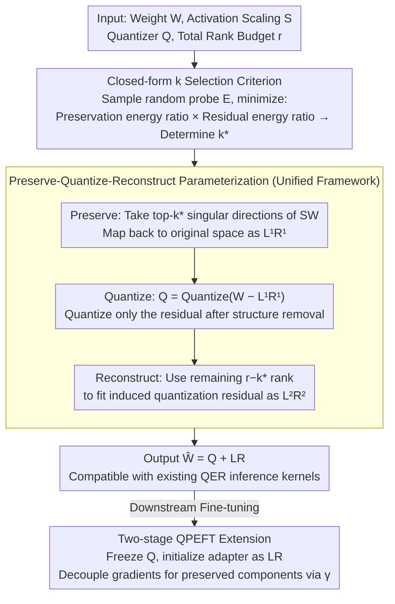

# Preserve-Then-Quantize: Balancing Rank Budgets for Quantization Error Reconstruction in LLMs

**Conference**: ICML 2026  
**arXiv**: [2602.02001](https://arxiv.org/abs/2602.02001)  
**Code**: https://ai-isl.github.io/srr (Project Page)  
**Area**: Model Compression / LLM Low-bit Quantization  
**Keywords**: PTQ, Quantization Error Reconstruction, Low-rank Compensation, QPEFT, Rank Budget Allocation

## TL;DR
The authors propose SRR (Structured Residual Reconstruction), which explicitly splits the fixed low-rank budget $r$ in Quantization Error Reconstruction (QER) into two parts: "preserving $k$ principal singular directions before quantization" and "fitting the residual with the remaining $r-k$ rank". Using a closed-form criterion based on a one-shot random probe to select $k^\star$ per layer, SRR consistently outperforms LQER/QERA in 2/3-bit PTQ and QPEFT.

## Background & Motivation

**Background**: When LLM weights are compressed to 3/2-bit via low-bit PTQ, accuracy significantly drops. The mainstream remedy is QER, which approximates weights as $\mathbf{W}\approx \mathbf{Q}+\mathbf{L}\mathbf{R}$, where $\mathbf{Q}=\mathcal{Q}(\mathbf{W})$ is the direct quantization result and $\mathbf{L}\mathbf{R}$ is a correction term with rank $\le r$ to restore quantization error. Methods like ZeroQuant-V2, LQER, and QERA follow this path, often performing truncated SVD in a scaled space $\mathbf{S}\mathbf{W}$ using a diagonal scaling matrix $\mathbf{S}$ derived from calibrated activations.

**Limitations of Prior Work**: Existing methods allocate the entire rank budget $r$ to fitting the residual $\mathbf{S}(\mathbf{W}-\mathbf{Q})$. However, in low-bit regimes, quantization error is typically dense and high-rank, while $\mathbf{S}\mathbf{W}$ itself is actually "low-rank"—Transformer weights in activation-scaled space are highly anisotropic, with energy concentrated in a few principal singular directions. Consequently, quantization first destroys these high-energy directions, leaving a noisy, high-rank residual that the limited rank budget struggles to reconstruct.

**Key Challenge**: The "usage" of the rank budget is locked into "residual compensation" by default. In reality, a rank budget can be used more efficiently in two ways: either preserving the principal subspace before quantization (structure preservation) or reconstructing errors after quantization (error reconstruction). Which usage is more cost-effective depends on the spectral shape of the specific layer.

**Goal**: Given a fixed rank budget $r$, this work aims to answer two questions: (i) whether there exists a unified framework for "preserving $k$ dimensions of structure, quantizing, and then reconstructing the residual with $r-k$ dimensions"; and (ii) how to select the optimal $k$ per layer and per matrix without brute-force enumeration.

**Key Insight**: The authors treat the singular spectrum shape of $\mathbf{S}\mathbf{W}$ as a "prior signal"—the faster the spectral decay and more concentrated the energy, the more valuable it is to spend the rank on preservation; the flatter the decay, the more rank should be reserved for the residual. Combined with the assumption that quantization noise is approximately isotropic, the choice of $k$ can be formulated as minimizing $\rho_k(\mathbf{S}\mathbf{W})\cdot\rho_{r-k}(\mathbf{S}\mathbf{E})$, where $\rho_p(\mathbf{A})$ is the energy ratio of the tail after rank-$p$ truncation, and $\mathbf{E}$ is a simple $\mathcal{U}[-1,1]$ random matrix proxy.

**Core Idea**: Reformulating QER into a three-step "Preserve-Quantize-Reconstruct" process ($\mathbf{W}\approx \mathbf{L}^{(1)}\mathbf{R}^{(1)} + \mathbf{Q} + \mathbf{L}^{(2)}\mathbf{R}^{(2)}$) and determining the optimal rank split $k^\star$ using a one-shot random probe.

## Method

### Overall Architecture
SRR is a plug-and-play, training-free PTQ post-processing method. For each linear layer weight $\mathbf{W}\in\mathbb{R}^{m\times n}$ and its activation scaling matrix $\mathbf{S}$, given a quantizer $\mathcal{Q}$ and a total rank budget $r$, SRR follows four steps: (1) Sample a random matrix $\mathbf{E}_{ij}\sim\mathcal{U}[-1,1]$ and determine the rank split $k^\star=\arg\min_k \rho_k(\mathbf{S}\mathbf{W})\rho_{r-k}(\mathbf{S}\mathbf{E})$; (2) Extract the top-$k^\star$ singular components of $\mathbf{S}\mathbf{W}$ and map them back to the original space to get $\mathbf{L}^{(1)}\mathbf{R}^{(1)}=\mathbf{S}^{-1}\mathrm{SVD}_{k^\star}(\mathbf{S}\mathbf{W})$; (3) Quantize only the remaining components $\mathbf{Q}=\mathcal{Q}(\mathbf{W}-\mathbf{L}^{(1)}\mathbf{R}^{(1)})$; (4) Use the remaining $r-k^\star$ rank to fit the induced quantization error $\mathbf{E}_k=\mathbf{W}-\mathbf{L}^{(1)}\mathbf{R}^{(1)}-\mathbf{Q}$ in the scaled space, obtaining $\mathbf{L}^{(2)}\mathbf{R}^{(2)}=\mathbf{S}^{-1}\mathrm{SVD}_{r-k^\star}(\mathbf{S}\mathbf{E}_k)$. Finally, the two low-rank blocks are concatenated into $\mathbf{L},\mathbf{R}$. The inference form remains $\widehat{\mathbf{W}}=\mathbf{Q}+\mathbf{L}\mathbf{R}$, which is fully compatible with existing QER kernels.

### Key Designs

**1. Differentiable "Preserve-Quantize-Reconstruct" Parameterization: Exposing Implicit Rank Usage**

Traditional QER defaults to spending the entire rank budget $r$ on the residual, implicitly making the decision for the user. SRR makes this explicit via a tunable split point $k\in\{0,\dots,r\}$. $k=0$ reduces to traditional QER (ZeroQuant-V2/LQER/QERA), and $k=r$ reduces to structure-first methods like LQ-LoRA/SVDQuant. This formulation minimizes the reconstruction error in scaled space: $\min_{0\le k\le r}\|\mathbf{S}(\mathbf{W}-(\Delta_1+\mathcal{Q}(\mathbf{W}-\Delta_1)+\Delta_2))\|_F$, where $\Delta_1$ is the rank-$k$ preservation term and $\Delta_2$ is the rank-$(r-k)$ residual correction. By the Eckart-Young theorem, the optimal $\Delta_1,\Delta_2$ for a given $k$ are determined by truncated SVDs, leaving $k$ as the only scalar degree of freedom. This split is necessary because optimal $k$ values vary significantly across different projection matrices (Query, Output, MLP up/down) within the same layer.

**2. Closed-form $k$ Selection Criterion via "Constant Quantization Noise Ratio": One-shot Random Probe**

To avoid $O(r)$ expensive computations from brute-force enumeration of $k$, the authors simplify the loss $\mathcal{L}(k)^2=\|\mathbf{S}\mathbf{E}_k\|_F^2\cdot\rho_{r-k}(\mathbf{S}\mathbf{E}_k)$. Two assumptions are used: (1) The quantization error energy ratio is approximately a constant $\eta_\mathcal{Q}$, meaning $\|\mathbf{S}\mathbf{E}_k\|_F^2\approx \eta_\mathcal{Q}^2\rho_k(\mathbf{S}\mathbf{W})\|\mathbf{S}\mathbf{W}\|_F^2$; (2) The normalized spectrum of the quantization residual is approximately independent of $k$, allowing a random matrix $\mathbf{E}\sim\mathcal{U}[-1,1]$ to substitute for the real $\mathbf{E}_k$. The resulting criterion $k^\star=\arg\min_k \rho_k(\mathbf{S}\mathbf{W})\rho_{r-k}(\mathbf{S}\mathbf{E})$ only requires calculating the singular spectrum of $\mathbf{S}\mathbf{W}$ and one random $\mathbf{E}$. This proxy is highly consistent with real reconstruction error curves (Figure 2 in the paper) and is stable across different random probes due to the concentration of singular spectra in large dimensions.

**3. Two-stage QPEFT Initialization + Gradient Decay Decoupling: Stable Preservation and Active Reconstruction**

SRR naturally extends to Quantized PEFT by initializing LoRA-style adapters with $\mathbf{L}\mathbf{R}=\mathbf{L}^{(1)}\mathbf{R}^{(1)}+\mathbf{L}^{(2)}\mathbf{R}^{(2)}$. However, the singular values of preserved components $\mathbf{L}^{(1)}\mathbf{R}^{(1)}$ are much larger than those of residual components $\mathbf{L}^{(2)}\mathbf{R}^{(2)}$, leading to unbalanced learning. The authors introduce a decay coefficient $\gamma \in (0, 1)$ for the preserved component gradients: $\nabla_{\mathbf{L}^{(1)}\mathbf{R}^{(1)}}\mathcal{L}\leftarrow \gamma\nabla_{\mathbf{L}^{(1)}\mathbf{R}^{(1)}}\mathcal{L}$, while residual gradients remain unchanged. This ensures that preservation directions representing original semantic structures stay stable, while residual directions are free to adapt to downstream tasks.

### Loss & Training
The PTQ stage requires no training and is performed via SVD, quantization, and random probes. The QPEFT stage uses standard downstream task losses (e.g., cross-entropy for GLUE) with the addition of the gradient scaling $\gamma$. All SVDs use randomized SVD for efficiency.

## Key Experimental Results

### Main Results
Systematic comparisons were conducted across 6 models (TinyLlama 1.1B to LLaMA-3.1 70B) and two rank budgets ($r=32, 64$). Representative data (WikiText2 PPL ↓, 3-bit MXINT quantization):

| Model | Rank | QER Baseline (QERA-exact) | + SRR | Gain |
|------|----|-----------------------|-------|------|
| TinyLlama 1.1B | $r=64$ | $19.59$ | $18.71$ | $-0.88$ |
| Gemma-2 2B | $r=64$ | $19.36$ | $18.30$ | $-1.06$ |
| LLaMA-2 7B | $r=64$ | $10.68$ | $10.59$ | $-0.09$ |
| LLaMA-3.1 8B | $r=64$ | $11.00$ | $10.78$ | $-0.22$ |
| LLaMA-3.1 70B | $r=32$ | $6.68$ | $6.63$ | $-0.05$ |

SRR consistently reduces perplexity across all combinations; gains are most significant for smaller models and the 3-bit regime. Zero-shot average accuracy (5 tasks, $r=64$, 3-bit):

| Model | BF16 | w-only | QERA-exact | + SRR |
|------|------|--------|-----------|-------|
| Gemma-2 2B | $59.26$ | $45.12$ | $52.15$ | $54.38$ |
| LLaMA-2 7B | $58.90$ | $52.50$ | $55.28$ | $56.56$ |
| LLaMA-3.1 8B | $67.34$ | $51.17$ | $59.05$ | $60.79$ |

### Ablation Study

| Configuration | Key Metric | Description |
|------|---------|------|
| QER ($k=0$) | baseline PPL | All rank to residual (standard practice) |
| LQ-LoRA-style ($k=r$) | Worse than $k=0$ | All rank to structure (no residual correction) |
| SRR with one-shot probe | Within $\pm 1$ of optimal $k^\star$ | One-shot spectral proxy is stable |
| QPEFT w/o gradient decay $\gamma$ | Unstable training | Preserved directions are washed out |
| QPEFT $\gamma\in\{0.1, 0.5\}$ | Consistently better than baseline | Robust to $\gamma$, gains from initialization |

### Key Findings
- The key is not just "how much to preserve," but "knowing how much to preserve for each layer"—layer-wise adaptation is core to SRR's success.
- One-shot random probes work because Transformer layer dimensions are large enough for random matrix singular spectra to concentrate.
- The $5.9$ pp GLUE gain in QPEFT primarily stems from the fidelity of SRR initialization to the original backbone structure, with gradient decay acting as a stabilizer against drift.

## Highlights & Insights
- Exposing an "implicit" resource allocation (rank budget) and solving it with a closed-form spectral ratio is a powerful template applicable to other areas like MoE expert allocation or KV cache retention.
- Using random matrices as a proxy for quantization noise spectra leverages the Marchenko-Pastur concentration of measure. LLM dimensions are well within this concentration zone.
- Zero-cost engineering deployment: The inference form $\widehat{\mathbf{W}}=\mathbf{Q}+\mathbf{L}\mathbf{R}$ is identical to existing QER kernels, requiring only a change in initialization scripts.

## Limitations & Future Work
- The constant energy ratio assumption might fail in extreme 1-bit regimes; the paper only evaluates down to 2-bit.
- Scaling matrix $\mathbf{S}$ still depends on calibration data; ensuring SRR robustness under calibration distribution drift is a potential future direction.
- Gradient decay for QPEFT is a simple heuristic; second-order or preconditioned optimizers might remove the need for hyperparameter $\gamma$.

## Related Work & Insights
- **vs LQER / QERA**: These occupy the $k=0$ extreme (residual only). SRR shows this is sub-optimal for highly anisotropic layers and provides a training-free upgrade.
- **vs LQ-LoRA / SVDQuant**: These occupy the $k=r$ extreme (structure only). SRR demonstrates that this is sub-optimal for layers with high-rank residuals.
- **vs LoftQ / QLoRA**: SRR shows that initialization quality is more critical than iteration count, achieving significant gains with a one-shot closed-form initialization.

## Rating
- Novelty: ⭐⭐⭐⭐ Explicitly parameterizing the rank budget split is simple but effective.
- Experimental Thoroughness: ⭐⭐⭐⭐ Extensive coverage across model scales, ranks, and downstream tasks.
- Writing Quality: ⭐⭐⭐⭐ Clear logical flow from motivation to algorithmic formulation.
- Value: ⭐⭐⭐⭐ Highly practical for deployment with minimal overhead and significant improvements.

<!-- RELATED:START -->

## Related Papers

- [\[ICLR 2026\] SERQ: Saliency-Aware Low-Rank Error Reconstruction for LLM Quantization](../../ICLR2026/model_compression/serq_saliency-aware_low-rank_error_reconstruction_for_llm_quantization.md)
- [\[ICLR 2026\] Prune-then-Quantize or Quantize-then-Prune? Understanding the Impact of Compression Order in Joint Model Compression](../../ICLR2026/model_compression/prune-then-quantize_or_quantize-then-prune_understanding_the_impact_of_compressi.md)
- [\[ICML 2026\] Compress then Merge: From Multiple LoRAs into One Low-Rank Adapter](compress_then_merge_from_multiple_loras_into_one_low-rank_adapter.md)
- [\[ICML 2026\] ProjQ: Project-and-Quantize for Adapter-Aware LLM Compression](projq_project-and-quantize_for_adapter-aware_llm_compression.md)
- [\[ICML 2026\] Post-Hoc Merging Is Not Enough: Many-Shot Model Merging with Loss-Gap Balancing](post-hoc_merging_is_not_enough_many-shot_model_merging_with_loss-gap_balancing.md)

<!-- RELATED:END -->
