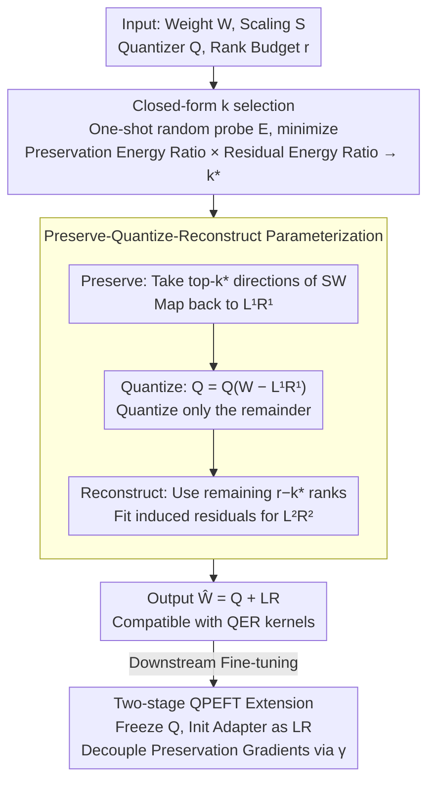

# Preserve-Then-Quantize: Balancing Rank Budgets for Quantization Error Reconstruction in LLMs

**Conference**: ICML 2026  
**arXiv**: [2602.02001](https://arxiv.org/abs/2602.02001)  
**Code**: https://ai-isl.github.io/srr (Project Page)  
**Area**: Model Compression / LLM Low-bit Quantization  
**Keywords**: PTQ, Quantization Error Reconstruction, Low-rank Compensation, QPEFT, Rank Budget Allocation

## TL;DR
The authors propose SRR (Structured Residual Reconstruction), which explicitly splits the fixed low-rank budget $r$ used for compensating quantization residuals in QER (Quantization Error Reconstruction) into two parts: "preserving $k$ principal singular directions before quantization" and "fitting residuals with $r-k$ ranks." A closed-form criterion requiring only a one-shot random probe is provided to select $k^\star$ per layer, consistently outperforming LQER/QERA in 2/3-bit PTQ and QPEFT.

## Background & Motivation

**Background**: When low-bit PTQ compresses LLM weights to 3/2-bit, accuracy drops significantly. The mainstream remedy is QER: approximating weights as $\mathbf{W}\approx \mathbf{Q}+\mathbf{L}\mathbf{R}$, where $\mathbf{Q}=\mathcal{Q}(\mathbf{W})$ is the direct quantization result, and $\mathbf{L}\mathbf{R}$ is a correction term of rank $\le r$ to restore quantization errors. Representative methods like ZeroQuant-V2, LQER, and QERA perform truncated SVD in the scaling space $\mathbf{S}\mathbf{W}$ using a diagonal scaling matrix $\mathbf{S}$ derived from calibration activations.

**Limitations of Prior Work**: Existing methods allocate the entire rank budget $r$ to fitting the residual $\mathbf{S}(\mathbf{W}-\mathbf{Q})$. However, in low-bit regimes, quantization errors are usually dense and high-rank, whereas $\mathbf{S}\mathbf{W}$ itself is truly "low-rank"—transformer weights are highly anisotropic in the activation-scaled space, with energy concentrated in a few principal singular directions. Consequently, quantization first destroys these high-energy directions, leaving "dirty" high-rank residuals for the limited rank budget to fix, leading to suboptimal reconstruction.

**Key Challenge**: The "use case" of the rank budget is default-locked to "compensating residuals." In reality, a rank budget can be used more efficiently in two ways: either preserving the principal subspace before quantization (structure preservation) or reconstructing errors after quantization (error reconstruction). Which is more cost-effective depends on the specific spectral shape of the layer.

**Goal**: Given a fixed rank budget $r$, this paper answers two questions: (i) whether a unified framework exists to "preserve $k$-dim principal structure, then quantize, then reconstruct residuals with $r-k$ dims"; (ii) how to select the optimal $k$ per layer/matrix without exhaustive search?

**Key Insight**: The authors treat the singular spectrum shape of $\mathbf{S}\mathbf{W}$ as a "prior signal"—faster spectral decay and more concentrated energy indicate the rank is better spent on preservation; flatter decay favors residual reconstruction. Combined with an "approximate isotropic quantization noise" assumption, the selection of $k$ is formulated as a minimization of $\rho_k(\mathbf{S}\mathbf{W})\cdot\rho_{r-k}(\mathbf{S}\mathbf{E})$, where $\rho_p(\mathbf{A})$ is the energy ratio remaining after rank-$p$ truncation, and $\mathbf{E}$ is a simple $\mathcal{U}[-1,1]$ random matrix proxy.

**Core Idea**: Reformulate QER into a three-step "Preserve-Quantize-Reconstruct" process ($\mathbf{W}\approx \mathbf{L}^{(1)}\mathbf{R}^{(1)} + \mathbf{Q} + \mathbf{L}^{(2)}\mathbf{R}^{(2)}$) and solve for the optimal rank split $k^\star$ using a one-shot random probe.

## Method

### Overall Architecture
SRR is a plug-and-play, training-free PTQ post-processing method. For each linear layer weight $\mathbf{W}\in\mathbb{R}^{m\times n}$ and its activation scaling matrix $\mathbf{S}$, given a quantizer $\mathcal{Q}$ and total rank budget $r$, SRR executes four steps: (1) Sample a random matrix $\mathbf{E}_{ij}\sim\mathcal{U}[-1,1]$ and determine the rank split via $k^\star=\arg\min_k \rho_k(\mathbf{S}\mathbf{W})\rho_{r-k}(\mathbf{S}\mathbf{E})$; (2) Extract the top-$k^\star$ singular components of $\mathbf{S}\mathbf{W}$ and map them back to the original space as $\mathbf{L}^{(1)}\mathbf{R}^{(1)}=\mathbf{S}^{-1}\text{SVD}_{k^\star}(\mathbf{S}\mathbf{W})$; (3) Quantize only the remaining components $\mathbf{Q}=\mathcal{Q}(\mathbf{W}-\mathbf{L}^{(1)}\mathbf{R}^{(1)})$; (4) Fit the induced quantization error $\mathbf{E}_k=\mathbf{W}-\mathbf{L}^{(1)}\mathbf{R}^{(1)}-\mathbf{Q}$ in the scaling space using the remaining $r-k^\star$ ranks to obtain $\mathbf{L}^{(2)}\mathbf{R}^{(2)}=\mathbf{S}^{-1}\text{SVD}_{r-k^\star}(\mathbf{S}\mathbf{E}_k)$. The final output concatenates the low-rank blocks into $\mathbf{L}, \mathbf{R}$, maintaining the inference form $\widehat{\mathbf{W}}=\mathbf{Q}+\mathbf{L}\mathbf{R}$, which is fully compatible with existing QER inference kernels.

### Key Designs

**1. Differentiable "Preserve-Quantize-Reconstruct" Parameterization**

Traditional QER defaults to spending the entire $r$ on residuals, implicitly making the decision for the user. SRR explicitly parameterizes this as a tunable split point $k\in\{0,\dots,r\}$. When $k=0$, it reverts to traditional QER (ZeroQuant-V2/LQER/QERA); when $k=r$, it reverts to structure-preserving schemes like LQ-LoRA/SVDQuant. Intermediate values occupy a previously unstudied region. Formally, this minimizes $\min_{0\le k\le r}\|\mathbf{S}(\mathbf{W}-(\Delta_1+\mathcal{Q}(\mathbf{W}-\Delta_1)+\Delta_2))\|_F$, where $\Delta_1$ is the rank-$k$ preserved term and $\Delta_2$ is the rank-$(r-k)$ residual correction. By the Eckart-Young theorem, for a given $k$, optimal $\Delta_1, \Delta_2$ reduce to truncated SVDs, leaving $k$ as the sole scalar degree of freedom. This decomposition is necessary because optimal $k$ values vary drastically across different projection matrices (Query, Output, MLP up/down).

**2. Closed-form $k$ Selection via "Approximate Constant Quantization Noise Ratio"**

To avoid expensive $O(r)$ SVD computations for every candidate $k$, authors simplify the loss $\mathcal{L}(k)^2=\|\mathbf{S}\mathbf{E}_k\|_F^2\cdot\rho_{r-k}(\mathbf{S}\mathbf{E}_k)$. Assumption 1 posits that the quantization error energy ratio is approximately constant $\eta_\mathcal{Q}$, thus $\|\mathbf{S}\mathbf{E}_k\|_F^2\approx \eta_\mathcal{Q}^2\rho_k(\mathbf{S}\mathbf{W})\|\mathbf{S}\mathbf{W}\|_F^2$. Assumption 2 posits that the normalized spectrum of quantization residuals is roughly independent of $k$, allowing a random matrix $\mathbf{E}\sim\mathcal{U}[-1,1]$ to serve as a proxy for the empirical $\mathbf{E}_k$. The resulting criterion $k^\star=\arg\min_k \rho_k(\mathbf{S}\mathbf{W})\rho_{r-k}(\mathbf{S}\mathbf{E})$ only requires one SVD for $\mathbf{S}\mathbf{W}$ and one for the random $\mathbf{E}$. This proxy aligns closely with real error curves due to spectral concentration in high-dimensional transformer layers.

**3. Two-stage QPEFT Initialization + Gradient Decay Decoupling**

SRR extends naturally to Quantized PEFT by using $\mathbf{Q}$ as the frozen backbone and initializing the LoRA-style adapter as $\mathbf{L}\mathbf{R}=\mathbf{L}^{(1)}\mathbf{R}^{(1)}+\mathbf{L}^{(2)}\mathbf{R}^{(2)}$. However, the singular values of preserved components $\mathbf{L}^{(1)}\mathbf{R}^{(1)}$ are much larger than residual components $\mathbf{L}^{(2)}\mathbf{R}^{(2)}$, causing training instability. The solution is to multiply preserved gradients by a decay coefficient $\gamma\in(0,1)$ (e.g., $0.1$ or $0.5$): $\nabla_{\mathbf{L}^{(1)}\mathbf{R}^{(1)}}\mathcal{L}\leftarrow \gamma\nabla_{\mathbf{L}^{(1)}\mathbf{R}^{(1)}}\mathcal{L}$. This encourages the preserved directions (carrying original backbone semantics) to stay stable while allowing the residual directions to learn task-specific features.

### Loss & Training
PTQ is training-free, utilizing SVD, quantization, and random probes. QPEFT uses standard downstream task losses (e.g., cross-entropy/Pearson for GLUE) with the addition of gradient scaling $\gamma$. Randomized SVD is used for all SVD operations to compute only top-$r$ values efficiently.

## Key Experimental Results

### Main Results
SRR was compared across 6 models (TinyLlama 1.1B, Gemma-2 2B, LLaMA-2 7B/13B, LLaMA-3.1 8B/70B) and two rank budgets ($r=32, 64$). Representative WikiText2 PPL results (3-bit MXINT):

| Model | Rank | QER Baseline (QERA-exact) | + SRR | Gain |
|------|----|-----------------------|-------|------|
| TinyLlama 1.1B | $r=64$ | $19.59$ | $18.71$ | $-0.88$ |
| Gemma-2 2B | $r=64$ | $19.36$ | $18.30$ | $-1.06$ |
| LLaMA-2 7B | $r=64$ | $10.68$ | $10.59$ | $-0.09$ |
| LLaMA-3.1 8B | $r=64$ | $11.00$ | $10.78$ | $-0.22$ |
| LLaMA-3.1 70B | $r=32$ | $6.68$ | $6.63$ | $-0.05$ |

SRR consistently reduces perplexity, with most significant gains observed in smaller models and the 3-bit regime. For Zero-shot (average of 5 tasks, $r=64$, 3-bit):
- LLaMA-3.1 8B: $60.79\%$ (+1.74% over QERA).
- Gemma-2 2B: $54.38\%$ (+2.23% over QERA).

### Ablation Study

| Configuration | Key Metric | Observation |
|------|---------|------|
| QER ($k=0$) | Baseline PPL | Suboptimal for anisotropic layers. |
| LQ-LoRA style ($k=r$) | Slightly worse than $k=0$ | Neglects residual fitting. |
| One-shot Random Probe | Difference to optimal $k^\star \le \pm 1$ | Extremely stable due to spectral concentration. |
| QPEFT w/o $\gamma$ | Training unstable | Backbone directions are over-updated. |
| QPEFT $\gamma \in \{0.1, 0.5\}$ | Consistently better than baseline | Robust to $\gamma$ choice, gain primarily from initialization. |

### Key Findings
- The core value is "knowing how much to preserve" per layer. Optimal $k^\star$ varies significantly across matrices, and layer-wise adaptation is critical.
- One-shot random probes work because high-dimensional transformer layers yield concentrated singular spectra for random matrices.
- In QPEFT, the $+5.9$ pp gain on GLUE (2-bit) stems from SRR's structural preservation during initialization, whereas gradient decay acts as a necessary "anti-drift" stabilizer.

## Highlights & Insights
- Parameterizing an "apparent single-purpose" resource (rank budget) and solving it via spectral energy ratios is a powerful template. This "exposing implicit design choices" approach is transferable to other domains like KV cache ratios or expert counts in MoE.
- The use of random matrices as noise proxies leverages the Marchenko-Pastur concentration phenomena.
- SRR is compatible with existing QER inference kernels with zero cost, making it highly deployment-friendly.

## Limitations & Future Work
- Assumptions regarding noise energy ratios may falter in extreme 1-bit regimes.
- The scaling matrix $\mathbf{S}$ still depends on calibration data; future work could investigate SRR's stability under distribution shifts.
- Gradient decay for QPEFT is a simple heuristic; second-order or preconditioned optimizers might eliminate the need for hyperparameter $\gamma$.
- The study focuses on weights; whether this split logic applies to activation or KV quantization remains unexplored.

## Related Work & Insights
- **vs. LQER/QERA**: These define $k=0$, focusing solely on residuals. SRR shows this is suboptimal for highly anisotropic layers.
- **vs. LQ-LoRA/SVDQuant**: These define $k=r$, focusing solely on structure. SRR demonstrates that intermediate split points provide a better balance.
- **vs. LoftQ/QLoRA**: SRR's closed-form initialization outperforms iterative QER methods in 2-bit QPEFT, suggesting initialization quality is more critical than iteration count.

## Rating
- Novelty: ⭐⭐⭐⭐ Explicitly parameterizing rank split is a simple yet impactful perspective.
- Experimental Thoroughness: ⭐⭐⭐⭐ Broad coverage across models and downstream tasks.
- Writing Quality: ⭐⭐⭐⭐ Clear logical flow from motivation to algorithmic derivation.
- Value: ⭐⭐⭐⭐ High engineering utility with zero modification to inference kernels.

<!-- RELATED:START -->

## Related Papers

- [\[ICML 2026\] Compress then Merge: From Multiple LoRAs into One Low-Rank Adapter](compress_then_merge_from_multiple_loras_into_one_low-rank_adapter.md)
- [\[CVPR 2026\] Quant Experts: Token-aware Adaptive Error Reconstruction with Mixture of Experts for Large Vision-Language Models Quantization](../../CVPR2026/model_compression/quant_experts_token_aware_vlm_quantization.md)
- [\[ICML 2026\] ProjQ: Project-and-Quantize for Adapter-Aware LLM Compression](projq_project-and-quantize_for_adapter-aware_llm_compression.md)
- [\[ICML 2026\] GEMQ: Global Expert-Level Mixed-Precision Quantization for MoE LLMs](gemq_global_expert-level_mixed-precision_quantization_for_moe_llms.md)
- [\[ICML 2026\] NeUQI: Near-Optimal Uniform Quantization Parameter Initialization for Low-Bit LLMs](neuqi_near-optimal_uniform_quantization_parameter_initialization_for_low-bit_llm.md)

<!-- RELATED:END -->
