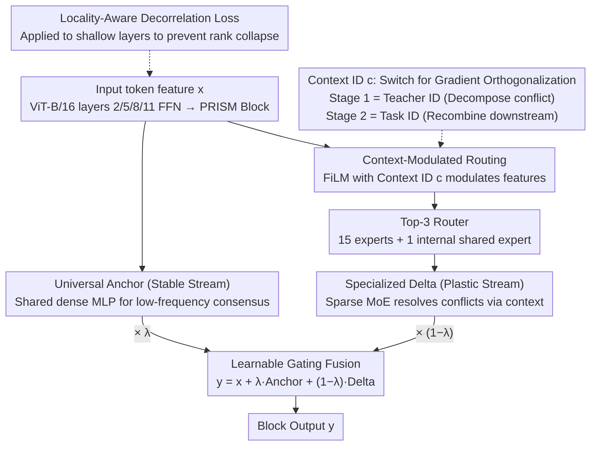

# PRISM: Synergizing Vision Foundation Models via Self-Organized Expert Specialization

**Conference**: ICML 2026  
**arXiv**: [2606.03444](https://arxiv.org/abs/2606.03444)  
**Code**: https://github.com/robotyingtang/PRISM-VFM  
**Area**: Multimodal VLM / Vision Foundation Model Distillation  
**Keywords**: Multi-teacher distillation, Vision Foundation Model, MoE, Context-aware routing, Gradient conflict  

## TL;DR
PRISM distills three heterogeneous vision foundation models (CLIP, SAM, DINOv2) into a single ViT student using a "dual-stream conditional MoE." This architecture consists of a shared anchor stream for gradient stability and a context-routed sparse expert stream for conflict resolution. This allows experts to self-organize—sharing consensus knowledge and branching for conflicting knowledge—outperforming the previous SOTA (SAK) across all five tasks on PASCAL-Context.

## Background & Motivation
**Background**: Vision foundation models (VFMs) like CLIP (semantic alignment), SAM (boundary/geometry), and DINOv2 (fine-grained local texture) possess distinct strengths. Industrial deployment seeks to compress these capabilities into a single student backbone to reduce memory and latency.

**Limitations of Prior Work**: Compressing multi-teacher features into a dense student (e.g., RADIO, Theia, UNIC series) leads to severe gradient conflicts. For instance, CLIP encourages features to be category-invariant (compressing variance), while DINOv2 requires local textures to be discriminative (maintaining variance). Shared parameters receive gradients in opposite directions $\cos(\mathbf{g}_i, \mathbf{g}_j) < 0$, causing magnitude cancellation and resulting in a suboptimal compromise that excels in neither domain.

**Key Challenge**: Existing "divide-and-conquer" solutions (e.g., SAK using Teacher-Agnostic Stems + Teacher-Specific Adapters) mitigate interference via hard branching. However, this assumes a strong hypothesis that "visual knowledge can be explicitly partitioned into disjoint sub-domains." In reality, CLIP and DINO might encode a "cat" as different frequency bands of the same concept (semantics vs. local texture); hard partitioning leads to either parameter redundancy or the death of positive transfer.

**Goal**: In multi-teacher VFM distillation, avoid both "dense sharing (conflict)" and "hard partitioning (redundancy)." Instead, seek an intermediate path that dynamically decides whether to share or branch based on token, layer, and teacher context.

**Key Insight**: Treat the sparse routing of MoE as a tool for "gradient orthogonalization." For conflicting teacher gradients, route them to different experts to minimize the effective inner product $\langle \tilde{\mathbf{g}}_{i,n}, \tilde{\mathbf{g}}_{j,n}\rangle \approx 0$; for consensus knowledge, utilize a shared anchor stream.

**Core Idea**: A "Decompose-then-Recombine" two-stage paradigm is proposed. Stage 1 uses teacher IDs as context to allow sparse experts to emerge via self-organized specialization. Stage 2 uses task IDs as context to recombine these experts for downstream tasks. A locality-aware decorrelation loss is introduced to prevent premature collapse in shallow layers due to strong semantic supervision.

## Method

### Overall Architecture
PRISM compresses CLIP, SAM, and DINOv2 into a ViT-B/16 student. The FFNs of layers 2, 5, 8, and 11 are replaced with **PRISM blocks**—a **dual-stream conditional MoE**. This includes a **Universal Anchor** (a shared dense MLP $\mathcal{F}_{\text{anc}}$ handling task-agnostic low-frequency consensus for stability) and a **Specialized Delta** (a sparse MoE $\mathcal{F}_{\text{moe}}$ with 15 experts, Top-3 routing, and one internal shared expert, modulated by context $c$ to resolve conflicts). The output is fused via a learnable gate $\lambda \in [0,1]$ as $\mathbf{y} = \mathbf{x} + \lambda \cdot \mathcal{F}_{\text{anc}}(\text{LN}(\mathbf{x})) + (1-\lambda) \cdot \mathcal{F}_{\text{moe}}(\mathbf{x}, c)$. Training follows a two-stage process: Stage 1 distills from 3 frozen ViT-L teachers on ImageNet-1k (30 epochs) using Teacher IDs as context; Stage 2 recombines experts on PASCAL-Context/NYUD-v2 (40k iterations) using Task IDs as context.

### Key Designs

**1. MoE as a Gradient Orthogonalization Tool: Resolving Conflicts via Sparse Routing**

The root pain point of multi-teacher distillation is optimization contradiction. In a dense backbone, the aggregate gradient is $\mathbf{g}_{\text{total}} = \sum_k \gamma_k \mathbf{g}_k$. When two teachers point in opposite directions $\cos(\mathbf{g}_i, \mathbf{g}_j) < 0$ (e.g., CLIP vs. DINO), the magnitude collapses $\mathbf{g}_i \approx -\mathbf{g}_j$, leading to "gradient averaging" and suboptimal equilibrium. PRISM argues that sparse MoE naturally alleviates this: by routing conflicting teacher gradients to different experts $E_n$, the effective inner product on the same parameters $\langle \tilde{\mathbf{g}}_{i,n}, \tilde{\mathbf{g}}_{j,n}\rangle \approx 0$ is minimized. Consequently, specialization emerges naturally: consensus knowledge flows through the Universal Anchor, while conflicts are diverted through the Conditioned MoE.

**2. Context-Modulated Routing: Making the Router "Context-Aware" via FiLM**

Standard MoE routers only consider image content. Thus, if a CLIP teacher and a DINO teacher process the same image, they might be routed to the same expert, causing emergent specialization to fail. PRISM uses FiLM to inject the Context ID $c$ (Teacher ID in Stage 1, Task ID in Stage 2) as an affine transformation: $\hat{\mathbf{x}} = (1+\gamma(c)) \odot \text{LayerNorm}(\mathbf{x}) + \beta(c)$. The router $G(\hat{\mathbf{x}})$ then performs Top-K dispatching. The MoE output is $\mathcal{F}_{\text{moe}}(\mathbf{x}, c) = E_{\text{shared}}(\mathbf{x}) + \sum_{i \in \text{TopK}} G(\hat{\mathbf{x}})_i \, E_i(\mathbf{x})$, where $E_{\text{shared}}$ absorbs common biases. Unlike MoFME, which uses FiLM to replace expert computation, PRISM's FiLM only modulates the **routing decision**, maintaining independence between routing and representation learning.

**3. Locality-Aware Decorrelation Loss: Supporting High-Rank Representations to Prevent Collapse**

MoE routing effectiveness depends on token diversity. However, multi-teacher distillation often suffers from "semantic short-circuiting," where strong CLIP supervision causes shallow layers to converge early to global semantics, causing token homogenization (rank collapse). LDL is applied only to the first two layers to penalize high cosine similarity between spatially distant tokens while preserving local correlations: $\mathcal{L}_{\text{decorr}} = \frac{1}{|\mathcal{P}|} \sum_{(i,j) \in \mathcal{P}} \max(0, \cos(\mathbf{z}_i, \mathbf{z}_j) - \epsilon) \cdot \mathbb{I}(d_{ij} > r)$, where $r$ is a local radius and $d_{ij}$ is the Euclidean distance. This injects a "local inductive bias" that forces distant tokens to remain distinct, providing discriminative features for deeper experts.

### Loss & Training
- **Stage 1**: $\mathcal{L}_{\text{stage1}} = \mathcal{L}_{\text{aux}} + \alpha \mathcal{L}_{\text{distill}} + \beta \mathcal{L}_{\text{decorr}}$, with $\alpha=0.9, \beta=0.1$. A teacher $T_k$ is randomly sampled per iteration.
- **Stage 2**: $\mathcal{L}_{\text{stage2}} = \mu \mathcal{L}_{\text{distill}} + \sum_{t} w_t \mathcal{L}_t$, with $\mu=1.0$ and fixed task weights $w_t$.
- Backbone: ViT-B/16. MoE: 15 experts + 1 shared expert per Layer, Top-3 routing. The gate $\lambda$ naturally evolves into a "shallow=stable, deep=specialized" hierarchy.

## Key Experimental Results

### Main Results
Evaluation conducted on PASCAL-Context (5 tasks: SemSeg, Parsing, Saliency, Normal, Boundary) and NYUD-v2 (4 tasks).

| Method (PASCAL-Context, ViT-B) | SemSeg mIoU↑ | Parsing mIoU↑ | Saliency maxF↑ | Normal mErr↓ | Boundary odsF↑ | $\Delta_m$ %↑ |
|------|------|------|------|------|------|------|
| Single-task baseline | 80.25 | 70.54 | 84.54 | 13.57 | 74.22 | 0.00 |
| Multi-task baseline | 76.76 | 65.26 | 84.39 | 13.98 | 70.37 | -4.04 |
| RADIO | 78.06 | 68.13 | 85.18 | 13.59 | 72.64 | -1.53 |
| Theia | 76.51 | 67.53 | 84.38 | 14.56 | 70.34 | -4.33 |
| SAK (Prev. SOTA) | 81.88 | 74.30 | 84.79 | 14.02 | 74.09 | 0.83 |
| **PRISM (Ours)** | **82.20** | **75.34** | **84.81** | **13.47** | **75.92** | **2.29** |

**Key Observations**: (1) Average gain $\Delta_m$ improved from SAK's 0.83% to 2.29%, marking the first time a multi-task unified model significantly outperformed single-task baselines on PASCAL-Context. (2) PRISM outperformed SAK across **all** five tasks. Significant gains in Boundary (+1.83 odsF) and Normal (-0.55 mErr) suggest that emergent experts are more efficient at extracting shared geometric structures than SAK's isolated adapters.

### Ablation Study

| Configuration | Key Finding | Description |
|------|---------|------|
| Full PRISM | $\Delta_m = 2.29\%$ | Dual-stream + FiLM + LDL enabled |
| Shallow vs. Deep $\lambda$ | Shallow $\lambda$ high, Deep $\lambda$ low | Spontaneous hierarchical pattern: "Shallow shared, deep specialized" |
| Stage 1 Teacher ID Routing | Teachers routed to different experts | Confirms that emergent specialization actually occurred |

### Key Findings
- **$\lambda$ Hierarchical Evolution**: The gate $\lambda$ automatically learns that shallow layers require the Universal Anchor for robust optimization, while deep layers utilize sparse experts for fine specialization. This aligns with the semantic hierarchy of ViT.
- **Cross-Teacher Geometric Knowledge**: Improvement in geometric tasks suggests emergent experts leverage shared boundaries across SAM and DINOv2 better than SAK's hard-branching adapters.
- **LDL Placement**: LDL is only effective in the first two layers; adding it to deep layers harms specialization, confirming that "short-circuiting" primarily occurs at the beginning of the network.

## Highlights & Insights
- **MoE as an "Orthogonalizer"**: This perspective shifts MoE from merely "increasing capacity" to a structural solution for resolving gradient conflicts in multi-objective optimization.
- **FiLM on Routing vs. Calculation**: Modulating only the routing decision ensures representational purity. In contrast, approaches that use FiLM for expert computation couple the routing logic too tightly with feature learning.
- **Dual-stream Philosophy**: The "stable + plastic" design is transferable to scenarios requiring both general capability preservation and downstream specialization, such as multimodal instruction tuning.

## Limitations & Future Work
- **Training Cost**: The dual-stream MoE architecture is heavier than a dense ViT-B. While inference is sparse (Top-3), Stage 1 requires multiple teacher forward passes.
- **Teacher Sensitivity**: The study focuses on three teachers (CLIP/SAM/DINOv2). The scalability and convergence stability when adding more models (e.g., Depth Anything) remain to be explored.
- **Domain Specialization**: On NYUD-v2, SAK still wins on certain tasks, suggesting that for indoor environments with high-frequency geometric signals, hard-branching adapters might provide stronger local inductive biases than MoE.

## Related Work & Insights
- **vs. SAK (Lu et al., 2025)**: SAK uses hard-cut branches. PRISM uses "soft-cut + context routing," allowing more granular sharing and achieving better results across all PASCAL-Context tasks.
- **vs. RADIO / RADIOv2.5 (Ranzinger et al., 2024)**: RADIO uses dense distillation and relies on loss weighting to handle conflicts; PRISM resolves conflicts via structural branching.
- **vs. Mod-Squad (Chen et al., 2023)**: Uses information-theoretic constraints for specialization within a single task; PRISM achieves emergent specialization across multiple teachers and tasks.

## Rating
- **Novelty**: ⭐⭐⭐⭐ The combination of dual-stream conditional MoE, context-modulated routing, and LDL is a novel and clear recipe for VFM distillation.
- **Experimental Thoroughness**: ⭐⭐⭐⭐ Solid evaluation on two benchmarks with ViT-L scaling and detailed diagnostics on hierarchy and LDL layers.
- **Writing Quality**: ⭐⭐⭐⭐ Strong logical flow from conflict diagnosis to architectural solution.
- **Value**: ⭐⭐⭐⭐ Provides a reproducible recipe for compressing multiple VFMs into one student, with a significant SOTA gain of $\Delta_m = 2.29\%$.

<!-- RELATED:START -->

## Related Papers

- [\[NeurIPS 2025\] VESSA: Video-based objEct-centric Self-Supervised Adaptation for Visual Foundation Models](../../NeurIPS2025/model_compression/vessa_video-based_object-centric_self-supervised_adaptation_for_visual_foundatio.md)
- [\[ICML 2026\] Quantifying the Uncertainty of Foundation Models with Singular Value Ensembles](quantifying_the_uncertainty_of_foundation_models_with_singular_value_ensembles.md)
- [\[ICML 2026\] BioArc: Discovering Optimal Neural Architectures for Biological Foundation Models](bioarc_discovering_optimal_neural_architectures_for_biological_foundation_models.md)
- [\[ICML 2026\] End-to-End Compression for Tabular Foundation Models](end-to-end_compression_for_tabular_foundation_models.md)
- [\[ICML 2026\] Geo-Expert: 用 LoRA 把 8B 模型微调成专家级地质推理 LLM](geo-expert_towards_expert-level_geological_reasoning_via_parameter-efficient_fin.md)

<!-- RELATED:END -->
