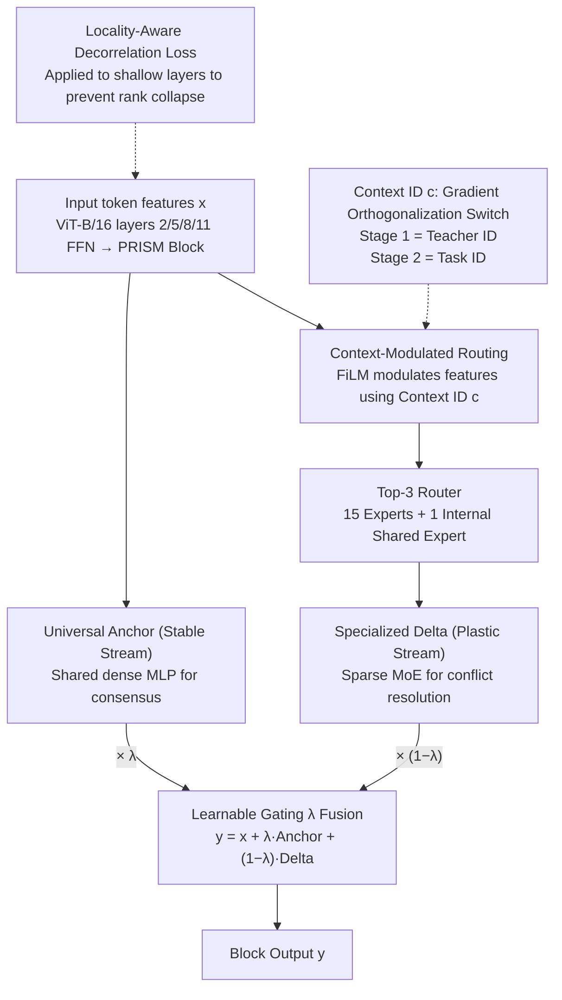

# PRISM: Synergizing Vision Foundation Models via Self-Organized Expert Specialization

**Conference**: ICML 2026  
**arXiv**: [2606.03444](https://arxiv.org/abs/2606.03444)  
**Code**: https://github.com/robotyingtang/PRISM-VFM  
**Area**: Multimodal VLM / Vision Foundation Model Distillation  
**Keywords**: Multi-teacher distillation, Vision Foundation Models, MoE, Contextual routing, Gradient conflict  

## TL;DR
PRISM distills three heterogeneous Vision Foundation Models (CLIP, SAM, and DINOv2) into a single ViT student. By employing a "dual-stream conditional MoE"—consisting of a shared anchor stream for gradient stability and a context-routed sparse expert stream for conflict resolution—experts self-organize to share consensus knowledge and branch for conflicting knowledge. It outperforms the previous SOTA, SAK, across all five tasks on PASCAL-Context.

## Background & Motivation
**Background**: CLIP (semantic alignment), SAM (boundary/geometry), and DINOv2 (fine-grained local texture) each possess distinct strengths. Industrial deployment aims to compress these capabilities into a single student backbone to reduce memory and latency.

**Limitations of Prior Work**: Compressing multiple teacher features into a dense student (e.g., RADIO, Theia, UNIC) leads to severe gradient conflicts. For instance, CLIP favors category-invariant features (variance compression), while DINO demands local texture discriminability (variance preservation). Shared parameters receive opposing gradients $\cos(\mathbf{g}_i, \mathbf{g}_j) < 0$ during backpropagation, causing the synthesized gradient magnitude to cancel out, resulting in a suboptimal compromise that excels at neither.

**Key Challenge**: Existing "divide and conquer" schemes (like SAK's Teacher-Agnostic Stem + Teacher-Specific Adapters) mitigate interference via hard branching. However, this relies on the overly strong assumption that "visual knowledge can be explicitly partitioned into disjoint sub-domains." In reality, CLIP and DINO often encode different frequency bands of the same concept (e.g., semantics vs. local texture). Hard partitioning either wastes parameters (copying consensus $K$ times) or stifles positive transfer.

**Goal**: In multi-teacher VFM distillation, avoid both "complete sharing leading to conflict" (dense models) and "complete hard splitting leading to redundancy" (SAK-style). The objective is a middle ground that dynamically decides between sharing and branching based on token, layer, and teacher context.

**Key Insight**: Treat sparse MoE routing as a tool for "gradient orthogonalization." For conflicting teacher gradients, route them to different experts to minimize the effective inner product $\langle \tilde{\mathbf{g}}_{i,n}, \tilde{\mathbf{g}}_{j,n}\rangle \approx 0$. For consensus components, route them through a shared anchor stream.

**Core Idea**: A "Decompose-then-Recombine" two-stage paradigm is proposed. Stage 1 uses Teacher ID as context to allow sparse experts to undergo emergent specialization during multi-teacher distillation. Stage 2 uses Task ID as context to recombine these experts for downstream tasks. A locality-aware decorrelation loss is introduced to prevent early collapse in shallow layers caused by the strong semantic supervision of CLIP.

## Method

### Overall Architecture
PRISM compresses CLIP, SAM, and DINOv2 into a ViT-B/16 student without gradient cancellation. The standard FFNs at layers 2, 5, 8, and 11 are replaced with **PRISM blocks**—a **dual-stream conditional MoE**. This includes a **Universal Anchor** (a dense MLP $\mathcal{F}_{\text{anc}}$ shared across all contexts to capture task-agnostic low-frequency consensus for stability) and a **Specialized Delta** (a sparse MoE $\mathcal{F}_{\text{moe}}$ with 15 experts, Top-3 routing, and an internal shared expert, modulated by context $c$ to resolve conflicts). The output is a weighted sum via a learnable gate $\lambda \in [0, 1]$: $\mathbf{y} = \mathbf{x} + \lambda \cdot \mathcal{F}_{\text{anc}}(\text{LN}(\mathbf{x})) + (1-\lambda) \cdot \mathcal{F}_{\text{moe}}(\mathbf{x}, c)$. Training follows the "Decompose-then-Recombine" paradigm: Stage 1 involves distillation on ImageNet-1k (30 epochs) using Teacher IDs to foster self-organized specialization from three frozen ViT-L teachers. Stage 2 fine-tunes on PASCAL-Context/NYUD-v2 (40k iterations) using Task IDs to recombine experts.

### Key Designs

**1. MoE as a Gradient Orthogonalization Tool: Resolving Conflicts via Sparse Routing**
The core pain point of multi-teacher distillation is optimization conflict: the aggregated gradient in a dense backbone is $\mathbf{g}_{\text{total}} = \sum_k \gamma_k \mathbf{g}_k$. If two teachers have opposing directions $\cos(\mathbf{g}_i, \mathbf{g}_j) < 0$, the magnitude collapses (gradient averaging). PRISM leverages sparse MoE to mitigate this—routing conflicting teacher gradients to different experts $E_n$, ensuring the effective inner product on the same parameters $\langle \tilde{\mathbf{g}}_{i,n}, \tilde{\mathbf{g}}_{j,n}\rangle \approx 0$. Consensus flows through the Universal Anchor, while conflicts are branched via the Conditioned MoE.

**2. Context-Modulated Routing: Making the Router "Context-Aware"**
Standard MoE routers only consider image content. When CLIP and DINO teachers view the same image, they would produce identical routing, causing emergent specialization to fail. PRISM uses FiLM to inject Context ID $c$ as an affine transformation: $\hat{\mathbf{x}} = (1+\gamma(c)) \odot \text{LayerNorm}(\mathbf{x}) + \beta(c)$. The router $G(\hat{\mathbf{x}})$ then performs Top-$K$ dispatching. The MoE output is $\mathcal{F}_{\text{moe}}(\mathbf{x}, c) = E_{\text{shared}}(\mathbf{x}) + \sum_{i \in \text{TopK}} G(\hat{\mathbf{x}})_i E_i(\mathbf{x})$. PRISM modulates only the **routing decision**, keeping the expert parameters focused on feature learning, which separates routing logic from representation learning.

**3. Locality-Aware Decorrelation Loss (LDL): Sustaining High-Rank Bases in Shallow Layers**
Effective MoE routing relies on token diversity. However, multi-teacher distillation often suffers from "semantic short-circuiting," where CLIP’s strong semantic supervision causes shallow layers to converge prematurely to global semantics, causing rank collapse. LDL is applied to the first two layers to penalize high cosine similarity between spatially distant tokens while preserving local correlations: $$\mathcal{L}_{\text{decorr}} = \frac{1}{|\mathcal{P}|} \sum_{(i,j) \in \mathcal{P}} \max(0, \cos(\mathbf{z}_i, \mathbf{z}_j) - \epsilon) \cdot \mathbb{I}(d_{ij} > r)$$, where $r$ is the local radius. This forces distant tokens to remain distinct, providing the deep experts with discriminative "raw materials."

### Loss & Training
- **Stage 1**: $\mathcal{L}_{\text{stage1}} = \mathcal{L}_{\text{aux}} + \alpha \mathcal{L}_{\text{distill}} + \beta \mathcal{L}_{\text{decorr}}$, with $\alpha=0.9, \beta=0.1$. A teacher $T_k$ is randomly sampled each iteration for ID-based context.
- **Stage 2**: $\mathcal{L}_{\text{stage2}} = \mu \mathcal{L}_{\text{distill}} + \sum_{t} w_t \mathcal{L}_t$, with $\mu=1.0$ and $w_t$ fixed per standard MTL practices.
- Architecture: ViT-B/16 backbone, 15 experts + 1 shared expert per MoE layer, Top-3 routing. Gating $\lambda$ naturally evolves to be higher in shallow layers (stability) and lower in deep layers (specialization).

## Key Experimental Results

### Main Results
Evaluated on PASCAL-Context (5 tasks) and NYUD-v2 (4 tasks).

| Method (PASCAL-Context, ViT-B) | SemSeg mIoU↑ | Parsing mIoU↑ | Saliency maxF↑ | Normal mErr↓ | Boundary odsF↑ | $\Delta_m$ %↑ |
| :--- | :---: | :---: | :---: | :---: | :---: | :---: |
| Single-task baseline | 80.25 | 70.54 | 84.54 | 13.57 | 74.22 | 0.00 |
| Multi-task baseline | 76.76 | 65.26 | 84.39 | 13.98 | 70.37 | -4.04 |
| RADIO | 78.06 | 68.13 | 85.18 | 13.59 | 72.64 | -1.53 |
| Theia | 76.51 | 67.53 | 84.38 | 14.56 | 70.34 | -4.33 |
| SAK (Prev. SOTA) | 81.88 | 74.30 | 84.79 | 14.02 | 74.09 | 0.83 |
| **PRISM (Ours)** | **82.20** | **75.34** | **84.81** | **13.47** | **75.92** | **2.29** |

**Observation**: (1) $\Delta_m$ improves from SAK's 0.83% to 2.29%, marking the first time a multi-task model significantly outperforms the single-task baseline on PASCAL-Context. (2) PRISM exceeds SAK in **all** five tasks, particularly in geometric tasks like Boundary (+1.83 odsF) and Normal (-0.55 mErr).

### Ablation Study
On NYUD-v2, PRISM and SAK are competitive. PRISM leads in SemSeg and Depth, while SAK performs slightly better in Normal/Boundary. This suggests SAK’s dedicated adapters might be more localized for high-frequency indoor signals, reflecting a trade-off between flexible recombination and rigid specialization.

| Configuration | Key Findings |
| :--- | :--- |
| Full PRISM | $\Delta_m=2.29\%$ (Dual-stream + FiLM + LDL enabled) |
| Layerwise $\lambda$ | Higher in shallow layers, lower in deep layers; learned hierarchical pattern. |
| Stage 1 Routing | Different teachers indeed activate different experts (Emergent specialization). |

### Key Findings
- **$\lambda$ Hierarchy**: Shallow layers favor the Universal Anchor for robust optimization, while deep layers favor sparse experts for fine-grained specialization.
- **Cross-Teacher Geometry**: PRISM's gain in geometric tasks proves that emergent experts are more efficient at mining shared structures (e.g., boundaries common to SAM/DINO) than SAK’s hard-partitioned adapters.
- **LDL Placement**: Restricting LDL to the first two layers is sufficient; applying it to deep layers harms specialization, confirming that "short-circuiting" is a shallow-layer issue.

## Highlights & Insights
- **MoE for Gradient Orthogonalization**: This perspective reframes MoE from a "capacity/conditional computation" tool to a "structural solution for multi-objective gradient conflict."
- **Routing vs. Representation**: Using FiLM to modulate only the router ensures specialized decision-making without intertwining expert weight logic with routing logic.
- **Anchor Philosophy**: The Dual-stream design (Stability + Plasticity) is a transferable motif for scenarios requiring both general robustness and task-specific adaptation.

## Limitations & Future Work
- **Training Cost**: The dual-stream MoE is heavier than a dense ViT-B during training. Stage 1 requires multiple teacher forwards, making training time a factor.
- **Teacher Sensitivity**: The experiments use CLIP/SAM/DINOv2. The scalability and stability of emergent specialization when adding more teachers (e.g., Depth Anything) remain to be explored.
- **Backbone Scaling**: While ViT-B results are strong, more extensive ViT-L/H scaling experiments would further solidify the value of PRISM for large-scale models.

## Related Work & Insights
- **vs. SAK (Lu et al., 2025)**: SAK uses hard physical isolation; PRISM uses soft context-aware routing. PRISM is better at PASCAL-Context but requires LDL to prevent collapse.
- **vs. RADIO / RADIOv2.5**: RADIO uses dense distillation and manual weighting; PRISM uses structural branching. PRISM shows significantly higher $\Delta_m$.
- **vs. Mod-Squad (Chen et al., 2023)**: Mod-Squad uses info-theoretic constraints for single-task specialization. PRISM generalizes this to multi-teacher emergent specialization.
- **vs. MoFME (Zhang et al., 2024)**: MoFME uses FiLM for computation; PRISM uses FiLM for routing, achieving better separation of duties.

## Rating
- Novelty: ⭐⭐⭐⭐ (Dual-stream MoE + Context-routing + LDL is a potent mix for VFM distillation).
- Experimental Thoroughness: ⭐⭐⭐⭐ (Solid coverage of baselines and diverse benchmarks).
- Writing Quality: ⭐⭐⭐⭐ (Logical progression from gradient conflict to structural solution).
- Value: ⭐⭐⭐⭐ (Provides a reproducible recipe for real-world VFM synergy).

<!-- RELATED:START -->

## Related Papers

- [\[CVPR 2026\] SigLino: Efficient Multi-Teacher Distillation for Agglomerative Vision Foundation Models](../../CVPR2026/model_compression/siglino_efficient_multi-teacher_distillation_for_agglomerative_vision_foundation.md)
- [\[NeurIPS 2025\] VESSA: Video-based objEct-centric Self-Supervised Adaptation for Visual Foundation Models](../../NeurIPS2025/model_compression/vessa_video-based_object-centric_self-supervised_adaptation_for_visual_foundatio.md)
- [\[ICML 2026\] Quantifying the Uncertainty of Foundation Models with Singular Value Ensembles](quantifying_the_uncertainty_of_foundation_models_with_singular_value_ensembles.md)
- [\[ICML 2026\] BioArc: Discovering Optimal Neural Architectures for Biological Foundation Models](bioarc_discovering_optimal_neural_architectures_for_biological_foundation_models.md)
- [\[ICML 2026\] End-to-End Compression for Tabular Foundation Models](end-to-end_compression_for_tabular_foundation_models.md)

<!-- RELATED:END -->
