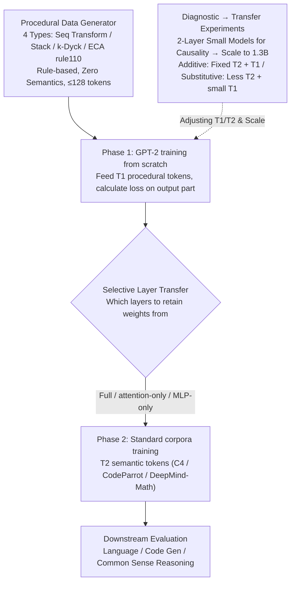

# Procedural Pretraining: Warming Up Language Models with Abstract Data

**Conference**: ICML 2026  
**arXiv**: [2601.21725](https://arxiv.org/abs/2601.21725)  
**Code**: Yes  
**Area**: LLM Pretraining / Data-centric AI  
**Keywords**: Procedural data, Warm-up pretraining, Algorithmic skills, Formal languages, Data efficiency

## TL;DR
Injecting a lightweight "procedural data" warm-up (formal languages, stacks, cellular automata, etc.) before standard language/code/math pretraining consistently improves downstream performance with only 0.1–0.3% additional tokens. This strategy enables models to replicate the same loss using only 55–86% of the original data, representing a pretraining strategy that decouples "reasoning scaffolds" from "knowledge."

## Background & Motivation

**Background**: The current de facto standard for LLM training is a "one-pot" approach—performing next-token prediction directly on web-scale corpora, forcing the model to simultaneously learn semantic knowledge and the skills to manipulate that knowledge.

**Limitations of Prior Work**: Knowledge and reasoning are learned in a highly entangled manner within the same set of weights. Consequently, models often rely on surface heuristics rather than systematic reasoning processes; several studies (Han 2025, Kumar 2025, Nikankin 2025) have identified this as a core flaw in current models.

**Key Challenge**: Learning both knowledge and algorithmic skills from "semantic data" is inefficient—semantics are mixed with approximations, ambiguities, and shortcuts, making it difficult to reliably cultivate precise symbolic manipulation capabilities. Ideally, models should follow the human developmental path of "learning logic/mathematics first, then high-level reasoning," but there is currently no systematic engineering path to decouple these two.

**Goal**: To implement the cognitive development concept of "learning structure before semantics" into a reproducible pretraining pipeline, verify its effectiveness across various scales and semantic domains, and explain which components benefit at a mechanistic level.

**Key Insight**: The authors start from "procedural data"—non-semantic sequences generated by explicit rules such as formal languages, simple algorithms, and cellular automata. Unlike "LLM-generated synthetic data," procedural data contains zero semantic content but possesses strict structures (nesting, recursion, long-range dependencies), serving as pure "algorithmic scaffolds." Warming up on these scaffolds before introducing standard corpora may allow models to learn "manipulation capabilities" and "knowledge" in distinct stages.

**Core Idea**: Prepend 0.1–0.3% procedural data before standard pretraining as a "pre-pretraining" phase. This phase teaches no semantics, only how to manage stacks, balance brackets, and perform sequence transformations.

## Method

### Overall Architecture
The method splits standard pretraining into two phases. Phase One trains a GPT-2 style decoder-only transformer from scratch using $T_1$ "procedural tokens" (bracket strings, stack operations, cellular automata evolution, etc.) with no semantic content. Phase Two continues training the same weights using $T_2$ semantic tokens (C4, CodeParrot, or DeepMind-Math) using standard next-token loss without freezing any layers. The baseline is pure standard pretraining where $T_1=0$. Between phases, a "transfer mode" switch determines whether to migrate all weights (Full), only attention layers, or only MLP layers. Two measurement settings are used: **Additive** (fixed $T_2$, extra $T_1$ to measure gains from "free" tokens) and **Substitutive** (reduced $T_2$ with small $T_1$ to measure semantic data savings for equivalent loss). The causal relationships are first established using 2-layer small models before scaling to 1.3B parameters.

### Key Designs

**1. Procedural Data Generator: Creating Zero-Semantic, Strongly Structured "Algorithmic Scaffolds"**

The pain point of monolithic pretraining is the entanglement of knowledge and algorithmic skills. The authors counter this by first feeding short sequences ($\le 128$ tokens) generated by explicit rules. These focus on precise manipulation, compositionality, and long-range dependencies. Four categories are used: **Sequence Transformations** (Set/Reverse/Identity/Union/Sort/Delete), **Memory Operations** (Stack simulation), **Formal Languages** ($k$-Dyck balanced parentheses and non-nested Shuffle versions), and **Cellular Automata** (ECA rule 110 deterministic Markov dynamics). "Procedural" data is preferred over LLM-synthetic data because it has provable generation processes and clear structures, allowing for precise decoupling of "which structure teaches which skill."

**2. Diagnostic → Transfer Experiments: Establishing Causality then Scaling**

To determine if and why procedural data works, the authors first use a 2-layer, 4-head transformer with 10 seeds as a "diagnostic instrument." They run additive settings for every pair of (procedural type, algorithmic task), where tasks include Haystack (long-context retrieval), arithmetic (Addition/Multiplication), and Sorting. A shuffled control—randomizing token order while maintaining distribution—collapses performance back to baseline, proving that "structure," not "token statistics," is the driver. Findings are then validated at 1.3B parameters and 10.5B tokens.

**3. Selective Layer Transfer: Probing Mechanisms via Attention/MLP Migration**

To locate where gains are stored, the authors perform selective transfers: Phase Two starts by retaining only specific pre-trained weights (attention-only or MLP-only) while resetting others. Results show clear functional division: MLP-only transfer is superior for natural language (C4), while attention-only is better for structured code (CodeParrot). Mixed tasks (DeepMind-Math) benefit from both. This modular probe validates the "MLPs store knowledge, Attention stores patterns" hypothesis and provides engineering guidance for domain-specific pretraining.

### Loss & Training
Both phases use standard next-token prediction loss. For procedural data involving input/output pairs, the loss is calculated only on output tokens. In Phase Two (Section 5, 6), token embeddings are reset to random values (since procedural and semantic vocabularies do not map), whereas in Section 4 (procedural → algorithmic), embeddings are initialized as mean vectors. Counterfactual controls include: (a) Explicit attention sharpening regularization, which failed to replicate procedural gains; (b) Layer-wise weight shuffling, which destroyed performance despite maintaining magnitude distributions.

## Key Experimental Results

### Main Results

| Setting | Data | Gain |
|------|------|------|
| Haystack (context recall) | $k$-Dyck vs baseline | Accuracy 10% → 98% |
| Additive, 1.3B model | +0.1–0.3% Procedural tokens | Consistent improvement on C4 / CodeParrot / Math |
| Substitutive, same loss | C4 | Requires only 55% of original data |
| Substitutive, same loss | CodeParrot | Requires only 67% of original data |
| Substitutive, same loss | DeepMind-Math | Requires only 86% of original data |
| Downstream Tasks | Language, Code, Reasoning | Procedural warm-up gains persist |

### Ablation Study

| Configuration | Meaning | Conclusion |
|------|------|------|
| Full (Structured Procedural) | Complete method | Baseline for comparison |
| Shuffled Procedural | Same distribution, broke structure | Gain collapses, proving structure is key |
| Attention Sharpening | Explicitly sharpening attention | Does not replicate gains; rejects "sharpening" explanation |
| Weight Magnitude Shuffle | Kept magnitudes, shuffled positions | Performance drops sharply; rejects "initialization scale" explanation |
| Attention-only Transfer | Kept only attention weights | Improved Identity/Haystack by ~80%; better for code domain |
| MLP-only Transfer | Kept only MLP weights | Superior for Reversed Addition and Natural Language (C4) |
| Procedural Mixture | Combining different scaffolds | Further gains observed, suggesting additive benefits |

### Key Findings
- Different procedural data specialize in different skills: $k$-Dyck enhances long-context retrieval and sorting, while ECA rule 110 enhances reversed addition, indicating a traceable mapping between "algorithmic structure" and "algorithmic skill."
- Procedural warm-up information is highly localized: attention layers carry structural capabilities (stacks, brackets, retrieval patterns), whereas MLPs are more valuable for natural language.
- Reversed Addition is a rare task where MLP-only/Full models outperform Attention-only, suggesting the bottleneck is numerical processing rather than pattern matching.

## Highlights & Insights
- Placing 0.1% "scaffolding" at the very beginning of training is an almost free improvement—it provides additive performance gains and substitutive data savings without architectural changes or extra compute.
- The "Structure → Skill → Component (MLP/Attention)" causal chain is exceptionally clear. This progressive research hierarchy (Diagnostic → Transfer → Mechanism → Combination) is a valuable methodological template.
- Procedural data is modality-agnostic; concurrent work (Shinnick 2026) has observed similar benefits in vision, suggesting the existence of "modality-independent algorithmic mechanisms."

## Limitations & Future Work
- The model scale (1.3B) is small compared to flagship LLMs; whether procedural warm-up remains effective at 100B+ scales requires further verification.
- The procedural data types are currently limited ($k$-Dyck, ECA, etc.); a systematic methodology for "selecting data + mixing ratios + determining order" is still lacking.
- Downstream evaluations focus on LM loss and code generation; effectiveness on more complex structured tasks (e.g., multi-step reasoning agents) remains to be tested.
- While the study observes "what" components learn, it lacks circuit-level mechanistic explanations (e.g., activation patching).

## Related Work & Insights
- **vs Hu et al. (2025) "pre-pretraining on formal languages"**: Hu emphasizes "substitution" of tokens, whereas this work treats procedural data as a "supplementary family" and focuses on modular mechanisms.
- **vs Wu et al. (2022) / Zhang et al. (2024)**: Previous works replaced standard pretraining with algorithms; this work proves that even a 0.1–0.3% prefix is sufficient and identifies skill specialization.
- **vs Code Pretraining**: Code is often used as an implicit scaffold for reasoning; this work generalizes this intuition to any structured non-semantic data and explains why it works.
- **vs LLM Synthetic Data**: Synthetic data carries semantics; procedural data is rule-generated, zero-semantic, and serves as a pure "skill scaffold," making the two approaches complementary.

## Rating
- Novelty: ⭐⭐⭐⭐ Transforms the "structure first" concept into a reproducible engineering pipeline with rigorous mechanism experiments.
- Experimental Thoroughness: ⭐⭐⭐⭐ High-quality evidence across scales (diagnostic and 1.3B), domains (Lang/Code/Math), and modes (additive/substitutive).
- Writing Quality: ⭐⭐⭐⭐⭐ The four-part narrative (Diagnostic → Transfer → Mechanism → Combination) is exceptionally clear.
- Value: ⭐⭐⭐⭐ Practically applicable to industrial pretraining at near-zero cost, providing a path for knowledge-reasoning decoupling.

## Rating
- Novelty: TBD
- Experimental Thoroughness: TBD
- Writing Quality: TBD
- Value: TBD

<!-- RELATED:START -->

## Related Papers

- [\[ICLR 2026\] LipNeXt: Scaling up Lipschitz-based Certified Robustness to Billion-parameter Models](../../ICLR2026/model_compression/lipnext_scaling_up_lipschitz-based_certified_robustness_to_billion-parameter_mod.md)
- [\[ACL 2026\] Alignment Tuning for Large Language Models: A Data-Centric Lens on Alignment Data Pipelines](../../ACL2026/model_compression/alignment_tuning_for_large_language_models_a_data-centric_lens_on_alignment_data.md)
- [\[ICML 2026\] IDLM: Inverse-distilled Diffusion Language Models](idlm_inverse-distilled_diffusion_language_models.md)
- [\[ICML 2026\] An Algebraic View of the Expressivity of Recurrent Language Models](an_algebraic_view_of_the_expressivity_of_recurrent_language_models.md)
- [\[ICML 2026\] Entropy-Aware On-Policy Distillation of Language Models](entropy-aware_on-policy_distillation_of_language_models.md)

<!-- RELATED:END -->
