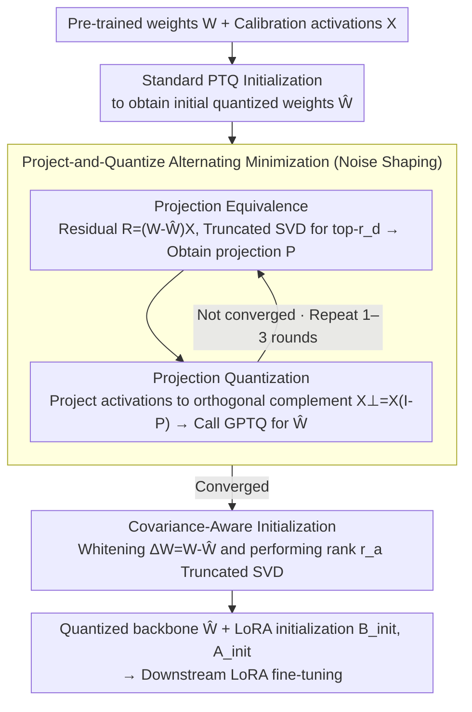

# ProjQ: Project-and-Quantize for Adapter-Aware LLM Compression

**Conference**: ICML 2026  
**arXiv**: [2606.00494](https://arxiv.org/abs/2606.00494)  
**Code**: https://github.com/yy9301/ProjQ  
**Area**: Model Compression / LLM Efficiency  
**Keywords**: Post-Training Quantization, LoRA, Subspace Projection, Activation-Aware, Low-Rank Noise Shaping

## TL;DR
ProjQ actively "shapes" the quantization noise of PTQ into a low-rank subspace and delegates this part to the subsequent LoRA adapter for elimination, thereby preserving LoRA capacity for learning downstream tasks. It achieves parity with standard 4-bit baselines using only 3 bits on LLaMA-2 / Qwen2.5 / Qwen3.

## Background & Motivation

**Background**: The de facto standard pipeline for LLM deployment involves first compressing the large model to 3-4 bits using PTQ (e.g., GPTQ, AWQ, QuIP) and then attaching a LoRA adapter for downstream fine-tuning (e.g., QLoRA, LoftQ).

**Limitations of Prior Work**: Current practices treat quantization and adaptation as two independent stages. The PTQ stage focuses solely on minimizing the "weight reconstruction error," thus spreading noise uniformly across all singular directions. In the LoRA stage, an adapter with a very small rank $r$ must first dedicate a significant portion of its capacity to "erasing" these multi-directional noises, leaving the remaining capacity to learn the task—essentially a "double burden."

**Key Challenge**: LoRA can only repair errors in low-rank directions, whereas PTQ tends to produce full-rank, isotropic noise. The geometric misalignment between the two stages—where the repairable subspace is small but the error spans the entire space—results in LoRA always patching holes instead of learning.

**Goal**: To "squeeze" the quantization noise into the low-rank subspace that LoRA can repair during the quantization stage, thereby minimizing the unrepairable residual in the orthogonal complement and releasing LoRA's capacity from "noise patching" to "task learning."

**Key Insight**: The authors begin with a geometric observation: "Repairing a low-rank error of rank $r_d$" $\equiv$ "Finding an orthogonal projection $P$ of rank $r_d$ that captures the maximum amount of error." Since the downstream task directions are unknown but the subspace structure is controllable, the quantizer should be optimized for "repairability" rather than "absolute magnitude." Concurrently, the objective is shifted from weight space to activation space $(W-\widehat{W})X$, as output error truly determines downstream performance.

**Core Idea**: Enable PTQ to learn a LoRA-friendly quantization solution—squeezing the inevitable quantization noise into a low-rank subspace that LoRA can absorb.

## Method

### Overall Architecture
ProjQ aims to resolve the misalignment where "PTQ scatters noise and LoRA cannot fully repair it." It reformulates "PTQ + LoRA initialization" as an activation-aware bi-level optimization problem: $\min_{\widehat{W}\in\mathcal{Q}}\,\min_{B,A}\,\lVert (W-\widehat{W}+BA)X\rVert_F^2$, where the outer layer "shapes the noise" and the inner layer "absorbs noise with a low-rank adapter." The entire process takes pre-trained weights $W$ and calibration activations $X$ as input, executing in two phases: Phase I (Noise Shaping) uses a **design rank** $r_d$ for **Project-and-Quantize alternating minimization** to squeeze noise into an $r_d$-dimensional repairable subspace; Phase II uses the actual **adaptation rank** $r_a$ for a covariance-aware closed-form SVD, outputting the quantized backbone $\widehat{W}$ and a pair of LoRA initializations $B_{init}, A_{init}$ for downstream LoRA fine-tuning.

### Key Designs

**1. Projection Equivalence: Replacing "finding the optimal low-rank adapter" with "finding a low-rank subspace"**

The original problem mixes discrete weights $\widehat{W}$ and continuous low-rank matrices $B,A$, making the variables strongly coupled and difficult to solve. The authors' breakthrough is proving that $\min_{B,A}\lVert R+BAX\rVert_F^2 = \min_{P\in\mathcal{P}_{r_d}}\lVert R(I-P)\rVert_F^2$, where $R=(W-\widehat{W})X$ is the residual in the activation space. This equation eliminates the "continuous low-rank matrix optimization": the optimal adapter simply corresponds to the $r_d$-dimensional subspace with the largest residual energy, and the optimal projection $P$ is given in closed form by the right singular vectors $V_{r_d}$ of the truncated SVD of $R$, as $P=V_{r_d}V_{r_d}^\top$. The previously intractable mixed optimization collapses into an alternating solution of discrete $\widehat{W}$ and projection $P$, providing a clean geometric explanation—it is clear which subspace should host the quantization error and which subspace is responsible for erasing it.

**2. Project-and-Quantize Alternating Minimization: Letting PTQ optimize only the part LoRA cannot repair**

This is the soul of ProjQ. It decomposes quantization into two alternating steps: the P-Step fixes the current $\widehat{W}^{(t)}$ and performs a truncated SVD on the residual $R^{(t)}=(W-\widehat{W}^{(t)})X$ to select the top-$r_d$ right singular vectors, identifying the "repairable subspace" $P^{(t+1)}$ for LoRA. The W-Step projects the activations into its orthogonal complement $X_\perp=X(I-P^{(t+1)})$ and then calls a standard activation-aware PTQ (such as GPTQ) to solve $\min_{\widehat{W}\in\mathcal{Q}}\lVert (W-\widehat{W})X_\perp\rVert_F^2$. The elegance lies in the fact that $X_\perp$ has already "removed" the directions that LoRA will eliminate; PTQ thus automatically allocates the precious bit budget to the unrepairable tail rather than wasting it on subspaces that will be erased anyway—bit resources are precisely delivered to where they are most needed. The authors also prove that as long as the PTQ sub-solver does not increase the error, the alternating sequence converges monotonically, stabilizing in 1-3 rounds in practice.

**3. Covariance-Aware Adapter Initialization: Providing an optimal starting point for the fine-tuning stage**

After shaping, LoRA must be given a good initial value to avoid the loss associated with a cold start. Upon obtaining $\widehat{W}^{(T)}$, let $\Delta W = W-\widehat{W}^{(T)}$. Perform an eigen-decomposition on the activation covariance $XX^\top=U_X\Lambda_X U_X^\top$, construct the whitening matrix $Y=U_X\Lambda_X^{1/2}$, and then perform a rank $r_a$ truncated SVD on $\Delta W Y$ as $U_{r_a}\Sigma_{r_a}V_{r_a}^\top$. The closed-form outputs are $B_{init}=U_{r_a}\Sigma_{r_a}^{1/2}$ and $A_{init}=\Sigma_{r_a}^{1/2}V_{r_a}^\top\Lambda_X^{-1/2}U_X^\top$. Note that shaping uses the design rank $r_d$ (focused on noise "shape"), while initialization uses the adaptation rank $r_a$ (focused on actual "capacity"). Decoupling these two ranks allows for independent parameter tuning based on storage budgets and task difficulty, while providing a mathematically optimal starting point—LoRA is aligned with the directions of maximum error energy from the outset. Computationally, this is efficient: $\Lambda_X$ is strictly diagonal, so $\Lambda_X^{-1/2}$ is just an $O(n)$ element-wise inversion, avoiding $O(n^3)$ overhead.

### Loss & Training
ProjQ itself does not introduce additional training losses; it only calls the PTQ solver during the quantization phase: the outer objective is $\lVert (W-\widehat{W})X(I-P)\rVert_F^2$, and the inner PTQ reuses mature schemes like GPTQ. Theoretically, the authors prove that under "sufficient adapter capacity" $r_a\ge r_d+r_s$, the separable upper bound for ProjQ $\mathcal{U}(W_p)\le \mathcal{U}(W_c)$ is strictly better than classic PTQ. They also provide a strong conclusion $f(W_p)\le f(W_c)$ for the zero task drift scenario ($r_s=0$), indicating that ProjQ is not just an engineering trick but a theoretically sound strategy.

## Key Experimental Results

### Main Results
Extreme 2-bit quantization was performed on LLaMA-2 / Qwen2.5-Instruct / Qwen3, with calibration set to $r_a=r_d=64$, comparing against GPTQ+SVD-LLM, AWQ+SVD-LLM, CALDERA, and LoftQ. C4 Perplexity (lower is better):

| Model | GPTQ+SVD-LLM | AWQ+SVD-LLM | CALDERA | LoftQ | ProjQ |
|------|--------------|-------------|---------|-------|-------|
| LLaMA2-7B | 26.26 | 1.7e5 | 21.59 | 28.77 | **21.50** |
| LLaMA2-13B | 14.50 | 9.5e4 | 13.56 | 14.14 | **12.48** |
| Qwen2.5-7B-Ins | 62.27 | NAN | 50.57 | 34.17 | **33.50** |
| Qwen2.5-14B-Ins | 28.94 | NAN | 23.33 | 31.74 | **22.22** |
| Qwen2.5-32B-Ins | 16.96 | — | — | 16.95 | **14.33** |
| Qwen3-32B | 26.24 | — | — | 25.71 | **20.74** |

At the extreme 2-bit level, AWQ collapses to $10^5$ level PPL, while ProjQ achieves the lowest PPL across all models; similar trends are observed on WikiText. The paper also reports that the compensation loss is approximately $2\times$ lower than the baselines.

### Ablation Study

| Configuration | Meaning | Result Trend |
|------|------|----------|
| Full ProjQ | Alternating optimization + Covariance-aware initialization | Baseline |
| w/o Alternating Iteration | Only identifies P-Step for initialization (LoftQ style) | Performance degradation, significantly worse than ProjQ |
| w/o Activation Weighting | Set $X=I$ (Weight space LoftQ) | Most severe collapse at low bit rates |
| Varying Design Rank $r_d$ | $r_d$ too small → cannot fit error; too large → $X_\perp$ degrades | Intermediate $r_d$ is optimal |
| Varying Iterations $T$ | Fast convergence between $T=1$ and $T=3$ | Stabilizes within 1-3 rounds |

### Key Findings
- Enabling both "activation-aware" and "low-rank shaping" simultaneously is critical—performing either in isolation fails to capture the full benefit, indicating that ProjQ's two mechanisms are synergistic rather than just additive.
- The advantages of ProjQ are most pronounced in ultra-low bit (2 bit, 3 bit) scenarios; at 4 bits, all methods approach FP performance, narrowing the gap. This aligns with theory: higher noise results in a heavier "double burden" for LoRA, making the benefits of shaping more significant.
- ProjQ at 3-bit can match the language modeling performance of a standard 4-bit baseline, effectively saving 25% in storage and bandwidth for free.

## Highlights & Insights
- The idea of "shaping noise into a form LoRA can ingest" is inherently elegant—it moves beyond the inertia of "PTQ should be as accurate as possible" by acknowledging that LoRA will follow, thereby making LoRA part of the quantization objective. This co-design approach can be transferred to any "compression + adaptation" two-stage pipeline.
- The projection equivalence theorem, which replaces "low-rank matrix optimization" with "orthogonal projection optimization," is a valuable engineering simplification: any problem of the form $\min_{B,A}\lVert R+BA\rVert$ can be equivalently rewritten as "finding an $r$-dimensional subspace."
- The decoupling of the design rank $r_d$ and adaptation rank $r_a$ is highly practical—$r_d$ controls the "sharpness" of shaping while $r_a$ controls actual available capacity. Not locking them implies that parameters can be tuned independently based on storage budgets and task difficulty.

## Limitations & Future Work
- ProjQ is still "layer-wise independent optimization" and does not explicitly consider cross-layer error propagation; in very deep models, cross-layer coupling might cause local optima to deviate from the global optimum.
- The algorithm assumes the calibration set $X$ represents the downstream distribution; if calibration data deviates, the shaped subspace may be misaligned. The paper lacks a thorough discussion on robustness under OOD calibration.
- Current experiments mainly focus on NLU/language modeling PPL, lacking systematic evaluation of "softer" metrics such as generation quality, long context, and instruction following; downstream gains still require verification.
- The theoretical part relies on the assumption that "classic PTQ noise spectrum is diffused, whereas ProjQ noise spectrum is concentrated," which may not hold in extreme quantization like 1-bit, representing a potential vulnerability in the analysis.

## Related Work & Insights
- **vs LoftQ**: LoftQ also seeks synergy between quantization and LoRA but minimizes $\lVert W-\widehat{W}-BA\rVert$ in weight space, treating all weights equally; ProjQ minimizes $\lVert (W-\widehat{W}+BA)X\rVert$ in activation space, weighting errors by their actual contribution to the output, effectively serving as an "activation-aware + subspace shaping" upgrade to LoftQ.
- **vs GPTQ / AWQ**: Classic PTQ only cares about the compression itself without considering subsequent fine-tuning, resulting in evenly scattered errors; ProjQ calls GPTQ as a W-Step sub-solver but replaces the activations with $X_\perp$, effectively wrapping GPTQ in a "shaping shell."
- **vs QLoRA**: QLoRA is a fully decoupled PTQ + LoRA approach which is simple but wastes LoRA capacity; ProjQ is an "aligned version" of QLoRA—equally lightweight, but with a LoRA starting point closer to the optimum.
- **vs CALDERA / EoRA / SVD-LLM**: CALDERA uses low-rank + quantization decomposition to approximate weights; EoRA / SVD-LLM propose covariance-aware low-rank approximation. ProjQ adopts EoRA's closed-form initialization as its second stage and adds "active shaping" in the first stage, stringing together the strengths of these works into a complete pipeline.

## Rating
- Novelty: ⭐⭐⭐⭐ Transforming PTQ into a "shaping tool for LoRA" is a clear new perspective, and the projection equivalence theorem is solid.
- Experimental Thoroughness: ⭐⭐⭐⭐ Covers three major model families across multiple bit depths and baselines, with theoretical and experimental cross-verification; lacks long-context and generation quality evaluation.
- Writing Quality: ⭐⭐⭐⭐ The geometric intuition, algorithm, theory, and experiments are clearly linked, and the propositions and theorems are formally stated.
- Value: ⭐⭐⭐⭐ Directly addresses the core needs of "edge deployment of LLMs"; matching 4-bit with 3-bit is a very practical gain.

## Rating
- Novelty: To be rated
- Experimental Thoroughness: To be rated
- Writing Quality: To be rated
- Value: To be rated

<!-- RELATED:START -->

## Related Papers

- [\[ICLR 2026\] Prune-then-Quantize or Quantize-then-Prune? Understanding the Impact of Compression Order in Joint Model Compression](../../ICLR2026/model_compression/prune-then-quantize_or_quantize-then-prune_understanding_the_impact_of_compressi.md)
- [\[ICML 2026\] Swift-SVD: Theoretical Optimality Meets Practical Efficiency in Low-Rank LLM Compression](swift-svd_theoretical_optimality_meets_practical_efficiency_in_low-rank_llm_comp.md)
- [\[ICML 2026\] Multi-Adapter Representation Interventions via Energy Calibration](multi-adapter_representation_interventions_via_energy_calibration.md)
- [\[ICML 2026\] Preserve-Then-Quantize: Balancing Rank Budgets for Quantization Error Reconstruction in LLMs](preserve-then-quantize_balancing_rank_budgets_for_quantization_error_reconstruct.md)
- [\[ICML 2026\] Breaking the MoE LLM Trilemma: Dynamic Expert Clustering with Structured Compression](breaking_the_moe_llm_trilemma_dynamic_expert_clustering_with_structured_compress.md)

<!-- RELATED:END -->
