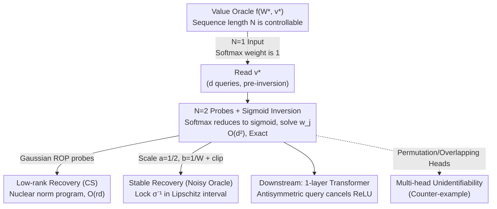

# Provably Learning Attention with Queries

**Conference**: ICML 2026  
**arXiv**: [2601.16873](https://arxiv.org/abs/2601.16873)  
**Code**: None  
**Area**: Learning Theory / Model Stealing / Transformer Learnability  
**Keywords**: model stealing, value query, single-head attention, parameter recovery, compressed sensing

## TL;DR
The authors prove that single-head softmax attention can be precisely recovered with surprising simplicity under value-query access—requiring only $O(d^2)$ queries, which is significantly easier than ReLU MLPs of equivalent structure. When the head dimension $r \ll d$, the complexity can be reduced to $O(rd)$ using compressed sensing. The findings are extended to noisy oracles, membership queries, and multi-head unidentifiability.

## Background & Motivation
**Background**: Transformers are the backbone of industrial deployment, making model stealing attacks a core security concern. Since Tramèr 2016, there have been extensive empirical and theoretical results on extracting feed-forward networks (FFNs); recently, Carlini 2024 even demonstrated the extraction of embedding matrices and widths from production-level LLMs. However, the fundamental question of whether parameters of softmax attention can be provably recovered under black-box API access remains unanswered.

**Limitations of Prior Work**: (1) Existing query learning theories focus almost exclusively on ReLU FFNs and require strong assumptions like Gaussian inputs, linearly independent parameters, or general position. (2) Passive learning of attention (without queries) is inherently difficult because the softmax combined with bilinear scores is non-convex; researchers often rely on tools like token-selection, max-margin, or SVMs in restricted cases. (3) Softmax couples the bilinear term $x_i^\top W x_N$ of token pairs with cross-position weighting, making it unclear how to solve for $W$ entry by entry using naive methods.

**Key Challenge**: While the non-linearity of attention appears more complex than MLPs (due to softmax normalization and variable sequence length), the authors find that this "relatively soft" non-linearity actually aids the attacker. By controlling the sequence length $N$, the softmax can be reduced to an invertible sigmoid, allowing attention to be reformulated as a system of linear equations—a convenience entirely absent in ReLU MLPs.

**Goal**: (1) Provide the first polynomial-time algorithm and query complexity for single-head attention parameter recovery. (2) Connect it to a ReLU FFN learner to achieve learnability for a single Transformer layer. (3) Address more realistic scenarios including low-rank structures, noisy oracles, membership queries, and multi-head unidentifiability.

**Key Insight**: Leveraging the unique advantage of "controllable length" in attention: at $N=1$, softmax weights are always 1, allowing the independent recovery of $v$ via $f(X)=x^\top v$; at $N=2$, softmax reduces to a sigmoid, allowing the linear equations for the columns of $W$ to be solved by inverting $\sigma^{-1}(\cdot)$ from oracle outputs.

**Core Idea**: Precisely recover $(W^\star, v^\star)$ using $d^2+d$ queries through "single-token queries for $v$" and "double-token queries for column-wise $W$ via sigmoid inversion." This approach is combined with compressed sensing, Lipschitz clipping, and antisymmetric queries to cover variants including low-rank, noise, and ReLU FFNs.

## Method

### Overall Architecture
The attacker accesses a value oracle $f_{W^\star,v^\star}(X)=\text{softmax}(x_1^\top W^\star x_N,\dots,x_N^\top W^\star x_N)^\top(Xv^\star)$ and aims to recover the parameters $(W^\star,v^\star)\in\mathbb R^{d\times d}\times\mathbb R^d$ exactly. The algorithm exploits the advantage that the sequence length $N$ is controlled by the attacker: first, inputs of length $N=1$ are used to force softmax weights to 1, allowing the oracle to output components of $v^\star$; then, inputs of length $N=2$ compress the softmax into an invertible sigmoid to solve for $W^\star$ column by column. This main framework is further refined with compressed sensing or symmetrization techniques for other variants.

### Key Designs

**1. Length-2 Probing + Sigmoid Inversion (Thm 4.1): Reducing Non-linear Attention to Linear Equations**

The difficulty of softmax lies in the global normalization that couples all token bilinear scores. The solution is to fix a target column $j$ and construct length-2 inputs $X=[(u+e_j)^\top;\, e_j^\top]$. The scores become $s_1=(u+e_j)^\top W^\star e_j$ and $s_2=e_j^\top W^\star e_j$. Subtracting them yields $s_1-s_2=u^\top w_j$, eliminating the problematic $e_j^\top W^\star e_j$ term. The attention weight for position 1 reduces to a univariate sigmoid $\alpha=\sigma(u^\top w_j)$. Since $v^\star$ is already isolated from the $N=1$ step, the oracle output $y=v^\star_j+\alpha\,(u^\top v^\star)$ contains only $\alpha$ as an unknown. As long as $u^\top v^\star\neq 0$, one can derive $\alpha=(y-v^\star_j)/(u^\top v^\star)\in(0,1)$ and apply $\sigma^{-1}$ to obtain the linear constraint $u^\top w_j=\sigma^{-1}(\alpha)$. Using $d$ linearly independent $u$ vectors allows the recovery of the full column $w_j$. The complexity is $O(d^2)$, turning the non-linearity of attention into an advantage.

**2. Low-rank Recovery of $W^\star$ (Thm 5.1): Compressing $d^2$ to $O(rd)$ via Rank-1 Snapshots**

In practical LLMs, $W^\star=K^\top Q$ and the head dimension $r$ is much smaller than the width $d$. Instead of querying the full matrix, the authors use Gaussian probes $a,b\sim\mathcal N(0,I_d)$ with $X=[(a+b)^\top;\, b^\top]$. Sigmoid inversion now provides a rank-1 measurement $t=\langle ab^\top, W^\star\rangle$. After collecting $m=O(rd)$ such Rank-One Projection (ROP) measurements, the convex program $\min\|W\|_\ast\ \text{s.t.}\ \langle a_kb_k^\top,W\rangle=t_k$ recovers the matrix exactly with high probability, leveraging the Restricted Uniform Boundedness (RUB) condition.

**3. Stable Recovery under Noisy Oracle (Thm 6.1): Lipschitz Interval Locking and Clipping**

To handle noise where $\sigma^{-1}$ becomes non-Lipschitz as $\alpha \to 0$ or $1$, the probe scales are designed to keep logits in a safe zone. By setting $a=1/2$ and $b=1/W$ such that $|ab\,W^\star_{ij}|\leq 1/2$, the weight $\alpha^\star$ is restricted to the smooth interval $[\sigma(-1/2),\,1-\sigma(-1/2)]$. Estimations are then clipped via $\text{clip}(\hat\alpha;\tau_{\text{clip}},1-\tau_{\text{clip}})$, ensuring the estimation error propagates linearly. This yields $\|\hat W-W^\star\|_F\leq\epsilon_W$ given a noise tolerance $\tau$.

### Loss & Training
This work focuses on query complexity and probabilistic accuracy rather than training. The low-rank recovery uses nuclear norm minimization. For multi-head unidentifiability (Prop 7.1), the authors construct different sets of $\{(W_h,v_h)\}$ that induce identical input-output mappings. For one-layer Transformers, an antisymmetric query $\widetilde{\text{VQ}}(X)=\text{VQ}(X)-\text{VQ}(-X)$ is used to cancel the even-symmetric ReLU activation, reducing the problem to the pure attention learner, while the FFN part relies on existing learners (e.g., Milli 2019).

## Key Experimental Results
The paper is theoretical and does not contain empirical experiments. The "data" refers to query and precision complexities.

### Main Results

| Setting | Query Complexity | Guarantee | Assumptions |
|------|-------------|------|------|
| Exact Single-head Recovery (Thm 4.1) | $O(d^2)$ | Exact | $v^\star\neq 0$ |
| Low-rank Single-head (Thm 5.1) | $O(rd)$ | Exact, prob $1-e^{-\Omega(m)}$ | $\text{rank}(W^\star)\leq r$, $v^\star\neq 0$ |
| Noisy Oracle (Thm 6.1) | $O(d^2)$ | $\|\hat W-W^\star\|_F\leq\epsilon_W$ | $\|W^\star\|_F\leq W$, $\min v^\star\geq\mu$ |
| 1-layer Transformer (w/ ReLU MLP) | $Q_{\text{FFN}}(d,m)+O(d^2)$ | Exact, depends on $\mathcal A_{\text{FFN}}$ | $A^\star w_o^\star\neq 0$ |
| Multi-head Attention | Unidentifiable | No algorithm exists | No additional structure |

### Ablation Study

| Variant | Queries / Precision | Remarks |
|------|--------------|------|
| Value query | $O(d^2)$, Exact | Baseline |
| Membership query (App. B) | poly + bisection | Returns only ±1 labels; higher complexity |
| Antisymmetric query | $2\times$ Single query | Used to isolate attention from ReLU |

### Key Findings
- Single-head attention is significantly easier to learn via queries than single-hidden-layer ReLU MLPs, despite having more complex non-linearity (softmax is globally invertible and smooth, whereas ReLU is not).
- The selection of probe scales is crucial for algorithmic closure, especially in low-rank and noisy settings.
- Multi-head attention is unidentifiable without structural assumptions (like head orthogonality) due to permutation and linear superposition symmetries.
- $N=1$ queries are a necessary prerequisite to isolate $v^\star$, without which sigmoid inversion of $W^\star$ lacks a valid denominator.

## Highlights & Insights
- Controllable sequence length identifies a specific attack surface for attention, placing Transformer security in a more vulnerable position than MLPs.
- The antisymmetric trick $f(X)-f(-X)$ to cancel ReLU can be reused for analyzing any architecture combining odd transformations with even non-linearities.
- Formulating model extraction within a PAC-style query complexity framework bridges the gap between the security and learning theory communities.
- Reducing query complexity to $O(rd)$ for modern LLM dimensions ($r\sim 128, d\sim 4096$) suggests that attention parameters of SOTA-scale models are qualitatively extractable.

## Limitations & Future Work
- The study focuses on a simplified version; real Transformers include multi-layer stacking, LayerNorm, and position encodings.
- The noisy case requires a margin $\mu>0$, which may not hold for sparse or near-zero weights in LLMs.
- Multi-head unidentifiability is proven via counter-examples but the boundaries for identifiability under structural assumptions (e.g., orthogonal heads) are not explored.
- The assumption $v^\star \neq 0$ is critical; in degenerate cases where $v^\star = 0$, $W^\star$ is entirely unidentifiable.

## Related Work & Insights
- **vs. Chen et al. 2021**: Their recovery of 2-layer ReLU MLPs requires Gaussian inputs and distribution-dependent arguments, whereas attention recovery here requires no distribution assumptions.
- **vs. Daniely-Granot 2023**: This work uses their FFN learner as a subroutine for the Transformer layer, demonstrating a modular "FFN learner + attention learner" approach.
- **vs. Carlini et al. 2024**: While Carlini provides empirical extraction on industrial LLMs, this work provides the minimal, provable version of the same problem.

## Rating
- Novelty: ⭐⭐⭐⭐⭐ First provable parameter recovery for softmax attention.
- Experimental Thoroughness: ⭐⭐ Purely theoretical; lacks empirical demos.
- Writing Quality: ⭐⭐⭐⭐⭐ Clear motivations and concise proofs.
- Value: ⭐⭐⭐⭐ Opens new tools for both security and attention theory.

## Related Papers

- [\[ICML 2026\] Token Sparse Attention: Efficient Long-Context Inference with Interleaved Token Selection](token_sparse_attention_efficient_long-context_inference_with_interleaved_token_s.md)
- [\[ICML 2026\] QHyer: Q-conditioned Hybrid Attention-mamba Transformer for Offline Goal-conditioned RL](qhyer_q-conditioned_hybrid_attention-mamba_transformer_for_offline_goal-conditio.md)
- [\[CVPR 2026\] BinaryAttention: One-Bit QK-Attention for Vision and Diffusion Transformers](../../CVPR2026/model_compression/binaryattention_one-bit_qk-attention_for_vision_and_diffusion_transformers.md)
- [\[ICLR 2026\] TurboBoA: Faster and Exact Attention-aware Quantization without Backpropagation](../../ICLR2026/model_compression/turboboa_faster_and_exact_attention-aware_quantization_without_backpropagation.md)
- [\[ICLR 2026\] FASA: Frequency-Aware Sparse Attention](../../ICLR2026/model_compression/fasa_frequency-aware_sparse_attention.md)

<!-- RELATED:END -->

<!-- RELATED:START -->

## Related Papers

- [\[ICML 2026\] Token Sparse Attention: Efficient Long-Context Inference with Interleaved Token Selection](token_sparse_attention_efficient_long-context_inference_with_interleaved_token_s.md)
- [\[ICML 2026\] Selective Coupling of Decoupled Informative Regions: Masked Attention Alignment for Data-Free Quantization of Vision Transformers](selective_coupling_of_decoupled_informative_regions_masked_attention_alignment_f.md)
- [\[ICML 2026\] AREA: Attribute Extraction and Aggregation for CLIP-Based Class-Incremental Learning](area_attribute_extraction_and_aggregation_for_clip-based_class-incremental_learn.md)
- [\[ICML 2026\] Easier to Judge Than to Find: Predicting In-Context Learning Success for Demonstration Selection](easier_to_judge_than_to_find_predicting_in-context_learning_success_for_demonstr.md)
- [\[ICML 2026\] Energy-Structured Low-Rank Adaptation for Continual Learning](energy-structured_low-rank_adaptation_for_continual_learning.md)

<!-- RELATED:END -->
