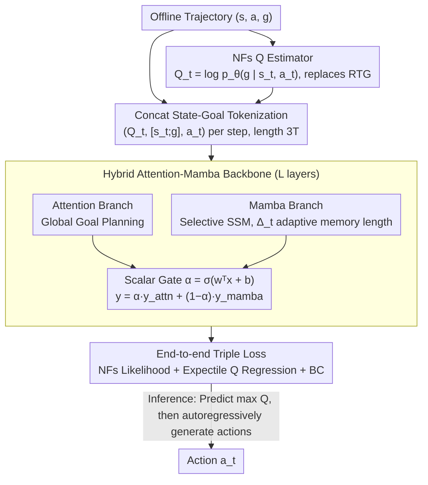

# QHyer: Q-conditioned Hybrid Attention-mamba Transformer for Offline Goal-conditioned RL

**Conference**: ICML 2026  
**arXiv**: [2605.01862](https://arxiv.org/abs/2605.01862)  
**Code**: Not released  
**Area**: Reinforcement Learning / Sequence Modeling / Offline Goal-conditioned RL  
**Keywords**: Offline GCRL, Decision Transformer, Normalizing Flows, Mamba, Trajectory Stitching

## TL;DR
QHyer replaces the trajectory-dependent RTG in Decision Transformers with state-dependent Q-values estimated via Normalizing Flows, and utilizes a gated Attention-Mamba hybrid backbone to achieve content-adaptive history compression, simultaneously setting a new SOTA on the non-Markovian and Markovian offline goal-conditioned RL datasets of OGBench/D4RL.

## Background & Motivation

**Background**: Offline Goal-Conditioned Reinforcement Learning (Offline GCRL) learns "goal-reaching" policies from static datasets. Current mainstream approaches include Bellman-based value methods (e.g., IQL/HIQL) and Decision Transformer (DT) variants that treat decision-making as sequence modeling. The latter naturally handles history dependence and is considered more suitable for real-world datasets containing non-Markovian behavior policies (e.g., OGBench play).

**Limitations of Prior Work**: Directly applying DT to Offline GCRL faces two major hurdles. First, DT uses Return-to-Go (RTG) as a conditioning signal, but under sparse rewards, RTG degrades into a near-binary signal indicating only whether a trajectory succeeded. The same state receives a 1 in successful trajectories and 0 in failures, making it **impossible to compare state quality across trajectories**, leading to the collapse of stitching capabilities for "locally useful segments" from failed demonstrations. Second, pure attention is insensitive to temporal structure; while LSDT/DMixer use fixed-window causal convolutions to add "local branches," play data requires long memory whereas noisy data requires only short memory. Fixed receptive fields either waste capacity or truncate critical dependencies.

**Key Challenge**: These two limitations are **coupled**. Simply replacing the Q-value while retaining the RTG-style fixed window still suffers from convolution-related issues on non-Markovian play data; simply changing the backbone while keeping RTG still fails to resolve the stitching bottleneck under sparse rewards. Both must be addressed simultaneously: a "state-dependent value signal" and "content-adaptive effective memory" are required.

**Goal**: (i) Find a conditioning signal for DT that distinguishes state quality under sparse goal rewards; (ii) Design a temporal module for the backbone that dynamically adjusts memory length per token.

**Key Insight**: The author notes that the goal-reaching Q-function $Q^\beta(s,a,g)=p^\beta_+(g\mid s,a)$ represents the "probability of reaching goal $g$ from $(s,a)$", which is **trajectory-independent**—precisely the "trajectory-agnostic value measure" needed for stitching. Meanwhile, Mamba’s selective SSM makes the discretization step $\Delta_t$ an input-dependent function, allowing the effective memory to drift per token without changing the structure. Combining these two observations addresses both limitations.

**Core Idea**: Use **Normalizing Flows to estimate MC Q-values as conditioning tokens to replace RTG**, and replace the pure attention backbone with a **gated fusion Attention-Mamba hybrid** to make sequence modeling truly compatible with Offline GCRL.

## Method

### Overall Architecture
QHyer transforms the "sequence modeling" framework of Decision Transformer into a version adapted for sparse goal rewards. It represents each timestep as a triplet $(Q_t, [s_t;g], a_t)$, where $Q_t=\log p_\theta(g\mid s_t,a_t)$ is the log-probability estimated via Normalizing Flows (replacing RTG), and $[s_t;g]$ is a token concatenating state and goal. This sequence is processed through $L$ layers of Hybrid Attention-Mamba blocks. In each block, the attention branch handles global goal planning, while the Mamba branch performs content-adaptive history compression. Their outputs are weighted and fused using a scalar gate. The system is trained via end-to-end optimization of NFs likelihood, expectile regression of Q, and behavior cloning. During inference, the maximum Q is predicted first, and actions are generated autoregressively conditioned on it.

### Key Designs

**1. Replacing RTG with Normalizing Flows estimated Q: Replacing "binary success signals" with "trajectory-independent state quality measures"**

The most fatal pain point of DT-based methods is the degradation of RTG under sparse rewards—the same state gets 1 in successful trajectories and 0 in failures, making cross-trajectory comparisons impossible and destroying stitching capability (RTG coverage is only 25% under sparse rewards). QHyer instead uses the goal-reaching Q-function $Q^\beta(s,a,g)=p^\beta_+(g\mid s,a)$ as a condition, representing the probability of reaching goal $g$ from $(s,a)$ regardless of the trajectory (NFs Q coverage rises to 92%). Specifically, coupling-layer NFs model the conditional density $p_\theta(g\mid s,a)$ to obtain exact log-likelihoods $Q^\beta_\theta(s,a,g)=\log p_0(f_\theta(g;z))+\log\bigl|\det\partial f_\theta(g;z)/\partial g\bigr|$ via the change-of-variables formula. Then, expectile regression $L^2_\tau(u)=|\tau-\mathds{1}(u<0)|\cdot u^2$ ($\tau\in(0.5,1)$) is used to learn $\hat Q_\phi(s,g)$ within the transformer, converging toward the **in-distribution maximum Q** (Theorem 3.1 shows the bias $\epsilon_\tau$ decreases as $\tau$ increases).

Why NFs? The authors provide a structural argument: density models in transformers reading Q-tokens across multiple goals need specific attributes. CVAE only provides ELBO bounds, Contrastive RL has goal-dependent shifts, and Diffusion requires ODE+Hutchinson estimation which introduces variance. NFs' triangular Jacobian makes log-density **both exact and efficient**, satisfying the requirements for multi-goal conditioning. Empirically, NFs show the lowest Q estimation error (Appendix G.4).

**2. Hybrid Attention-Mamba Backbone: Replacing fixed kernels with input-dependent "smooth forgetting" to allow effective memory to drift with data shape**

The second pain point relates to the backbone: pure attention is insensitive to temporal structure, while fixed-window causal convolutions (in LSDT/DMixer) are constrained by receptive fields—convolutions have fixed weights $w_j$, resulting in hard truncation. Play data needs long memory, while noisy data needs short memory; fixed kernels either waste capacity or truncate critical dependencies. QHyer places two branches in parallel in each block: Attention for global goal-oriented reasoning and Mamba for content-adaptive history compression. The Mamba branch processes local features $x'_t$ via selective SSM $h_t=\bar A h_{t-1}+\bar B x'_t,\ y_t=Ch_t$, where the discretized step size is input-dependent: $\bar A_t=\exp(\Delta_t\cdot A)$, $\Delta_t=\mathrm{softplus}(\mathrm{Linear}_\Delta(x'_t))$. When $\Delta_t$ is small, $\bar A_t\approx 1$, preserving long history (suitable for play); when $\Delta_t$ is large, $\bar A_t\approx 0$, focusing on local information (suitable for noisy). This "input-dependent smooth forgetting" automatically adjusts effective memory across datasets without manual receptive field tuning.

**3. Concatenated State-Goal Tokenization + End-to-End Triple Loss: Embedding goals into each token to avoid quadratic overhead from sequence extension**

Arranging the sequence as a quadruplet $(Q_t, s_t, g, a_t)$ would increase length from $3T$ to $4T$, incurring quadratic attention costs. QHyer utilizes $(Q_t, [s_t;g], a_t)$, concatenating state and goal into a single token. This ensures goal signals are visible at every step while keeping the sequence length at $3T$, serving as a key engineering trick to integrate NFs Q signals into the DT pipeline. The system optimizes $\mathcal L_{\text{QHyer}}=\lambda_{\text{critic}}\mathcal L_{\text{NFs}}+\lambda_{\text{BC}}\mathcal L_{\text{BC}}+\lambda_Q \mathcal L_Q$.

### Loss & Training
The NFs critic is trained via maximum likelihood with hindsight relabeling; the transformer branch uses BC loss $\mathcal L_{\text{BC}}=-\mathbb E[\log\pi_\theta(a_t\mid Q_t,[s_t;g])]$; the expectile $\tau$ is chosen based on data coverage ($0.9$ for low-coverage play, $0.95$ for high-coverage noisy). Inference involves two stages: first generating $\hat Q(s_t,g)$, then generating $a_t$ conditioned on it.

## Key Experimental Results

### Main Results
OGBench manipulation (5 test goals, avg. success %) and D4RL Maze (normalized score).

| Dataset | Task | Second Best | QHyer | Gain |
|---|---|---|---|---|
| OGBench cube-play | single | GCIQL 68 | **84** | +16 |
| OGBench cube-play | double | GCIQL 40 | **56** | +16 |
| OGBench cube-noisy | double | GCIQL 23 | **30** | +7 |
| OGBench puzzle-play | 4x5 | GCIQL 14 | **31** | +17 |
| D4RL AntMaze-v2 | large-play | IQL 39.6 | **44.2** | +4.6 |
| D4RL AntMaze-v2 | medium-diverse | LSDT 75.8 | **94.0** | +18.2 |
| D4RL Maze2d | medium | QT 172.0 | **173.0** | +1.0 |

Overall Scores: OGBench cube-play increased from 24 to 152 (vs. HIQL baseline). AntMaze total score rose from 303.6 to 483.4, and Maze2d from 136.5 to 291.5. QHyer breaks the freeze on large mazes where RTG-based series (DT/EDT/DC) largely failed.

### Ablation Study

| Configuration | cube-single-play | cube-single-noisy | Conclusion |
|---|---|---|---|
| RTG + Attention (≈DT) | Low | Low | RTG failure |
| NFs Q + Attention only | 74 | 60 | Lacks temporal adaptivity |
| NFs Q + Mamba only | 80 | 91 | Lacks global reasoning |
| NFs Q + Hybrid (Ours) | **84** | **95** | Complementary gating |
| Hybrid + No Q | -- | -- | Degenerates to BC |
| Hybrid + CVAE Q | < CRL | < CRL | ELBO distortion |
| Hybrid + CRL Q | < NFs | < NFs | Negative sampling bias |

Performance climbed monotonically with expectile $\tau$ up to 0.9, but regressed after 0.95 due to insufficient coverage.

### Key Findings
- **Both innovations are necessary and optimal in combination**: Fixing NFs while changing the backbone, or fixing RTG while changing the backbone, both showed that QHyer's two modifications are additive rather than redundant.
- **Mamba's $\Delta_t$ truly drifts with data shape**: On play data, mean $\Delta_t=0.38$, $\bar A_t=0.92$ (eff. memory ~12 steps), with the gate allocating 0.57 capacity to attention. On noisy data, $\Delta_t=1.05$, $\bar A_t=0.61$ (eff. memory ~3 steps), with 0.58 allocated to Mamba.
- **NFs > CRL > CVAE > No-Q**: Exact normalized log-density is the critical bottleneck for stitching in sequence modeling.

## Highlights & Insights
- **The "coupled limitations" argument is highly coherent**: The authors explicitly identify failure modes for resolving only one side (non-Markovian issues in convolutions or trajectory-dependency in RTG), providing strong motivation for simultaneous changes.
- **Structural argument for NFs selection**: The analysis of why CVAE/CRL/Diffusion fail for multi-goal Q-token scenarios provides design principles beyond mere experimental numbers.
- **Dual-level adaptivity of Gating + Mamba $\Delta$**: Coarse-grained capacity allocation via the gate between branches, and fine-grained memory adjustment via $\Delta_t$. This is a superior paradigm for datasets with heterogeneous temporal structures.

## Limitations & Future Work
- Still limited on visual-noisy tasks: Pixel-level NFs density estimation becomes the primary error source, and Markovian behavior offsets the non-Markovian modeling advantages.
- Theoretical analysis assumes deterministic transitions (inherited from R2CSL); extension to stochastic environments remains open.
- Higher training cost: Overlapping components (NFs critic + Mamba SSM + expectiles); wall-clock comparisons were not detailed.
- Expectile $\tau$ is coupled with coverage $\tilde c$, often requiring manual tuning ($\tau\in\{0.9, 0.95\}$) across datasets.

## Related Work & Insights
- **vs. DT/EDT/DC/DMamba**: These use RTG, which degrades to a binary signal under sparse rewards; QHyer's NFs Q provides a qualitative leap in stitching.
- **vs. QDT/CGDT/QT/Reinformer/VDT**: These retain RTG and use Q as an auxiliary loss or regularizer; QHyer replaces RTG with Q-tokens directly.
- **vs. LSDT/DMixer**: These use fixed-kernel convolutions with hard receptive field constraints; QHyer’s Mamba branch provides content-adaptive memory.
- **vs. HIQL/SAW/OTA**: Hierarchical methods assume Markovian transitions between subgoals, which fails on play data; QHyer’s sequence modeling handles non-Markovianity naturally.

## Rating
- Novelty: ⭐⭐⭐⭐⭐ First to combine NFs Q + Hybrid Attention-Mamba for Offline GCRL with a deep analysis of coupled limitations.
- Experimental Thoroughness: ⭐⭐⭐⭐⭐ Double benchmarks (OGBench + D4RL), ablations for 3 Q-estimators and 3 backbones, plus $\Delta_t$ and gate visualization.
- Writing Quality: ⭐⭐⭐⭐⭐ Logical progression from "limitation → root cause → choice"; the NFs selection argument is exemplary.
- Value: ⭐⭐⭐⭐ Establishes a viable path for "sequence modeling + exact density Q" in Offline GCRL, with clear transfer value for robotics.

<!-- RELATED:START -->

## Related Papers

- [\[CVPR 2025\] BHViT: Binarized Hybrid Vision Transformer](../../CVPR2025/model_compression/bhvit_binarized_hybrid_vision_transformer.md)
- [\[ACL 2026\] No-Worse Context-Aware Decoding: Preventing Neutral Regression in Context-Conditioned Generation](../../ACL2026/model_compression/no-worse_context-aware_decoding_preventing_neutral_regression_in_context-conditi.md)
- [\[ICML 2026\] Provably Learning Attention with Queries](provably_learning_attention_with_queries.md)
- [\[ICML 2026\] FlattenGPT: Depth Compression for Transformer with Layer Flattening](flattengpt_depth_compression_for_transformer_with_layer_flattening.md)
- [\[CVPR 2025\] Binarized Mamba-Transformer for Lightweight Quad Bayer HybridEVS Demosaicing](../../CVPR2025/model_compression/binarized_mamba-transformer_for_lightweight_quad_bayer_hybridevs_demosaicing.md)

<!-- RELATED:END -->
