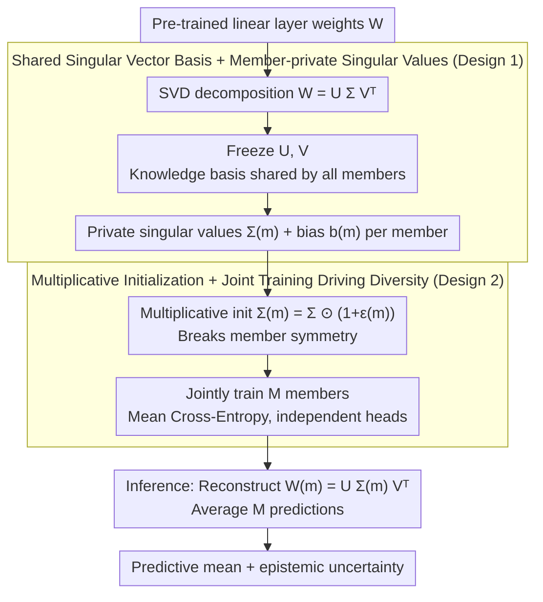

# Quantifying the Uncertainty of Foundation Models with Singular Value Ensembles

**Conference**: ICML 2026  
**arXiv**: [2601.22068](https://arxiv.org/abs/2601.22068)  
**Code**: https://github.com/moturkoglu/Singular-Value-Ensemble  
**Area**: AI Safety / Uncertainty Quantification  
**Keywords**: Uncertainty Quantification, Implicit Ensemble, Singular Value Fine-tuning, Parameter-efficient, Calibration  

## TL;DR
Singular Value Ensemble (SVE) expresses "ensemble diversity" purely through the distinct re-weighting of SVD singular values—freezing the left and right singular vectors (shared "knowledge basis") of pre-trained weights while training an independent set of singular values for each ensemble member. With a parameter overhead of $\lesssim 1\%$, its calibration quality approaches that of a true Deep Ensemble, bringing UQ into PEFT-friendly, resource-constrained scenarios.

## Background & Motivation

**Background**: Deep models are increasingly deployed in high-risk scenarios (medical diagnosis, autonomous driving, agricultural decision-making), yet those trained with maximum likelihood are generally overconfident, "not knowing what they don't know." The gold standard for quantifying epistemic uncertainty remains Deep Ensemble—training $M$ independent models and averaging them—which consistently outperforms single-model approximations like MC-Dropout in calibration and OOD detection.

**Limitations of Prior Work**: The training and VRAM costs of Deep Ensembles scale linearly by $M$, which is nearly unbearable for foundation models with billions of parameters, even for $M=4$. Implicit ensembles (BatchEnsemble rank-1 perturbations, MIMO, FiLM-Ensemble, LoRA-Ensemble) attempt to share backbones and only add a small number of parameters per member, but they still require "learning a set of new directions useful for final prediction from scratch"—these new parameters do not inherit pre-trained semantic priors. Conversely, single-model Bayesian methods (Laplace-LoRA, BLoB, C-LoRA, SNGP) use fewer parameters but either require complex posterior fitting or perform poorly on Transformers.

**Key Challenge**: Modern PEFT paradigms (LoRA, Adapter, Prompt-Tuning) have minimized "fine-tuning" costs, but "UQ" remains prohibitively expensive, creating a structural gap between the two.

**Goal**: To provide an implicit ensemble method with $<1\%$ parameter overhead that reuses the "knowledge basis" of pre-trained foundation models while generating enough diversity in predictive distributions among members to measure epistemic uncertainty.

**Key Insight**: The authors rely on a consensus formed in interpretability and PEFT over recent years: "knowledge is organized along linear subspaces in the weight space." SVF (Sun et al., 2022) found that freezing pre-trained singular vectors and only fine-tuning singular values is sufficient for various downstream adaptations, as singular values act to "re-weight pre-trained representations."

**Core Idea**: Since different re-weightings of singular values yield functionally distinct models, "each member learning a set of singular values while sharing pre-trained singular vectors" naturally constitutes an implicit ensemble that preserves pre-trained priors.

## Method

### Overall Architecture
SVE aims to add a layer of epistemic uncertainty to foundation models with $<1\%$ parameter overhead without retraining the entire model. For each linear layer $\mathbf{W}\in\mathbb{R}^{m\times n}$ to be ensembled, it first performs an SVD $\mathbf{W}=\mathbf{U}\boldsymbol{\Sigma}\mathbf{V}^{\top}$, freezing the singular vectors $\mathbf{U}, \mathbf{V}$ as a shared "knowledge basis" for all members. Each member $m$ is then assigned a private set of trainable singular values $\boldsymbol{\Sigma}^{(m)}$ and a bias $\mathbf{b}^{(m)}$. Consequently, the forward pass for the $m$-th member uses $\mathbf{W}^{(m)}=\mathbf{U}\boldsymbol{\Sigma}^{(m)}\mathbf{V}^{\top}$ and outputs $\mathbf{y}^{(m)}=\mathbf{W}^{(m)}\mathbf{x}+\mathbf{b}^{(m)}$. $M$ members (each with independent classification heads) are trained jointly. At inference, predictions are averaged following standard Deep Ensemble practices, with diversity stemming entirely from different re-weightings of singular values.

### Key Designs

**1. Shared Singular Vector Basis + Member-private Singular Values: Compressing ensemble diversity into different intensity combinations of the same subspace**

The pain points of Deep Ensembles and LoRA-Ensembles lie in "new parameters"—the former requires full weight copies, and the latter requires learning new low-rank directions from scratch for each member, which don't inherit pre-trained semantics. SVE decomposes $\mathbf{W}$ into $\mathbf{U}\boldsymbol{\Sigma}\mathbf{V}^{\top}$ and freezes the directions, rescaling singular values anisotropically per member. Interpretability research on Transformers views singular vectors as "semantic directions" and singular values as their relative importance; thus, each member constructs a different "weight profile" on the same set of directions. The cost per layer per member is only $\min(m,n)$ scalars (plus optional bias), with total overhead around $(M-1)\cdot 5/(4d)$—for LLaMA-2-7B ($d=4096$), even $M=16$ results in $\approx 0.2\%$. This avoids the "cold start" problem of new parameters in LoRA-Ensemble and uses the "amplification or suppression of directions" as the sole degree of freedom for diversity, preserving pre-trained priors while creating functional variance. Essentially, it generalizes the single-model adaptation of SVF to ensemble-based UQ.

**2. Multiplicative Initialization + Joint Training Driven Diversity: Converging $M$ members to different solutions without extra regularization**

If members sharing the same basis are initialized identically, they collapse into the same solution. SVE breaks symmetry using multiplicative perturbations: $\boldsymbol{\Sigma}^{(m)}=\boldsymbol{\Sigma}\odot(1+\boldsymbol{\epsilon}^{(m)})$, where $\boldsymbol{\epsilon}^{(m)}\!\sim\!\mathcal{N}(\mathbf{0},\sigma_{\text{init}}^2\mathbf{I})$ (default $\sigma_{\text{init}}=0.01$, approx. 1% relative shift), and biases use additive perturbations $\mathbf{b}^{(m)}=\mathbf{b}+\boldsymbol{\eta}^{(m)}$. During joint training, random gradients from different mini-batches amplify these initial differences, causing members to converge to different singular value combinations. A non-negativity constraint is ensured via `clamp(min=0)` during forward passes. Multiplicative noise is preferred over additive because the noise magnitude adapts to the scale of the singular values—perturbing important directions more and minor ones less—preserving the relative ranking while ensuring meaningful diversity. This serves as a lightweight version of the Deep Ensemble mechanism where different random seeds lead to different modes.

> The entire premise of this method is that "pre-trained singular vectors are already meaningful semantic directions"—the strength of this assumption dictates SVE's applicability. The authors validate this via a falsifiable scaling law (see "Key Experimental Results"): fixing the ViT-S architecture and varying only the backbone (Random → DINOv1 → DINOv2), SVE's relative gains rise monotonically, performing worst with a weak backbone. This empirical law defines the boundaries of the method.

### Loss & Training
The sole loss is the average Cross-Entropy of $M$ members $\mathcal{L}=\frac{1}{M}\sum_m \mathcal{L}_{\text{CE}}(f^{(m)}(\mathbf{x}),\mathbf{t})$, where all members are trained synchronously without additional regularization. Each member is equipped with an independent classification head (additional $M\cdot d\cdot C$ parameters, negligible relative to the total). The number of members $M$ varies by task—visual tasks use $M=4$, SST-2 uses $M=8$, and ARC-Easy uses $M=16$. $\sigma_{\text{init}}$ is robust between 0.001 and 0.1, with a default of 0.01. SVE can also be applied selectively to specific linear layers (e.g., only attention projections) to further reduce parameters.

## Key Experimental Results

### Main Results

| Dataset / Backbone | Method | Acc ↑ | ECE ↓ | NLL ↓ | Brier ↓ |
|---------------|------|-------|-------|-------|---------|
| Flowers102 / DINO ViT-S | Single | 86.3 | 3.9 | 0.56 | 0.20 |
| Flowers102 / DINO ViT-S | Deep Ensemble (M=4) | 91.5 | 0.9 | 0.33 | 0.12 |
| Flowers102 / DINO ViT-S | LoRA-Ensemble (M=4) | 94.6 | 1.1 | 0.21 | 0.08 |
| Flowers102 / DINO ViT-S | **SV-Ensemble (M=4)** | **95.4** | 1.0 | **0.18** | **0.07** |
| Oxford Pets / DINOv2 ViT-S | Deep Ensemble (M=4) | 89.2 | 13.3 | 0.43 | 0.17 |
| Oxford Pets / DINOv2 ViT-S | LoRA-Ensemble (M=4) | 86.1 | 9.0 | 0.49 | 0.22 |
| Oxford Pets / DINOv2 ViT-S | **SV-Ensemble (M=4)** | **90.1** | **2.2** | **0.30** | **0.15** |
| SST-2 / BERT-base | Deep Ensemble (M=8) | **93.2** | 4.7 | 0.23 | — |
| SST-2 / BERT-base | LoRA-Ensemble (M=8) | 92.7 | 3.8 | 0.21 | — |
| SST-2 / BERT-base | **SV-Ensemble (M=8)** | 92.0 | **2.8** | **0.21** | — |
| ARC-Easy / LLaMA-2-7B | Deep Ensemble (M=3) | 85.8 | 9.9 | 0.83 | — |
| ARC-Easy / LLaMA-2-7B | LoRA-Ensemble (M=5) | 86.0 | 9.0 | 0.92 | — |
| ARC-Easy / LLaMA-2-7B | Bayes-LoRA (LA) | 85.1 | 5.4 | 0.49 | — |

### Ablation Study

| Configuration | Key Findings | Source |
|------|----------|------|
| Backbone Quality (Random / DINOv1 / DINOv2) | Relative gain of SVE rises monotonically with representation quality; exceeds Deep Ensemble on DINOv2. | Fig. 2 |
| Freezing $\mathbf{U},\mathbf{V}$ vs. Tuning $\boldsymbol{\Sigma}$ (Single w/ SVF) | Single-model SVF consistently outperforms standard Single (e.g., Flowers102 86.3→91.8). | Table 1 |
| Varying $M$ ($M\!=\!4/8/16$) | Calibration improves as $M$ increases, while SVE's incremental parameter cost per $M$ is $\sim$ per mille. | Appendix B |
| $\sigma_{\text{init}}$ range $0.001\sim 0.1$ | Performance is robust and requires no fine-tuning. | Appendix C |
| Partial Layer SVE (Attention only) | Further reduces parameters with only a minor loss in accuracy. | Appendix D |

### Key Findings
- Calibration is SVE's true "killer feature": On ARC-Easy, SVE's ECE is significantly lower than all explicit/implicit ensemble baselines, approaching Bayesian methods (e.g., BLoB) that jointly learn mean/covariance, but without complex posterior fitting.
- The "small-sample + short-training" scenario of Oxford Pets reveals the fragility of baseline methods: BatchEnsemble ECE was 48.7%, Deep Ensemble 13.3%, and LoRA-Ensemble 9.0%, while SVE remained at 2.2%—demonstrating that sharing pre-trained bases provides a regularization effect, where diversity comes from singular value reshaping rather than parameter overfitting.
- Single-member SVF (where $M=1$) generally outperforms standard fine-tuning, suggesting "tuning only singular values" is a competitive PEFT method in itself; SVE effectively adds the "ensemble" dimension painlessly.
- The method's "weakness" is on weak backbones: SVE performs worst on randomly initialized ViTs, confirming the prerequisite: without meaningful singular vector bases to share, the re-weighting mechanism loses physical meaning. This serves as an applicability boundary test.

## Highlights & Insights
- Redefining ensemble diversity in a semantic subspace: Instead of letting members learn new directions from scratch, they are allowed different intensity combinations of the same "knowledge directions"—a highly parsimonious diversity paradigm. Analogies: "Multi-task"—a set of singular values per task; "Personalization"—a set per user; "Continual Learning"—singular value deltas recording task knowledge.
- Inverse validation of hypothesis via backbone strength: Rather than just claiming superiority, the authors designed a scaling law experiment (Random→DINOv1→DINOv2) to show exactly when the method fails and when it wins. This is excellent research methodology.
- Clear engineering budget: The $(M-1)\cdot 5/(4d)$ formula shows that for LLaMA-2-7B ($d=4096$), even $M=16$ only costs $\approx 0.2\%$, meaning UQ can be "standardized" in any PEFT pipeline without architectural compromises.

## Limitations & Future Work
- The degree of "actual predictive diversity among members" and its saturation with $M$ is not fully explored. Locking singular vectors might lead to an expressivity ceiling where diversity gains vanish after a certain $M$.
- LLM experiments were limited to LLaMA-2-7B on the ARC-Easy task. Covergence on newer models like LLaMA-3 or Qwen and generative tasks (open-ended QA, code generation) remains an open question, particularly regarding token-level calibration.
- Technical detail: The non-negative constraint `clamp(min=0)` creates a non-differentiable boundary during training, theoretically causing occasional gradient truncation; smooth constraints like `softplus` might be more stable.
- Inference still requires explicit reconstruction of $\mathbf{W}^{(m)}=\mathbf{U}\boldsymbol{\Sigma}^{(m)}\mathbf{V}^{\top}$ for each member; for large $d$, this means $M$ reconstruction overheads. While parameter-efficient, the wall-clock inference cost still grows with $M$.

## Related Work & Insights
- **vs. Deep Ensemble**: The standard gold standard baseline but with $M\times$ parameters and computation. SVE fits $M$ members into the same singular vector basis, achieving $\lesssim 1\%$ parameters while matching or exceeding calibration.
- **vs. LoRA-Ensemble**: Also an implicit ensemble. LoRA-Ensemble adds $\mathcal{O}((m+n)r)$ new parameters for "low-rank updates"; SVE learns only $\min(m,n)$ singular values and introduces no "new directions," saving more parameters and leveraging pre-trained priors.
- **vs. SVF / SVFit**: SVF applies "singular value only" tuning for single-model adaptation; SVE extends this to ensembles, asserting singular vectors as the shared language of backbone knowledge.
- **vs. BatchEnsemble**: BatchEnsemble uses rank-1 scaling vectors to multiply shared weights; SVE performs a similar "per-direction scaling" in the SVD domain, but the scaling targets semantic singular directions rather than arbitrary bases.
- **vs. Bayes-LoRA / BLoB / C-LoRA**: These methods use posterior approximations for UQ. They are theoretically rigorous but complex to implement. SVE approximates the posterior via the ensemble paradigm, remaining simple while achieving comparable ECE.

<!-- RELATED:START -->

## Related Papers

- [\[CVPR 2026\] AdaSVD: Singular Value Decomposition with Adaptive Mechanisms for Large Multimodal Models](../../CVPR2026/model_compression/adasvd_singular_value_decomposition_with_adaptive_mechanisms_for_large_multimoda.md)
- [\[NeurIPS 2025\] Hankel Singular Value Regularization for Highly Compressible State Space Models](../../NeurIPS2025/model_compression/hankel_singular_value_regularization_for_highly_compressible_state_space_models.md)
- [\[ICML 2026\] BioArc: Discovering Optimal Neural Architectures for Biological Foundation Models](bioarc_discovering_optimal_neural_architectures_for_biological_foundation_models.md)
- [\[ICML 2026\] PRISM: Synergizing Vision Foundation Models via Self-Organized Expert Specialization](prism_synergizing_vision_foundation_models_via_self-organized_expert_specializat.md)
- [\[ICML 2026\] Partial Fusion of Neural Networks: Efficient Tradeoffs Between Ensembles and Weight Aggregation](partial_fusion_of_neural_networks_efficient_tradeoffs_between_ensembles_and_weig.md)

<!-- RELATED:END -->
