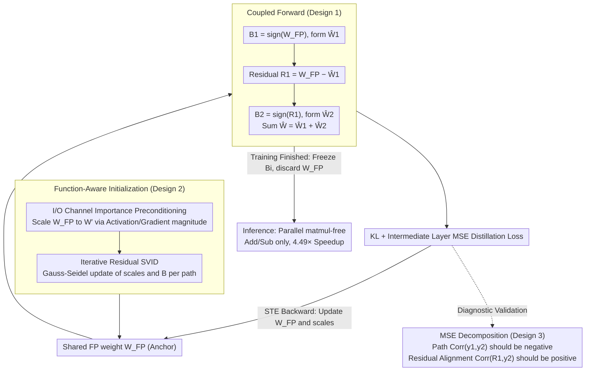

# RaBiT: Residual-Aware Binarization Training for Accurate and Efficient LLMs

**Conference**: ICML 2026  
**arXiv**: [2602.05367](https://arxiv.org/abs/2602.05367)  
**Code**: TBD  
**Area**: Model Compression / LLM Quantization / Binarization  
**Keywords**: Residual Binarization, Quantization-Aware Training, LLM, Path Co-adaptation, matmul-free Inference  

## TL;DR
This paper addresses a failure mode in residual binarized LLMs named "inter-path adaptation," where parallel binary paths learn redundant features. The authors propose RaBiT, which online derives all binary paths from a single shared full-precision weight combined with function-aware initialization. This structurally enforces a residual hierarchy, allowing 2-bit Llama2-7B to outperform strong VQ baselines in a matmul-free architecture for the first time (Wiki2 PPL 5.78 vs. QTIP 5.86) while achieving 4.49× inference acceleration.

## Background & Motivation

**Background**: When deploying LLMs at extreme compression ratios, 4-bit quantization (GPTQ, AWQ) has become the industry standard, but the frontier is moving toward 2-bit. Two main routes exist in the 2-bit regime: (i) Vector Quantization (VQ) (AQLM, QuIP#, QTIP), which preserves high accuracy through codebooks or complex rotations but incurs high hardware overhead; (ii) Residual Binarization, which stacks multiple $\{\pm1\}$ binary layers and inherently supports extremely efficient matmul-free (addition/subtraction only) execution. The core promise of residual binarization is that "subsequent paths compensate for the errors of preceding paths," thereby achieving multi-bit expressiveness at binary costs.

**Limitations of Prior Work**: Although the residual structure appears promising, it remains unstable during QAT. The authors' in-depth analysis reveals that standard QAT applies the same global gradient to all parallel paths simultaneously. This drives each path to learn nearly identical features while "racing to reduce the same global loss"—a specific manifestation of "feature co-adaptation" (Hinton 2012) in residual binarization, which the authors term "inter-path adaptation." Consequently, the error compensation hierarchy is destroyed, severely weakening model expressiveness.

**Key Challenge**: MSE decomposition indicates that paths must be negatively correlated and the second path must actively align with the residual of the first for the model to truly leverage multi-path capacity. However, the symmetric structure and shared gradients of standard QAT keep paths nearly independent (correlation near zero). Thus, stacking multiple paths merely increases parameters without providing error compensation. Previous works (DB-LLM, MBOK) relied on heuristic constraints (path freezing, mechanical splitting) to break this symmetry, but either sacrificed joint optimization space or failed to achieve proper residual alignment despite creating negative correlation.

**Goal**: (i) Provide formal diagnostic metrics for inter-path adaptation; (ii) embed the residual hierarchy into the training loop at the algorithmic level rather than through heuristics; (iii) resolve the high sensitivity of 2-bit QAT initialization to final accuracy.

**Key Insight**: Since the root problem is that "two paths maintain independent latent weights while sharing a global gradient," the solution is to retain only one full-precision weight $\mathbf{W}_{\mathrm{FP}}$ as an anchor. In each step, the first path and its residual are derived online from this anchor, and the second path is derived from the residual. This makes "the second path compensating for the first" a hard structural constraint on the computation graph rather than soft encouragement via loss.

**Core Idea**: Use a shared full-precision weight to derive all binary paths in sequence online (Coupled Forward) so the residual hierarchy is automatically reconstructed at each step. Additionally, provide stable initialization via Iterative Residual SVID + I/O channel importance preconditioning to "preserve function rather than weights."

## Method

### Overall Architecture
RaBiT aims to cure the training pathology of 2-bit residual binarization. Standard QAT assigns independent latent weights to each binary path and pushes them with the same global gradient, resulting in redundant paths. RaBiT retains only one shared full-precision weight $\mathbf{W}_{\mathrm{FP}}$ as an anchor. Each forward step derives the first path from it, then the second path from the resulting residual, making "compensation" a structural constraint. It also employs function-aware initialization to stabilize the QAT starting point. During inference, the trained binary matrices $\mathbf{B}_i$ are frozen and $\mathbf{W}_{\mathrm{FP}}$ is discarded, reverting to the original parallel, matmul-free architecture without increasing deployment overhead.

The basic binary block is written as $\hat{\mathbf{W}}=\mathbf{g}\odot\mathbf{B}\odot\mathbf{h}$, where $\mathbf{B}\in\{-1,+1\}^{d_{\text{out}}\times d_{\text{in}}}$, $\mathbf{g}\in\mathbb{R}^{d_{\text{out}}}$, and $\mathbf{h}\in\mathbb{R}^{d_{\text{in}}}$. The matrix-vector multiplication $\mathbf{y}=\mathbf{g}\odot(\mathbf{B}(\mathbf{h}\odot\mathbf{x}))$ is implemented using only additions and subtractions. For 2-bit, $k=2$ such binary blocks are summed.

### Key Designs

**1. Coupled Forward: Online derivation from shared FP weights to hardcode residual compensation into the computation graph**

The root of inter-path adaptation is that previous methods stored independent latent weights for both paths without structurally distinguishing between "primary" and "compensatory" paths. RaBiT stores only one $\mathbf{W}_{\mathrm{FP}}$ during training. Each step involves a three-step online derivation: first, $\mathbf{B}_1=\text{sign}(\mathbf{W}_{\mathrm{FP}})$ is used to form $\hat{\mathbf{W}}_1=\mathbf{g}_1\odot\mathbf{B}_1\odot\mathbf{h}_1$; second, the residual $\mathbf{R}_1=\mathbf{W}_{\mathrm{FP}}-\hat{\mathbf{W}}_1$ is calculated; finally, $\mathbf{B}_2=\text{sign}(\mathbf{R}_1)$ defines the effective weight $\hat{\mathbf{W}}^{(2)}=\hat{\mathbf{W}}_1+\hat{\mathbf{W}}_2$. Since the second path is a function of the first path's residual, $\mathbf{B}_2$ is structurally forced to track $\mathbf{R}_1$. The backward pass uses STE to pass $\nabla_{\hat{\mathbf{W}}^{(2)}}\mathcal{L}$ directly to $\mathbf{W}_{\mathrm{FP}}$. A byproduct is that maintaining only one set of FP weights halves the optimizer state memory.

**2. Function-Aware Initialization: Iterative Residual SVID + I/O Channel Importance Preconditioning**

2-bit QAT is extremely sensitive to the starting point. Standard SVID initialization is greedy—the first path monopolizes the fit, pushing the residual structure into poor local minima. RaBiT solves this in two steps. First, Preconditioning: use input activation magnitudes $\mathbf{s}_{\text{in}}$ and output gradient magnitudes $\mathbf{s}_{\text{out}}$ from a calibration set to scale weights to $\mathbf{W}'=\mathbf{s}_{\text{out}}^{\alpha_{\text{out}}}\odot\mathbf{W}_{\mathrm{FP}}\odot\mathbf{s}_{\text{in}}^{\alpha_{\text{in}}}$, focusing decomposition resources on functionally sensitive channels. Second, Iterative Residual SVID: refresh $(\mathbf{B}_i,\mathbf{g}_i,\mathbf{h}_i)$ path-by-path in a Gauss-Seidel style for $T$ rounds. This decouples greedy path alignment and accounts for channel importance.

**3. Inter-path Adaptation Diagnostic Metrics: Dual correlations via MSE decomposition**

RaBiT decomposes the MSE of a 2-bit residual network $y_s=y_1+y_2$ into: $\text{MSE}(y_t,y_s)=C'+2\sigma_1\sigma_2\cdot\text{Corr}(y_1,y_2)$, and an equivalent view $\text{MSE}\approx\sigma_{R_1}^2+\sigma_{y_2}^2-2\sigma_{R_1}\sigma_{y_2}\cdot\text{Corr}(R_1,y_2)$, where $R_1=y_t-y_1$. This provides two criteria: **Path Correlation** $\text{Corr}(y_1,y_2)$ should be negative, and **Residual Alignment** $\text{Corr}(R_1,y_2)$ should be positive. Standard QAT shows $\text{Corr}(y_1,y_2) \approx 0$ (no compensation), while RaBiT achieves high negative correlation (-0.35 to -0.50) and high residual alignment (0.58–0.65), proving the mechanism works.

### Loss & Training
Total loss: $\mathcal{L}_{\text{total}}=\mathcal{L}_{\text{kl}}+\gamma\sum_i\mathcal{L}_{\text{inter},i}$, combining KL divergence and intermediate layer MSE distillation. Training uses the Muon optimizer for 6 epochs on a 200M token calibration set (WikiText-2 + C4) with a 4096 context length.

## Key Experimental Results

### Main Results
Comparison with SOTA 2-bit methods on Llama and Gemma models.

| Model / Data | Metric | RaBiT (2-bit) | Prev. SOTA (2-bit) | Full Precision (16-bit) |
|--------|------|------|----------|------|
| Llama2-7B Wiki2 | PPL ↓ | **5.78** | QTIP 5.86 / DBF 6.10 / MBOK 6.99 | 5.12 |
| Llama2-7B QA Avg | Acc ↑ | **61.51** | QTIP 58.97 / DBF 58.42 | 62.26 |
| Llama2-13B Wiki2 | PPL ↓ | 5.15 | QTIP 5.11 | 4.57 |
| Llama3-8B Wiki2 | PPL ↓ | **7.34** | QTIP 7.52 / QuIP# 8.70 | 5.75 |
| Llama3-8B QA Avg | Acc ↑ | **64.13** | AQLM 64.12 / QTIP 63.88 | 68.66 |
| Gemma3-1B Wiki2 | PPL ↓ | **11.27** | QTIP 13.14 / DBF 13.28 | 9.80 |
| Llama2-13B Hard Tasks Avg | Acc ↑ | **27.14** | QTIP 25.38 | 29.27 |
| Llama2-7B End-to-end Speedup | Speedup ↑ | **4.49×** | — | 1.00× |

### Ablation Study

| Configuration | Llama2-7B Wiki2 PPL ↓ | Description |
|------|---------|------|
| Standard QAT (Indep. weights) | 6.55 | Baseline with heavy inter-path adaptation |
| Standard QAT + Iterative SVID Init | 6.21 | Gain from initialization alone |
| Standard QAT + I/O Preconditioning | 6.31 | Functional sensitivity alone |
| Coupled QAT (Only Coupled Forward) | 5.84 | Major gain from solving adaptation |
| **RaBiT (Full)** | **5.78** | Complete proposed solution |

### Key Findings
- **Coupled training is the primary contributor**: Moving from Standard QAT (6.55) to Coupled QAT (5.84) provides a 0.71 PPL improvement, indicating inter-path adaptation is the primary bottleneck.
- **Synergy between designs**: Coupling and function-aware initialization are complementary, optimizing the structure and the starting point respectively.
- **Outperforming VQ**: On Llama2-7B, RaBiT (5.78 PPL) slightly outperforms QTIP (5.86) while remaining matmul-free, achieving 4.49× speedup on RTX 4090.
- **Memory Efficiency**: Maintaining a single set of FP weights significantly reduces optimizer VRAM overhead during QAT.

## Highlights & Insights
- Upgrading "residual compensation" from a loss preference to a structural constraint is an elegant paradigm shift. This "chain derivation + shared anchor" approach is transferable to MoE routing or multi-branch distillation.
- The dual metrics (Path Correlation and Residual Alignment) are highly explanatory, revealing that "mechanical negative correlation" (as in DB-LLM) is not true compensation.
- Retaining scales $\{\mathbf{g}_i,\mathbf{h}_i\}$ as independent learnable parameters rather than recomputing SVD at each step is a clever trade-off between structural rigor and optimization flexibility.

## Limitations & Future Work
- Significant gaps remain on hard tasks (e.g., Llama3-8B 25.12 vs. 31.03), indicating 2-bit still struggles with complex reasoning.
- Instruction-following (IFEval) is a weak point, likely due to high sensitivity to quantization noise in formatting.
- As model size increases, VQ methods like QTIP still hold a slight edge in some metrics (e.g., Llama2-13B), which the current framework does not specifically address.
- Online derivation increases the computational cost per training step; the overhead compared to standard QAT in long schedules requires further engineering analysis.

## Related Work & Insights
- **vs. DB-LLM**: Moves beyond heuristic splitting to structural constraints that satisfy both negative correlation and residual alignment.
- **vs. MBOK**: Replaces path freezing (which limits optimization) with structural coupling that allows full joint optimization of all parameters.
- **vs. VQ (QTIP/AQLM)**: Challenges the industry assumption that 2-bit requires VQ by proving matmul-free residual binarization can achieve parity or better accuracy.

## Rating
- Novelty: ⭐⭐⭐⭐
- Experimental Thoroughness: ⭐⭐⭐⭐⭐
- Writing Quality: ⭐⭐⭐⭐⭐
- Value: ⭐⭐⭐⭐⭐

<!-- RELATED:START -->

## Related Papers

- [\[ICML 2026\] ReSpinQuant: Efficient Layer-Wise LLM Quantization via Subspace Residual Rotation Approximation](respinquant_efficient_layer-wise_llm_quantization_via_subspace_residual_rotation.md)
- [\[ICML 2026\] RQ-MoE: Residual Quantization via Mixture of Experts for Efficient Input-Dependent Vector Compression](rq-moe_residual_quantization_via_mixture_of_experts_for_efficient_input-dependen.md)
- [\[ICLR 2026\] Compute-Optimal Quantization-Aware Training](../../ICLR2026/model_compression/compute-optimal_quantization-aware_training.md)
- [\[ACL 2026\] CadLLM: Improving the Throughput of Diffusion-based LLMs via Training-Free Confidence-Aware Calibration](../../ACL2026/model_compression/improving_the_throughput_of_diffusion-based_large_language_models_via_a_training.md)
- [\[ICLR 2026\] What Layers When: Learning to Skip Compute in LLMs with Residual Gates](../../ICLR2026/model_compression/what_layers_when_learning_to_skip_compute_in_llms_with_residual_gates.md)

<!-- RELATED:END -->
