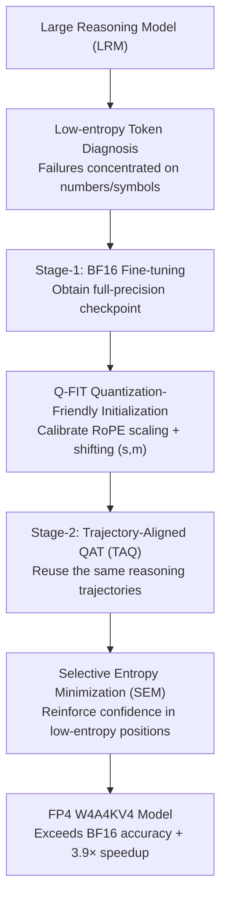

# ReQAT: Achieving Full-Precision Reasoning Accuracy with 4-bit Floating-Point Quantization-Aware Training

**Conference**: ICML2026  
**arXiv**: [2606.15682](https://arxiv.org/abs/2606.15682)  
**Code**: https://github.com/aiha-lab/ReQAT  
**Area**: Model Compression / Quantization  
**Keywords**: FP4 Quantization, Reasoning Models, QAT, KV cache, Low-entropy tokens

## TL;DR
This paper discovers that FP4 quantization failures in large reasoning models (LRMs) are concentrated on "low-entropy tokens" (deterministic symbolic commitments like numbers and operators). It proposes ReQAT—a three-component toolkit (Trajectory-Aligned QAT + Selective Entropy Minimization + Quantization-Friendly Initialization for KV cache) specifically targeting these tokens. Under full W4A4KV4 quantization, ReQAT not only matches but even **surpasses** BF16 fine-tuning accuracy while achieving up to 3.9× throughput speedup.

## Background & Motivation
**Background**: Large Reasoning Models (LRMs) rely on Chain-of-Thought (CoT) to solve math/logic problems. However, generating tens of thousands of tokens during inference requires repeated weight loading and causes KV cache to expand linearly, leading to extremely high deployment costs. The industry is shifting toward micro-scaling FP4 formats (MXFP4, NVFP4 using E2M1 layout). Blackwell B200's FP4 compute power is approximately 4× that of FP16 and natively supports W4A4KV4, where weights, activations, and KV cache are all compressed to 4-bit.

**Limitations of Prior Work**: Compressing LRMs to W4A4KV4 causes **severe accuracy degradation**. Standard PTQ performs poorly on distilled reasoning models. While QAT is considered a recovery method, it fails to close the gap with the BF16 baseline even with an increased fine-tuning token budget. Once the KV cache is quantized, channel-level outliers combined with the rotational structure of RoPE bring layer-by-layer distortion, which fixed smoothing/shifting strategies cannot adapt to due to fluctuating token statistics.

**Key Challenge**: Existing PTQ/QAT methods treat all tokens equally during optimization. However, reasoning failures are not uniformly distributed—they are highly concentrated on a few critical tokens. The gradient in general QAT is diluted by a massive number of ordinary tokens, failing to treat the actual "pathogen."

**Goal**: To restore reasoning accuracy of FP4 (especially the aggressive W4A4KV4) to or even beyond that of BF16 full-precision fine-tuning under the same training budget, while enjoying FP4 throughput benefits.

**Key Insight**: The authors first perform a diagnosis by analyzing the impact of quantization noise grouped by token entropy. Low-entropy tokens are mostly numbers and symbolic operators (where the model is highly confident), while high-entropy tokens are conjunctions/transition words (where the model is inherently uncertain).

**Core Idea**: The root cause of FP4 failure is the **amplification of sampling errors in low-entropy tokens**: quantization lowers the probability of the top-1 token that should have been sampled and raises the probability of other tokens (the top-1 rank remains unchanged, but the tail mass increases). This leads to occasional symbolic errors (wrong digit/operator) cascading into a total collapse of the reasoning chain. The strategy is to concentrate training focus on low-entropy tokens.

## Method

### Overall Architecture
ReQAT is an FP4 training framework involving "diagnosis first, then a three-component targeted treatment." The diagnosis phase proves that quantization failure is dominated by sampling errors of low-entropy tokens (injecting logit noise into low-entropy tokens causes significant accuracy drops, whereas noise in high-entropy tokens has almost no impact). Based on this, the pipeline is: Stage-1 BF16 fine-tuning to obtain a full-precision checkpoint, followed by Q-FIT to calibrate RoPE-related KV cache quantization transformation parameters $(s, m)$ for initialization, and finally Stage-2 QAT with SEM loss on a subset of the **exact same reasoning trajectories** used in Stage-1 to obtain the FP4 model.

### Key Designs

**1. Low-entropy Token Diagnosis: Pinpointing FP4 failures to "Symbolic Commitments"**

This is the foundational observation. In LRMs, approximately 80% are low-entropy tokens (confident numbers, operators), and about 20% are high-entropy tokens (discourse markers, conjunctions). The paper uses two experiments to prove the "pathogen" lies at the low-entropy end: ① **Entropy-aware hybrid precision decoding**—routing predictions to BF16 or FP4 per token based on entropy. Entrusting low-entropy predictions to BF16 restores most of the lost accuracy, while doing so for high-entropy tokens is useless. ② **Logit noise injection**—adding multiplicative Gaussian noise $\sigma Z\odot\eta$ ($\eta\sim\mathcal{N}(0,I)$) to logits. Perturbing only the 25% lowest entropy tokens leads to a massive drop in AIME accuracy, while perturbing the 25% highest has minimal impact. Mechanistically, the paper defines **tail mass** $M=1-P(x_{\text{top1}})$ and **tail mass ratio** $\rho=(M_{\text{FP4}}+\epsilon)/(M_{\text{BF16}}+\epsilon)$: low-entropy tokens have near-zero top-1 mismatch rates (ranks don't flip), but $\rho$ is significantly $>1$—meaning that while the argmax remains unchanged, the probability of sampling non-top-1 tokens is elevated by quantization, leading to cascading reasoning failures.

**2. TAQ Trajectory-Aligned QAT: Repeatedly hitting the same low-entropy decisions**

Standard QAT starts training directly from a base model, where gradients primarily modify high-entropy bins while low-entropy bins remain static—missing the "pathogen." TAQ adopts a two-stage approach: Stage-1 performs BF16 fine-tuning on dataset $\mathcal{D}_{\text{FT}}$, and Stage-2 QAT is performed on a **subset** $\mathcal{D}_{\text{TAQ}}\subseteq\mathcal{D}_{\text{FT}}$ using **identical reasoning trajectories**. This forces quantization-aware updates to act repeatedly on the same set of low-entropy token decisions. The "entropy change" metric verifies this: standard FT or QAT only changes high-entropy bins, while FT+QAT causes entropy changes in low-entropy bins as Stage-2 progresses. Crucially, this effect **only appears with trajectory alignment**; it disappears if Stage-2 uses different trajectories, proving that "reusing trajectories" is the key mechanism rather than simply more training. Practically, a 70M token budget for $\mathcal{D}_{\text{TAQ}}$ is sufficient to match BF16 fine-tuning.

**3. SEM Selective Entropy Minimization: Reinforcing confidence solely at low-entropy positions**

Simply targeting training on low-entropy tokens is insufficient; confidence at these positions must be actively "sharpened" to suppress the tail mass elevated by quantization. SEM adds a **selective** entropy minimization term to the standard SFT loss:

$$\mathcal{L}_{\text{SEM}}=\mathcal{L}_{\text{SFT}}+\lambda\cdot\frac{1}{T}\sum_{t=1}^{T}w_t H_t$$

Where $H_t$ is the prediction entropy at step $t$, $\lambda$ controls sharpening intensity, and $w_t$ determines the location of application. Crucially, $w_t$ uses **soft weighting** rather than a hard binary mask (to avoid over-penalizing tokens near the threshold):

$$w_t=\max\!\left(0,\ 1-\frac{H_t-H_{\min}}{\tau-H_{\min}+\epsilon}\right)$$

$H_{\min}$ is the minimum entropy within a minibatch, and $\tau$ is set to the 75th percentile of minibatch entropy. Tokens that are already near-certain (e.g., the digit "4") receive a larger $w_t$ and are sharpened more strongly. Unlike previous "globally uniform" entropy regularization, SEM is **selectively applied at the token level** based on entropy; ablations show soft weighting is more effective than hard masking.

**4. Q-FIT Quantization-Friendly Initialization: Jointly calibrating RoPE scaling and shifting for KV cache**

W4A4KV4 introduces the hurdle of KV cache quantization: RoPE paired channels may have **asymmetric outliers** (which a single shared scale cannot handle), and post-RoPE key magnitudes fluctuate with tokens (making fixed shifts sub-optimal for long sequences). Prior methods either only scale or only shift. Q-FIT **jointly** calibrates pre-RoPE channel scaling and post-RoPE channel shifting before Stage-2 QAT:

$$\tilde{Q}=\mathcal{R}(Q^{\text{pre}}\odot s),\qquad \tilde{K}=\mathcal{R}(K^{\text{pre}}\oslash s)-m$$

Scaling vector $s$ is folded into projection weights with zero inference overhead, and shifting vector $m$ is fixed after calibration and subtracted during inference. Both are parameterized by scalars $(\alpha_s,\alpha_m)\in[0,1]$: $s=s_0^{\alpha_s}$ ($\alpha_s=0$ turns off scaling), and $m$ is initialized as the channel mean of post-RoPE keys on the calibration set multiplied by $\alpha_m$. Parameters $(\alpha_s,\alpha_m)$ are selected by minimizing the distance between BF16 and KV4 attention outputs. This allows Q-FIT to be **layer-wise adaptive**: it disables scaling and uses shifting when channels are asymmetric but token variation is small, and disables shifting in favor of paired scaling when magnitudes fluctuate strongly. MXFP4 configurations add block-wise rotations (treated as a special case of Q-FIT), while NVFP4 does not require them; KV cache uses E1M2 FP4 format (resulting in lower training loss).

### Loss & Training
The foundation is the token-level negative log-likelihood $\mathcal{L}_{\text{SFT}}=-\mathbb{E}_{(X,Y)}[\frac{1}{T}\sum_t \log P_\theta(y_t\mid y_{<t},X)]$, with the selective entropy term superimposed via SEM. The total fine-tuning budget is split between BF16 FT and a fixed 70M-token Stage-2 QAT, with budgets aligned across methods for fair comparison. ReQAT has three variants: T (TAQ only), TQ (TAQ+Q-FIT), TQS (full set with SEM, referred to as TQS by default).

## Key Experimental Results

### Main Results: AIME Accuracy on R1-Qwen-14B (BF16 Baseline 56.83)
ReQAT pushes accuracy beyond BF16 full-precision fine-tuning (best FT approx 65.46) across all three FP4 deployment settings, especially in the most challenging W4A4KV4.

| Setting | Method | AIME (Best Budget) | Description |
|------|------|-----------------|------|
| — | BF16 Baseline | 56.83 | Full-precision unfinetuned |
| — | BF16 Full FT | 65.46 | Full-precision finetuned upper bound |
| MXFP4 W4A16 | Direct PTQ | 50.37 | Direct quantization causes drop |
| MXFP4 W4A16 | QAT | 62.29 | Still below BF16 FT |
| MXFP4 W4A16 | ReQAT-TQS | **68.02** | Exceeds BF16 FT |
| MXFP4 W4A4 | QAT | 58.03 | — |
| MXFP4 W4A4 | ReQAT-TQS | **65.94** | Exceeds BF16 FT |
| NVFP4 W4A4KV4 | Direct PTQ | 50.13 | High-impact full quantization zone |
| NVFP4 W4A4KV4 | QAT | 58.86 | Cannot close the gap |
| NVFP4 W4A4KV4 | ReQAT-TQS | **65.63** | Matches and exceeds BF16 FT |

### Ablation Study: Contribution of Components (NVFP4 W4A4KV4, R1-Qwen-14B)

| Configuration | AIME (Representative Budget) | Description |
|------|-----------------|------|
| ReQAT-T (TAQ only) | 60~63 | Trajectory alignment significantly beats standard QAT |
| ReQAT-TQ (+Q-FIT) | 63~66 | Q-FIT recovers major drops from KV cache quantization |
| ReQAT-TQS (+SEM) | 64~66 | SEM adds approx +1.3% confidence reinforcement |
| Hard mask instead of soft weight | Lower | Soft weighting is superior (Table 12) |
| Different trajectory for Stage-2 | Entropy change disappears | Proves "trajectory alignment" is key to TAQ |

### Key Findings
- **Pathogen localization is the primary contribution**: Routing low-entropy predictions to BF16 restores almost all accuracy, while perturbing them causes massive drops—proving FP4 failures are dominated by low-entropy sampling errors rather than high-entropy flips.
- **TAQ's success depends on "Trajectory Alignment" not just more training**: Using different trajectories for Stage-2 causes the entropy change in low-entropy bins to disappear, proving the necessity of reusing the same trajectories.
- **Q-FIT is critical for W4A4KV4**: TAQ alone is sufficient for W4A4, but accuracy plunges with KV cache quantization. Q-FIT saves this through layer-wise adaptive joint scaling and shifting.
- **Real-world hardware gains**: Achieving 3.1× end-to-end throughput speedup on B200 and 3.9× on DGX Spark (measured using TensorRT-LLM), rather than just theoretical speedup.

## Highlights & Insights
- **Specification of "Not all tokens are equally important"**: Attributing reasoning failure to low-entropy symbolic commitments and using quantifiable metrics like tail mass ratio $\rho$ to describe "top-1 rank static but sampling noise increases" provides a clean, reproducible diagnostic perspective.
- **The elegance of Trajectory Alignment**: It requires no change to loss or data, simply reusing Stage-1 trajectories to direct gradients to low-entropy bins. The causal proof (failure when switching trajectories) is compelling.
- **SEM's soft-weighting design**: Using minibatch entropy percentiles for a soft threshold avoids jitter at the boundary, a design potentially transferable to other token-selective regularization scenarios.
- **Q-FIT consolidates scaling and shifting**: It treats two types of KV cache outliers (paired asymmetry vs. token fluctuation) with a single pair of $(\alpha_s, \alpha_m)$ parameters for layer-wise adaptation, which is engineeringly elegant.

## Limitations & Future Work
- **Dependency on Two-Stage + Same Trajectory**: Requires Stage-1 BF16 fine-tuning trajectories, creating a higher barrier for scenarios without existing fine-tuning data or compute.
- **Empirical Thresholds in Diagnosis**: The 25% entropy binning and $\tau$ at the 75th percentile are empirical; their optimality across various models/tasks hasn't been fully explored.
- **Evaluation concentrated on Math Reasoning**: AIME/MATH/GSM8K are all math-centric. Whether the "low-entropy token = digit/operator" conclusion holds for code, logic, or multimodal reasoning requires verification.
- **Inconsistency between MXFP4 and NVFP4**: MXFP4 requires extra block-wise rotation and E1M2 for KV, suggesting the method still possesses some format-specific customization.

## Related Work & Insights
- **vs. Standard QAT/QAD**: These methods optimize all tokens uniformly and fail to match BF16 even with increased budgets. ReQAT concentrates effort on low-entropy tokens to surpass the baseline with a smaller budget.
- **vs. KV Cache Transformation Methods (e.g., pre-RoPE scaling / post-RoPE shifting)**: Prior methods use single fixed transformations difficulty adapting to layer-wise statistics; Q-FIT jointly applies both and adapts per layer.
- **vs. Entropy Regularization**: While previous methods apply regularization uniformly, SEM applies it selectively based on token entropy, sharpening only positions that should be deterministic.

## Rating
- Novelty: ⭐⭐⭐⭐⭐ The insight "FP4 failure is concentrated on low-entropy tokens" is novel and rigorously verified; the three components are logically derived from it.
- Experimental Thoroughness: ⭐⭐⭐⭐⭐ Multiple models, settings, benchmarks, plus real Blackwell hardware throughput testing and thorough ablations.
- Writing Quality: ⭐⭐⭐⭐ Logical flow from diagnosis to method to experiments; formulas are clear, though variant names require a lookup table.
- Value: ⭐⭐⭐⭐⭐ Directly useful for large-scale LRM deployment by enabling W4A4KV4 "accuracy parity with speedup."

<!-- RELATED:START -->

## Related Papers

- [\[ICML 2026\] TWLA: Achieving Ternary Weights and Low-Bit Activations for LLMs via Post-Training Quantization](twla_achieving_ternary_weights_and_low-bit_activations_for_llms_via_post-trainin.md)
- [\[NeurIPS 2025\] FALQON: Accelerating LoRA Fine-tuning with Low-Bit Floating-Point Arithmetic](../../NeurIPS2025/model_compression/falqon_accelerating_lora_fine-tuning_with_low-bit_floating-point_arithmetic.md)
- [\[ICLR 2026\] Achieving low-bit Muon through subspace preservation and grid quantization](../../ICLR2026/model_compression/achieving_low-bit_muon_through_subspace_preservation_and_grid_quantization.md)
- [\[ICLR 2026\] Compute-Optimal Quantization-Aware Training](../../ICLR2026/model_compression/compute-optimal_quantization-aware_training.md)
- [\[ICML 2026\] WinQ: Accelerating Quantization-Aware Training of Language Models Around Saddle Points](winq_accelerating_quantization-aware_training_of_language_models_around_saddle_p.md)

<!-- RELATED:END -->
