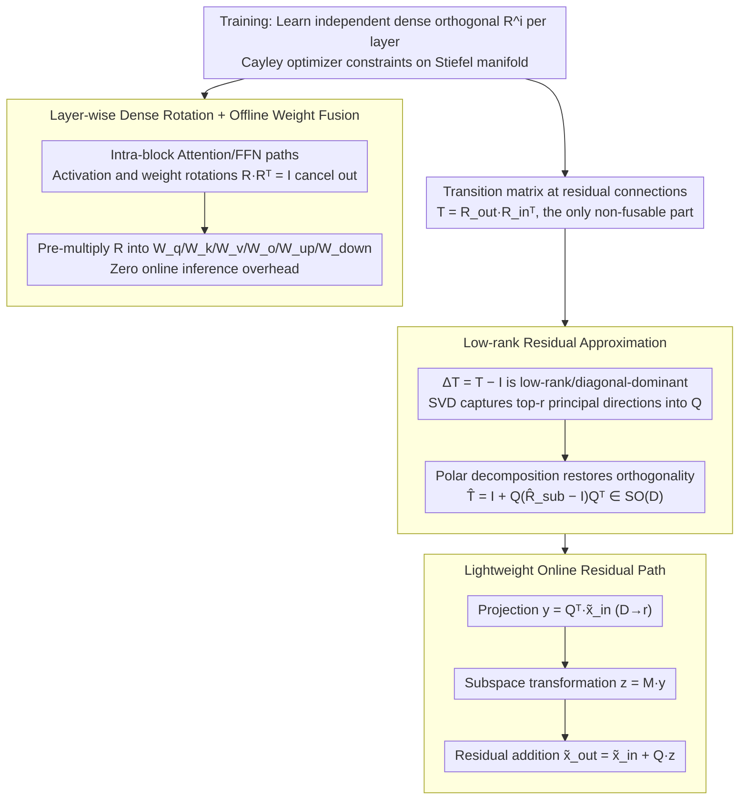

# ReSpinQuant: Efficient Layer-Wise LLM Quantization via Subspace Residual Rotation Approximation

**Conference**: ICML 2026  
**arXiv**: [2604.11080](https://arxiv.org/abs/2604.11080)  
**Code**: TBD  
**Area**: Model Compression  
**Keywords**: LLM Quantization, Rotation-based Quantization, Inter-layer Rotation, Subspace Approximation, Residual Alignment  

## TL;DR
ReSpinQuant preserves the dual advantages of low-bit LLM PTQ: "global rotations fused with weights" and "layer-wise rotations adaptable to outliers." It replaces the non-fusable rotation transition matrix $\mathbf{T}=\mathbf{R}_{out}\mathbf{R}_{in}^{\top}$ at residual connections with a subspace orthogonal approximation of rank $r\!\approx\!32$. This increases online overhead by only $\sim0.2\%$, while outperforming SpinQuant and FlatQuant on W4A4/W3A3 tasks.

## Background & Motivation

**Background**: The mainstream path for low-bit PTQ in LLMs has evolved from weight-only quantization (GPTQ, AWQ) to weight-activation quantization (W4A4/W3A3). Orthogonal rotation-based methods are critical for addressing activation outliers. QuaRot uses random Hadamard matrices to distribute outlier energy across dimensions, while SpinQuant treats rotation matrices as learnable parameters constrained on the Stiefel manifold using the Cayley optimizer.

**Limitations of Prior Work**: Existing rotation strategies are split into two camps. **Global Rotation** uses a shared $\mathbf{R}$ for the entire model, allowing $\mathbf{X}\mathbf{R}$ to be pre-fused into the weights $\mathbf{W}\mathbf{R}$ for zero inference overhead, but it fails to adapt to the heterogeneous outlier distributions of different layers. **Layer-wise Rotation** (FlatQuant, OSTQuant, ButterflyQuant, ParoQuant) assigns independent $\mathbf{R}^i$ matrices to each layer for higher precision. However, inconsistent bases between adjacent layers prevent activation rotation fusion, necessitating online computation. To reduce overhead, these methods use structured matrices (Scaling, Butterfly, Kronecker) which restrict expressivity.

**Key Challenge**: In residual connections, $\tilde{x}_{out}=\mathbf{R}_{out}\mathbf{R}_{in}^{\top}\tilde{x}_{in}+\mathbf{R}_{out}\,\text{Block}(\mathbf{R}_{in}^{\top}\tilde{x}_{in})$, the transition matrix $\mathbf{T}=\mathbf{R}_{out}\mathbf{R}_{in}^{\top}$ only reduces to an identity matrix and disappears if $\mathbf{R}_{in}=\mathbf{R}_{out}$. This is the fundamental trade-off between expressivity and online overhead.

**Goal**: (1) Retain dense, layer-wise independent rotation matrices for maximum expressivity; (2) Fuse all rotations within Attention/FFN blocks into weights offline; (3) Pay only a negligible online cost for basis transitions at residual connections.

**Key Insight**: The authors observe that rotation matrices $\mathbf{R}$ trained from Hadamard initialization using the Cayley optimizer remain very close to their initial values—the Frobenius norm shift is small, and the cosine similarity to the initial value remains near 1. This implies $\mathbf{T}=\mathbf{R}_{out}\mathbf{R}_{in}^{\top}\approx \mathbf{H}\mathbf{H}^{\top}=\mathbf{I}$, meaning $\Delta\mathbf{T}=\mathbf{T}-\mathbf{I}$ is a low-rank, diagonal-dominant "small perturbation."

**Core Idea**: Since the main energy of $\Delta\mathbf{T}$ is concentrated in a tiny subspace, a dense orthogonal rotation correction is performed within this subspace, while the orthogonal complement undergoes identity mapping. This compresses the $\mathcal{O}(D^2)$ dense alignment into an $\mathcal{O}(rD)$ low-rank alignment.

## Method

### Overall Architecture
ReSpinQuant seeks the expressivity of layer-wise dense rotations without inference-time costs. It learns independent $D\times D$ orthogonal matrices for each Transformer layer, expanding the parameter space to $\mathcal{O}(L\cdot D^2)$ during training to fit outliers. During inference, intra-block rotations are fused into weights, leaving only a low-rank online module for inter-layer residuals, reducing online parameters to $\mathcal{O}(L\cdot rD)$.

### Key Designs

**1. Layer-wise Dense Rotation + Offline Weight Fusion**
The accuracy of layer-wise schemes stems from layer-independent bases. Previously, dense $\mathbf{R}^i\in\mathbb{R}^{D\times D}$ matrices required online computation, forcing methods like FlatQuant to use structured matrices. ReSpinQuant employs 4 dense rotations per layer ($\mathbf{R}_1^i$ to $\mathbf{R}_4^i$) to align MHSA and FFN activations. By pre-multiplying $\mathbf{R}$ coefficients into weight matrices (e.g., $\tilde{\mathbf{W}}_v=\mathbf{R}_1^{i\top}\mathbf{W}_v\mathbf{R}_3$), the rotations mathematically cancel out. Consequently, training parameters reach $1091.0\text{M}$ (63× SpinQuant), but online parameters drop to $8.4\text{M}$.

**2. Low-rank Residual Approximation**
The transition matrix $\mathbf{T}=\mathbf{R}_{out}\mathbf{R}_{in}^{\top}$ at residual connections remains non-fusable. The authors observe that $\mathbf{T}$ is nearly identity, with the perturbation $\Delta\mathbf{T}=\mathbf{T}-\mathbf{I}$ concentrated on few principal directions. SVD is performed on $\Delta\mathbf{T}$ to obtain $\mathbf{Q}\in\mathbb{R}^{D\times r}$. To maintain the error bounds of rotation methods, the subspace transformation $\mathbf{T}_{\text{sub}}=\mathbf{Q}^{\top}\mathbf{T}\mathbf{Q}$ is restored to orthogonality via Polar Decomposition $\hat{\mathbf{R}}_{\text{sub}}=\mathbf{U}_{sub}\mathbf{V}_{sub}^{\top}$. The final $\hat{\mathbf{T}}=\mathbf{I}+\mathbf{Q}(\hat{\mathbf{R}}_{\text{sub}}-\mathbf{I}_r)\mathbf{Q}^{\top}$ remains in $SO(D)$, reducing complexity from $\mathcal{O}(D^2)$ to $\mathcal{O}(rD)$.

**3. Lightweight Online Residual Path**
To ensure efficiency, ReSpinQuant avoids explicit construction of $\hat{\mathbf{T}}$. Instead, it uses a three-step pipeline: project to $r$ dimensions $y=\mathbf{Q}^{\top}\tilde{x}_{in}$, apply subspace transformation $z=\mathbf{M}y$ (where $\mathbf{M}=\hat{\mathbf{R}}_{\text{sub}}-\mathbf{I}_r$), and perform residual addition $\tilde{x}_{out}=\tilde{x}_{in}+\mathbf{Q}z$. All non-trivial operations occur in the $r$-dimensional subspace, eliminating $D\times D$ matrix multiplications.

### Loss & Training
Rotation matrices are strictly constrained by the Cayley optimizer on the Stiefel manifold. The objective is to minimize $\|\mathbf{Y}-Q(\tilde{\mathbf{X}})Q(\tilde{\mathbf{W}})^{\top}\|_F^2$. Using 800 segments from WikiText-2, the loss utilizes standard cross-entropy without extra terms (consistent with SpinQuant). After rotation optimization, GPTQ is used for weight quantization with fixed clipping. The default rank $r=32$ is chosen based on a Pareto analysis of PPL. Calibration of LLaMA-3 8B takes approximately 42 minutes on a single H100.

## Key Experimental Results

### Main Results
Evaluated on LLaMA-2, LLaMA-3, and LLaMA-3.2 for W4A4 and W3A3 quantization.

| Model / Setting | Metric | RTN | QuaRot | SpinQuant | FlatQuant | ReSpinQuant |
|-------------|------|-----|--------|-----------|-----------|-------------|
| LLaMA-3 8B / W4A4 | PPL ↓ | 219.82 | 7.82 | 7.50 | 7.73 | **7.24** |
| LLaMA-3 8B / W4A4 | 0-shot Avg ↑ | 36.74 | 62.90 | 64.53 | 62.72 | **64.65** |
| LLaMA-3 8B / W3A3 | PPL ↓ | 77055 | 98.04 | 15.07 | 133.52 | **13.09** |
| LLaMA-3.2 1B / W3A3 | PPL ↓ | 115358 | 812.46 | 69.70 | 543.66 | **49.90** |
| LLaMA-3.2 3B / W4A4 | PPL ↓ (FP16=7.81) | 266.80 | 9.99 | 9.46 | 9.57 | **9.06** |

### Ablation Study (LLaMA-3 8B, W3A3, varying rank $r$)

| Config | PPL ↓ | 0-shot Avg ↑ | Description |
|------|-------|--------------|------|
| $r=0$ | 20.03 | 46.94 | Identity mapping for residuals |
| $r=8$ | 14.20 | 49.77 | Significant recovery with 8 directions |
| $r=32$ (Default) | 13.09 | 50.74 | Online MACs: 32.3M (0.2% of total) |
| $r=128$ | 12.80 | 50.80 | Diminishing returns |
| $r=4096$ (Full) | 12.52 | 51.22 | Upper bound reference |

### Key Findings
- **Information Concentration**: Moving from $r=0$ to $r=8$ reduces PPL by $30\%$, while increasing $r=32$ to $4096$ only shifts PPL by $0.57$. This confirms that basis mismatch is low-rank.
- **Efficiency**: LLaMA-3 8B calibration takes 42 minutes on an H100. While the training parameter space is $63\times$ larger, it significantly improves accuracy at a manageable cost.
- **Latency**: TTIT for LLaMA-3 8B (batch=16) on H100 increases from $160.95$ ms (SpinQuant) to $163.81$ ms ($+1.7\%$), proving negligible overhead.
- **Quantized vs. Full Precision**: ReSpinQuant W4A4 LLaMA-3.2 3B achieves 9.06 PPL, outperforming FP16 LLaMA-3.2 1B (9.76 PPL) with lower memory footprint.

## Highlights & Insights
- **"Train-Large, Infer-Small" Paradigm**: This design allocates $\mathcal{O}(L\cdot D^2)$ parameters during training while compressing online costs to $0.2\%$. This approach is applicable to other scenarios where training is flexible but inference is resource-constrained.
- **Polar Decomposition Utility**: Direct SVD truncations violate orthogonality. Combining SVD with Polar Decomposition ($\mathbf{U}\mathbf{V}^{\top}$) ensures the subspace transform remains strictly orthogonal, preserving quantization error bounds.
- **Logical Coherence**: Starting from the observation that $\mathbf{R}$ stays near its initialization, the paper logically derives that $\Delta\mathbf{T}$ is low-rank.
- **Decoupling of Design Degrees**: Decoupling training parameters from online parameters provides a new dimension for architecting quantization methods.

## Limitations & Future Work
- The current method optimizes structure but does not integrate advanced training objectives like KL divergence or layer-wise losses used in OSTQuant.
- Experiments are capped at 13B models; whether $\mathbf{R}$ continues to cluster near Hadamard for 70B+ models is unverified.
- Lack of specialized low-bit hardware kernels. While TTIT is competitive, end-to-end throughput might vary with optimized W4A4/W3A3 operators.
- The rank $r$ is currently fixed; adaptive rank selection for different architectures (MoE, Mistral) remains for future work.

## Related Work & Insights
- **vs SpinQuant**: Both use Cayley optimizers, but SpinQuant uses a global $\mathbf{R}$. ReSpinQuant adopts layer-wise dense rotations and restores fusability via subspace approximation.
- **vs FlatQuant**: FlatQuant uses Kronecker products for efficiency ($198.1\text{M}$ online MACs). ReSpinQuant shifts the complexity to offline by using dense rotations that are then fuzed.
- **vs OSTQuant**: OSTQuant restricts layer-wise components to diagonal scaling ($\mathcal{O}(D)$), whereas ReSpinQuant uses full dense rotations for superior expressivity.
- **vs QuaRot**: ReSpinQuant starts from the random Hadamard initialization of QuaRot but transitions into a learnable framework, significantly boosting accuracy.

<!-- RELATED:START -->

## Related Papers

- [\[ICLR 2026\] ParoQuant: Pairwise Rotation Quantization for Efficient Reasoning LLM Inference](../../ICLR2026/model_compression/paroquant_pairwise_rotation_quantization_for_efficient_reasoning_llm_inference.md)
- [\[ACL 2026\] Adaptive Layer Selection for Layer-Wise Token Pruning in LLM Inference](../../ACL2026/model_compression/adaptive_layer_selection_for_layer-wise_token_pruning_in_llm_inference.md)
- [\[ICML 2026\] RQ-MoE: Residual Quantization via Mixture of Experts for Efficient Input-Dependent Vector Compression](rq-moe_residual_quantization_via_mixture_of_experts_for_efficient_input-dependen.md)
- [\[ICLR 2026\] Rethinking Residual Errors in Compensation-based LLM Quantization](../../ICLR2026/model_compression/rethinking_residual_errors_in_compensation-based_llm_quantization.md)
- [\[ICML 2026\] RaBiT: Residual-Aware Binarization Training for Accurate and Efficient LLMs](rabit_residual-aware_binarization_training_for_accurate_and_efficient_llms.md)

<!-- RELATED:END -->
