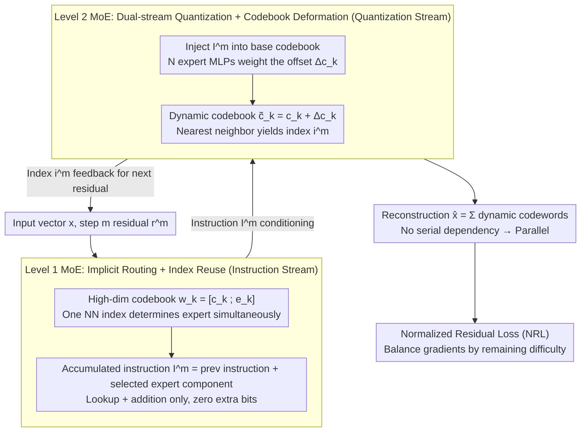

# RQ-MoE: Residual Quantization via Mixture of Experts for Efficient Input-Dependent Vector Compression

**Conference**: ICML 2026  
**arXiv**: [2605.14359](https://arxiv.org/abs/2605.14359)  
**Code**: [KDEGroup/RQ-MoE](https://github.com/KDEGroup/RQ-MoE)  
**Area**: Model Compression / Vector Quantization  
**Keywords**: Residual Quantization, MoE, Input-dependent Codebook, Parallel Decoding, Normalized Residual Loss

## TL;DR
RQ-MoE employs a "two-level MoE + dual-stream quantization" design to enable dynamic codebook generation for Residual Quantization (RQ). By decoupling the instruction stream from the reconstruction stream, it achieves a 6–14× decoding speedup while matching or exceeding QINCo in MSE/Recall across four retrieval benchmarks.

## Background & Motivation
**Background**: Vector Quantization (VQ) achieves compression by mapping high-dimensional vectors to "codebook centers." Multi-Codebook Quantization (MCQ) further reduces errors using multiple small codebooks, where the "progressive approximation" strategy of Residual Quantization (RQ) is widely used for tokenization in recommendation systems, speech codecs, and generative RecSys. Recently, QINCo upgraded RQ to "dynamic codebooks" — using an MLP to dynamically generate the next-step codebook based on the previously reconstructed part, significantly improving reconstruction quality.

**Limitations of Prior Work**: (i) Traditional RQ uses static codebooks, applying a "one-size-fits-all" approach to the local manifold geometry of different regions, which limits expressiveness. (ii) QINCo introduces strict serial dependencies — the codebook for step $m$ requires the reconstruction from steps $1 \dots m-1$, preventing parallel decoding and causing high deployment latency. (iii) Applying MoE via "explicit gating" wastes bit budget (4 experts require 2 extra bits, a 25% overhead for a 256-entry codebook).

**Key Challenge**: There is a natural conflict between dynamic codebooks (for quality) and parallel decoding (for speed). If codebooks depend on prior reconstructions, they must be serial; if they are parallel, they lose input-adaptivity.

**Goal**: To fully parallelize decoding and maintain or exceed the reconstruction and retrieval accuracy of QINCo without adding extra bits or losing input-adaptivity.

**Key Insight**: The authors re-examine RQ as a degenerate MoE (Nearest Neighbor search = top-1 implicit routing). By binding "expert information" and "quantization components" of each codeword under the same index, routing becomes free. Simultaneously, by stripping "instruction propagation" away from the "reconstruction path," parallelism is achieved.

**Core Idea**: A high-dimensional codebook $\mathbf{w}_k^m=[\mathbf{c}_k^m;\mathbf{e}_k^m]$ is used to bind quantization components and expert components to the same index (first-level MoE implicit routing). The instruction accumulation stream is decoupled from the codebook generation stream (second-level MoE deforms the base codebook according to accumulated instructions), supporting fully parallel decoding.

## Method

### Overall Architecture
RQ-MoE follows the "progressive residual refinement" skeleton of RQ with $M$ quantization steps, selecting an index $i^m$ at each step. However, it maintains two parallel streams:

- **Instruction Stream**: Stores accumulated expert information $\mathbf{I}^m \in \mathbb{R}^{D_e}$ with a minimal update rule: $\mathbf{I}^m = \mathbf{I}^{m-1} + \mathbf{e}_{i^{m-1}}^{m-1}$, with initial $\mathbf{I}^1 = \mathbf{0}$.
- **Quantization Stream**: At step $m$, the static base codebook $\mathcal{C}^m$ is deformed into a dynamic codebook $\tilde{\mathcal{C}}^m = \{\tilde{\mathbf{c}}_k^m\}$ via a second-level MoE function $f_t$ conditioned on $\mathbf{I}^m$. Nearest neighbor search is then performed: $i^m = \arg\min_k \|\mathbf{r}^m - \tilde{\mathbf{c}}_k^m\|_2^2$.

Final reconstruction is $\hat{\mathbf{x}} = \sum_{m=1}^M \tilde{\mathbf{c}}_{i^m}^m$, consistent with the summation form of standard RQ. This means that once index sequences are obtained during decoding, all $\mathbf{I}^m$ can be computed via "index lookup + addition" in parallel, and all $\tilde{\mathcal{C}}^m$ can be generated in parallel, completely removing serial dependencies from the decoding path.

### Key Designs

**1. Level 1 MoE with Implicit Routing + Index Reuse: Zero-bit routing via dual-use indices**

Naive MoE integration into RQ wastes bits on gating — each expert requires an additional $\log_2 N$ bits. The authors' breakthrough is to "weld" expert selection into the existing quantization indices. Each codeword is expanded from $D$ dimensions to $(D+D_e)$ dimensions as $\mathbf{w}_k^m=[\mathbf{c}_k^m;\mathbf{e}_k^m]$, where the first $D$ dimensions $\mathbf{c}_k^m$ constitute the base codebook for residual matching, and the latter $D_e$ dimensions $\mathbf{e}_k^m$ represent the expert component encoding local manifold features. Nearest neighbor search (Eq. 1) only calculates distances on the first $D$ dimensions, but once index $i^m$ is selected, the expert signal $\mathbf{e}_{i^m}^m$ is determined simultaneously and added to $\mathbf{I}^{m+1}$. Thus, routing info "piggybacks" on the index without consuming new bits, preserving the simplicity of the RQ storage format.

**2. Level 2 MoE with Dual-stream Quantization + Codebook Deformation: Parallel decoding via decoupling**

QINCo is slow because the step $m$ codebook must wait for the step $m-1$ reconstruction. RQ-MoE breaks this by splitting "conditional information" and the "reconstruction path" into two independent streams. The instruction stream only performs lookup and addition: $\mathbf{I}^m = \mathbf{I}^{m-1} + \mathbf{e}_{i^{m-1}}^{m-1}$, relying only on indices and expert components without touching reconstruction vectors. The quantization stream then uses $\mathbf{I}^m$ to deform the base codebook via the second-level MoE. Specifically, for each candidate $k$, $\mathbf{z}_k^m = \text{Linear}([\mathbf{c}_k^m; \mathbf{I}^m])$ injects accumulated instructions into the base codeword. Then, $N$ expert MLPs calculate $\mathcal{E}_n(\mathbf{z}_k^m)$ in parallel, and a gating $\boldsymbol{\alpha}_k^m = \text{softmax}(\text{Linear}(\mathbf{z}_k^m))$ provides a weighted sum for the offset $\Delta\mathbf{c}_k^m = \sum_n \boldsymbol{\alpha}_{k,n}^m \mathcal{E}_n(\mathbf{z}_k^m)$, resulting in the dynamic codeword $\tilde{\mathbf{c}}_k^m = \mathbf{c}_k^m + \Delta\mathbf{c}_k^m$. Crucially, during decoding, given the index sequence, $\{\mathbf{I}^1, \dots, \mathbf{I}^M\}$ can be pre-calculated, allowing $M$ dynamic codebooks $\{\tilde{\mathcal{C}}^m\}$ to be generated in parallel.

**3. Normalized Residual Loss (NRL): Graident balancing via "remaining difficulty"**

Direct MSE training leads to imbalanced learning: MSE gradients are $2\|\mathbf{r}^{m+1}\|_2$, which scale linearly with the residual. Early steps have large residuals and late steps have small ones, causing early gradients to drown out signals for later experts. NRL focuses on "relative progress": the relative residual ratio is defined as $\rho^m = \|\mathbf{r}^{m+1}\|_2^2 / (\text{sg}(\|\mathbf{r}^m\|_2^2) + \epsilon)$, and the loss is $\mathcal{L}_{\text{NRL}} = \sum_{m=1}^M \log(1 + \rho^m)$. Its gradient $\nabla_{\mathbf{r}^{m+1}} \mathcal{L}_{\text{NRL}} = 2\|\mathbf{r}^{m+1}\|_2 / (\|\mathbf{r}^{m+1}\|_2^2 + C)$ increases with $\|\mathbf{r}^{m+1}\|_2$ for moderate residuals but tends to zero for extreme residuals — a redescending influence function from robust statistics. This provides two benefits: each step is normalized by its remaining difficulty so deep experts receive effective gradients, and the model automatically ignores extreme outliers, leading to more stable training.

### Loss & Training
All base/expert codebooks, MoE gates, and expert MLPs are optimized end-to-end using the NRL loss alone. No auxiliary load-balancing losses are required, as implicit routing is naturally balanced by the nearest neighbor property.

## Key Experimental Results

### Main Results
Evaluation was conducted on Deep1M, BigANN1M, FB-ssnpp1M, and Contriever1M with 10M training samples and 8/16-byte budgets. RQ-MoE defaults to $N=1, L=16$.

| Dataset (8 bytes) | Metric | RQ-MoE | QINCo | OPQ |
|------------------|------|--------|-------|-----|
| Deep1M (D=96) | MSE / R@1 | Par or Better | -- | 0.25 / 15.2 |
| BigANN1M (D=128) | MSE (×$10^4$) / R@1 | Par or Better | -- | 2.97 / 21.4 |
| FB-ssnpp1M (D=256) | MSE / R@1 | Par or Better | -- | 9.51 / 2.5 |
| Contriever1M (D=768) | MSE / R@100 | Par or Better | -- | 1.87 / 50.6 |

**Decoding Speedup**: **6×–14×** relative to QINCo / QINCo2 PAD (varying by dataset and $M$).

**Complexity** (FLOPS per vector, fixed $N \cdot L$ budget)

| Method | Encoding | Decoding |
|------|------|------|
| UNQ | $H'(D+H+Mb+MK)$ | $H'(b+H'+D+M)$ |
| QINCo | $2MKD(D+LH)$ | $2MD(D+LH)$ |
| **RQ-MoE** | $2MKD(D+NLH+N)$ | $2MD(D+NLH+N)$ |

Theoretical decoding speedup: Step-level $M \times$ + Expert-level $N \times = (M \cdot N) \times$.

### Ablation Study

| Configuration | Observation | Explanation |
|------|------|------|
| Full RQ-MoE | SOTA / 6–14× speedup | Main result |
| MSE-final instead of NRL | Late experts underperform | NRL solves deep underfitting |
| Per-step MSE instead of NRL | Early steps dominate optimization | Early gradients are too large |
| Disable Level 2 MoE (Fixed) | Degenerates to RQ, error rises | Input-adaptivity is necessary |
| Couple instruction/reconstruction | Serial dependency returns | Stream decoupling is key for parallel |
| Explicit gating (extra bits) | Accuracy drops for fixed budget | Implicit routing + index reuse is superior |

### Key Findings
- Theoretical Proof: RQ-MoE degenerates to standard RQ when $D_e=0, \Delta\mathbf{c}_k^m=0$, and to QINCo when $f_t$ is a residual MLP and $D_e=D$. Both are restricted special cases of RQ-MoE.
- Guideline for expert dimension $D_e$: Setting $D_e=D$ provides stable performance across most benchmarks.
- Decoding speedup is multiplicative ($M \cdot N$): Parallelization happens both across steps and within the second-level MoE experts.

## Highlights & Insights
- "Piggybacking routing information onto existing quantization indices" is a clever design — it achieves MoE routing with 0-bit overhead and natural load balancing.
- Dual-stream decoupling makes dynamic codebooks and parallel decoding compatible targets, which were previously considered mutually exclusive.
- NRL is equivalent to the redescending M-estimator in robust statistics, explaining why deep experts learn better. This loss design is transferable to other "progressive refinement" tasks like diffusion or autoregressive tokens.
- RQ-MoE provides a generalized framework: using hyper-dimensional codebooks to bind "main task output + auxiliary routing signals" to a single discrete index is a lightweight way to integrate MoE.

## Limitations & Future Work
- Encoding remains serial (calculating residuals step-by-step to query dynamic codebooks), though $N$ experts can theoretically assist; fully parallel encoding is not yet achieved.
- Experiments focus on retrieval/reconstruction; downstream effects on RecSys (generative recommendation tokenization) or speech codecs are not directly evaluated.
- Training stability: While implicit routing seems stable, whether MoE scaling requires gating noise or explicit load balancing deserves further verification.
- $D_e=D$ doubles codebook storage, which may be a cost in extremely constrained (IoT) scenarios.

## Related Work & Insights
- **vs RQ / PQ / OPQ**: Classic MCQ uses static codebooks; RQ-MoE introduces input-conditioned dynamic codebooks while maintaining "index sequence as code" simplicity.
- **vs QINCo / QINCo2**: QINCo was the first dynamic codebook work but is strictly serial; QINCo2 uses PAD/beam search to speed up but does not eliminate serial dependency. RQ-MoE eliminates it via decoupling.
- **vs UNQ**: UNQ uses deep networks for lookup instead of Euclidean distance but remains static; RQ-MoE places network capacity into "codebook generation" to leverage sparse activation.
- Insight: In retrieval-augmented LLMs or generative recommenders, RQ-MoE can replace RVQ for better accuracy and faster decoding.

## Rating
- Novelty: ⭐⭐⭐⭐ Resolves the conflict between dynamic codebooks and parallel decoding using implicit routing and dual-stream decoupling.
- Experimental Thoroughness: ⭐⭐⭐⭐ Four standard benchmarks plus complexity analysis and ablations, though lacking some downstream task validation.
- Writing Quality: ⭐⭐⭐⭐ Clear architectural diagrams and algorithm descriptions.
- Value: ⭐⭐⭐⭐ High replacement value for RVQ tokens in generative recommendation and speech codecs.

<!-- RELATED:START -->

## Related Papers

- [\[ICML 2026\] DAG-MoE: From Simple Mixture to Structural Aggregation in Mixture-of-Experts](dag-moe_from_simple_mixture_to_structural_aggregation_in_mixture-of-experts.md)
- [\[CVPR 2026\] ProGIC: Progressive and Lightweight Generative Image Compression with Residual Vector Quantization](../../CVPR2026/model_compression/progic_progressive_and_lightweight_generative_image_compression_with_residual_ve.md)
- [\[CVPR 2026\] Quant Experts: Token-aware Adaptive Error Reconstruction with Mixture of Experts for Large Vision-Language Models Quantization](../../CVPR2026/model_compression/quant_experts_token_aware_vlm_quantization.md)
- [\[ICML 2026\] ReSpinQuant: Efficient Layer-Wise LLM Quantization via Subspace Residual Rotation Approximation](respinquant_efficient_layer-wise_llm_quantization_via_subspace_residual_rotation.md)
- [\[ACL 2025\] MoQAE: Mixed-Precision Quantization for Long-Context LLM Inference via Mixture of Quantization-Aware Experts](../../ACL2025/model_compression/moqae_mixed_precision_kv_cache.md)

<!-- RELATED:END -->
