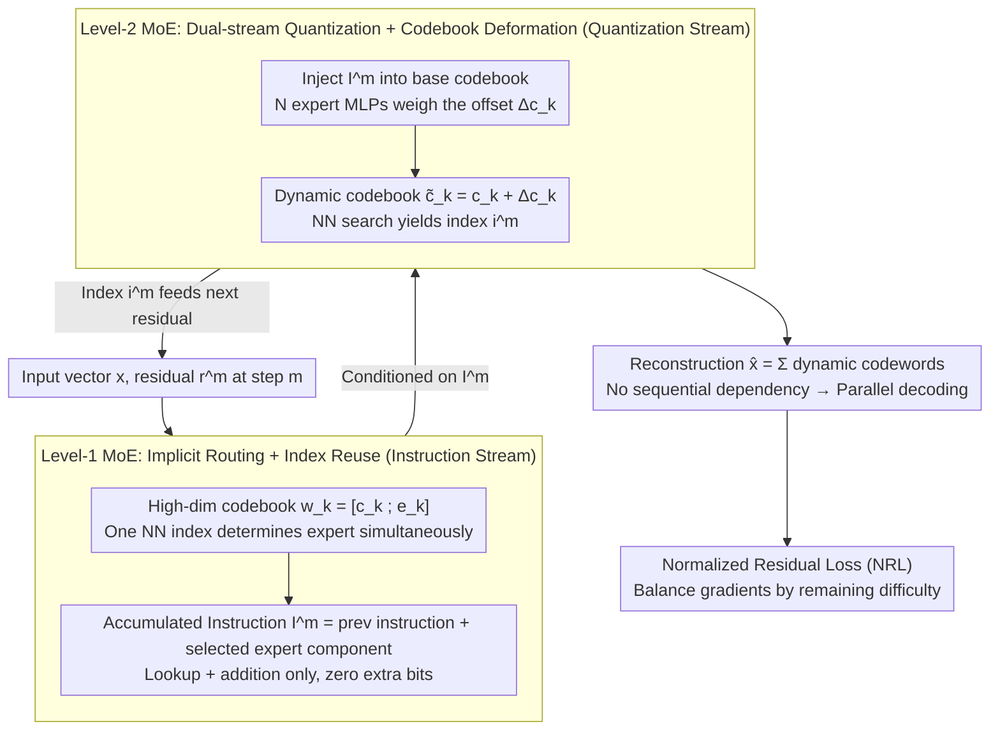

# RQ-MoE: Residual Quantization via Mixture of Experts for Efficient Input-Dependent Vector Compression

**Conference**: ICML 2026  
**arXiv**: [2605.14359](https://arxiv.org/abs/2605.14359)  
**Code**: [KDEGroup/RQ-MoE](https://github.com/KDEGroup/RQ-MoE)  
**Area**: Model Compression / Vector Quantization  
**Keywords**: Residual Quantization, MoE, Input-Adaptive Codebook, Parallel Decoding, Normalized Residual Loss

## TL;DR
RQ-MoE introduces a "two-level MoE + dual-stream quantization" design, enabling the codebook in Residual Quantization (RQ) to be dynamically generated per input. By decoupling the instruction stream from the reconstruction stream, it achieves 6–14× decoding acceleration while matching or exceeding QINCo's MSE/Recall performance across four retrieval benchmarks.

## Background & Motivation
**Background**: Vector Quantization (VQ) achieves compression by mapping high-dimensional vectors to "codebook centers." Multi-codebook Quantization (MCQ), specifically Residual Quantization (RQ) with its "successive approximation" strategy, is widely used in recommendation systems, speech codecs, and generative RecSys tokenization. Recently, QINCo upgraded RQ to use "dynamic codebooks," where each step employs an MLP to generate the next codebook based on the current reconstruction, significantly improving reconstruction quality.

**Limitations of Prior Work**: (i) Traditional RQ uses static codebooks, applying a "one-size-fits-all" approach to the local manifold geometry of different regions, which limits expressiveness; (ii) QINCo introduces strict sequential dependencies—the $m$-th codebook requires the reconstruction from steps $1\ldots m-1$, preventing parallel decoding and increasing deployment latency; (iii) Standard "explicit gating" MoE designs waste bit budget (e.g., 4 experts require 2 extra bits, a 25% overhead for a 256-entry codebook).

**Key Challenge**: There is an inherent conflict between dynamic codebooks (for quality) and parallel decoding (for speed). If codebooks depend on previous reconstructions, they must be sequential; if they are parallelized, they typically lose input-adaptive capabilities.

**Goal**: To achieve fully parallel decoding without increasing the bit budget or losing input adaptability, while maintaining or exceeding the reconstruction and retrieval accuracy of QINCo.

**Key Insight**: The authors reinterpret RQ as a degenerate MoE, where nearest neighbor search acts as top-1 implicit routing. By binding "expert information" and "quantization components" to the same index, routing becomes "free." Simultaneously, by decoupling "instruction propagation" from the "reconstruction path," parallelization is achieved.

**Core Idea**: Use a high-dimensional codebook $\mathbf{w}_k^m=[\mathbf{c}_k^m;\mathbf{e}_k^m]$ to bind quantization and expert components to the same index (Level-1 MoE implicit routing), and decouple the instruction accumulation stream from the codebook generation stream (Level-2 MoE deforming the base codebook via accumulated instructions) to support fully parallel decoding.

## Method

### Overall Architecture
RQ-MoE maintains the "progressive residual refinement" skeleton of RQ with $M$ quantization steps. It maintains two streams in parallel at each step:

- **Instruction Stream**: Stores accumulated expert information $\mathbf{I}^m\in\mathbb{R}^{D_e}$, updated via a minimal rule $\mathbf{I}^m=\mathbf{I}^{m-1}+\mathbf{E}_{i^{m-1}}^{m-1}$, with $\mathbf{I}^1=\mathbf{0}$.
- **Quantization Stream**: At step $m$, the static base codebook $\mathcal{C}^m$ is deformed into a dynamic codebook $\tilde{\mathcal{C}}^m=\{\tilde{\mathbf{c}}_k^m\}$ via a Level-2 MoE function $f_t$ conditioned on $\mathbf{I}^m$. Nearest neighbor search is then performed: $i^m=\arg\min_k\|\mathbf{r}^m-\tilde{\mathbf{c}}_k^m\|_2^2$.

The final reconstruction is $\hat{\mathbf{x}}=\sum_{m=1}^M\tilde{\mathbf{c}}_{i^m}^m$, consistent with the summation form of standard RQ. This means that once the index sequence is obtained during decoding, all $\mathbf{I}^m$ can be computed via "index lookup + addition" in parallel, and all $\tilde{\mathcal{C}}^m$ can be generated concurrently, removing sequential dependencies.

### Key Designs

**1. Level-1 MoE: Implicit Routing + Index Reuse—Zero-bit routing via dual-purpose indices**

Standard MoE gating is wasteful—each expert selection requires $\log_2 N$ extra bits. The authors solve this by "embedding" expert selection into the quantization index: codewords are expanded from $D$ dimensions to $(D+D_e)$ dimensional vectors $\mathbf{w}_k^m=[\mathbf{c}_k^m;\mathbf{e}_k^m]$. The first $D$ dimensions $\mathbf{c}_k^m$ serve as the base codebook for residual matching, while the latter $D_e$ dimensions $\mathbf{e}_k^m$ encode local manifold features as expert components. Nearest neighbor search (Eq. 1) only considers the first $D$ dimensions, but once $i^m$ is selected, the corresponding expert signal $\mathbf{e}_{i^m}^m$ is determined and added to $\mathbf{I}^{m+1}$. This "piggyback" routing requires zero extra bits while preserving the simplicity of RQ index storage.

**2. Level-2 MoE: Dual-stream Quantization + Codebook Deformation—Parallel decoding via decoupled instruction propagation**

QINCo is slow because the $m$-th codebook must wait for the $m-1$ step reconstruction. RQ-MoE breaks this "reconstruction deadlock" by separating "conditional info" and "reconstruction paths" into two streams. The instruction stream only performs lookup and addition: $\mathbf{I}^m=\mathbf{I}^{m-1}+\mathbf{E}_{i^{m-1}}^{m-1}$, which depends solely on indices and expert components, not reconstruction vectors. The quantization stream then uses $\mathbf{I}^m$ to deform the base codebook via Level-2 MoE: for each candidate $k$, $\mathbf{I}^m$ is injected via $\mathbf{z}_k^m=\text{Linear}([\mathbf{c}_k^m;\mathbf{I}^m])$, followed by $N$ parallel expert MLPs calculating offsets $\mathcal{E}_n(\mathbf{z}_k^m)$. A gating mechanism $\boldsymbol{\alpha}_k^m=\text{softmax}(\text{Linear}(\mathbf{z}_k^m))$ produces the final dynamic codeword $\tilde{\mathbf{c}}_k^m=\mathbf{c}_k^m+\sum_n\boldsymbol{\alpha}_{k,n}^m\mathcal{E}_n(\mathbf{z}_k^m)$. Since $\{\mathbf{I}^1,\ldots,\mathbf{I}^M\}$ can be computed instantly from an index sequence, all dynamic codebooks $\{\tilde{\mathcal{C}}^m\}$ are generated in parallel, yielding approximately $M\times$ acceleration.

**3. Normalized Residual Loss (NRL): Balanced gradients via "remaining difficulty" to revive deep experts**

Standard MSE training causes vanishing gradients for deeper steps: the MSE gradient $2\|\mathbf{r}^{m+1}\|_2$ scales linearly with the residual. Since residuals are large in early steps and small in later steps, early gradients overwhelm signals for deep experts. NRL addresses this by looking at "relative improvement" instead of absolute error: $\rho^m=\|\mathbf{r}^{m+1}\|_2^2/(\text{sg}(\|\mathbf{r}^m\|_2^2)+\epsilon)$ where $\mathcal{L}_{\text{NRL}}=\sum_{m=1}^M\log(1+\rho^m)$. Its gradient $\nabla_{\mathbf{r}^{m+1}}\mathcal{L}_{\text{NRL}}$ behaves as a redescending influence function from robust statistics, normalizing gradients per step based on their own difficulty and preventing explosions from outliers. This ensures deep experts receive effective training signals.

### Loss & Training
The entire model (base/expert codebooks, MoE gates, and MLPs) is optimized end-to-end using the NRL loss alone. No auxiliary load-balancing loss is required, as implicit routing inherits balance from the nearest neighbor search.

## Key Experimental Results

### Main Results
Evaluated on Deep1M, BigANN1M, FB-ssnpp1M, and Contriever1M retrieval benchmarks with 8/16 byte budgets. RQ-MoE uses $N=1, L=16$ ($L=12$ for Contriever to match QINCo).

| Dataset (8 bytes) | Metric | RQ-MoE | QINCo | OPQ |
|------------------|------|--------|-------|-----|
| Deep1M (D=96) | MSE / R@1 | Par or Better | -- | 0.25 / 15.2 |
| BigANN1M (D=128) | MSE (×$10^4$) / R@1 | Par or Better | -- | 2.97 / 21.4 |
| FB-ssnpp1M (D=256) | MSE / R@1 | Par or Better | -- | 9.51 / 2.5 |
| Contriever1M (D=768) | MSE / R@100 | Par or Better | -- | 1.87 / 50.6 |

**Decoding Acceleration**: Achieves **6×–14×** speedup relative to QINCo / QINCo2 with PAD, depending on the dataset and $M$.

**Complexity** (FLOPS per vector, with $N\cdot L$ total budget fixed)

| Method | Encoding | Decoding |
|------|------|------|
| UNQ | $H'(D+H+Mb+MK)$ | $H'(b+H'+D+M)$ |
| QINCo | $2MKD(D+LH)$ | $2MD(D+LH)$ |
| **RQ-MoE** | $2MKD(D+NLH+N)$ | $2MD(D+NLH+N)$ |

Theoretical decoding acceleration stems from $M\times$ (step parallelization) $\cdot N\times$ (expert parallelization).

### Ablation Study

| Configuration | Observation | Explanation |
|------|------|------|
| Full RQ-MoE | SOTA / 6–14× Speedup | Main result |
| MSE-final instead of NRL | Deep experts underfit | NRL solves deep step underfitting |
| Per-step MSE instead of NRL | Early steps dominate optimization | Initial gradients too large |
| No Level-2 MoE (static base) | Degenerates to RQ, error rises | Input adaptation is essential |
| Coupled instruction & reconstruction | Sequential dependency returns | Joint stream is the bottleneck |
| Explicit gating (extra bits) | Precision drops at fixed budget | Implicit routing + index reuse is superior |

### Key Findings
- **Theoretical Unification**: It is proven that RQ-MoE degenerates to standard RQ when $D_e=0, \Delta\mathbf{c}_k^m=0$, and to QINCo when $f_t$ is a residual-MLP and $D_e=D$. Thus, RQ-MoE is a unified framework.
- **Expert Dimension**: Guideline suggests $D_e=D$ provides stable performance across most benchmarks.
- **Acceleration Sources**: Beyond step-level parallelism, Level-2 MoE experts can be parallelized, creating a significant latency advantage over QINCo.

## Highlights & Insights
- "Piggybacking routing info onto existing quantization indices" is a brilliant design—achieving MoE routing with zero bit overhead and natural load balancing.
- Dual-stream decoupling makes dynamic codebooks and parallel decoding compatible—two goals previously considered mutually exclusive.
- The equivalence between NRL and redescending M-estimators in robust statistics provides a solid theoretical foundation for why deep experts learn effectively. This loss design is transferable to other "refinement-style" tasks like diffusion or autoregressive tokenization.
- RQ-MoE provides a general framework using hyper-dimensional codebooks to bind task outputs with auxiliary routing signals in a lightweight engineering manner.

## Limitations & Future Work
- **Sequential Encoding**: Encoding still requires step-by-step residual calculation, though $N$-expert parallelism helps; fully parallel encoding is not yet achieved.
- **Downstream Evaluation**: Lacks direct evaluation on downstream tasks like generative recommendation tokenization (e.g., Rajput et al.) or speech codecs.
- **Training Stability**: While implicit routing seems to provide stability, MoE systems often require gating noise or load balancing at scale; robustness in larger models remains to be verified.
- **Memory Overhead**: Setting $D_e=D$ effectively doubles the codebook storage, which might be an issue for extremely resource-constrained IoT devices.

## Related Work & Insights
- **vs RQ / PQ / OPQ**: While classic MCQ uses static codebooks, RQ-MoE introduces input-conditioned dynamic codebooks while maintaining the simplicity of RQ (index sequence = encoding).
- **vs QINCo / QINCo2**: QINCo pioneered dynamic codebooks but suffered from strict seriality. QINCo2 used PAD/beam search to speed up but didn't eliminate the underlying sequential dependency. RQ-MoE achieves true independence via dual-stream decoupling.
- **vs UNQ**: UNQ replaces European distance with deep networks for lookup but remains static; RQ-MoE focuses network capacity on "codebook generation," better utilizing sparse activation.
- **Insight**: In retrieval-augmented LLMs or generative recommenders, RQ-MoE can serve as a drop-in replacement for RVQ to achieve faster decoding at equal precision.

## Rating
- Novelty: ⭐⭐⭐⭐ Resolves conflicts between dynamic codebooks and parallel decoding via implicit routing.
- Experimental Thoroughness: ⭐⭐⭐⭐ Solid benchmark results and complexity analysis, though needs more downstream task validation.
- Writing Quality: ⭐⭐⭐⭐ Clear framework diagrams and rigorous theoretical grounding.
- Value: ⭐⭐⭐⭐ High potential for RVQ replacement in high-throughput generative and retrieval systems.

<!-- RELATED:START -->

## Related Papers

- [\[ICML 2026\] DAG-MoE: From Simple Mixture to Structural Aggregation in Mixture-of-Experts](dag-moe_from_simple_mixture_to_structural_aggregation_in_mixture-of-experts.md)
- [\[ICLR 2026\] MoBE: Mixture-of-Basis-Experts for Compressing MoE-based LLMs](../../ICLR2026/model_compression/mobe_mixture-of-basis-experts_for_compressing_moe-based_llms.md)
- [\[ICLR 2026\] Efficient Quantization of Mixture-of-Experts with Theoretical Generalization Guarantees](../../ICLR2026/model_compression/efficient_quantization_of_mixture-of-experts_with_theoretical_generalization_gua.md)
- [\[ICML 2026\] ReSpinQuant: Efficient Layer-Wise LLM Quantization via Subspace Residual Rotation Approximation](respinquant_efficient_layer-wise_llm_quantization_via_subspace_residual_rotation.md)
- [\[ICML 2026\] UniSVQ: 2-bit Unified Scalar-Vector Quantization](unisvq_2-bit_unified_scalar-vector_quantization.md)

<!-- RELATED:END -->
